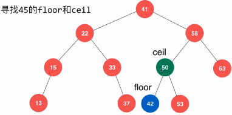
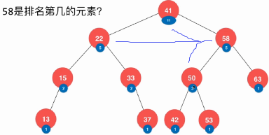
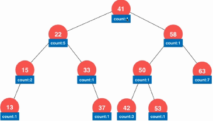
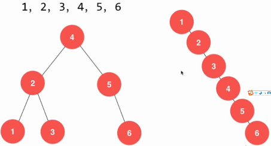
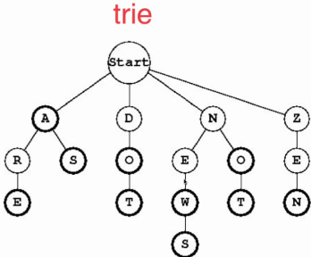

### 二分搜索树

可以高效查找、插入、删除数据。方便min,max,floor,ceil,rank,select

性质：

1. 左孩子节点　< 节点 <　右孩子节点(**中序遍历会得到有序数组**)
2. 不一定是完全二叉树，所以不能用数组。　堆为完全二叉树，可以用数组存储。
3. 元素的顺序性


局限性：同一数据，因为构造的顺序不同，造成结构的不同。

1. 二分搜索树可能退化成链表。log(n) -> n

改善：平衡二叉树，让二叉树一直保持log(n)的高度。

平衡二叉树实现：红黑树、2-3 tree， AVL tree, Splay tree

平衡二叉树和堆的结合：Treap 保持二叉树的性质和堆的优先级的性质。

trie:字典树(末尾)

树形问题：**天然的递归特性**进行树型搜索。

归并排序、快速排序、搜索问题(8皇后)。

其余树：KD树，区间树，哈弗曼树


```java
public class BST{
  private class Node {
    private int key;
    private int value;
    private Node left, right;
    public Node(int key, int value){
      this.key = key;
      this.value = value;
      left = right = null;
    }
    public Node(Node node){ //copy一个
      this.key = node.key;
      this.value = node.value;
      this.left = node.left;
      this.right = node.right;
    }
    private Node root;//根节点
    private int count;//节点个数
    // 构造函数, 默认构造一棵空二分搜索树
    public BST(){
      root = null;
      count = 0;
    }
    public int size() {// 返回二分搜索树的节点个数
        return count;
    }
    // 返回二分搜索树是否为空
    public boolean isEmpty() {
        return count == 0;
    }
    // 1.向二分搜索树中插入一个新的(key, value)数据对
    public void insert(int key, int value){
        root = insert(root, key, value);
    }
    // 1.1
    private Node insert(Node node, int key, int value){
      if( null == node ){
        count++;
        return new Node(key, value);
      }
      if( key == node.key ) //如果已经存在，则进行更新
        node.value = value;
      else if ( key < node.key ) // 在左边插入
        node.left = insert( node.left, key, value );
      else // 在右边插入
        node.right = insert( node.right, key, value );
      return node;
    }
    // 2. 判断是否存在key
    public boolean contain(int key){
      return contain(root, key);
    }
    // 2.1
    private boolean contain(Node node, int key){
      if( null == node )
        	return false;
      if( key == node.key )
        	return true;
      if( key < node.key )
        return contain(node.left, key);
      else
        return contain(node.right, key);
    }
    // 3.搜索
    public int search(int key){
      return search(root, key);
    }
    
    //3.1
    private int search(Node node, int key){
      if( null == node )
        return -1;
      if( key == node.key )
        return node.value;
      else if( key < node.key )
        return search( node.left, key );
      else
        return search( node.right, key );
    }
    // 4.递归遍历
    // 二分搜索树的前序遍历
    public void preOrder(){
        preOrder(root);
    }
    // 二分搜索树的中序遍历
    public void inOrder(){
        inOrder(root);
    }
    // 二分搜索树的后序遍历。(释放空间的时候用的方法)
    public void postOrder(){
        postOrder(root);
    }
    // 4.1 对以node为根的二叉搜索树进行前序遍历, 递归算法
    private void preOrder(Node node){
        if( node != null ){
            System.out.println(node.key);
            preOrder(node.left);
            preOrder(node.right);
        }
    }
    // 对以node为根的二叉搜索树进行中序遍历, 递归算法
    private void inOrder(Node node){

        if( node != null ){
            inOrder(node.left);
            System.out.println(node.key);
            inOrder(node.right);
        }
    }
    // 对以node为根的二叉搜索树进行后序遍历, 递归算法
    private void postOrder(Node node){

        if( node != null ){
            postOrder(node.left);
            postOrder(node.right);
            System.out.println(node.key);
        }
    }
    // 5.释放空间
    public void destory(){
      destory(root);
    }
    // 5.1
    private void destroy(Node node){
      if( null != node ){
        destory(node.left);
        destory(node.right);
        node = null;
        count---;
      }
    }  
    
    // 6.层序遍历
    public void levelOrder(){
      if( null == root ) return;
      Queue<Node> q = new LinkedList<Node>();
      q.offer(root);
      while( !q.isEmpty() ){
        Node node = q.poll();
        System.out.println(node.key);
        if( node.left != null )
            q.offer( node.left );
        if( node.right != null )
            q.offer( node.right );
      }
    }
    //7 寻找二分搜索树的最小的键值
    public int minimum(){
        Node minNode = minimum( root ); //assert count != 0;
        return minNode.key;
    }
		//7.1 返回以node为根的二分搜索树的最小键值所在的节点
    private Node minimum(Node node){
        if( node.left == null ) return node;
        return minimum(node.left);
    }
    //8 寻找二分搜索树的最大的键值
    public int maximum(){
        Node maxNode = maximum(root); //assert count != 0;
        return maxNode.key;
    }
		//8.1 返回以node为根的二分搜索树的最大键值所在的节点
    private Node maximum(Node node){
        if( node.right == null ) return node;
        return maximum(node.right);
    }
    //9 从二分搜索树中删除最小值所在节点
    public void removeMin(){
        if( root != null )
            root = removeMin( root );
    }
    //9.1 删除掉以node为根的二分搜索树中的最小节点，该节点一定没有左孩子。
    // 返回删除节点后新的二分搜索树的根
    // 1.如果最小节点没有右孩子，则直接将null赋值给其父节点的左孩子
    // 2.由于最小节点有右孩子， 所以将其右孩子赋值给其父节点的左变
    private Node removeMin(Node node){
        if( node.left == null ){         //找到了该节点
            Node rightNode = node.right; // 合二为一
            node.right = null;　         //删除右孩子
            count --;
            return rightNode;
        }
        node.left = removeMin(node.left);　//注意这一句
        return node;
    }
    //10 从二分搜索树中删除最大值所在节点
    public void removeMax(){
        if( root != null )
            root = removeMax( root );
    }
    //10.1 删除掉以node为根的二分搜索树中的最大节点。该节点一定没有右孩子。
    // 返回删除节点后新的二分搜索树的根
    private Node removeMax(Node node){
        if( node.right == null ){
            Node leftNode = node.left;
            node.left = null;
            count --;
            return leftNode;
        }
        node.right = removeMax(node.right);
        return node;
    }
    
    // 删除只有左孩子的节点，类似removeMax
    // 删除只有右孩子的节点，类似removeMin
		// 删除有左右孩子的节点。 左边 < 删除点cur < 右边
    // 左边最大值代替？　右边最小值代替？
    //　所以需要在右边选出最小值点s来代替当前删除点cur，然后删除s(s为右边最小值，没有左孩子)
    // 从二分搜索树中删除键值为key的节点
    // 11
    public void remove(int key){
        root = remove(root, key);
    }
    // 11.1 删除掉以node为根的二分搜索树中键值为key的节点, 递归算法
    // 返回删除节点后新的二分搜索树的根
    Node = remove(Node node, int key){
      if(null == node)
        return null;
      //如果key在左边，则在左边删
      if(key < node.key){
        node.left = remove(node.left, key);
        return node;
      }
      //如果key在右边，则在右边删
      else if(node.key < key){
        node.right = remove(node.rihgt, key);
        return node;
      }
      // key == node->key
      else{ 
        // 待删除节点左子树为空的情况(或者左右都为空)
        if( null == node.left ){
          Node rightNode = node.right;
          node.right = null;
          count--;
          return rightNode;
        }
        
        // 待删除节点右子树为空的情况
        if( null == node.right ){
          Node leftNode = node.left;
          node.left = null;
          count--;
          return leftNode;
        }
        // 待删除节点左右子树均不为空的情况
        // 找到比待删除节点大的最小节点, 即待删除节点右子树的最小节点
        // 用这个节点顶替待删除节点的位置
        Node successor = new Node(minimum(node.right));
        count++;
        successor.right = removeMin(node.right);
        successor.left = node.left;
        node.left = node.right = null;
        count--;
        return successor;
      }
    }
  }
}
```

思考：

０、求节点前驱和后继

１、实现floor和ceil:



２、rank/select: 记录每个节点下有多少个元素。（排名第10的元素是谁？）

例如：　58的排名＝58左子树元素个数　＋　58父节点　＋　58父节点左子树个数



３、如果有大量重复元素：

1. 将<改为<=
2. 记录每个节点有多少个重复值



４、局限性：



５、字典树：




### 求最近的值(lintcode 900)

在二分搜索树中查找离target最近的值（lintcode 900）：

```java
public int closestValue(TreeNode root, double target) {
    if( null == root ) return -1;
    TreeNode node = root;
    int closest = node.val;
    double min = Double.MAX_VALUE;
    while( null != node ){
        if( Math.abs( node.val - target ) < min ){
            closest = node.val;
            min = Math.abs( node.val - target );
        }
        if( target < node.val )      //１．在左边找
            node = node.left;
        else if( node.val < target )　//2.在右边找
            node = node.right;
        else                         //３．即不在左边，也不在右边，直接返回
            return closest;
    }
    return closest;
}
```

### 求第k小的值(lintcode 902)

给节点加上count值，然后求第k小的数

```java
public int kthSmallest(TreeNode root, int k) {
    TreeNodeCount myroot = build(root);
    return kthhelper(myroot, k);
}
public class TreeNodeCount {
    public int val;
    public int count;
    public TreeNodeCount left, right;
    public TreeNodeCount(int val) {
        this.val = val;
        this.count = 1;
        this.left = this.right = null;
    }
}
//通过TreeNode构造TreeNodeCount树
public TreeNodeCount build(TreeNode root){
    if( null == root )
        return null;
    TreeNodeCount node = new TreeNodeCount(root.val);
    node.left = build(root.left);
    node.right = build(root.right);
    if( null != node.left )
        node.count += node.left.count;
    if( null != node.right )
        node.count += node.right.count;
    return node;
}
//基于TreeNodeCount求第ｋ小的值
public int kthhelper(TreeNodeCount node, int k){
    if( k <= 0 || k > node.count )
        return -1;
    if( null != node.left ){
        if( k <= node.left.count ) return kthhelper( node.left, k );
        if( k-1 == node.left.count ) return node.val; //重要
        return kthhelper(node.right, k - ( 1 + node.left.count ));
    }
    else{
        if( 1 == k ) return node.val;　//　到了叶子节点
        return kthhelper( node.right, k-1 );
    }
}
```

### 验证二叉搜索树(lintcode 95)

假设严格大小。

```java
//递归
helper(root, Long.MIN_VALUE, Long.MAX_VALUE); //调用，注意边界
private boolean helper(TreeNode node, Long min, Long max){
    if( null == node )
        return true;
    return ( min < node.val && node.val < max ) && 
        helper(node.left, min, Long.valueOf(node.val)) &&
        helper(node.right, Long.valueOf(node.val), max );
}
//循环 利用中序遍历的有序性　
public boolean isValidBST(TreeNode root) {
    if( null == root )
        return true;
    Stack<TreeNode> stack = new Stack<TreeNode>();
    TreeNode node = root;
    Long pre = Long.MIN_VALUE;
    while( null != node ){
        stack.push(node);
        node = node.left;
    }
    while( !stack.isEmpty() ){
        node = stack.pop();
        if( pre >= node.val )
            return false;
        pre = Long.valueOf(node.val);
        if( null != node.right ){
            node = node.right;
            while( null != node ){
                stack.push(node);
                node = node.left;
            }
        }
    }
    return true;
}
```

### 找节点的后继（第一个大于该节点的节点，lintcode 448）

1.如果该节点有右孩子，则其右孩子最左边的值即为所求

2.如果没有，从root开始找该节点，在这条路径上，记录大于p节点的节点，如果找到p，则最后一次记录的节点即为所求。

```java
public TreeNode inorderSuccessor(TreeNode root, TreeNode p) {
    if( null == root || null == p || (null == root.left && null == root.right)) 
      return null;
    if( null != p.right ){
        TreeNode node = p.right;
        while( null != node.left ) node = node.left;
        return node;
    }else{
        TreeNode node = root;
        TreeNode pre = root;
        while( node.val != p.val ){
            if( p.val > node.val ){
                node = node.right;
            }
            if( p.val < node.val ){
                pre = node;　　　　　　//记录节点
                node = node.left;
            }
            if( null == node )
                return null;
        }
        return pre;
    }
}
```

### 二叉查找树的区间查询(lintcode 11)

思路:使用递归，如果在范围内的话，先将左边的值加入，再加入当前节点，最后加入右边节点。

```java
public List<Integer> searchRange(TreeNode root, int k1, int k2) {
    ArrayList<Integer> ans = new ArrayList<Integer>();
    helper( root, k1, k2, ans );
    return ans;
}
public void helper( TreeNode node, int k1, int k2, ArrayList<Integer> ans ){
    if( null == node )
        return;
    if( k1 < node.val && null != node.left) helper(node.left, k1, k2, ans);
    if( k1 <= node.val && node.val <= k2 ) ans.add(node.val);
    if( node.val < k2 && null != node.right ) helper(node.right, k1, k2, ans);
}
```

### Trim a Binary Search Tree（lintcode 701）

```java
public TreeNode trimBST(TreeNode root, int minimum, int maximum) {
    if( null == root ) return null;
  	//当前节点<最小值，则去掉当前节点和其左子树，只考虑其右子树
    if( root.val < minimum ) return trimBST( root.right, minimum, maximum );
  	//最大值<当前节点，则去掉当前节点和其右子子树，只考虑其左子树
    if( maximum < root.val ) return trimBST( root.left, minimum, maximum );
  	//当前节点在区间内，则左右进行递归执行
    root.left = trimBST( root.left, minimum, maximum );
    root.right = trimBST( root.right, minimum, maximum );
    return root;
}
```

```java
//循环，充分利用搜索树的顺序性质。
public TreeNode trimBST(TreeNode root, int minimum, int maximum) {
    if( null == root ) return null;
  	//找到在[min,max]范围内的根几点，并准备最后返回
    while( root.val < minimum || root.val > maximum ){
        if( root.val < minimum ) root = root.right;
        if( root.val > maximum ) root = root.left;
    }
    TreeNode dummy = root;
  	//移除dummy的左边不符合条件的
    while( null != dummy ){
        while( null != dummy.left && dummy.left.val < minimum ){
          //如果左孩子小，更新为左孩子的右孩子  
          dummy.left = dummy.left.right;
        }
        dummy = dummy.left;//继续迭代
    }
    dummy = root;
  	//移除dummy右边不符合条件的
    while( null != dummy ){
        while( null != dummy.right && dummy.right.val > maximum ){
          //如果右孩子大，则更新为右孩子的左孩子  
          dummy.right = dummy.right.left;
        }
        dummy = dummy.right;
    }
    return root;
}
```

### 二叉查找树的迭代器(lintcode 86)

利用中序遍历

```java
public class BSTIterator {
    private Stack<TreeNode> stack = new Stack<TreeNode>();
    public BSTIterator(TreeNode root) {
        TreeNode node = root;
        while( null != node ){
            stack.push(node);
            node = node.left;
        }
    }
    public boolean hasNext() {
        return !stack.isEmpty();
    }
    public TreeNode next() {
        TreeNode node = stack.pop();
        TreeNode next = node.right;
        while( null != next ){
            stack.push(next);
            next = next.left;
        }
        return node;
    }
}
```

### 删除节点

1.如果左右孩子为空，直接删

2.如果只有一个孩子，则将该孩子上提为当前节点

3.如果左右都不为空，则在其右子树中选择最小的(左子树叶节点)代替，并删除左子树叶节点

```java
public TreeNode removeNode(TreeNode root, int value) {
    if( null == root )
        return null;
  	//递归找到删除节点，也可以用循环。
    if( value < root.val )
        root.left =  removeNode( root.left, value );
    else if( value > root.val )
        root.right = removeNode( root.right, value );
    else{
        if( null == root.left || null == root.right ) //为空，或只有一个孩子
            root = ( null != root.left ) ? root.left : root.right;
        else{
            TreeNode cur = root.right;
            while( null != cur.left )
                cur = cur.left;
            root.val = cur.val;
            root.right = removeNode( root.right, cur.val );
        }
    }
    return root;
}
```


