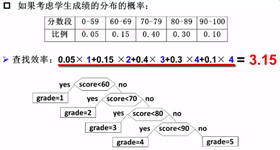
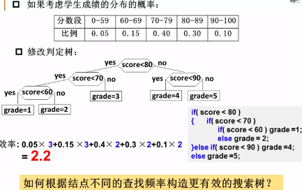
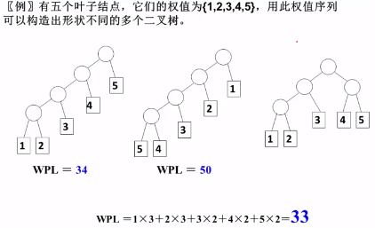
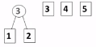
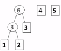
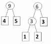
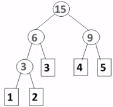
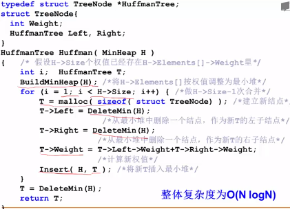
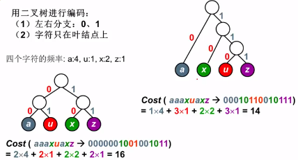
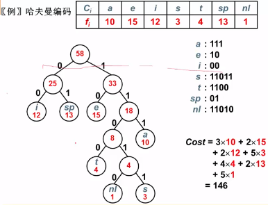

## 哈夫曼树

[TOC]

哈夫曼树的定义：

  设二叉树中共有n个叶子节点，每个叶子节点带有权值Wi（上例中的频率分布）,从根节点到每个叶子节点的长度为Li，则每个叶子节点的带权路径长度之和为WPL= (W1*L1+W2*L2+W3*L3+...+Wn*Ln)。可以证明哈夫曼树的WPL是最小的。

### 哈夫曼树的构造

  每次把权值最小的两课二叉树合并。合并后节点的权值为两棵树权值的和，并将新的节点加入到未使用的节点中。

    

伪代码：利用最小堆来实现

哈夫曼树的特点：

- 没有度为1的节点。因为每次都是两两合并在一起。
- n个叶子节点的哈夫曼树节点共有2n-1个。因为$n_0 = n_2 + 1$
- 任意非叶节点左右交换之后，任然是哈夫曼树
- 有相同权值，哈夫曼树可能不同构，但WPL值是一样的

### 哈夫曼编码

只有所有节点出现在叶子节点上，才能避免二义性（避免一个字符的编码是另外一个字符的前缀）

例子：每次取频率最小的两个叶子节点，合并成一个新的节点。

