##　图论

表示：

邻接矩阵：（适合稠密图，即边多）(完全图，每个节点都会相互连接)

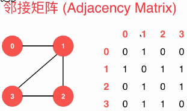　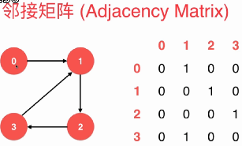

邻接表：（适合稀疏图，即边少）

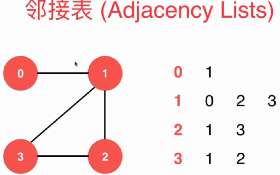　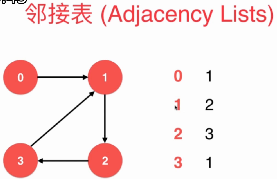

```java
// 稠密图 - 邻接矩阵
public class DenseGraph {

    private int n;  // 节点数
    private int m;  // 边数
    private boolean directed;   // 是否为有向图
    private boolean[][] g;      // 图的具体数据

    // 构造函数
    public DenseGraph( int n , boolean directed ){
        assert n >= 0;
        this.n = n;
        this.m = 0;    // 初始化没有任何边
        this.directed = directed;
        // g初始化为n*n的布尔矩阵, 每一个g[i][j]均为false, 表示没有任和边
        // false为boolean型变量的默认值
        g = new boolean[n][n];
    }

    public int V(){ return n;} // 返回节点个数
    public int E(){ return m;} // 返回边的个数

    // 向图中添加一个边
    public void addEdge( int v , int w ){

        assert v >= 0 && v < n ;
        assert w >= 0 && w < n ;

        if( hasEdge( v , w ) )
            return;

        g[v][w] = true;
        if( !directed )
            g[w][v] = true;

        m ++;
    }

    // 验证图中是否有从v到w的边
    boolean hasEdge( int v , int w ){
        assert v >= 0 && v < n ;
        assert w >= 0 && w < n ;
        return g[v][w];
    }
}
```


```java
// 稀疏图 - 邻接表
public class SparseGraph {

    private int n;  // 节点数
    private int m;  // 边数
    private boolean directed;    // 是否为有向图
    private Vector<Integer>[] g; // 图的具体数据

    // 构造函数
    public SparseGraph( int n , boolean directed ){
        assert n >= 0;
        this.n = n;
        this.m = 0;    // 初始化没有任何边
        this.directed = directed;
        // g初始化为n个空的vector, 表示每一个g[i]都为空, 即没有任和边
        g = (Vector<Integer>[])new Vector[n];
        for(int i = 0 ; i < n ; i ++)
            g[i] = new Vector<Integer>();
    }

    public int V(){ return n;} // 返回节点个数
    public int E(){ return m;} // 返回边的个数

    // 向图中添加一个边
    public void addEdge( int v, int w ){

        assert v >= 0 && v < n ;
        assert w >= 0 && w < n ;

        g[v].add(w);
        if( v != w && !directed ) //v!=w，避免做个自环边
            g[w].add(v);

        m ++;
    }

    // 验证图中是否有从v到w的边,
  	// 最差的复杂度为O(n),避免　平行边
    boolean hasEdge( int v , int w ){

        assert v >= 0 && v < n ;
        assert w >= 0 && w < n ;

        for( int i = 0 ; i < g[v].size() ; i ++ )
            if( g[v].elementAt(i) == w )
                return true;
        return false;
    }
}
```

**遍历**：邻接矩阵每次都要遍历完，此时邻接表就有优势。

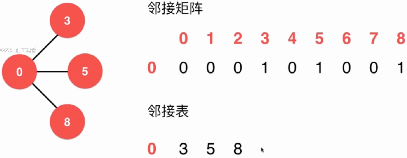

图的深度优先遍历：需要记录每个节点是否被访问过。（应用：求图的连通分量）

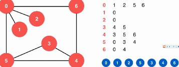　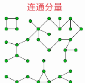


图的广度优先遍历：将节点加入队列时记录访问标志。(应用：求无权图的最短路径)

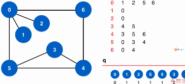

有权图：

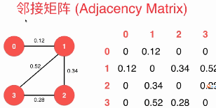　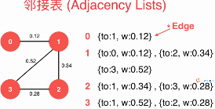


最小生成树（有权无向图）：从v个节点中选择v-1条边来相互连接。

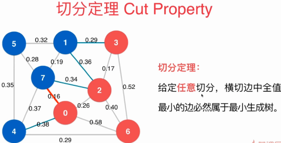

**Lazy prim**:（切分定理＋最小堆）

1.从节点０开始，将与０相连的顶点都加入最小堆中(最小堆中的边代表的是当前的横切面)

2. 从最小堆中取出节点(横切面中最小的边的点)，将点加入红色，并将与该点相连的边并且没有访问过的加入最小堆中。　然后循环。。。

缺点：所有的边都会进入最小堆中，以及访问节点visit。

时间复杂度：O(ElogE)

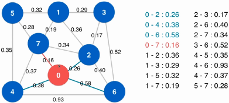 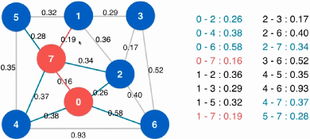

注意：下图中，2-7(0.27),1-2(0.36)在堆中，但已经不是横切边了，所以在堆中选择的时候要过滤掉。(即该边的两个节点在同一个阵营)

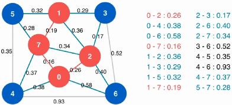

```java
import sun.jvm.hotspot.asm.Arithmetic;
import java.util.Vector;
// 使用Prim算法求图的最小生成树
public class LazyPrimMST<Weight extends Number & Comparable> {
    private WeightedGraph<Weight> G;    // 图的引用
    private MinHeap<Edge<Weight>> pq;   // 最小堆, 算法辅助数据结构
    private boolean[] marked;           // 标记数组, 在算法运行过程中标记节点i是否被访问
    private Vector<Edge<Weight>> mst;   // 最小生成树所包含的所有边
    private Number mstWeight;           // 最小生成树的权值
    // 构造函数, 使用Prim算法求图的最小生成树
    public LazyPrimMST(WeightedGraph<Weight> graph){
        // 算法初始化
        G = graph;
        pq = new MinHeap<Edge<Weight>>(G.E());
        marked = new boolean[G.V()];
        mst = new Vector<Edge<Weight>>();
        // Lazy Prim
        visit(0);
        while( !pq.isEmpty() ){
            // 使用最小堆找出已经访问的边中权值最小的边
            Edge<Weight> e = pq.extractMin();
            // 如果这条边的两端都已经访问过了, 则扔掉这条边
            if( marked[e.v()] == marked[e.w()] )
                continue;
            // 否则, 这条边则应该存在在最小生成树中
            mst.add( e );
            // 访问和这条边连接的还没有被访问过的节点
            if( !marked[e.v()] )
                visit( e.v() );
            else
                visit( e.w() );
        }
        // 计算最小生成树的权值
        mstWeight = mst.elementAt(0).wt();
        for( int i = 1 ; i < mst.size() ; i ++ )
            mstWeight = mstWeight.doubleValue() + mst.elementAt(i).wt().doubleValue();
    }
    // 访问节点v
    private void visit(int v){
        assert !marked[v];
        marked[v] = true;
        // 将和节点v相连接的所有未访问的边放入最小堆中
        for( Edge<Weight> e : G.adj(v) )
            if( !marked[e.other(v)] )
                pq.insert(e);
    }
    // 返回最小生成树的所有边
    Vector<Edge<Weight>> mstEdges(){
        return mst;
    };
    // 返回最小生成树的权值
    Number result(){
        return mstWeight;
    };
}
```

优化：使用索引最小堆。IndexMinHeap。只保存每个节点最短的横切边。所以

1. 首先，从0开始，建立最小索引堆，找到最小的边0.16，并将节点7加入红色。

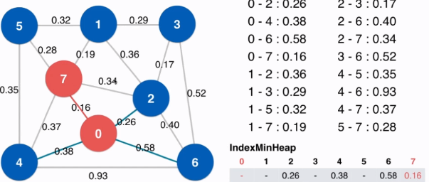

２．当7加入红色后，遍历7的邻接边:7-1(0.19),堆中还不存在该横切面，故直接加入;7-2(0.34)，因为堆中已有与节点2的横截面，长度为0.26,故舍弃边7-2;7-4(0.37),堆中已有与节点4的横切面(0.38),但现在的横切面更小，故更新堆中的与节点4的横切边长度为0.37;7-5(0.58),堆中还没有，则直接加入。

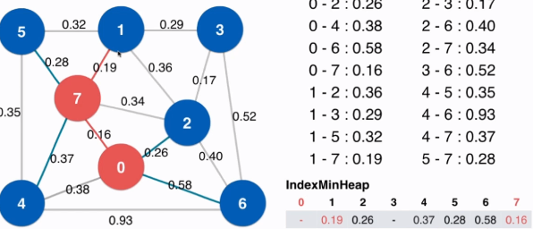

3. 遍历完之后，在堆中的蓝色阵营中选择最小的边的节点加入。即选择节点１，然后依次循环。

　时间复杂度：O(ElogV)

```java
// 使用优化的Prim算法求图的最小生成树
public class PrimMST<Weight extends Number & Comparable> {
    private WeightedGraph G;              // 图的引用
    private IndexMinHeap<Weight> ipq;     // 最小索引堆, 算法辅助数据结构
    private Edge<Weight>[] edgeTo;        // 访问的点所对应的边, 算法辅助数据结构
    private boolean[] marked;             // 标记数组, 在算法运行过程中标记节点i是否被访问
    private Vector<Edge<Weight>> mst;     // 最小生成树所包含的所有边
    private Number mstWeight;             // 最小生成树的权值
    // 构造函数, 使用Prim算法求图的最小生成树
    public PrimMST(WeightedGraph graph){
        G = graph;
        assert( graph.E() >= 1 );
        ipq = new IndexMinHeap<Weight>(graph.V());
        // 算法初始化
        marked = new boolean[G.V()];
        edgeTo = new Edge[G.V()];
        for( int i = 0 ; i < G.V() ; i ++ ){
            marked[i] = false;
            edgeTo[i] = null;]]]]
        }
        mst = new Vector<Edge<Weight>>();
        // Prim
        visit(0);
        while( !ipq.isEmpty() ){
            // 使用最小索引堆找出已经访问的边中权值最小的边
            // 最小索引堆中存储的是点的索引, 通过点的索引找到相对应的边
            int v = ipq.extractMinIndex();
            assert( edgeTo[v] != null );
            mst.add( edgeTo[v] );
            visit( v );
        }
        // 计算最小生成树的权值
        mstWeight = mst.elementAt(0).wt();
        for( int i = 1 ; i < mst.size() ; i ++ )
            mstWeight = mstWeight.doubleValue() + mst.elementAt(i).wt().doubleValue();
    }
    // 访问节点v
    void visit(int v){
        assert !marked[v];
        marked[v] = true;
        // 将和节点v相连接的未访问的另一端点, 和与之相连接的边, 放入最小堆中
        for( Object item : G.adj(v) ){
            Edge<Weight> e = (Edge<Weight>)item;
            int w = e.other(v);
            // 如果边的另一端点未被访问
            if( !marked[w] ){
                // 如果从没有考虑过这个端点, 直接将这个端点和与之相连接的边加入索引堆
                if( edgeTo[w] == null ){
                    edgeTo[w] = e;
                    ipq.insert(w, e.wt());
                }
                // 如果曾经考虑这个端点, 但现在的边比之前考虑的边更短, 则进行替换
                else if( e.wt().compareTo(edgeTo[w].wt()) < 0 ){
                    edgeTo[w] = e;
                    ipq.change(w, e.wt());
                }
            }
        }
    }
    // 返回最小生成树的所有边
    Vector<Edge<Weight>> mstEdges(){
        return mst;
    }
    // 返回最小生成树的权值
    Number result(){
        return mstWeight;
    }
    // 测试 Prim
    public static void main(String[] args) {
        String filename = "testG1.txt";
        int V = 8;
        SparseWeightedGraph<Double> g = new SparseWeightedGraph<Double>(V, false);
        ReadWeightedGraph readGraph = new ReadWeightedGraph(g, filename);
        // Test Prim MST
        System.out.println("Test Prim MST:");
        PrimMST<Double> primMST = new PrimMST<Double>(g);
        Vector<Edge<Double>> mst = primMST.mstEdges();
        for( int i = 0 ; i < mst.size() ; i ++ )
            System.out.println(mst.elementAt(i));
        System.out.println("The MST weight is: " + primMST.result());

        System.out.println();
    }
}
```


Kruskal算法：

先对所有的边进行排序，然后依次遍历每条边，如果没有形成环(并查集)，则将该边的两节点加入红色。

由于需要先排序O(ElogE)，所以效率低于优化后的prim算法。

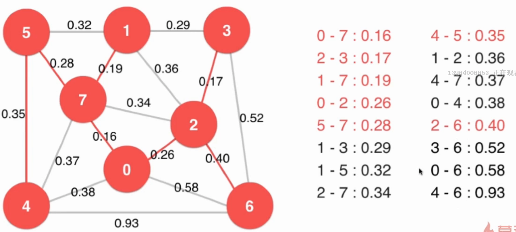

```java
// Kruskal算法求最小生成树
public class KruskalMST<Weight extends Number & Comparable> {
    private Vector<Edge<Weight>> mst;   // 最小生成树所包含的所有边
    private Number mstWeight;           // 最小生成树的权值
    // 构造函数, 使用Kruskal算法计算graph的最小生成树
    public KruskalMST(WeightedGraph graph){
        mst = new Vector<Edge<Weight>>();
        // 将图中的所有边存放到一个最小堆中
        MinHeap<Edge<Weight>> pq = new MinHeap<Edge<Weight>>( graph.E() );
        for( int i = 0 ; i < graph.V() ; i ++ )
            for( Object item : graph.adj(i) ){
                Edge<Weight> e = (Edge<Weight>)item;
                if( e.v() <= e.w() ) // e.v() < e.w()?
                    pq.insert(e);
            }
        // 创建一个并查集, 来查看已经访问的节点的联通情况
        UnionFind uf = new UnionFind(graph.V());
      	// 如果边已经够了，则提前终止循环。
        while( !pq.isEmpty() && mst.size() < graph.V() - 1 ){
            // 从最小堆中依次从小到大取出所有的边
            Edge<Weight> e = pq.extractMin();
            // 如果该边的两个端点是联通的, 说明加入这条边将产生环, 扔掉这条边
            if( uf.isConnected( e.v() , e.w() ) )
                continue;
            // 否则, 将这条边添加进最小生成树, 同时标记边的两个端点联通
            mst.add( e );
            uf.unionElements( e.v() , e.w() );
        }
        // 计算最小生成树的权值
        mstWeight = mst.elementAt(0).wt();
        for( int i = 1 ; i < mst.size() ; i ++ )
            mstWeight = mstWeight.doubleValue() + mst.elementAt(i).wt().doubleValue();
    }
    // 返回最小生成树的所有边
    Vector<Edge<Weight>> mstEdges(){
        return mst;
    }
    // 返回最小生成树的权值
    Number result(){
        return mstWeight;
    }
    // 测试 Kruskal
    public static void main(String[] args) {
        String filename = "testG1.txt";
        int V = 8;
        SparseWeightedGraph<Double> g = new SparseWeightedGraph<Double>(V, false);
        ReadWeightedGraph readGraph = new ReadWeightedGraph(g, filename);
        // Test Kruskal
        System.out.println("Test Kruskal:");
        KruskalMST<Double> kruskalMST = new KruskalMST<Double>(g);
        Vector<Edge<Double>> mst = kruskalMST.mstEdges();
        for( int i = 0 ; i < mst.size() ; i ++ )
            System.out.println(mst.elementAt(i));
        System.out.println("The MST weight is: " + kruskalMST.result());
        System.out.println();
    }
}
```

三者算法比较：

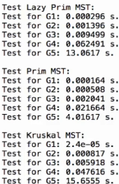


lazy Prim: O(ElogE)

Prim: O(ElogV)

Kruskal:O(ElogE)

O(E)???


如果横切边有相等的边，则每次选择一个边，此时存在多个最小生成数。那么，图中有多少个最小生成数？

Vyssotsky's Algorithm:将边逐渐地添加到生成树中，一旦形成环，删除环中权值最大的边。


最短路径问题：

**Dijkstra**:单源最短路径

前提：图中不能有负权边。

时间复杂度：O(Elog(V))

１．首先，从０节点开始，遍历它能直接到达的边，并初始化数组。

２．在数组中选择路径最短的节点2(要求不能有负权边),然后看从2开始到其它的节点路径有没有比当前数组中的路径更短的节点。　

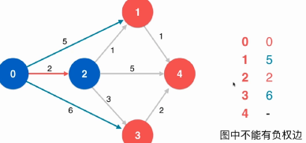

３．**松弛操作**：节点2到节点１的路径为１，所以节点0到节点1的路径更短，所以舍弃0-1路径，并更新数组，设置到节点１的路径为３；

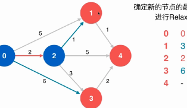　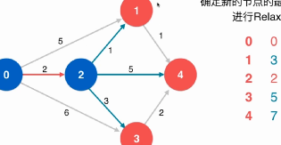

４．然后选择最近的节点１；继续进行松弛操作

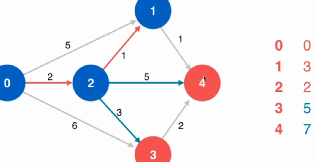　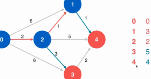

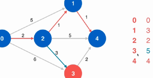　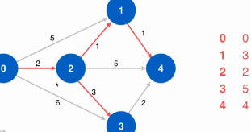

最后的红色为最短路径

主要操作：找到没有访问过的最短路径的节点　并　更新。故可以使用IndexMinHeap.

对于无向图也是成立的，相当于保存了有向图的两条边（方向相反）

```java
import java.util.Vector;
import java.util.Stack;
// Dijkstra算法求最短路径
public class Dijkstra<Weight extends Number & Comparable> {
    private WeightedGraph G;           // 图的引用
    private int s;                     // 起始点
    private Number[] distTo;           // distTo[i]存储从起始点s到i的最短路径长度
    private boolean[] marked;          // 标记数组, 在算法运行过程中标记节点i是否被访问
    private Edge<Weight>[] from;       // from[i]记录最短路径中, 到达i点的边是哪一条
                                       // 可以用来恢复整个最短路径
    // 构造函数, 使用Dijkstra算法求最短路径
    public Dijkstra(WeightedGraph graph, int s){
        // 算法初始化
        G = graph;
        assert s >= 0 && s < G.V();
        this.s = s;
        distTo = new Number[G.V()];
        marked = new boolean[G.V()];
        from = new Edge[G.V()];
        for( int i = 0 ; i < G.V() ; i ++ ){
            distTo[i] = 0.0;
            marked[i] = false;
            from[i] = null;
        }
        // 使用索引堆记录当前找到的到达每个顶点的最短距离
        IndexMinHeap<Weight> ipq = new IndexMinHeap<Weight>(G.V());
        //对于其实点s进行初始化
        distTo[s] = 0.0;
        from[s] = new Edge<Weight>(s, s, (Weight)(Number)(0.0));
        ipq.insert(s, (Weight)distTo[s] );
        marked[s] = true;
        while( !ipq.isEmpty() ){
            int v = ipq.extractMinIndex();
            // distTo[v]就是s到v的最短距离
            marked[v] = true;
            // 对v的所有相邻节点进行更新
            for( Object item : G.adj(v) ){
                Edge<Weight> e = (Edge<Weight>)item;
                int w = e.other(v);
                // 如果从s点到w点的最短路径还没有找到
                if( !marked[w] ){
                    // 如果w点以前没有访问过,
                    // 或者访问过, 但是通过当前的v点到w点距离更短, 则进行更新
                    if( from[w] == null || distTo[v].doubleValue() + e.wt().doubleValue() < distTo[w].doubleValue() ){
                        distTo[w] = distTo[v].doubleValue() + e.wt().doubleValue();
                        from[w] = e;
                        if( ipq.contain(w) )
                            ipq.change(w, (Weight)distTo[w] );
                        else
                            ipq.insert(w, (Weight)distTo[w] );
                    }
                }
            }
        }
    }
    // 返回从s点到w点的最短路径长度
    Number shortestPathTo( int w ){
        assert w >= 0 && w < G.V();
        assert hasPathTo(w);
        return distTo[w];
    }
    // 判断从s点到w点是否联通
    boolean hasPathTo( int w ){
        assert w >= 0 && w < G.V() ;
        return marked[w];
    }
    // 寻找从s到w的最短路径, 将整个路径经过的边存放在vec中
    Vector<Edge<Weight>> shortestPath( int w){
        assert w >= 0 && w < G.V();
        assert hasPathTo(w);
        // 通过from数组逆向查找到从s到w的路径, 存放到栈中
        Stack<Edge<Weight>> s = new Stack<Edge<Weight>>();
        Edge<Weight> e = from[w];
        while( e.v() != this.s ){
            s.push(e);
            e = from[e.v()];
        }
        s.push(e);
        // 从栈中依次取出元素, 获得顺序的从s到w的路径
        Vector<Edge<Weight>> res = new Vector<Edge<Weight>>();
        while( !s.empty() ){
            e = s.pop();
            res.add( e );
        }
        return res;
    }
    // 打印出从s点到w点的路径
    void showPath(int w){
        assert w >= 0 && w < G.V();
        assert hasPathTo(w);
        Vector<Edge<Weight>> path =  shortestPath(w);
        for( int i = 0 ; i < path.size() ; i ++ ){
            System.out.print( path.elementAt(i).v() + " -> ");
            if( i == path.size()-1 )
                System.out.println(path.elementAt(i).w());
        }
    }
}
```

处理负权边？

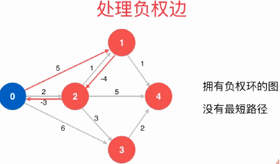

Bellamn-Ford单源最短路径算法

前提：图中不能有负权环。可以盘算图中是否有负权环。

复杂度：O(EV)

思路：如果一个图没有负权环，从一点到另外一点的最短路径，最多经过所有的v个顶点线，有v-1条边；否则，存在顶点经过了两次，即存在负权环。

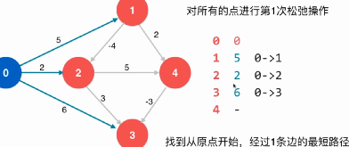

此时，需要对所有的点进行第２次松弛操作。

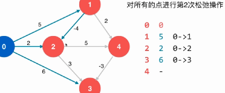　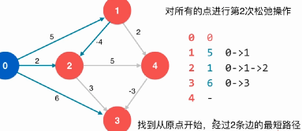

对一个点的一次松弛操作，就是找到经过这个点的另外一条路径，多一条边，权值更小。

如果一个图没有负权环，从一点到另外一点的最短路径，最多经过所有的v个顶点，有v-1条边。

对所有的点进行v-1次松弛操作。

对所有的点进行v-1次松弛操作，理论上就找到了从源点到其它所有点的最短路径。

如果还可以继续松弛，说明原图中有负权环。

对于无向图，一旦有一条负权边，则跟其反向的负权边形成负权环。

```java
import java.util.Vector;
import java.util.Stack;
// 使用BellmanFord算法求最短路径
public class BellmanFord<Weight extends Number & Comparable> {
  private WeightedGraph G;    // 图的引用
  private int s;              // 起始点
  private Number[] distTo;    // distTo[i]存储从起始点s到i的最短路径长度
  Edge<Weight>[] from;        // from[i]记录最短路径中, 到达i点的边是哪一条
                              // 可以用来恢复整个最短路径
  boolean hasNegativeCycle;   // 标记图中是否有负权环
  // 构造函数, 使用BellmanFord算法求最短路径
  public BellmanFord(WeightedGraph graph, int s){
    G = graph;
    this.s = s;
    distTo = new Number[G.V()];
    from = new Edge[G.V()];
    // 初始化所有的节点s都不可达, 由from数组来表示
    for( int i = 0 ; i < G.V() ; i ++ )
      from[i] = null;
    // 设置distTo[s] = 0, 并且让from[s]不为NULL, 表示初始s节点可达且距离为0
    distTo[s] = 0.0;
    from[s] = new Edge<Weight>(s, s, (Weight)(Number)(0.0)); // 这里我们from[s]的内容是new出来的, 注意要在析构函数里delete掉
    // Bellman-Ford的过程
    // 进行V-1次循环, 每一次循环求出从起点到其余所有点, 最多使用pass步可到达的最短距离
    for( int pass = 1 ; pass < G.V() ; pass ++ ){
        // 每次循环中对所有的边进行一遍松弛操作
        // 遍历所有边的方式是先遍历所有的顶点, 然后遍历和所有顶点相邻的所有边
        for( int i = 0 ; i < G.V() ; i ++ ){
            // 使用我们实现的邻边迭代器遍历和所有顶点相邻的所有边
            for( Object item : G.adj(i) ){
                Edge<Weight> e = (Edge<Weight>)item;
                // 对于每一个边首先判断e->v()可达
                // 之后看如果e->w()以前没有到达过， 显然我们可以更新distTo[e->w()]
                // 或者e->w()以前虽然到达过, 但是通过这个e我们可以获得一个更短的距离, 即可以进行一次松弛操作, 我们也可以更新distTo[e->w()]
                if( from[e.v()] != null && (from[e.w()] == null || distTo[e.v()].doubleValue() + e.wt().doubleValue() < distTo[e.w()].doubleValue()) ){
                    distTo[e.w()] = distTo[e.v()].doubleValue() + e.wt().doubleValue();
                    from[e.w()] = e;
                }
            }
        }
    }
    hasNegativeCycle = detectNegativeCycle();
  }
  // 判断图中是否有负权环
  boolean detectNegativeCycle(){
      for( int i = 0 ; i < G.V() ; i ++ ){
          for( Object item : G.adj(i) ){
              Edge<Weight> e = (Edge<Weight>)item;
              //如果还能进行松弛操作，则含有负权环
              if( from[e.v()] != null && distTo[e.v()].doubleValue() + e.wt().doubleValue() < distTo[e.w()].doubleValue() )
                  return true;
          }
      }
      return false;
  }
  // 返回图中是否有负权环
  boolean negativeCycle(){
      return hasNegativeCycle;
  }
  // 返回从s点到w点的最短路径长度
  Number shortestPathTo( int w ){
      assert w >= 0 && w < G.V();
      assert !hasNegativeCycle;
      assert hasPathTo(w);
      return distTo[w];
  }
  // 判断从s点到w点是否联通
  boolean hasPathTo( int w ){
      assert( w >= 0 && w < G.V() );
      return from[w] != null;
  }
  // 寻找从s到w的最短路径, 将整个路径经过的边存放在vec中
  Vector<Edge<Weight>> shortestPath(int w){
      assert w >= 0 && w < G.V() ;
      assert !hasNegativeCycle ;
      assert hasPathTo(w) ;
      // 通过from数组逆向查找到从s到w的路径, 存放到栈中
      Stack<Edge<Weight>> s = new Stack<Edge<Weight>>();
      Edge<Weight> e = from[w];
      while( e.v() != this.s ){
          s.push(e);
          e = from[e.v()];
      }
      s.push(e);
      // 从栈中依次取出元素, 获得顺序的从s到w的路径
      Vector<Edge<Weight>> res = new Vector<Edge<Weight>>();
      while( !s.empty() ){
          e = s.pop();
          res.add(e);
      }
      return res;
  }
  // 打印出从s点到w点的路径
  void showPath(int w){
      assert( w >= 0 && w < G.V() );
      assert( !hasNegativeCycle );
      assert( hasPathTo(w) );
      Vector<Edge<Weight>> res = shortestPath(w);
      for( int i = 0 ; i < res.size() ; i ++ ){
          System.out.print(res.elementAt(i).v() + " -> ");
          if( i == res.size()-1 )
              System.out.println(res.elementAt(i).w());
      }
  }
}
```

优化：

利用队列数据结构queue-based bellman-ford算法。


Floyed算法，处理无负权环的图。O(V^3).(动态规划)。

最长路径算法：


Bellman-Ford（图中所有权取负值，转为最段路径。）


