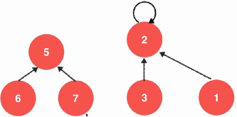
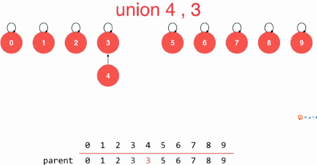
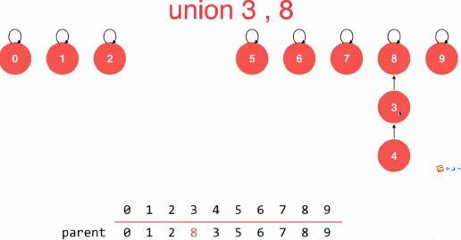
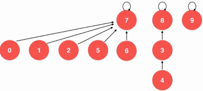
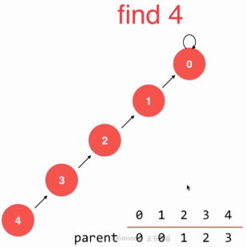
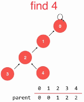
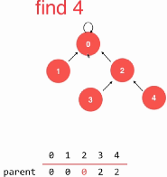
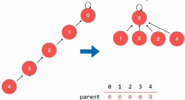

##　并查集

路径压缩优化后，并查集的操作，时间复杂度近乎是O(1)的。

实现一：数组方式，节点i处的值a[i]相同，则为一个集合。

实现二：用执行父节点的指针，若能指向同一个个父节点，则为同一集合。

合并时，只需将5的父节点指向2.



在实现时，仍然用数组：根节点指向自己。





在连接的时候，为避免一个集合的链过长，所以在连接的时候一般都连接在根节点。

```java
// 我们的第二版Union-Find
public class UnionFind2 {
    // 我们的第二版Union-Find, 使用一个数组构建一棵指向父节点的树
    // parent[i]表示第一个元素所指向的父节点
    private int[] parent;
    private int count;  // 数据个数
    // 构造函数
    public UnionFind2(int count){
        parent = new int[count];
        this.count = count;
        // 初始化, 每一个parent[i]指向自己, 表示每一个元素自己自成一个集合
        for( int i = 0 ; i < count ; i ++ )
            parent[i] = i;
    }
    // 查找过程, 查找元素p所对应的集合编号
    // O(h)复杂度, h为树的高度
    private int find(int p){
        assert( p >= 0 && p < count );
        // 不断去查询自己的父亲节点, 直到到达根节点
        // 根节点的特点: parent[p] == p
        while( p != parent[p] )
            p = parent[p];
        return p;
    }
    // 查看元素p和元素q是否所属一个集合
    // O(h)复杂度, h为树的高度
    public boolean isConnected( int p , int q ){
        return find(p) == find(q);
    }
    // 合并元素p和元素q所属的集合
    // O(h)复杂度, h为树的高度
    public void unionElements(int p, int q){
        int pRoot = find(p);
        int qRoot = find(q);
        if( pRoot == qRoot )
            return;
        parent[pRoot] = qRoot;
    }
}
```

**优化１**：避免同一个集合的链表过长。使用另一个数组来表示当前集合的大小，在合并的时候，将较小size的根指向较大ｓｉｚｅ的根，以避免同一个集合链表过长。这个优化效果非常好。

```java
// 我们的第三版Union-Find
public class UnionFind3 {
    private int[] parent; // parent[i]表示第一个元素所指向的父节点
    private int[] sz;     // sz[i]表示以i为根的集合中元素个数
    private int count;    // 数据个数
    // 构造函数
    public UnionFind3(int count){
        parent = new int[count];
        sz = new int[count];
        this.count = count;
        // 初始化, 每一个parent[i]指向自己, 表示每一个元素自己自成一个集合
        for( int i = 0 ; i < count ; i ++ ){
            parent[i] = i;
            sz[i] = 1;
        }
    }
    // 查找过程, 查找元素p所对应的集合编号
    // O(h)复杂度, h为树的高度
    private int find(int p){
        assert( p >= 0 && p < count );
        // 不断去查询自己的父亲节点, 直到到达根节点
        // 根节点的特点: parent[p] == p
        while( p != parent[p] )
            p = parent[p];
        return p;
    }
    // 查看元素p和元素q是否所属一个集合
    // O(h)复杂度, h为树的高度
    public boolean isConnected( int p , int q ){
        return find(p) == find(q);
    }
    // 合并元素p和元素q所属的集合
    // O(h)复杂度, h为树的高度
    public void unionElements(int p, int q){
        int pRoot = find(p);
        int qRoot = find(q);
        if( pRoot == qRoot )
            return;
        // 根据两个元素所在树的元素个数不同判断合并方向
        // 将元素个数少的集合合并到元素个数多的集合上
        if( sz[pRoot] < sz[qRoot] ){
            parent[pRoot] = qRoot;
            sz[qRoot] += sz[pRoot];
        }
        else{
            parent[qRoot] = pRoot;
            sz[pRoot] += sz[qRoot];
        }
    }
}
```

优化２：优化一是根据当前节点为根节点的集合大小。进一步优化为当前节点的层数，以进一步减小链表长度。　

合并7,8．如果是优化一，则8指向根7，链表最长为4.优化2则是，7指向根8，链表最长不变(3).

　

```java
// 我们的第四版Union-Find
public class UnionFind4 {
    private int[] rank;   // rank[i]表示以i为根的集合所表示的树的层数
    private int[] parent; // parent[i]表示第i个元素所指向的父节点
    private int count;    // 数据个数
    // 构造函数
    public UnionFind4(int count){
        rank = new int[count];
        parent = new int[count];
        this.count = count;
        // 初始化, 每一个parent[i]指向自己, 表示每一个元素自己自成一个集合
        for( int i = 0 ; i < count ; i ++ ){
            parent[i] = i;
            rank[i] = 1;
        }
    }
    // 查找过程, 查找元素p所对应的集合编号
    // O(h)复杂度, h为树的高度
    private int find(int p){
        assert( p >= 0 && p < count );
        // 不断去查询自己的父亲节点, 直到到达根节点
        // 根节点的特点: parent[p] == p
        while( p != parent[p] )
            p = parent[p];
        return p;
    }
    // 查看元素p和元素q是否所属一个集合
    // O(h)复杂度, h为树的高度
    public boolean isConnected( int p , int q ){
        return find(p) == find(q);
    }
    // 合并元素p和元素q所属的集合
    // O(h)复杂度, h为树的高度
    public void unionElements(int p, int q){
        int pRoot = find(p);
        int qRoot = find(q);
        if( pRoot == qRoot )
            return;
        // 根据两个元素所在树的元素个数不同判断合并方向
        // 将元素个数少的集合合并到元素个数多的集合上,如果不等，则rank不变，即层数不变。
        if( rank[pRoot] < rank[qRoot] ){
            parent[pRoot] = qRoot;
        }
        else if( rank[qRoot] < rank[pRoot]){
            parent[qRoot] = pRoot;
        }
        else{ // rank[pRoot] == rank[qRoot]　此时，合并的根的层数需要加１
            parent[pRoot] = qRoot;
            rank[qRoot] += 1;   // 此时, 我维护rank的值
        }
    }
}
```

优化3.1：**路径压缩**，在find进程压缩。之前，find要从当前节点一直返回到根节点。



两步一跳进行路径压缩：(在find函数中就一步：)

1. 看4的父亲是不是根节点，如果不是，则将４的父亲设为**父亲的父亲**(2)


2. 然后跳过３，直接看4现在的父亲2
3. 对2重复以上步骤。

　

优化3.2: 指向同一个父节点。可递归实现。



```java
// 查找过程, 查找元素p所对应的集合编号
// O(h)复杂度, h为树的高度
private int find(int p){
    assert( p >= 0 && p < count );

    // path compression 1
    while( p != parent[p] ){
        parent[p] = parent[parent[p]];
        p = parent[p];
    }
    return p;

    // path compression 2, 递归算法,因为递归，可能实际效率稍微低一点。
//            if( p != parent[p] )
//                parent[p] = find( parent[p] );
//            return parent[p];
}
```


