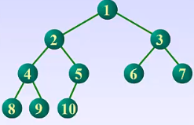

## 树的基本性质

1. 在第i层上，最多有$2^{i-1}$个节点。
2. 深度为k的满二叉树，总共有$2^k-1$个节点。及每一层相加：$1+2^1+2^2+...+2^{i-1}$等比数列求和得到。
3. 任一二叉树，度为0的节点个数：$n_0 = n_2 + 1$
   1. 二叉树中全部结点数：$n = n_0 + n_1 + n_2$ (叶子节点数+度为1的结点数+度为2的结点数)
   2. 二叉树中全部节点数：$ n = B + 1 $ (总分支数+1)
   3. 总分支数：$ B = n_1 + 2 n_2 $ (度为1的节点产生1个分支，度为2的节点产生2个分支)
   4. 上面三式可得：$ n_0 + n_1 + n_2 = n_1 + 2n_2 + 1 $ 得到：$n_0 = n_2 + 1$
4. 若完全二叉树的结点数为n，则深度必为$\lfloor log_2n \rfloor + 1$
   1. k-1层总结点最多：$2^{k-1}-1$ 
   2. k层总结点做多有：$2^k-1$
   3. 所以k层的完全二叉树的总节点个数满足：$ 2^{k-1}-1+1 \leq n \leq 2^k-1 $ [即上层最多节点+1，该层最多节点]。即$ 2^{k-1} \leq n < 2^k $
5. 在完全二叉树中，节点的层序编号反应了节点之间的关系。
   1. i的父亲：i/2
   2. i的左孩子：2i
   3. i的右孩子：2i+1
   4. 