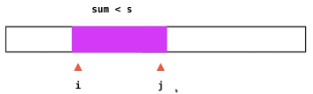

Given an array of **n** positive integers and a positive integer **s**, find the minimal length of a **contiguous** subarray of which the sum ≥ **s**. If there isn't one, return 0 instead.

For example, given the array `[2,3,1,2,4,3]` and `s = 7`,
the subarray `[4,3]` has the minimal length under the problem constraint.

[click to show more practice.](https://leetcode.com/problems/minimum-size-subarray-sum/description/#)

**Credits:**
Special thanks to [@Freezen](https://oj.leetcode.com/discuss/user/Freezen) for adding this problem and creating all test cases.


####　思路一　暴力

遍历所有的连续子数组；然后计算和，验证sum>=s

Ｏ(n^3)

暴力解的问题：大量的重复计算（计算和）


#### 思路二　滑动窗口（双指针）



当sum < target时，j向右扩展；

当sum >=target时，i向右扩展。

```c++
class Solution {
public:
    int minSubArrayLen(int s, vector<int>& nums) {
        
        int l=0, r=-1; //nums[l...r]为滑动窗口
        int sum = 0;
        int res = nums.size() + 1;
        
        while( l < nums.size() ){
            
            if( sum < s && r+1 < nums.size()){ //不够，r右移,并加上新的数
                r++;
                sum += nums[r];
            }
            else{ //多了，l右移，并减去原来最左边的数
                sum -= nums[l];
                l++;
            }
            if( sum >= s )
                res = min(res, r-l+1); //在原来的长度　和　当前长度　中选择最小的
        }
        
        if(res == nums.size()+1)
            return 0;
        return res;
         
    }
};
```

