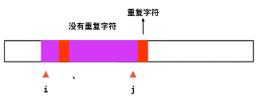
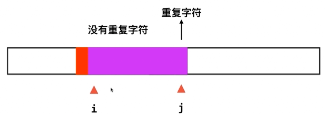

Given a string, find the length of the **longest substring** without repeating characters.

**Examples:**

Given `"abcabcbb"`, the answer is `"abc"`, which the length is 3.

Given `"bbbbb"`, the answer is `"b"`, with the length of 1.

Given `"pwwkew"`, the answer is `"wke"`, with the length of 3. Note that the answer must be a **substring**, `"pwke"` is a *subsequence*and not a substring.


字符串处理：字符集范围？　大小写敏感？　包括数字？ 


#### 思路一 双指针（滑动窗口）




　

如何记录重复字符？　freq[256] 有记录为１，　无记录为０

```c++
class Solution {
public:
    int lengthOfLongestSubstring(string s) {
        
        int l=0, r=-1; //滑动窗口为[l...r]
        int freq[256] = {0};
        int res = 0;
        
        while( l < s.size() ){
            
            if( r+1 < s.size() && freq[s[r+1]] == 0){ //　窗口右边　右移; 然后置１
                r++;
                freq[s[r]]++; //置１
            }
            else{　　　　　　　　　　　　//　窗口左边边　置１；然后右移
                freq[s[l]]--;　//置０
                l++;
            }
            res = max(res, r-l+1);
        }
        return res;
        
    }
};
```


练习：

438

76  

双指针：指针对撞　和　滑动窗口