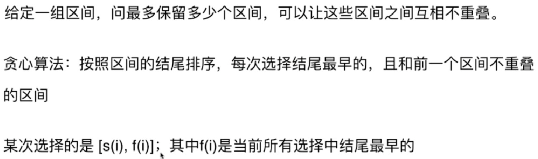
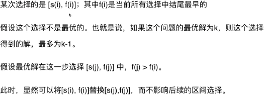
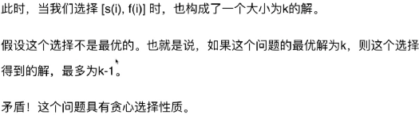

### 455. Assign Cookies

[Description](https://leetcode.com/problems/assign-cookies/description/)[Hints](https://leetcode.com/problems/assign-cookies/hints/)[Submissions](https://leetcode.com/problems/assign-cookies/submissions/)[Discuss](https://leetcode.com/problems/assign-cookies/discuss/)[Solution](https://leetcode.com/problems/assign-cookies/solution/)

[Pick One](https://leetcode.com/problems/random-one-question/)

------

Assume you are an awesome parent and want to give your children some cookies. But, you should give each child at most one cookie. Each child i has a greed factor gi, which is the minimum size of a cookie that the child will be content with; and each cookie j has a size sj. If sj >= gi, we can assign the cookie j to the child i, and the child i will be content. Your goal is to maximize the number of your content children and output the maximum number.

**Note:**
You may assume the greed factor is always positive. 
You cannot assign more than one cookie to one child.

**Example 1:**

```
Input: [1,2,3], [1,1]

Output: 1

Explanation: You have 3 children and 2 cookies. The greed factors of 3 children are 1, 2, 3. 
And even though you have 2 cookies, since their size is both 1, you could only make the child whose greed factor is 1 content.
You need to output 1.
```

**Example 2:**

```
Input: [1,2], [1,2,3]

Output: 2

Explanation: You have 2 children and 3 cookies. The greed factors of 2 children are 1, 2. 
You have 3 cookies and their sizes are big enough to gratify all of the children, 
You need to output 2.
```


```c++
class Solution {
public:
    int findContentChildren(vector<int>& g, vector<int>& s) {
        sort(g.begin(), g.end(), greater<int>());//从大到小排序
        sort(s.begin(), s.end(), greater<int>());
        
        int si=0, gi=0;
        int res = 0;
        while( gi<g.size() && si<s.size() ){
            if( s[si] >= g[gi] ){
                res++;
                si++;
                gi++;
            }
            else //如果当前最大的饼干满足不了小朋友，那么就继续找下一个小朋友。
                gi++;
        }
        return res;
    }
};
```

392:Is Subsequence　s是不是t的子序列？


### 435. Non-overlapping Intervals

[Description](https://leetcode.com/problems/non-overlapping-intervals/description/)[Hints](https://leetcode.com/problems/non-overlapping-intervals/hints/)[Submissions](https://leetcode.com/problems/non-overlapping-intervals/submissions/)[Discuss](https://leetcode.com/problems/non-overlapping-intervals/discuss/)[Solution](https://leetcode.com/problems/non-overlapping-intervals/solution/)

[Pick One](https://leetcode.com/problems/random-one-question/)

------

Given a collection of intervals, find the minimum number of intervals you need to remove to make the rest of the intervals non-overlapping.

**Note:**

1. You may assume the interval's end point is always bigger than its start point.
2. Intervals like [1,2] and [2,3] have borders "touching" but they don't overlap each other.

**Example 1:**

```
Input: [ [1,2], [2,3], [3,4], [1,3] ]

Output: 1

Explanation: [1,3] can be removed and the rest of intervals are non-overlapping.
```

**Example 2:**

```
Input: [ [1,2], [1,2], [1,2] ]

Output: 2

Explanation: You need to remove two [1,2] to make the rest of intervals non-overlapping.
```

**Example 3:**

```
Input: [ [1,2], [2,3] ]

Output: 0

Explanation: You don't need to remove any of the intervals since they're already non-overlapping.
```

最少删除多少区间，剩余区间不重叠？

等价于　最多保留多少个区间？

**暴力解法**：找出所有子区间的组合，之后判断它不重叠 O((2^n)*n)

动态规划？　最长上升子序列？

```c++
/**
 * Definition for an interval.
 * struct Interval {
 *     int start;
 *     int end;
 *     Interval() : start(0), end(0) {}
 *     Interval(int s, int e) : start(s), end(e) {}
 * };
 */
class Solution {
private:
    bool compare( const Interval &a, const Interval &b ){
        if( a.start != b.start )
            return a.start < b.start;
        return a.end < b.end;
    }
public:
    int eraseOverlapIntervals(vector<Interval>& intervals) {
        if( 0 == intervals.size() )
            return 0;
        sort( intervals.begin(), intervals.end(), compare );//排序
        //memo[i]表示使用intervals[0...i]的区间能够构成的最长不重叠区间序列
        vector<int> memo(intervals.size(), 1);
        for(int i=0; i<intervals.size(); i++)
          	//memo[i]
            for( int j=0; j<i; j++ )
                if( intervals[i].start >= intervals[j].end )
                    memo[i] = max( memo[i], 1+memo[j] );
        int res = 0;
        for( int i=0; i<memo.size(); i++ )
            res = max( res, memo[i] );
        return intervals.size() - res;
    }
};
```


思考：每次选择中，每个区间的结尾很重要。结尾越小，留给后面越大的空间，越有可能容纳更多区间。

**贪心算法**：根据区间的结尾排序，每次选择结尾最早的，且和前一个区间不重叠的区间。

O(n)

```c++
/**
 * Definition for an interval.
 * struct Interval {
 *     int start;
 *     int end;
 *     Interval() : start(0), end(0) {}
 *     Interval(int s, int e) : start(s), end(e) {}
 * };
 */
class Solution {
private:
    bool compare( const Interval &a, const Interval &b ){
        if( a.end != b.end )
            return a.end < b.end;
        return a.start < b.start;
    }
public:
    int eraseOverlapIntervals(vector<Interval>& intervals) {
        if( 0 == intervals.size() )
            return 0;
        sort( intervals.begin(), intervals.end(), compare );//根据结尾排序
        
        int res = 1;//将结尾最早的放入第一个位置
        int pre=0;//前一个计数
        for(int i=1; i<intervals.size(); i++)//从第二个开始
            if( intervals[i].start >= intervals[pre].end ){//如果满足条件，则放入
                res++;
                pre = i;
            }
        return intervals.size() - res;
    }
};
```


**贪心选择性质**：在求解最优问题时，使用贪心的方式选择一组内容时，不会影响剩下的子问题的求解。

如果无法使用贪心算法，举出反例即可。

证明贪心算法的正确性：

- 数学归纳法
- 反证法

反证法证明：







贪心算法为A,最优算法为O,发现A完全能替代O，且不影响求最优解。


最小生成树、最短路径　中都包含贪心思想。


