### 递归与回溯

复杂度分析：

每次递归的规模都一样

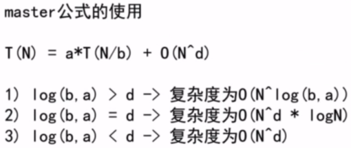

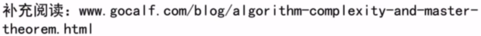

### 17. Letter Combinations of a Phone Number

[Description](https://leetcode.com/problems/letter-combinations-of-a-phone-number/description/)[Hints](https://leetcode.com/problems/letter-combinations-of-a-phone-number/hints/)[Submissions](https://leetcode.com/problems/letter-combinations-of-a-phone-number/submissions/)[Discuss](https://leetcode.com/problems/letter-combinations-of-a-phone-number/discuss/)[Solution](https://leetcode.com/problems/letter-combinations-of-a-phone-number/solution/)

[Pick One](https://leetcode.com/problems/random-one-question/)

------

Given a digit string, return all possible letter combinations that the number could represent.

A mapping of digit to letters (just like on the telephone buttons) is given below.


```
Input:Digit string "23"
Output: ["ad", "ae", "af", "bd", "be", "bf", "cd", "ce", "cf"].
```

**Note:**
Although the above answer is in lexicographical order, your answer could be in any order you want.

**思路**：树形问题

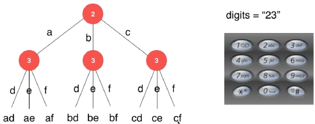

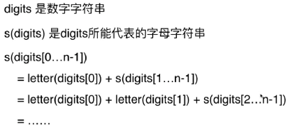

回溯法是暴力解法的一个主要实现手段。

时间复杂度：3^n = O(2^n)

```c++
class Solution {
private:
    const string letterMap[10] = {
        " ",
        "",
        "abc",
        "def",
        "ghi",
        "jkl",
        "mno",
        "pqrs",
        "tuv",
        "wxyz",
    };
    vector<string> res;
  	//　s中保存了此时从digits[0...index-1]翻译得到的一个字母字符串
  	// 寻找和digits[index]匹配的字母，获得digits[0...index]翻译的到的解
    void findCombination(const string &digits, int index, const string &s){
        if( index == digits.size() )
            res.push_back(s);//处理完毕　保存结果
            return;
        char c = digits[index];
        string letters = letterMap[c-'0'];
        for(int i=0; i<letters.size(); i++)
            findCombination(digits, index+1, s + letters[i]);
        return;
    }
public:
    vector<string> letterCombinations(string digits) {    
        res.clear();   
        if(digits == "")
            return res;  
        findCombination(digits, 0, "");     
        return res;
    }
};
```

93:返回所有合法的ip地址，分割数字

131:拆分字符串，拆分的字符串为回文

### 46. Permutations（回溯处理排列问题）

[Description](https://leetcode.com/problems/permutations/description/)[Hints](https://leetcode.com/problems/permutations/hints/)[Submissions](https://leetcode.com/problems/permutations/submissions/)[Discuss](https://leetcode.com/problems/permutations/discuss/)[Solution](https://leetcode.com/problems/permutations/solution/)

[Pick One](https://leetcode.com/problems/random-one-question/)

------

Given a collection of **distinct** numbers, return all possible permutations.

For example,
`[1,2,3]` have the following permutations:

```
[
  [1,2,3],
  [1,3,2],
  [2,1,3],
  [2,3,1],
  [3,1,2],
  [3,2,1]
]
```

转为树形问题：

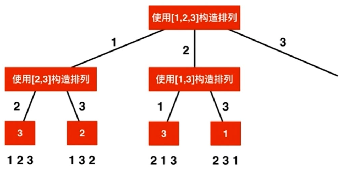

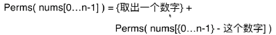


```c++
class Solution {
private:
    vector<vector<int>> res;
    vector<bool> used;
  	//p中保存了一个有index个元素的排列
  	//向这个排列的末尾添加第index+1个元素，获得一个有index+1个元素的排列
    void generatePermutation( const vector<int>& nums, int index, vector<int>& p ){
        if( index == nums.size() ){
            res.push_back(p);
            return;
        }
        for(int i=0; i < nums.size(); i++){
            if( !used[i] ){ //如果该元素没有被用过，则添加到p中。　不是遍历，而是用辅助数组
                p.push_back( nums[i] );
                used[i] = true;
                generatePermutation(nums, index+1, p);
                // 注意状态的回溯。因为状态冲突
              	p.pop_back();　
                used[i] = false;
            }
        }
        return;
    }
public:
    vector<vector<int>> permute(vector<int>& nums) {
        res.clear();
        if(nums.size() == 0)
            return res;
        used = vector<bool>(nums.size(), false);
        vector<int> p;
        generatePermutation(nums, 0, p);
        return res;
    }
};
```

### 77. Combinations　（回溯处理组合问题）

[Description](https://leetcode.com/problems/combinations/description/)[Hints](https://leetcode.com/problems/combinations/hints/)[Submissions](https://leetcode.com/problems/combinations/submissions/)[Discuss](https://leetcode.com/problems/combinations/discuss/)[Solution](https://leetcode.com/problems/combinations/solution/)

[Pick One](https://leetcode.com/problems/random-one-question/)

------

Given two integers *n* and *k*, return all possible combinations of *k* numbers out of 1 ... *n*.

For example,
If *n* = 4 and *k* = 2, a solution is:

```
[
  [2,4],
  [3,4],
  [2,3],
  [1,2],
  [1,3],
  [1,4],
]
```

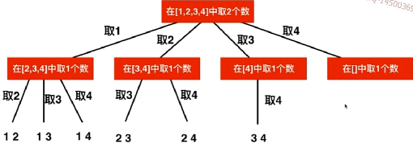

```c++
class Solution {
    vector<vector<int>> res;
  	//求解C(n,k), 当前已经找到的组合存储在c中，需要从start开始搜索新的元素
    void generateCombinations(int n, int k, int start, vector<int> &c){
        if(c.size() == k){
            res.push_back(c);
            return;
        }
        for(int i=start; i<=n; i++){
            c.push_back(i);
            generateCombinations(n, k, i+1, c);
            c.pop_back();
        }
        return;
    }
    vector<vector<int>> combine(int n, int k) {
        res.clear();
        if(n<=0 || k<=0 || k>n)
            return res;
        vector<int> c;
        generateCombinations(n, k, 1, c);
        return res;
    }
};
```

优化：回溯法的剪枝。除去不必要的分枝。例如不考虑取４.

```c++
  	//求解C(n,k), 当前已经找到的组合存储在c中，需要从start开始搜索新的元素
    void generateCombinations(int n, int k, int start, vector<int> &c){
        if(c.size() == k){
            res.push_back(c);
            return;
        }
      	//还有k-c.size()个空位，所以[i...n]中只要要有k-c.size()个元素
      	//i最多为　n - (k-c.size()) + 1　例如：[2,3,4]中得有３个元素，则起始：4-3+1＝２
        for(int i=start; i <= n - (k-c.size()) + 1; i++){
            c.push_back(i);
            generateCombinations(n, k, i+1, c);
            c.pop_back();
        }
        return;
    }
```

39:在元素唯一的集合中找组合的和为T的所有组合，集合中元素可以使用多次

40:在元素可能相同的集合中，找组合的和为T的所有组合，集合中元素只能使用一次

216:选出不同的k个个位数，每个数字只能使用一次，使得其和为n

78:集合中元素不相同，求集合的子集。空集？　2^n个

90:集合中元素可能相同，求所有子集

401:Binary watch


### 79. Word Search(二维回溯)

[Description](https://leetcode.com/problems/word-search/description/)[Hints](https://leetcode.com/problems/word-search/hints/)[Submissions](https://leetcode.com/problems/word-search/submissions/)[Discuss](https://leetcode.com/problems/word-search/discuss/)[Solution](https://leetcode.com/problems/word-search/solution/)

[Pick One](https://leetcode.com/problems/random-one-question/)

------

Given a 2D board and a word, find if the word exists in the grid.

The word can be constructed from letters of sequentially adjacent cell, where "adjacent" cells are those horizontally or vertically neighboring. The same letter cell may not be used more than once.

For example,
Given **board** =

```
[
  ['A','B','C','E'],
  ['S','F','C','S'],
  ['A','D','E','E']
]
```

word="ABCCED" true

word="SEE" true

word="ABCB" false

**思路**：递归、回溯

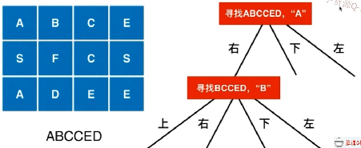


```c++
class Solution {
private:
    int d[4][2] = {{-1,0},{0,1},{1,0},{0,-1}}; //移动方向,上下左右
    int m,n;
    vector<vector<bool>> visited; // 是否访问过
    
    bool inArea(int x, int y){
        return x>=0 && y>=0 && x < m && y < n;
    }
    //从board[startx][starty]开始，寻找word[index...word.size()）
    bool searchWord(const vector<vector<char>> &board, const string& word, int index, int startx, int starty){
        if( index == word.size() - 1 )
            return board[startx][starty] == word[index];
        
        if(board[startx][starty] == word[index]){
            visited[startx][starty] = true;
            for(int i=0; i<4; i++){
                int newx = startx + d[i][0];
                int newy = starty + d[i][1];
                if( inArea(newx,newy) && !visited[newx][newy] )
                    if( searchWord( board, word, index+1, newx, newy ) )
                        return true;
            }
            visited[startx][starty] = false;
        }
        return false;
        
    }
public:
    bool exist(vector<vector<char>>& board, string word) {
        m = board.size();
        assert(m>0);
        n = board[0].size();
        
        visited = vector<vector<bool>>(m, vector<bool>(n, false));
        
        for(int i=0; i<board.size(); i++)
            for(int j=0; j<board[i].size(); j++)
                if( searchWord(board, word, 0, i, j) )
                    return true;
        
        return false;
    }
};
```


### 200. Number of Islands(二维回溯，深度有限搜索)

[Description](https://leetcode.com/problems/number-of-islands/description/)[Hints](https://leetcode.com/problems/number-of-islands/hints/)[Submissions](https://leetcode.com/problems/number-of-islands/submissions/)[Discuss](https://leetcode.com/problems/number-of-islands/discuss/)[Solution](https://leetcode.com/problems/number-of-islands/solution/)

[Pick One](https://leetcode.com/problems/random-one-question/)

------

Given a 2d grid map of `'1'`s (land) and `'0'`s (water), count the number of islands. An island is surrounded by water and is formed by connecting adjacent lands horizontally or vertically. You may assume all four edges of the grid are all surrounded by water.

**\*Example 1:***

```
11110
11010
11000
00000
```

Answer: 1

**\*Example 2:***

```
11000
11000
00100
00011
```

Answer: 3

```c++
class Solution {
private:
    int d[4][2] = {{-1,0},{0,1},{1,0},{0,-1}};
    int m,n;
    vector<vector<bool>> visited;
    
    bool inArea(int x, int y){
        return x>=0 && y>=0 && x < m && y < n;
    }
    //从grid[x][y]开始，进行floodfill
    void dfs( vector<vector<char>>& grid, int x, int y ){
        visited[x][y] = true;
        for(int i=0; i<4; i++){
            int newx = x + d[i][0];
            int newy = y + d[i][1];
            if( inArea(newx, newy) && !visited[newx][newy] && grid[newx][newy] == '1' )
                dfs( grid, newx, newy );
        }
    }
public:
    int numIslands(vector<vector<char>>& grid) {
        m = grid.size();
        if(m==0)
            return 0;
        n = grid[0].size();
        
        visited = vector<vector<bool>>(m, vector<bool>(n, false));
        
        int res = 0;
        for(int i=0; i<m; i++)
            for(int j=0; j<n; j++)
                if( grid[i][j]=='1' && !visited[i][j] ){
                    res++;
                    dfs( grid, i, j );
                }
        return res;
    }
};
```


130:将被x包围的o字符变为x

417:Pacific Atlantic Water Flow 难？


### 51. N-Queens

[Description](https://leetcode.com/problems/n-queens/description/)[Hints](https://leetcode.com/problems/n-queens/hints/)[Submissions](https://leetcode.com/problems/n-queens/submissions/)[Discuss](https://leetcode.com/problems/n-queens/discuss/)[Solution](https://leetcode.com/problems/n-queens/solution/)

[Pick One](https://leetcode.com/problems/random-one-question/)

------

The *n*-queens puzzle is the problem of placing *n* queens on an *n*×*n* chessboard such that no two queens attack each other.


Given an integer *n*, return all distinct solutions to the *n*-queens puzzle.

Each solution contains a distinct board configuration of the *n*-queens' placement, where `'Q'` and `'.'` both indicate a queen and an empty space respectively.

For example,
There exist two distinct solutions to the 4-queens puzzle:

```
[
 [".Q..",  // Solution 1
  "...Q",
  "Q...",
  "..Q."],

 ["..Q.",  // Solution 2
  "Q...",
  "...Q",
  ".Q.."]
]
```

------

**思路**：

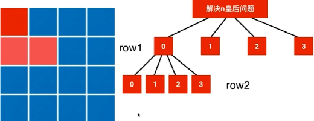

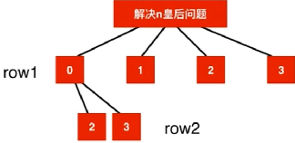

那么，如何快速判断是否合法的情况？

- 竖向：col[i]表示第i列被占用

- 对角线1:dia1[i]表示第i对角线1被占用.同一对角线相加的值相等。

- 对角线2:dia2[i]表示第i对角线2被占用.同一对角线相减的值相等。

  ​

   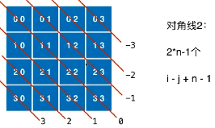 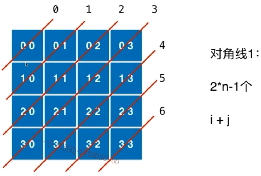

```c++
class Solution {
private:
    vector<vector<string>> res;
    vector<bool> col, dia1, dia2;
    //尝试在一个n皇后问题中，摆放第index行的皇后位置，并将列信息存储row中
    void putQueen(int n, int index, vector<int> &row){
        if( n == index ){
            res.push_back( generatedBoard(n, row) );
            return;
        }
        for(int i=0; i<n; i++){
          	//尝试将在第index行的皇后摆放在第i列
            if( !col[i] && !dia1[index+i] && !dia2[index-i+n-1] ){
                row.push_back(i);
                col[i] = true;
                dia1[index+i] = true;
                dia2[index-i+n-1] = true;
                putQueen(n, index+1, row);
                col[i] = false;
                dia1[index+i] = false;
                dia2[index-i+n-1] = false;
                row.pop_back();
            }
        }
        return;
    }
    vector<string> generatedBoard(int n, vector<int> &row){
        assert( row.size() == n );
        vector<string> board(n, string(n, '.'));
        for(int i=0; i<n; i++)
            board[i][row[i]] = 'Q';
        return board; 
    }
public:
    vector<vector<string>> solveNQueens(int n) {
        res.clear();
        col = vector<bool>(n, false);
        dia1 = vector<bool>(2*n-1, false);
        dia2 = vector<bool>(2*n-1, false);
        vector<int> row;
        putQueen(n, 0, row);
        return res;
    }
};
```


优化：如何加快搜索？ 如何进行有效地剪枝？？


52:N-Queens TWO，求n皇后问题的解的个数

37:Sudoku Solver　求解数独　　优化问题？


