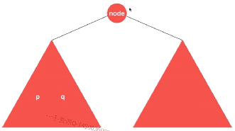
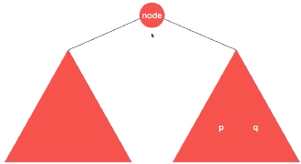
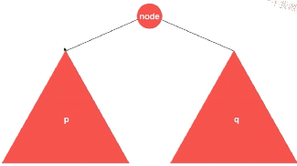
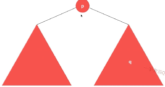

### 235. Lowest Common Ancestor of a Binary Search Tree

[Description](https://leetcode.com/problems/lowest-common-ancestor-of-a-binary-search-tree/description/)[Hints](https://leetcode.com/problems/lowest-common-ancestor-of-a-binary-search-tree/hints/)[Submissions](https://leetcode.com/problems/lowest-common-ancestor-of-a-binary-search-tree/submissions/)[Discuss](https://leetcode.com/problems/lowest-common-ancestor-of-a-binary-search-tree/discuss/)[Solution](https://leetcode.com/problems/lowest-common-ancestor-of-a-binary-search-tree/solution/)

[Pick One](https://leetcode.com/problems/random-one-question/)

------

Given a binary search tree (BST), find the lowest common ancestor (LCA) of two given nodes in the BST.

According to the [definition of LCA on Wikipedia](https://en.wikipedia.org/wiki/Lowest_common_ancestor): “The lowest common ancestor is defined between two nodes v and w as the lowest node in T that has both v and w as descendants (where we allow **a node to be a descendant of itself**).”

```
        _______6______
       /              \
    ___2__          ___8__
   /      \        /      \
   0      _4       7       9
         /  \
         3   5
```

For example, the lowest common ancestor (LCA) of nodes `2` and `8` is `6`. Another example is LCA of nodes `2` and `4` is `2`, since a node can be a descendant of itself according to the LCA definition.


思路：

pq在同一侧：

　

pq不在同一侧，即当前节点为公共祖先。

　　


```c++
/**
 * Definition for a binary tree node.
 * struct TreeNode {
 *     int val;
 *     TreeNode *left;
 *     TreeNode *right;
 *     TreeNode(int x) : val(x), left(NULL), right(NULL) {}
 * };
 */
class Solution {
public:
    TreeNode* lowestCommonAncestor(TreeNode* root, TreeNode* p, TreeNode* q) {
        
        assert( NULL != q && NULL != p );
        
        if( NULL == root )
            return NULL;
        //1.在左边
        if( p->val < root->val && q->val < root->val )
            return lowestCommonAncestor( root->left, p, q );
        //２.在右边
        if( p->val > root->val && q->val > root->val )
            return lowestCommonAncestor( root->right, p, q );
        //3. 要么在两边，要么是其中一个节点
        return root;
    }
};
```

98:验证是否为二分搜索树

450:在二分搜索树上删除一个节点　不存在？　多个节点？　是否返回删除节点？

108:有序数组转为平衡的二分搜索树。

230:在二分搜索树上找第k小的元素

236:二叉树中的最近公共祖先　LCA问题

