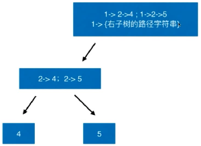

### 257. Binary Tree Paths

[Description](https://leetcode.com/problems/binary-tree-paths/description/)[Hints](https://leetcode.com/problems/binary-tree-paths/hints/)[Submissions](https://leetcode.com/problems/binary-tree-paths/submissions/)[Discuss](https://leetcode.com/problems/binary-tree-paths/discuss/)[Solution](https://leetcode.com/problems/binary-tree-paths/solution/)

[Pick One](https://leetcode.com/problems/random-one-question/)

------

Given a binary tree, return all root-to-leaf paths.

For example, given the following binary tree:

```
   1
 /   \
2     3
 \
  5
```

All root-to-leaf paths are:

```
["1->2->5", "1->3"]
```




每一次向上返回都重新生成数组元素（路径），即将当前节点加入到路径中。

```c++
 * Definition for a binary tree node.
 * struct TreeNode {
 *     int val;
 *     TreeNode *left;
 *     TreeNode *right;
 *     TreeNode(int x) : val(x), left(NULL), right(NULL) {}
 * };
 */
class Solution {
public:
    vector<string> binaryTreePaths(TreeNode* root) {
        
        vector<string> res;
        
        if( NULL == root )
            return res;
        
        if( NULL == root->left && NULL == root->right ){
            res.push_back( to_string(root->val) );
            return res;
        }
        
        vector<string> leftS = binaryTreePaths( root->left );
        for(int i=0; i < leftS.size(); i++)
            res.push_back( to_string(root->val) + "->" + leftS[i] );
        
        vector<string> rightS = binaryTreePaths( root->right );
        for(int i=0; i < rightS.size(); i++)
            res.push_back( to_string(root->val) + "->" + rightS[i] );
        
        return res;
    }
};
```


113:　返回所有从根节点到叶节点的路径，其和为sum。

129: 求每条路径代表的树的和

