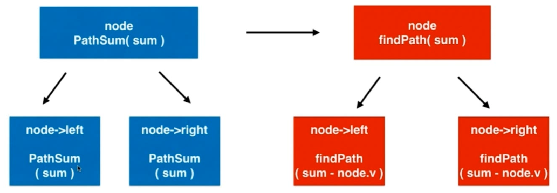
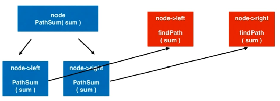

### 437. Path Sum III

[Description](https://leetcode.com/problems/path-sum-iii/description/)[Hints](https://leetcode.com/problems/path-sum-iii/hints/)[Submissions](https://leetcode.com/problems/path-sum-iii/submissions/)[Discuss](https://leetcode.com/problems/path-sum-iii/discuss/)[Solution](https://leetcode.com/problems/path-sum-iii/solution/)

[Pick One](https://leetcode.com/problems/random-one-question/)

------

You are given a binary tree in which each node contains an integer value.

Find the number of paths that sum to a given value.

The path does not need to start or end at the root or a leaf, but it must go downwards (traveling only from parent nodes to child nodes).

The tree has no more than 1,000 nodes and the values are in the range -1,000,000 to 1,000,000.

**Example:**

```
root = [10,5,-3,3,2,null,11,3,-2,null,1], sum = 8

      10
     /  \
    5   -3
   / \    \
  3   2   11
 / \   \
3  -2   1

Return 3. The paths that sum to 8 are:

1.  5 -> 3
2.  5 -> 2 -> 1
3. -3 -> 11
```


从任一节点开始，只能向下走。






```c++
/**
 * Definition for a binary tree node.
 * struct TreeNode {
 *     int val;
 *     TreeNode *left;
 *     TreeNode *right;
 *     TreeNode(int x) : val(x), left(NULL), right(NULL) {}
 * };
 */
class Solution {
public:
    int pathSum(TreeNode* root, int sum) {
        
        if( NULL == root )
            return 0;
        // 1.在包含root节点的路径中找
        int res = findPath(root, sum);
      	//　２．在不包含root节点的路径中找
        res += pathSum(root->left, sum);
        res += pathSum(root->right, sum);
        
        return res;
    }
private:
  	//在以node为根节点的二叉树中，寻找包含node的路径，和为num
  　//返回这样的路径个数
    int findPath(TreeNode* node, int num){
        if( NULL == node )
            return 0;
        int res = 0;
        if(node->val == num)
            res += 1;
      　//之所以找打了，还要继续找，是因为可能有负数，后面的路径中可能也有和为num的
        res += findPath( node->left, num - node->val );
        res += findPath( node->right, num - node->val );
        
        return res;
    }
};
```


