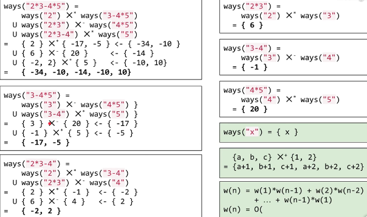

### 241. Different Ways to Add Parentheses

[Description](https://leetcode.com/problems/different-ways-to-add-parentheses/description/)[Hints](https://leetcode.com/problems/different-ways-to-add-parentheses/hints/)[Submissions](https://leetcode.com/problems/different-ways-to-add-parentheses/submissions/)[Discuss](https://leetcode.com/problems/different-ways-to-add-parentheses/discuss/)[Solution](https://leetcode.com/problems/different-ways-to-add-parentheses/solution/)

[Pick One](https://leetcode.com/problems/random-one-question/)

------

Given a string of numbers and operators, return all possible results from computing all the different possible ways to group numbers and operators. The valid operators are `+`, `-` and `*`.

Example 1

Input: `"2-1-1"`.

```
((2-1)-1) = 0
(2-(1-1)) = 2
```

Output: `[0, 2]`

Example 2

Input: `"2*3-4*5"`

```
(2*(3-(4*5))) = -34
((2*3)-(4*5)) = -14
((2*(3-4))*5) = -10
(2*((3-4)*5)) = -10
(((2*3)-4)*5) = 10
```

Output: `[-34, -14, -10, -10, 10]`


问题转换？

划分子问题：根据运算符号进行划分。

子问题如何重组？ 两个子问题的笛卡尔积(类似)




```java
class Solution {
  private Map<String, List<Integer>> cache;
  public List<Integer> diffWaysToCompute(String input) {
      cache = new HashMap<>(); 
      return diffWaysHelper(input);
  }
  private List<Integer> diffWaysHelper(String input){
    List<Integer> result = cache.get(input);
    if( null != result )
        return result;
    result = new LinkedList<>();
    
    for( int i = 0; i < input.length(); i++ ){
      if( input.charAt(i) < '0' ){//如果碰到预算符，就切分
        List<Integer> leftList = diffWaysHelper(input.substring(0,i));
        List<Integer> rightList = diffWaysHelper(input.substring(i+1));
        // 将两部分进行笛卡尔操作(类似)
        for(int left : leftList)
          for( int right : rightList )
            switch(input.charAt(i)) {
                case '+': 
                    result.add( left + right );
                    break;
                case '-':
                    result.add( left - right );
                    break;
                case '*':
                    result.add( left * right );
                    break;
            }
      }
    }
    //如果没有运算符号，则都为数字，直接转为结果。 
    if( result.isEmpty() )
        result.add( Integer.valueOf(input) );
    cache.put(input, result);
    return result;
  }
}
```


