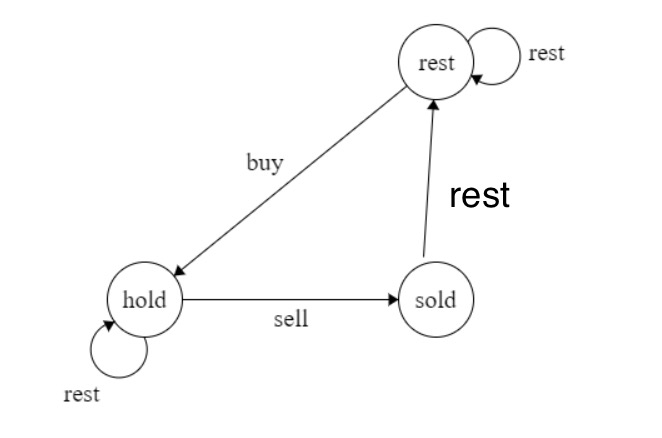

### 309. Best Time to Buy and Sell Stock with Cooldown

[Description](https://leetcode.com/problems/best-time-to-buy-and-sell-stock-with-cooldown/description/)[Hints](https://leetcode.com/problems/best-time-to-buy-and-sell-stock-with-cooldown/hints/)[Submissions](https://leetcode.com/problems/best-time-to-buy-and-sell-stock-with-cooldown/submissions/)[Discuss](https://leetcode.com/problems/best-time-to-buy-and-sell-stock-with-cooldown/discuss/)[Solution](https://leetcode.com/problems/best-time-to-buy-and-sell-stock-with-cooldown/solution/)

[Pick One](https://leetcode.com/problems/random-one-question/)

------

Say you have an array for which the *i*th element is the price of a given stock on day *i*.

Design an algorithm to find the maximum profit. You may complete as many transactions as you like (ie, buy one and sell one share of the stock multiple times) with the following restrictions:

- You may not engage in multiple transactions at the same time (ie, you must sell the stock before you buy again).
- After you sell your stock, you cannot buy stock on next day. (ie, cooldown 1 day)

**Example:**

```
prices = [1, 2, 3, 0, 2]
maxProfit = 3
transactions = [buy, sell, cooldown, buy, sell]
```


有穷状态机：



对于任何一天day[i],只可能处于以下三种状态：

- rest:没有股票。从hold状态卖出 或 rest状态 转入
- hold:持有股票。从rest状态买入 或者 hold状态 转入
- sold:卖出状态。从 持有股票并卖出 转入

即

- rest[i]:day[i]处于rest状态的最大收益
  - rest[i] = max( sold[i-1], rest[i-1] )
- hold[i]:day[i]处于hold状态的最大收益
  - hold[i] = max( rest[i-1]-price[i], hold[i-1] )
- sold[i]:day[i]处于卖出的状态
  - sold[i] = hold[i-1] + price[i]


```java
public int maxProfit(int[] prices) {
    if( null == prices || prices.length == 0 )
        return 0;
    int sold = 0;
    int rest = 0;
    int hold = Integer.MIN_VALUE;
    for( int price : prices ){
        int prev_sold = sold;
        sold = hold + price;
        hold = Math.max(hold, rest - price);
        rest = Math.max(rest, prev_sold);
    }
    return Math.max(rest, sold);
}
```

