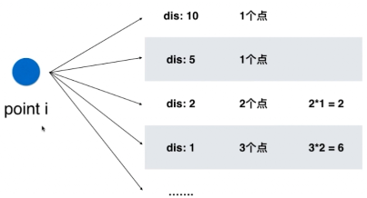

Given *n* points in the plane that are all pairwise distinct, a "boomerang" is a tuple of points `(i, j, k)` such that the distance between `i` and `j` equals the distance between `i` and `k` (**the order of the tuple matters**).

Find the number of boomerangs. You may assume that *n* will be at most **500** and coordinates of points are all in the range **[-10000, 10000]** (inclusive).

**Example:**

```
Input:
[[0,0],[1,0],[2,0]]

Output:
2

Explanation:
The two boomerangs are [[1,0],[0,0],[2,0]] and [[1,0],[2,0],[0,0]]
```


##### 思路一　暴力　O(n^3)

##### 思路二　O(n^2)

对与每个点i，遍历其余点到i的距离，如果有相同的，则构成该三元组。

从点演变为距离。因为距离可能为浮点数，而键不能，故求距离时不开方即可。考虑是否溢出。

范围限制，此复杂度可以接受。考虑坐标是否溢出。




```c++
class Solution {
public:
    int numberOfBoomerangs(vector<pair<int, int>>& points) {
        
        int res = 0;
        for(int i=0; i < points.size(); i++){
            unordered_map<int,int> record;
            for(int j=0; j<points.size(); j++)
                if(j!=i)
                    record[ dis(points[i], points[j]) ]++;
            for( unordered_map<int,int>::iterator iter = record.begin(); iter!=record.end(); iter++)
                res += (iter->second)*(iter->second-1); //如果为１的话，就加１＊０
        }
        return res;
    }
private:
    int dis(const pair<int,int> &pa, const pair<int,int> &pb){
        return (pa.first-pb.first) * (pa.first-pb.first) + 
            (pa.second-pb.second) * (pa.second-pb.second);
    }
};
```

