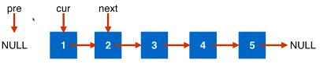
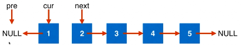
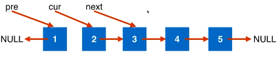

206. Reverse Linked List　

Reverse a singly linked list.

[click to show more hints.](https://leetcode.com/problems/reverse-linked-list/description/#)

Hint:

A linked list can be reversed either iteratively or recursively. Could you implement both?


##### 思路一

需要三个指针来保存信息

１、初始化



２、反转节点



３、更新辅助指针



４、重复２３步骤，直到cur为空。


```c++
/**
 * Definition for singly-linked list.
 * struct ListNode {
 *     int val;
 *     ListNode *next;
 *     ListNode(int x) : val(x), next(NULL) {}
 * };
 */
class Solution {
public:
    ListNode* reverseList(ListNode* head) {
        
        ListNode* pre = NULL;
        ListNode* cur = head;
        ListNode* next = NULL; //因为head可能为空，所以next暂时置为空
        
        while(cur != NULL){
            next = cur->next; //将 next指向cur的下一个位置。
            
            cur->next = pre;//翻转当前指针cur的next指向
            
            pre = cur; //pre前移
            cur = next;　//cur前移
        }
        return pre;
    }
};
```


92:只翻转m-n之间的元素　m,n超过范围？　ｍ>n？

83:删除有序链表中的重复元素

86:小于x放在左边，大于x放在右边

328:奇数索引节点在前，保持相对顺序

2:add two numers 数字中是否有前置０？　是否有负数？

445:add two numers II 顺序存储，相加链表。　使用辅助数据结构？