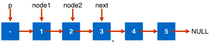
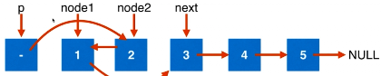
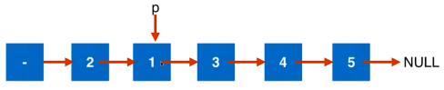

### 24. Swap Nodes in Pairs

[Description](https://leetcode.com/problems/swap-nodes-in-pairs/description/)[Hints](https://leetcode.com/problems/swap-nodes-in-pairs/hints/)[Submissions](https://leetcode.com/problems/swap-nodes-in-pairs/submissions/)[Discuss](https://leetcode.com/problems/swap-nodes-in-pairs/discuss/)[Solution](https://leetcode.com/problems/swap-nodes-in-pairs/solution/)

[Pick One](https://leetcode.com/problems/random-one-question/)

------

Given a linked list, swap every two adjacent nodes and return its head.

For example,
Given `1->2->3->4`, you should return the list as `2->1->4->3`.

Your algorithm should use only constant space. You may **not** modify the values in the list, only nodes itself can be changed.


思路一：

准备虚拟头节点和辅助指针



利用辅助指针交换位置



移动辅助指针。先移动p，然后根据p得到其余指针。



```c++
/**
 * Definition for singly-linked list.
 * struct ListNode {
 *     int val;
 *     ListNode *next;
 *     ListNode(int x) : val(x), next(NULL) {}
 * };
 */
class Solution {
public:
    ListNode* swapPairs(ListNode* head) {
        
        ListNode* dummyHead = new ListNode(0);
        dummyHead->next = head;
        ListNode* p = dummyHead;
        while(p->next && p->next->next){
          　//辅助指针
            ListNode* node1 = p->next;
            ListNode* node2 = node1->next;
            ListNode* next = node2->next;
            
            //开始交换位置
            node2->next = node1;
            node1->next = next;
            p->next = node2;
            
            p = node1;
        }
        ListNode* retNode = dummyHead->next;
        delete dummyHead;
        
        return retNode;
    }
};
```


25:翻转每组为k个节点的链表

147:在链表上实现插入排序

148:用O(nlogn)的时间复杂度对链表进行排序。　归并？自低向上？　迭代和递归？