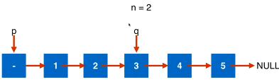
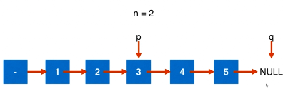

### 19. Remove Nth Node From End of List

[Description](https://leetcode.com/problems/remove-nth-node-from-end-of-list/description/)[Hints](https://leetcode.com/problems/remove-nth-node-from-end-of-list/hints/)[Submissions](https://leetcode.com/problems/remove-nth-node-from-end-of-list/submissions/)[Discuss](https://leetcode.com/problems/remove-nth-node-from-end-of-list/discuss/)[Solution](https://leetcode.com/problems/remove-nth-node-from-end-of-list/solution/)

[Pick One](https://leetcode.com/problems/random-one-question/)

------

Given a linked list, remove the *n*th node from the end of list and return its head.

For example,

```
   Given linked list: 1->2->3->4->5, and n = 2.

   After removing the second node from the end, the linked list becomes 1->2->3->5.
```

**Note:**
Given *n* will always be valid.
Try to do this in one pass.


删除倒数第n个节点


#####　思路一

先遍历计算链表长度，再遍历一遍删除第（len-n）个节点。

问题：需要遍历两边链表


##### 思路二 双指针　通过辅助空间来减少时间





两个指针的位置距离为(n+1)


```c++
/**
 * Definition for singly-linked list.
 * struct ListNode {
 *     int val;
 *     ListNode *next;
 *     ListNode(int x) : val(x), next(NULL) {}
 * };
 */
class Solution {
public:
    ListNode* removeNthFromEnd(ListNode* head, int n) {
        //需要判断n的范围　　
      
        ListNode* dummyHead = new ListNode(0);
        dummyHead->next = head;
        
        ListNode* p = dummyHead;
        ListNode* q = dummyHead;
        
        for(int i=0; i < n+1; i++)
            q = q->next;
        
        while(q!=NULL){
            q = q->next;
            p = p->next;
        }
        
        ListNode* delNode = p->next;
        p->next = delNode->next;
        delete delNode;
        
        ListNode* retNode = dummyHead->next;
        delete dummyHead;
        
        return retNode;
    }
};
```


61:向右旋转链表k位

143:重组链表　两次遍历？　获取中间元素？　一次遍历？

234:链表是否为回文链表　转为数组？　翻转一半链表，然后一次判断？