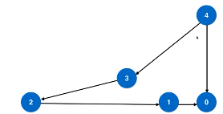
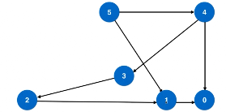
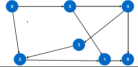
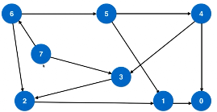
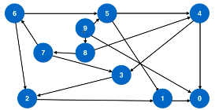

### 279. Perfect Squares

[Description](https://leetcode.com/problems/perfect-squares/description/)[Hints](https://leetcode.com/problems/perfect-squares/hints/)[Submissions](https://leetcode.com/problems/perfect-squares/submissions/)[Discuss](https://leetcode.com/problems/perfect-squares/discuss/)[Solution](https://leetcode.com/problems/perfect-squares/solution/)

[Pick One](https://leetcode.com/problems/random-one-question/)

------

Given a positive integer *n*, find the least number of perfect square numbers (for example, `1, 4, 9, 16, ...`) which sum to *n*.

For example, given *n* = `12`, return `3` because `12 = 4 + 4 + 4`; given *n* = `13`, return `2` because `13 = 4 + 9`.

完全平方数。包括１．


不能用贪心算法解决。例如： 12=9+1+1+1　一共4个数。而12=4+4+4，一共三个数。

那如何解决呢？


##### 思路一 图

问题转化：转为图论的问题

建模：

- 从０到ｎ，每个数字表示一个节点
- 如果两个数字ｘ到ｙ相差一个完全平方数，则连接ｘ与ｙ形成一条边
- 得到了一个无权图

原问题转为：求这个无权图中从ｎ到０的最短路径。












方案一：

```c++
class Solution {
public:
    int numSquares(int n) {
    	assert( n>0 );
      
      queue< pair<int,int> > q; // 数字，step
    	q.push(make_pair(n,0));
      
      while(!q.empty()){
        int num = q.front().first;
        int step = q.front().second;
        q.pop();
        
        if( num == 0 )
          return step;
        
        for( int i=0; num - i*i >-0; i++ ){
          q.push( make_pair( num - i*i, step+1 ) );
        }
      }
    }
};
```


方案二：

```c++
class Solution {
public:
    int numSquares(int n) {
    	assert( n>0 );
      
      queue< pair<int,int> > q; // 数字，step
    	q.push(make_pair(n,0));
      
      vector<bool> visited(n+1, false);
      visited[n] = true;
      
      while(!q.empty()){
        int num = q.front().first;
        int step = q.front().second;
        q.pop();
        
        if( num == 0 )
          return step;
        
        for( int i=0; num - i*i >=0; i++ ){　//寻找到ｎｕｍ的下一个节点(相差i*i完全平方数)
          if( !visited[num-i*i] ){
            q.push( make_pair( num - i*i, step+1 ) );
            visited[num-i*i] = true;
          }
         
        }
      }
    }
};
```


简单优化：


```c++
class Solution {
public:
    int numSquares(int n) {
    	assert( n>0 );
      
      queue< pair<int,int> > q; // 数字，step
    	q.push(make_pair(n,0));
      
      vector<bool> visited(n+1, false);
      visited[n] = true;
      
      while(!q.empty()){
        int num = q.front().first;
        int step = q.front().second;
        q.pop();
        
        for( int i=0; ; i++ ){
          int a = num - i*i; //１．减少计算量
          if(a<0)
            break;
          if(a==0)　　//２．提前判断，还差一步就到０了
            return step+1;　
          if( !visited[a] ){
            q.push( make_pair(a, step+1 ) );
            visited[a] = true;
          }
         
        }
      }
    }
};
```


127:　beginword 到 endword的最短变换路径长度

126:　beginword 到 endword的最短变换路径


