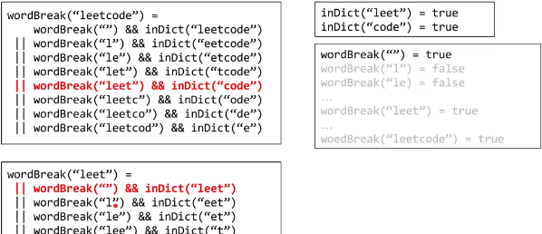

### 107. Word Break

Given a string s and a dictionary of words dict, determine if s can be break into a space-separated sequence of one or more dictionary words.

### 样例

Given s = `"lintcode"`, dict = `["lint", "code"]`.

Return true because **"lintcode"** can be break as `"lint code"`.


状态：flag[i]:代表字符串[0...i-1]能否成功组成。即，字符串中第i个位置由falg[i+1]来判断。

状态转移：flag[i+1]=true,if flag[j]=true 且 [j...i]为dict中的单词。

```java
public boolean wordBreak(String s, Set<String> dict) {
  int n = s.length();
  if( s == null || dict.contains(s) )
    return true;
  int wordMaxLen = maxLength(dict);
  boolean[] flag = new boolean[n+1];
  flag[0] = true;
  for( int i = 0; i < n; i++ )
    for( int j = 0; j <= i; j++ ){
      if( flag[j] && (i-j+1 <= wordMaxLen) && dict.contains(s.substring(j, i+1)) ){
        flag[i+1] = true;
        break;
      }
    }
  return flag[n];
}
private int maxLength(Set<String> dict){
  int len = 0;
  for(String s : dict)
      len = Math.max( len, s.length() );
  return len;
}
```

优化1：求出dict中最长单词的长度wordMaxLen,如果[j..i]的长度超过了wordMaxLen，则直接跳过。

优化2:第二层for循环从j=i开始，因为如果s很长，则第二次for循环的前面大部分都无效，即，无法满足(i-j+1 <= wordMaxLen)。

```java
for( int i = 0; i < n; i++ )
    for( int j = i; (i-j+1 <= wordMaxLen) && j >= 0; j-- )
//  for( int j = i; ( i-j  <  wordMaxLen) && j >= 0; j-- ) 小优化，放在j>=0前面。
```


记忆化递归思路：



```java
public boolean wordBreak(String s, Set<String> dict) {
  dict.add("");//如果为""，也为真
  HashMap<String, Boolean> memo = new HashMap<String, Boolean>();
  return wordBreak(s, dict, memo);
}
private boolean wordBreak( String s, Set<String> dict, HashMap<String, Boolean> memo ){
  if( memo.containsKey(s) ) return memo.get(s);
  if( dict.contains(s) ){
      memo.put(s, true);
      return true;
  }
  for( int j = 1; j < s.length(); j++ ){//如果left或者right为""，也包含在dict内
      String left = s.substring(0,j);
      String right = s.substring(j);
      if( dict.contains(right) && wordBreak( left, dict, memo ) ){
          memo.put(s, true);
          return true;
      }
  }
  memo.put(s, false);
  return false;
}
```

