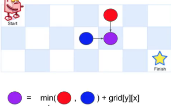

#### 110. 最小路径和

给定一个只含非负整数的m*n网格，找到一条从左上角到右下角的可以使数字和最小的路径。

你在同一时间只能向下或者向右移动一步



1.记忆化递归

```java
public int minPathSum(int[][] grid) {
    if( null == grid || grid.length == 0)
        return 0;
    int m = grid.length;
    int n = grid[0].length;
    int[][] f = new int[m][n];
    return path(m-1, n-1, grid, f);
}
private int path( int m, int n, int[][] grid, int[][] f){
    if( m < 0 || n < 0 ) return Integer.MAX_VALUE;
    if( 0 == m && 0 == n ) return grid[0][0];
    if( f[m][n] > 0 ) return f[m][n];
    f[m][n] = grid[m][n] + Math.min( path(m-1, n, grid, f), path(m, n-1, grid, f) );
    return  f[m][n];
}
```

2.动态规划

```java
public int minPathSum(int[][] grid) {
    if( null == grid || 0 == grid.length )
        return 0;
    int m = grid.length;
    int n = grid[0].length;
    int[][] dp = new int[m][n];
    for( int i = 0 ; i < m; i++ )
        for( int j = 0; j < n; j++ ){
            dp[i][j] = grid[i][j];
            if( 0 == i && 0 == j )
                continue;
            if( 0 == i )
                dp[0][j] += dp[0][j-1];
            else if( 0 == j )
                dp[i][0] += dp[i-1][0];
            else
                dp[i][j] += Math.min(dp[i-1][j], dp[i][j-1]);
        }
    return dp[m-1][n-1];
}
```

