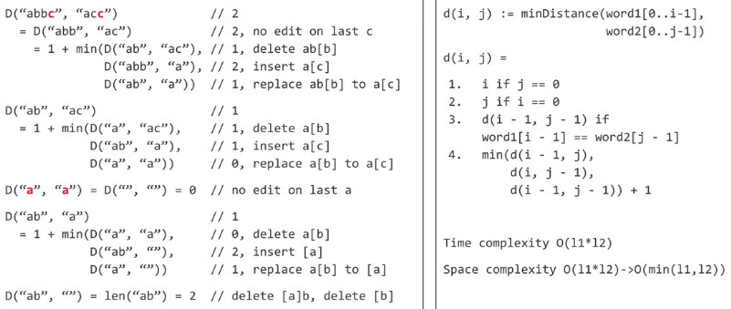
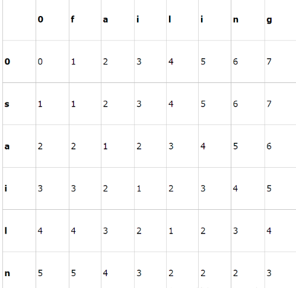

#### 119. 编辑距离 

- ​

给出两个单词word1和word2，计算出将word1 转换为word2的最少操作次数。

你总共三种操作方法：

- 插入一个字符
- 删除一个字符
- 替换一个字符

样例

给出 work1="mart" 和 work2="karma"

返回 3



１．记忆化递归

```java
public int minDistance(String word1, String word2) {
    int l1 = word1.length();
    int l2 = word2.length();
    int[][] memo = new int[l1+1][l2+1];
    return dis(word1, word2, l1, l2, memo);
}
public int dis(String word1, String word2, int l1, int l2, int[][] memo){
    if( 0 == l1 ) return l2;
    if( 0 == l2 ) return l1;
    if( memo[l1][l2] > 0 ) return memo[l1][l2];
    if( word1.charAt(l1-1) == word2.charAt(l2-1) )
        memo[l1][l2] = dis(word1, word2, l1-1, l2-1, memo);
    else
        memo[l1][l2] = 1 + Math.min( dis(word1, word2, l1-1, l2, memo),
                           Math.min( dis(word1, word2, l1, l2-1, memo),
                                     dis(word1, word2, l1-1, l2-1, memo)));
    return memo[l1][l2];
}
```

首先解释下dis[i][j]：它是指word1[i]和word2[j]的Edit Distance。dis[0][0]表示word1和word2都为空的时候，此时他们的Edit Distance为0。很明显可以得出的，dis[0][j]就是word1为空，word2长度为j的情况，此时他们的Edit Distance为j，也就是从空，添加j个字符转换成word2的最小Edit Distance为j；同理dis[i][0]就是，word1长度为i，word2为空时，word1需要删除i个字符才能转换成空，所以转换成word2的最小Edit Distance为i。

2.动态规划



```java
public int minDistance(String word1, String word2) {
  int l1 = word1.length();
  int l2 = word2.length();
  int[][] dp = new int[l1+1][l2+1];
  for( int i = 1; i <= l1; i++ )
    dp[i][0] = i;
  for( int j = 1; j <= l2; j++ )
    dp[0][j] = j;

  for( int i = 1; i <= l1; i++ )
    for( int j = 1; j <= l2; j++ ){
      if( word1.charAt(i-1) == word2.charAt(j-1) )
        dp[i][j] = dp[i-1][j-1];
      else
        dp[i][j] = 1 + Math.min( dp[i-1][j], Math.min( dp[i][j-1], dp[i-1][j-1] ));
    }
  return dp[l1][l2];
}
```

2.1 空间优化

```java
public int minDistance(String word1, String word2) {
  int l1 = word1.length();
  int l2 = word2.length();
  int[][] dp = new int[2][l2+1];
  int cur = 0;
  int pre = 0;
  for( int i = 0; i <= l1; i++ ){
    pre = cur;
    cur = 1-pre;
    for( int j = 0; j <= l2; j++ ){
      if( 0 == i ){ //注意边界条件 根据整个矩阵而来。
        dp[cur][j] = j;
        continue;
      }
      if( 0 == j ){ //想象一下，根据cur和pre恢复成整个矩阵
        dp[cur][j] = i;
        continue;
      }
      if( word1.charAt(i-1) == word2.charAt(j-1) )
        dp[cur][j] = dp[pre][j-1];
      else
        dp[cur][j] = 1 + Math.min(dp[pre][j], Math.min(dp[cur][j-1], dp[pre][j-1]));
    }
  }
  return dp[cur][l2];
}
```

