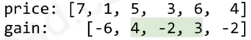

### 149. Best Time to Buy and Sell Stock

Say you have an array for which the *i*th element is the price of a given stock on day *i*.

If you were only permitted to complete at most one transaction (ie, buy one and sell one share of the stock), design an algorithm to find the maximum profit.

### 样例

Given array `[3,2,3,1,2]`, return `1`.


动态规划：

状态：lowestPrice:记录[0...i)，记录前i天的最低价格

状态转移：profit = max( profit, prices[i] - lowestPrice ).将前一天的收益和第i天的收益比较取最大值。

```java
public int maxProfit(int[] prices) {
    if( null == prices || prices.length == 0 )
        return 0;
    int n = prices.length;
    int profid = 0;
    int lowestPrice = prices[0];
    for( int i = 1; i < n; i++ ){
        lowestPrice = Math.min(lowestPrice, prices[i-1]);
        profid = Math.max( profid,  prices[i] - lowestPrice);
    }
    return profid;
}
```

思路二：将每天的价格转换为价格涨幅，然后在价格涨幅中求最大子数组即可。



