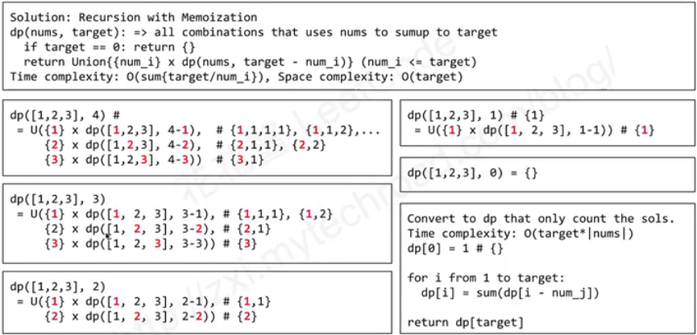

### 564. Combination Sum IV

Given an integer array `nums` with all positive numbers and no duplicates, find the number of possible combinations that add up to a positive integer `target`.

### Example

Given nums = `[1, 2, 4]`, target = `4`

```
The possible combination ways are:
[1, 1, 1, 1]
[1, 1, 2]
[1, 2, 1]
[2, 1, 1]
[2, 2]
[4]
```

return `6`

思路：当求target时(tt)，nums={1,5,6,3}

fun(tt)={1×fun(tt-1)} + {5×fun(tt-5)} + {6×fun(tt-6)} + {3×fun(tt-3)}

因为是组合，所以每个fun中都要循环一遍。



记忆化递归：

```java
int[] memo;
public int backPackVI(int[] nums, int target) {
    memo = new int[target+1];
    Arrays.fill(memo, -1);//　-1　没有访问过
    memo[0] = 1; 　// 即target-num==0,则target刚好可由num组成，为一种
    return helper( nums, target );
}
private int helper( int[] nums, int target ){
    if( target < 0 ) return 0; 　//如果target<0，则返回0，即不符合要求。
    if( memo[target] != -1 ) return memo[target];
    int ans = 0;
    for( int num : nums )
      	//若target-num==0,则target刚好可由num组成，为一种
        ans += helper( nums, target - num );
    memo[target] = ans;
    return ans;
}
```

动态规划：

注意：因为要从1循环到target,所以时间可能要比上面的久一点。

一种优化：先对nums进行排序

另一种优化：并查集？？

```java
public int backPackVI(int[] nums, int target) {
    int[] dp = new int[target+1];
    dp[0] = 1;
    for( int i = 1; i <= target; i++ )
        for( int num : nums )
            if( i - num >= 0 )
                dp[i] += dp[i - num];
    return dp[target];
}
```

