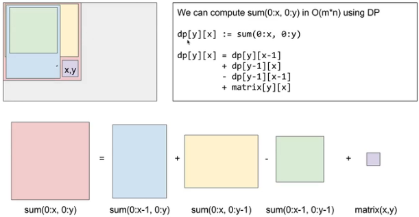
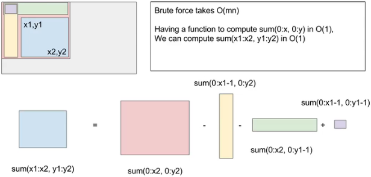

### 665. Range Sum Query 2D - Immutable

Given a 2D matrix matrix, find the sum of the elements inside the rectangle defined by its upper left corner `(row1, col1)` and lower right corner `(row2, col2)`.

### Example

Given matrix =

```
[
  [3, 0, 1, 4, 2],
  [5, 6, 3, 2, 1],
  [1, 2, 0, 1, 5],
  [4, 1, 0, 1, 7],
  [1, 0, 3, 0, 5]
]
```

sumRegion(2, 1, 4, 3) -> `8`
sumRegion(1, 1, 2, 2) -> `11`
sumRegion(1, 2, 2, 4) -> `12`


状态：从原点到当前点的矩阵之和。

状态转移：



则结果为：




```java
int[][] sum;
public NumMatrix(int[][] matrix) {
  if( null == matrix || 0 == matrix.length )
      return;
  int m = matrix.length;
  int n = matrix[0].length;
  sum = new int[m+1][n+1]; //注意sum的第一行和第一列为padding.
  for( int i = 1; i <= m; i++ )
    for( int j = 1; j <= n; j++ ){
      sum[i][j] = sum[i-1][j] + sum[i][j-1] - sum[i-1][j-1] + matrix[i-1][j-1];
    }
}

public int sumRegion(int row1, int col1, int row2, int col2) {
  //sum的第一行和第一列为padding
  return sum[row2+1][col2+1] - sum[row2+1][col1] - sum[row1][col2+1] +sum[row1][col1];
}
```


