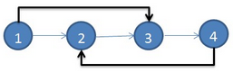
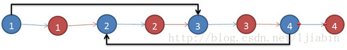

### 105. Copy List with Random Pointer

A linked list is given such that each node contains an additional random pointer which could point to any node in the list or null.

Return a deep copy of the list.

### Challenge

Could you solve it with O(1) space?


假设原始链表如下，细线表示next指针，粗线表示random指针，没有画出的指针均指向NULL：



构建新节点时，指针做如下变化，即把新节点插入到相应的旧节点后面：



```java
public class Solution {  
    public RandomListNode copyRandomList(RandomListNode head) {  
        if (head == null) return null;  
        //第一遍扫描：对每个结点进行复制，把复制出来的新结点插在原结点之后  
        RandomListNode node = head;  
        while (node != null) {  
            RandomListNode newnode = new RandomListNode(node.label);  
            newnode.next = node.next;  
            node.next = newnode;  
            node = newnode.next;  
        }     
        //第二遍扫描：根据原结点的random，给新结点的random赋值  
        node = head;  
        while (node != null) {  
            if (node.random != null) node.next.random = node.random.next;  
            node = node.next.next;  
        }      
        RandomListNode newhead = head.next;   
        //第三遍扫描：把新结点从原链表中拆分出来  
        node = head;  
        while (node != null) {  
            RandomListNode newnode = node.next;  
            node.next = newnode.next;  
            if (newnode.next != null) newnode.next = newnode.next.next;  
            node = node.next;  
        }  
        return newhead;  
    }  
}  
```

