### 提升

随机森林特点：又若干个样本直接加和求均值，或者少数服从多数。随机森林的决策树分别采样建立，相对独立。

思考：

- 样本加权？　分类器加权？
- 假设已经得到了m-1棵决策树，是否可以通过现有的样本和决策树信息，对第m决策树的建立产生有益的影响？
- 最后的投票过程可否在建立决策树时即确定呢？

方案：

1. 样本加权：在每一次分类中，将分错的样本权重提高

#### 基本概念

　　**提升**：可用于回归和分类。每一步产生一个弱预测模型(如决策树)，并加权累加到总模型中；如果每一步的弱预测模型的生成都是依据损失函数的梯度方向，则称为梯度提升Gradient boosting。

　　**梯度提升**：首先给出一个目标损失函数（根据实际问题给出，如MSE、交叉熵）。它的定义域是所有可行的弱函数集合(基函数)；然后通过迭代的选择一个*负梯度方向*上的基函数来逐渐逼近*局部极小值*。每一次下降的步长，可以当做分类器本身的权值。

　　**理论**：如果存在弱分类器，则可以通过提升的办法得到强分类器。

提升算法：

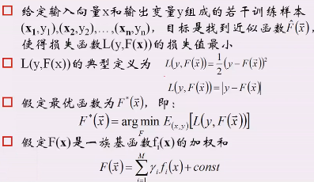

中位数是绝对最小最优解证明：

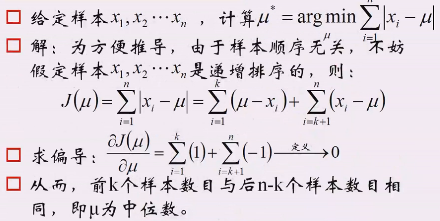

AdaBoost提供的解决方案：

1. 提高那些被前一轮弱分类器错误分类样本的权值，降低正确的，让后一轮的弱分类器更加关注于错误分类的样本。
2. 加权多数表决：加大分类误差率小的弱分类器的权值，使其在表决中起较大的作用；反之则反。

#### XGBoost

　　样本不加权值？

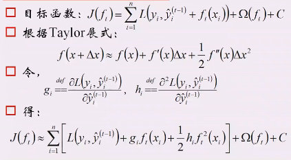

说明：

- 目标函数中：L为损失函数，i代表第i个样本。参数依次为：真实样本、前面(t-1)个弱分类器的预测值、当前分类器(第t个)。回顾logistic回归，正则化一般是约束参数(系数)，故后面为关于ft的正则化项，**即控制复杂度的**（叶子的权值不要太大，叶节点个数不能太多）。最后为常数。
- 映射：　x -> 预测值y;  delta x -> ft
- g和h可以看做已知的，因为损失函数L已知，真实样本已知，前t-1个分类器已知（即前t-1个分类器的预测结果已知）
- 在最后J的公式中，是关于ft的函数，第一项L()其实是个常数项，可以合并进C中
- 最后J(ft)对ft求导数(把ft当做自变量)。

对决策树的一个描述，此处的叶权值就是预测值：

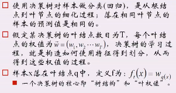

正则项的定义：超参数越大，越重视复杂度

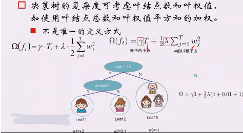

目标函数计算：

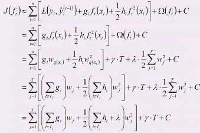

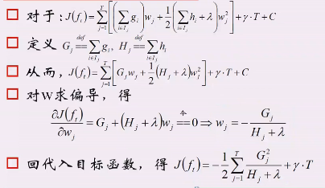

在上面的公式中可以看出：只要给定G H和超参数，就可以算出叶结点的w值了。

举例说明（最后得到损失值）：

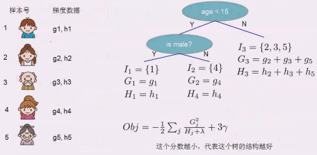

构造一棵树需要　树的结构　和　叶权值。已知叶权值，如何构造树呢？

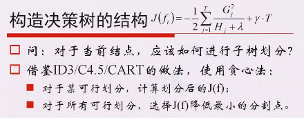

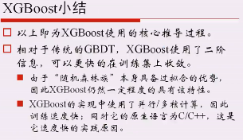

XGBoost并行：可以认为在构造树的过程中计算增益的时候并行。　

#### Adaboost

　　在样本上加上权值，预测错误的样本加上大的权值。

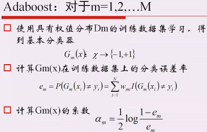

误差率e越小(e>0.5)，G的系数（权值）越大。

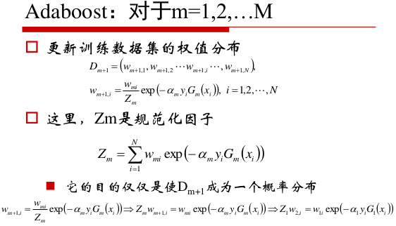

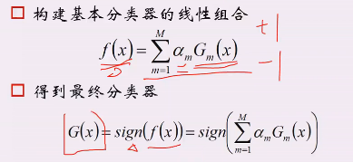

该模型为何会收敛，即误差越来越小：

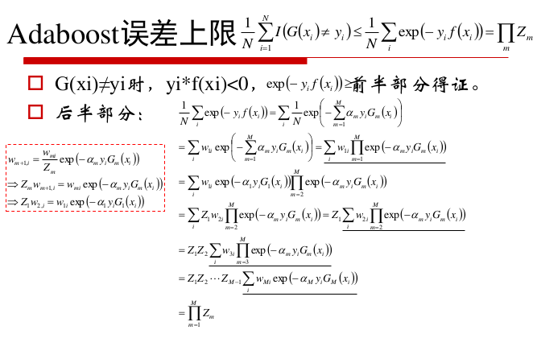

对于二分类问题，其训练误差界：

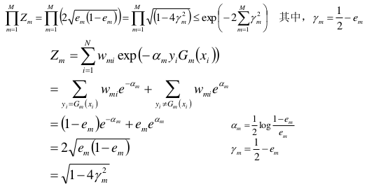

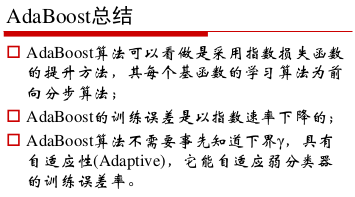

偏差与方差：

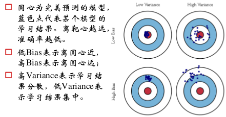

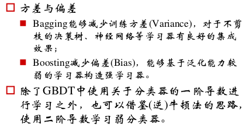

GBDT可以用来做特征。

