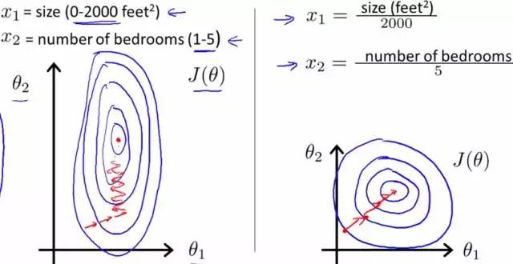

## 一、数据归一化的好处  

 - 1、归一化后加快了梯度下降求最优解的速度
 - 2、归一化有可能提高精度

### （一）归一化为什么能提高梯度下降法求解最优解的速度？

 斯坦福机器学习视频做了很好的解释：https://class.coursera.org/ml-003/lecture/21  

 如下图所示，蓝色的圈圈图代表的是两个特征的等高线。其中左图两个特征X1和X2的区间相差非常大，X1区间是[0,2000]，X2区间是[1,5]，其所形成的等高线非常尖。当使用梯度下降法寻求最优解时，很有可能走“之字型”路线（垂直等高线走），从而导致需要迭代很多次才能收敛；  

 而右图对两个原始特征进行了归一化，其对应的等高线显得很圆，在梯度下降进行求解时能较快的收敛。  

 因此如果机器学习模型使用梯度下降法求最优解时，归一化往往非常有必要，否则很难收敛甚至不能收敛。

  

### （二) 归一化有可能提高精度  
 一些分类器需要计算样本之间的距离（如欧氏距离），例如KNN。如果一个特征值域范围非常大，那么距离计算就主要取决于这个特征，从而与实际情况相悖（比如这时实际情况是值域范围小的特征更重要）。  

## 二、归一化的类型

### （一) 线性归一化:

$$ x' = \dfrac {x-min(x)} {max(x)-min(x)} $$

这种归一化方法将原始数据线性化的方法转换到[0 1]的范围,比较适用在数值比较集中的情况。这种方法有个缺陷，如果max和min不稳定，很容易使得归一化结果不稳定，使得后续使用效果也不稳定。实际使用中可以用经验常量值来替代max和min。

### （二)标准差标准化

经过处理的数据符合标准正态分布，即均值为0，标准差为1，其转化函数为：

$$ x^* = \dfrac {x-\mu} {\sigma} $$

其中μ为所有样本数据的均值，σ为所有样本数据的标准差。

该种归一化方式要求原始数据的分布可以近似为高斯分布，否则归一化的效果会变得很糟糕。

### （三) 非线性归一化

经常用在数据分化比较大的场景，有些数值很大，有些很小。通过一些数学函数，将原始值进行映射。该方法包括 log、指数，正切等。需要根据数据分布的情况，决定非线性函数的曲线，比如log(V, 2)还是log(V, 10)等。

未完待续。。。

参考：https://ask.julyedu.com/question/85149