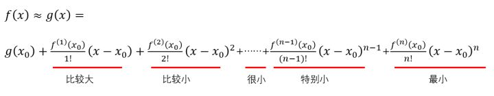
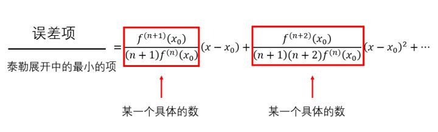
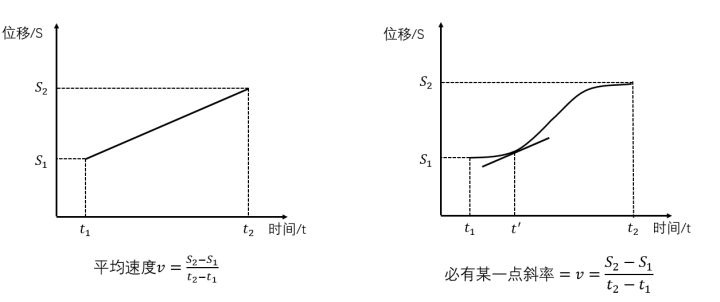
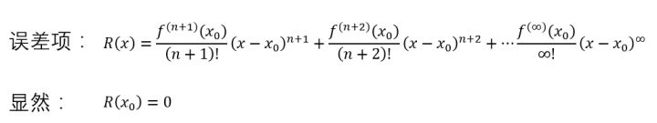
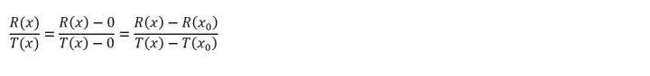
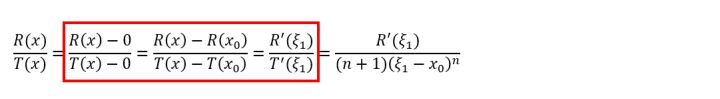
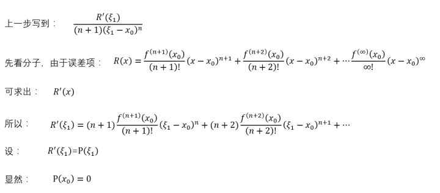
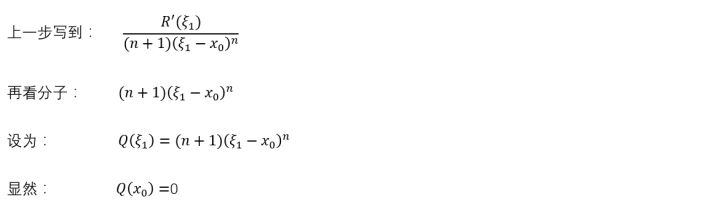
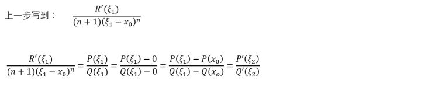

##　泰勒公式

通俗理解参考[这里](https://www.zhihu.com/question/25627482)。

先举一个例子：

　　如果想仿造一段曲线，那么首先应该保证曲线的起始点一样，其次保证起始点处位移随时间的变化率一样（速度相同），再次应该保证前两者相等的同时关于时间的二阶变化率一样（加速度相同）……如果随时间每一阶变化率（每一阶导数）都一样，那这俩曲线肯定是完全等价的。　　

泰勒展开式就是把一个三角函数或者指数函数或者其他比较难缠的函数用多项式替换掉。

也就是说，有一个**原函数 **，我再造一个图像与原函数图像相似的**多项式函数**  ,为了保证相似，我只需要保证这俩函数在某一点的**初始值相等，1阶导数相等，2阶导数相等，……n阶导数相等**。

首先要在曲线  上任选一个点，为了方便，就选  ,设仿造的曲线的解析式为  ，前面说了，仿造的曲线是一个多项式，假设算到n阶。

能求n次导数的多项式，其最高次数肯定也为n。所以，仿造的曲线的解析式肯定是这种形式：

前面说过，必须保证初始点相同，即

 ,求出了 $a_0$

接下来，必须保证n阶导数依然相等，即

因为对  求n阶导数时，只有最后一项为非零值，为$n!a_{n}$ ，

由此求出 

求出了$a_{n}$ ，剩下的只需要按照这个规律换数字即可。

综上： 

知道了原理，然后把原理用数学语言描述，只需要两步即可求出以上结果。背不过推一下就行。

泰勒推到这里，又想起了自己刚才那个问题：不一定非要从x=0的地方开始，也可以从  开始。此时，只需要将0换成 $x_0$ ，此时的多项式为：

$g(x) = a_0 + a_1(x-x_0) + a_2(x-x_0)^2 + a_3(x-x_0)^3 + ... + a_n(x-x_0)^n$

然后再按照上面一模一样的过程重新来一遍，最后就能得到如下结果：

**泰勒写到这里，长舒一口气，他写下结论：**

**有一条解析式很恶心的曲线  ，我可以用多项式仿造一条曲线  ,那么**

**** 

**泰勒指出：在实际操作过程中，可根据精度要求选择n值，只要n不是正无穷，那么，一定要保留上式中的约等号。**

**若想去掉约等号，可写成下面形式：**

**** 

好了，泰勒的故事讲完了。其实**真正的数学推导只需要两步**，困难的是不理解思想。如果背不过，就临时推导，只需要十几二十秒。

那么，到底该求导几次？

佩亚诺：

最后发现，只有当ｘ趋近于$x_0$时，这个商才趋近于0.

拉格朗日:

问题：一辆车，从S_{1} 处走到S_{2}处，中间用了时间t，那么这辆车的**平均速度**就是 $v=\frac{S_{1}-S_{2}}{t}$ ，假如有那么一个时刻，这辆车的瞬时速度是小于平均速度v的，那么，肯定有一个时刻，这辆车的速度是大于平均速度v的，由于车的速度不能突变，从小于v逐渐变到大于v，肯定有一个瞬间是等于v的。

就这个问题，我相信在做的大多数，即使小时候没有听说过拉格朗日，也一定能想明白这个问题。

拉格朗日的牛逼之处在于，能把生活中的这种小事翻译成数学语言。他把S-t图像画出来了，高中生都知道，在这个图像中，斜率表征速度：

把上面的这个简单的问题用数学语言描述出来，就是那个被拉格朗日了的定理，简称**拉格朗日中值定理**：有个函数  ，如果在一个范围内连续，可求导，则 

后来啊，拉格朗日的中值定理被柯西看到了，柯西牛逼啊，天生对于算式敏感。柯西认为，纵坐标是横坐标的函数，那我也可以把横坐标写成一个函数啊，于是他提出了**柯西中值定理**：

拉格朗日听说了这事，心里愤愤不平，又觉得很可惜，明明是自己的思路，就差这么一步，就让柯西捡便宜了，不过柯西确实说的有道理。这件事给拉格朗日留下了很深的心理阴影。

首先，跟佩亚诺一样，先把误差项写出来，并设误差项为R（x）:

误差项R（x）中每一项都是俩数的乘积，假如是你，你肯定是想两边同时除掉一个  ，对吧，为了简单，把  设为  :

所以除过之后，就成了：

等等，这一串东西看着怎么眼熟？咦？这不是柯西老哥推广的我的中值定理么？剩下的不就是……：

拉格朗日写到这里卡住了，不知道你们有没有这种经验，反正我思考一道数学题的时候，会尝试着把思路进行到底，直到完全进了死胡同才会否定这种思路。有了前面的脑洞，拉格朗日继续复制这种思路，想看看能不能继续往下写：

先看分子

再看分母

好巧合，又可以用一次柯西的中值定理了。

总之，按照这种方法，可以一直求解下去，最终的结果就是：

至此，拉格朗日把后面无数多的误差项给整合成了一项，而且比配诺亚更加先进的地方在于，不一定非要让x趋近于$x_{0}$，可以在二者之间的任何一个位置$\xi$处展开，及其好用。

本文涵盖泰勒展开式、佩亚诺余项、拉格朗日中值定理、柯西中值定理、拉格朗日余项。全文完毕。