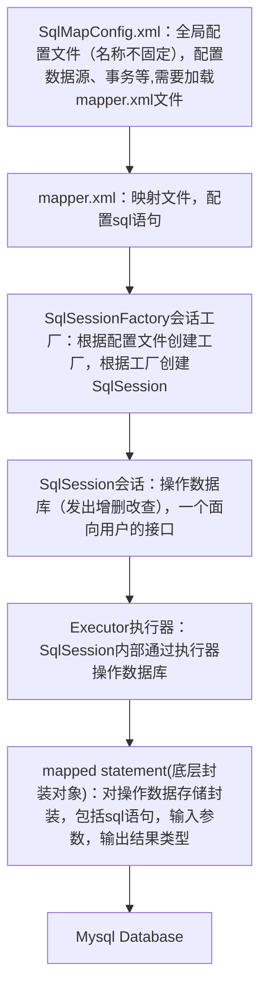

#### 原生JDBC问题总结：
 - 频繁创建、释放资源
    - 解决：使用数据库连接池
 - sql硬编码到java中
    - 解决：将sql语句配置在xml配置文件中
 - 向preparedStatement中设置参数，占位符和参数设置都是硬编码
    - 解决：占位符和参数配置在xml中
 - reultset中便利数据，硬编码
    - 设想：将结果集映射为对象

# Mybatis框架

mybaits让程序员将主要精力放在sql上，通过mybatis提供的映射方式，自由灵活生成满足需要的sql语句

输入映射：可以向preparement中输入参数自动进行输入映射

输出映射：可以将resultset灵活映射成java对象

 - SqlMapConfig.xml：全局配置文件（名称不固定），配置数据源、事务等
 - mapper.xml：映射文件，配置sql语句
 - SqlSessionFactory会话工厂：根据配置文件创建工厂，根据工厂创建SqlSession
 - SqlSession会话：操作数据库（发出增删改查），一个面向用户的接口
 - Executor执行器：SqlSession内部通过执行器操作数据库



sqlMapConfig.xml
```xml
    <!--加载映射文件-->
    <mappers>
        <mapper resource="sqlmap/User.xml">
        <mapper resource="mapper/UserMapper.xml">
    </mappers>
```

mapper.xml
```xml
<mapper namespace="testnp">
    <!--id：statement的id， parameterType：占位符的参数类型， resultType：返回的结果集中单条记录的类型-->
    <select id="findUserById" parameterType="int" resultType="org.quan.mybatis.User">
        <!-- #{} 表示占位符,可以使用value或者其它名称-->
        SELECT * FROM USER WHERE id=#{id}
    </select>

    <select id="findUserByName" parameterType="String" resultType="org.quan.mybatis.User">
        <!-- ${} 表示拼接sql串，将接收到的内容不加任何修饰拼接在sql中，可能会引起sql注入。如果传入的是简单类型，只能使用value-->
        SELECT * FROM USER WHERE username LIKE '%${value}%'
    </select>

    <insert id="insertUser" parameterType="org.quan.mybatis.User">
        <!--将插入数据的主键返回，返回到user对象中,只适用于自增主键-->
        <!--keyProperty：将主键值设置到parameterType指定对象的对应属性中(id)， order：相对insert执行顺序-->
        <selectKey keyProperty="id" order="AFTER" resultType="java.lang.Integer">
            DELECT LAST_INSERT_ID()
        </select>

        <!--使用mysql的uuid()生成的主键。过程：首先通过uuid得到主键，然后设置user，最后设置sql-->
        <selectKey keyProperty="id" order="BEFORE" resultType="java.lang.Integer">
            DELECT uuid()
        </select>
        insert into user(id, username, gender) values(#{id},#{username},#{gendre})
    </insert>

    <delete id="deleteUser" parameterType="java.lang.Integer">
        delete from user where id=#{id}
    <delete>

    <update id="updateUser" parameterType="org.quan.mybatis.User">
        <#{id}为user中的id属性值>
        update user set username=#{username}, gender=#{gender} where id=#{id}
    </update>

    
</mapper>
```

```java
    //mybatis配置文件
    String resource = "SqlMapConfig.xml"
    //得到配置文件流
    InputStream inputStream = Resources.gerResourceAsStream(resource);

    //创建会话工厂，传入mybatis的配置文件信息
    SqlSessionFactory sqlSessionFactory = new SqlSessionFactoryBuilder().build(inputStream);
    //通过工厂得到SqlSession
    SqlSession sqlSession = sqlSessionFactory.openSession();
    //通过SqlSession操作数据库
    //第一个参数：映射文件中statement的id,等于namespace.statement的id
    //第二个参数：指定和映射文件中所匹配的partameterType类型的参数
    //结果与指定的resultType类型对象一致
    User user = sqlSession.selectOne(“testnp.findUserById”, 1);

    List<User> list = sqlSession.selectList("testnp.findUserByName","Duke");

    User user = new User();
    user.setId(3);
    user.serUsername("Duke");
    user.serGender("1");
    sqlSession.insert("testnp.insertUser", user);

    sqlSession.delete("testnp.deleteUser", 22);

    user.setId(50);
    sqlSession.update("testnp.updateUser", user);

    sqlSession.commit();

    //释放会话资源
    sqlSession.close();
```

### mybatis和hibernate区别和应用场景
 - Hibernate：
    - 标准的ORM对象关系映射框架，入门门槛较高。
    - 不需要写sql，自动生成。但对sql优化比较困难
    - 适用：需求变化不多的中小型项目，比如：后台管理系统，erp，orm，oa等
 - Mybatis：
    - 不完全的ORM框架，可以实现输入、输出映射
    - 专注sql本身，需要程序员自己写sql语句，优化和修改较方便
    - 适用：需求变化较多的x项目，比如：互联网项目

### Mybatis开发DAO
使用单例模式创建sqlSessionFactory

sqlSession是一个接口，提供了很多操作数据库的方法

sqlSession是线程不安全的，在sqlSession的实现类中，除了有接口中的方法，还有数据域属性.

sqlSession最佳应用场合在方法体内，定义为局部变量来使用。

#### 原始DAO开发方法（程序员需要写dao接口和到实现类）

思路：向dao实现类中注入sqlSessionFactory，在方法体内通过sqlSessionFactory创建SqlSession。

UserDao.java
```java
public interface UserDao {
    public User findUserById(int id) throws Exception;
}
```

UserDaoImpl.java
```java
public class UserDaoImpl implements UserDao {
    //注入sqlSessionFactory
    private SqlSessionFactory sqlSessionFactory;
    @overide
    public User findUserById(int id) throws Exceptions {
        //sqlSession是线程不安全的,故在方法体内部声明使用 
        SqlSession sqlSession = sqlSessionFactory.openSession();
        User user = sqlSession.selectOne("testnp.findUserById",id);
        sqlSession.close();
        return user;
    }
}
```
原始DAO开发问题：
- 1、DAO的接口实现类的方法中存在大量的模板方法。设想能够将这些方法提取出来
- 2、调用sqlSession方法时，将Statement的id硬编码了
- 3、调用sqlSession方法时，传入的变量使用的是泛型，当类型传入错误时，在编译阶段也不报错，不利于程序员开发

#### Mybatis的DAO开发方法

思路：
 - 程序员只需要编写mapper接口（相当于dao接口）（开发规范），和mapper.xml映射文件

 - mybatis可以自动生成mapper接口实现类代理对象（其实就是自动生成了原始DAO的代码模板）

mapper代理 开发规范：
 - 1、mapper.java接口的地址 等于 mapper.xml中的namespace
 - 2、mapper.java接口中的方法名 和 mapper.xml中的Statement的id一致
 - 3、mapper.java接口中的方法输入参数类型 和 mapper.xml中的Statement的parameterType指定的类型一致
 - 4、mapper.java接口中的方法返回值类型 和 mapper.xml中的Statement的resultType指定的类型一致


|num|mapper.java接口|mapper.xml配置文件|
|--|--|--|
|1|接口的地址|namespace|
|2|方法名|Statement的id|
|3|方法输入参数类型|Statement的parameterType指定的类型|
|4|方法返回值类型|Statement的resultType指定的类型

mapper.xml
```xml
<mapper namespace="com.quan.mybatis.UserMapper">
    <!--id：statement的id， parameterType：占位符的参数类型， resultType：返回的结果集中单条记录的类型-->
    <select id="findUserById" parameterType="int" resultType="org.quan.mybatis.User">
        SELECT * FROM USER WHERE id=#{id}
    </select>
</mapper>
```

UserMapper.java
```java
public interface UserMapper {
    public User findUserById(int id) throws Exception;
}
```

Test.java
```java
SqlSession sqlSession = sqlSessionFactory.openSession();
//创建UserMapper对象，mybatis自动生成mapper代理对象
UserMapper userMapper = sqlSession.getMapper(UserMapper.class);
//调用userMapper的方法
User user = userMapper.findUserById(2);
```

说明：
 - 如果mapper方法返回一个对象，则代理对象内部通过selectOne查询数据库；如果返回对象集合，则通过selectList查询
 - 持久层方法的参数可以用包装类型，来达到传递多个参数的目的；但service层不建议使用。


#### SqlMapConfig.xml

Mybatis的全局配置文件：
 - properties 属性：加载db.properties中的参数，例如数据库参数。属性加载顺序：
    - 1、在properties元素体内定义的属性首先被读取
    - 2、然后读取properties元素中resource或者url加载的属性，他会覆盖已读取的同名属性
    - 3、最后读取parameterType传递的属性，它会覆盖已读取的同名属性。
 - settings 全局配置参数
 - typeAliases 类型别名
 - typeHandles 类型处理器
 - objectFactory 对象工厂
 - plugins 插件
 - environments 环境集合属性对象
    - environment 环境子属性对象
        - transactionManager 事务管理
        - dataSource 数据源
 - mappers 映射器 