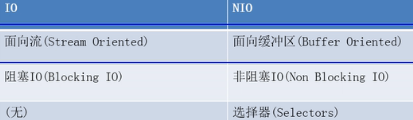
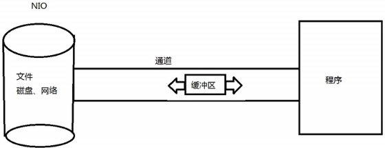
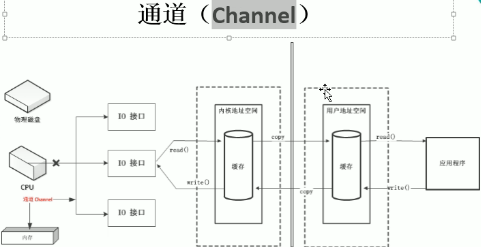
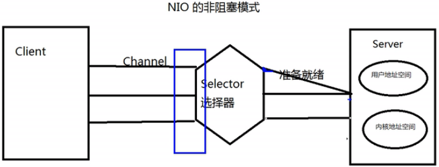

NIO

channel: 表示打开到IO设备(文件、套接字)的连接。

buffer:负责存储，容纳数据的缓冲区。（一个用于特定基本数据类型的容器，由java.nio定义，所有缓冲区都是Buffer抽象类的子类）。用于数据交互，数据从通道读入buffer,从buffer写入通道。

buffer:

- 根据数据类型不同(boolean除外)，提供了相应类型的缓冲区：ByteBuffer, CharBuffer, ShortBuffer, IntBuffer, LongBuffer,FloatBuffer, DoubleBuffer.
- 通过allocate获取缓冲区
- 缓冲区存取数据的两个核心方法：
  - put():存入数据到缓冲区
  - get():获取缓冲区的数据
- 缓冲区中的四个核心属性：
  - capacity:容量，最大容量，一旦申明就不能变。
  - limit:界限，表示缓冲区中可以操作的大小。
  - posotion:缓冲区正在操作数据的位置。

非阻塞模式：

每个channel都在selector上注册，然后selector监控每一个channel，如果数据准备好了，则通知相关线程来进行处理。

