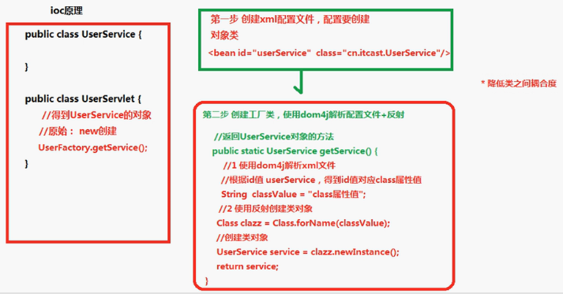

# Spring概念
 - 是开源的轻量级框架（不需要庞大的外界依赖）
 - Spring核心：
   -  1、aop 面向切面编程：扩展功能不是修改源代码实现
   -  2、ioc 控制反转：通过spring的配置来创建java类的对象。
 - 一站式框架：spring在javaEE三层结构中，每一层都提供不同的解决技术：
   - web层：springMVC
   - service层：spring的ioc
   - dao层：spring的jdbcTemplate

## Spring的ioc操作

### ioc操作的来个部分：
 - ioc的配置文件方式
 - ioc的注解方式

#### ioc底层原理
 - 1、xml配置文件
 - 2、dom4j解析xml
 - 3、工厂设计模式
 - 4、反射
 - 

#### ioc入门案例
 - 1、导入jar包（核心：Beans、core、context、spel）
 - 2、创建类，在类里面创建方法
 - 3、创建spring配置文件，配置创建类。配置文件采用schame约束
 - 4、写代码测试对象创建

### Bean管理（xml方式）
bean实例化的三种方式实现
 - 使用类的无参构造创建
 - 使用静态工厂创建:创建静态方法，返回类对象（factory-method）
 - 使用实例工厂创建：创建的不是静态方法，返回类对象(factory-bean factory-method)

#### bean标签常用属性
 - id: 名称，不能包含特殊符号。代码中根据id值得到配置对象
 - class： 创建对象所在类的全路径
 - name： 功能跟id一样，但name可以包含特殊符号
 - scope：
    - singleton：默认值，单利的
    - prototype：多例的，每次创建都是新的对象
    - request：创建对象，把对象放到request域里面
    - session：创建对象，把对象放到session域里面
    - globalSession：创建对象，把对象放到globalSession域里面

#### 属性注入
创建对象的时候，向对象中的属性中赋值

属性注入的方式：
 - 1、使用set方法
 - 2、有参构造
 - 3、使用接口注入
```java
   public  interface Dao{
       public void delete(String name);
   } 
   public class DaoImpl inplements Dao{
       private String name;
       public void delete(String name){
           this.name = name;
       }
   }
```

在spring中只支持前两种：(Mynam为类中的属性)
 - 使用有参构造注入
```xml
    <bean id="demo" class="org.quan.Demo">
      <constructor-arg name="myName" value="Duke"></constructor-arg>
    </bean>
```
 - 使用set方法注入
```xml
<bean id="demo" class="org.quan.Demo">
    <property name="Myname" value="Duke"></property>
</bean>
```

#### 注入对象类型属性（重点）
 - 1、创建service类和dao类
    - 在service中得到dao对象
 - 2、具体实现过程
    - （1）、在service中把dao作为类型属性
    - （2）、生成dao属性的set方法
    - （3）、在配置文件中进行对象属性注入 
```xml
<bean id="userDaoId" class="org.quan.UserDao"></bean>

<bean id="userServiceId" class="org.quan.UserService">
    <property name="userDao" ref="userDaoId"></property>
</bean>
```

#### P名称空间注入
```xml
...
xmlns:p="http://www.springframework.org/schema/p"
...
<bean id="person" class="org.quan.Person" p:pname="Duke"></bean>
...
```
#### 注入复杂类型属性(通过set方法)
```xml
<bean id="userServiceId" class="org.quan.Person">
    
    <!-- array -->
    <property name="arrs">
        <list>
            <value>小王</value>
            <value>小李</value>
            <value>小赵</value>
        </list>
    </property>

    <!-- list -->
    <property name="list">
        <list>
            <value>小王</value>
            <value>小李</value>
        </list>
    </property>

    <!-- map -->
    <property name="map">
        <map>
            <entry key="aa" value="Lucy"></entry>
            <entry key="bb" value="Duke"></entry>
        </map>
    </property>

    <!-- properties -->
    <property name="properties">
        <props>
            <prop key="aa" value="Lucy"></entry>
            <entry key="bb" value="Duke"></entry>
        </props>
    </property>
</bean>
```

#### IOC和DI区别
 - 1、IOC：控制反转，把对象创建交给spring进行配置
 - 2、DI：依赖注入，向类里面的属性中设置
 - 关系：依赖注入需要在ioc基础之上完成操作

#### Spring整合web项目原理
 - 1、加载spring核心配置文件,效率很低。
ApplicationContext context = new ClassPathXmlApplicationContext("bean.xml");
 - 2、实现思想：把加载配置文件和创建对象的过程，在服务器启动时候完成
 - 3、实现原理：
    - （1）、ServletContext对象
    - （2）、监听器
 - 4、具体过程：
    - 在服务器启动的时候，为每个项目创建一个ServletContext对象
    - 在Servletcontext对象创建的时候，使用监听器可以具体到ServletContext对象在什么时候创建
    - 使用监听器监听到ServletContext对象创建的时候，加载spring配置文件，把配置文件配置对象创建，并把创建出来的对象放到ServletContext域对象里面（setAttribute方法）
    - 最后到ServletContext域中获取对象（getAttribute方法）


### Bean管理（注解方式）
 - 需要导入aop的jar包
 - 需要在配置文件中引入context的约束（http://www.springframework.org/schema/context/spring-context.xsd）
 - 在配置文件中开启注解扫描 
```xml
<!-- 开启注解扫描，到指定包里面扫描类、方法、属相上面是否有注解 -->
<context:component-scan base-package="org.quan"></context:component-scan>

<!-- 只扫描属性上的注解 -->
<context:annotation-config></context:annotation-config>

```
#### 注解创建对象
在创建对象的类上面使用注解实现  
@Component(value="user") 相当于 \<bean id="user" class=""/> 

spring中提供@Component的三个衍生注解（目前功能一致）：
 - @Controller：web层
 - @Service：业务层
 - @Repository：持久层
 - @Scope(value="prototype")

#### 注解属相注入
- 1、@Autowired：自动装配,根据类型来找相应的对象，跟value的id值无关
- 2、@Resource(name="userDao")：根据id指定对象来注入
```java
@Component("userDao")
public class UserDao{
    public void add(){
        System.out.println("userDao...");
    }
}


@Service(value="userService")
public class UserService {

    // @Autowired //1、自动装配,根据类型来找相应的对象，跟value的id值无关
    @Resource(name="userDao") //2、根据id指定对象来注入
    private UserDao userDao;
    
    public void add(){
        System.out.println("userService...");
        userDao.add();
    }
}
```

### 配置文件和注解混合使用
 - 1、创建对象操作使用配置文件方式实现
 - 2、注入属性的操作使用注解方式实现

### AOP

#### AOP概述
 - AOP:面向切面编程，扩展功能不修改源代码实现
 - AOP采取**横向抽取机制**，取代了传统的纵向继承体系重复性代码（性能监视、事务管理、安全检查）
 - 

#### AOP底层原理

 - 使用**动态代理**实现

#### AOP操作相关术语

 - Joinpoint(连接点)：类中可以被增强的方法
 - Pointcut(切入点)：在实际操作中，实际增强的方法
 - Advice(通知/增强)：增强的逻辑，例如 扩展日志
    - 前置通知、后置通知、异常通知、最终通知、环绕通知
 - Aspect(切面)：把增强应用到具体方法上，这一过程称为切面
 - Introduction(引介):在不修改类代码的前提下，在运行期间为类动态地添加一些方法或Field
 - Target(目标对象)：代理的目标对象（要增强的类）
 - Weaving(植入)：把增强应用到目标的过程（把advice应用到target的过程）
 - Proxy(代理)：一个类被AOP植入增强后，就产生一个结果代理类

#### AOP操作
 - 通过AspectJ来实现，是一个基于java的面向切面的框架。
 - 需要导入Spring AOP和AspectJ相关jar包
 - 在配置文件中导入AOP的约束：http://www.springframework.org/schema/aop/spring-aop.xsd

#### 使用aspectJ实现AOP的两种方式
 - 常用的表达式：
    - execution(<访问修饰符>?<返回类型><方法名>(<参数>)<异常>)
    - execution(* org.quan.Book.add(..))
    - execution(* org.quan.Book.*(..))
    - execution(* *.*(..))
    - execution(* save*(..))

##### A.基于xml配置

```xml
<!--1、配置对象-->
<bean id="book" class="org.quan.aop.Book"></bean>
<bean id="mybook" class="org.quan.aop.MyBook"></bean>

<!--2、配置aop操作-->
<aop:config>
    <!--2.1 配置切入点Pointcut，即需要增强的方法-->
    <aop:pointcut expression="execution(* org.quan.aop.Book.add(..))" id="pointcut1"/>
    <!--2.2 配置切面Aspect 把增强应用到方法上-->
    <aop:aspect ref="myBook">
        <!--myBook中的before1方法作为 pointcut1 的前置增强-->
        <aop:before method="before1" pointcut-ref="pointcut1">
        <aop:after-returning method="after1" pointcut-ref="pointcut1">
        <aop:around method="around1" pointcut-ref="pointcut1">
    </aop:aspect>
</aop:config>
```

```java
public void around1(ProceedingJoinPoint proceedingJoinPoint) throws Throwable {
    System.out.println("环绕之前。。。")
    proceddingJoinPoint.proceed();//执行被增强的方法
    System.out.println("环绕之后。。。")
}
```

##### B.基于注解方式
```xml
<!--1、配置对象-->
<bean id="book" class="org.quan.aop.Book"></bean>
<bean id="mybook" class="org.quan.aop.MyBook"></bean>

<!--2、开启AOP扫描操作-->
<aop:aspectJ-autoproxy></aop:appectJ-autoproxy>
```
```java
@Aspect //代理类注解
public class MyBook {
    //切面配置注解
    @Before(value="execution(* org.quan.aop.Book.add(..))")
    public void before1() {
        System.out.println("before...");
    }
}
```

#### Log4j介绍
 - 通过log4j可以看到程序运行过程中更详细的信息，例如哪些对象被创建了，哪些配置文件被加载了。
 - 具体使用：
    - 1、导入log4j的jar包
    - 2、复制log4j的配置文件log4j.properties,到src下面

### spring整合web项目
需要导入spring整合web项目jar包

在服务器启动的时候，创建对象加载配置文件，底层使用监听器、ServletContext对象。在spring中封装了一个监听器，只需要配置监听器就可以了。

通过监听器加载配置文件  
在web.xml中
```xml

<!--配置监听器-->
<listener>
    <listeber-class>org.springframework.web.coontext.ContextLoaderListener</listener-class>
<\listener>

<!--指定spring配置文件位置-->
<context-param>
    <param-name>contextConfigLocationo</param-name>
    <param-value>classpath:bean1.xml</param-value>
</context-param>
```

#### spring的jdbcTemplate操作
导入jar包（jdbc、tx）
##### 增加
jdbcUtils
```java
//查询
Connection conn = null;
PreparedStatement psmt = null;
ResultSet ts = null;
try {
    Class.forName("com.mysql.jdbc.Driver");
    conn = DirverManager.getConnection("jdbc:mysql:///spring", "root", "root");
    String sql = "delect * from user where username=?";
    psmt = conn.prepareStatement(sql);
    psmt.serString(1, "Duke");
    rs = psmt.executeQuery();
    while(rs.next()){
        String username = rs.getString("username");
        String password = rs.getString("password");
        User user = new User();
        user.setUsername(username);
        user.setPassword(password);
        System.out.println(user);
    }
}
```

```java
public void add() {
    DriverManagerDataSource dataSource = new DriverManagerDataSource();
    dataSource.setDriverClassName("com.mysql.jdbc.Driver");
    dataSource.setUrl("jdbc:mysql:///spring");
    dataSource.serUsername("root");
    dataSource.setPassword("root");

    JdbcTemplate jdbcTemplate = new JdbcTemplate(dataSource);
    String sql = "insert into user valus(?,?)";
    int rows = jdbcTemplate.update(sql, "Duke", "18");
    System.out.println(row);

    //查询返回某一个值
    sql = "select count(*) from user";
    int count = jdbcTemplate.queryForObject(sql, Integer.class);

    //查询返回对象
    sql = "select * from user where username=?";
    //需要自己实现RowMapper接口
    User user = jdbcTemplate.queryforObject(sql, new MyRowMapper(), "Duke");

    //查询返回list
    sql = "select * form user";
    List<User> list = jdbcTemplate.query(sql,new MyRowMapper());
}

class MyRowMapper implements RowMapper<User> {
    @Override
    public User mapRow(Result rs, int num) throws SQLExpection {
        //自己将数据封装
        String username = rs.getString("username");
        String password = rs.getString("password");
        User user = new User();
        user.setUsername(username);
        user.setPassword(password);
        return user;
    }
}
```
#### spring配置c3p0
 - 1、导入jar包(c3p0、mchange-commons-java)
 - 2、通过spring的ioc来创建对象
```xml
<!--配置c3p0连接池-->
<bean id="dataSource" class="com.mchange.v2.c3p0.ComboPooledDataSource">
    <!--注入属性值-->
    <property name="driverClass" value=com.mysql.jdbc.Driver></property>
    <property name="jdbcUrl" value="jdbc:mysql:///spring"></property>
    <property name="user" value="root"></property>
    <property name="password" value="root"></property>
</bean>

<bean id="userService" class="org.quan.c3p0.UserService">
    <property name="userDao" ref="userDao">
</bean>

<bean id="userDao" class="org.quan.c3p0.UserDao">
    <property name="jdbcTemplate" ref="jdbcTemplate"></property>
</bean>

<bean id="jdbcTemplate" class="org.springframework.jdbc.core.JdbcTemplate">
    <property name="dataSource" ref="dataSource"></property>
</bean>
```
 - dao使用jdbcTemplate
    - 1、创建service和dao，配置service和到对象，在service注入到对象
    - 2、创建jdbcTemplate对象，把模板对象注入到到里面
    - 3、将dataSource注入jdbcTemlpate中
    - 4、最后在UserDao中可以使用模板进行curd的操作


### spring的事务

#### 事务
在xml中添加事务约束：http://www.springframework.org/schema/tx/spring-tx.xsd

#### spring事务管理api
spring针对不用的dao层框架，提供了不同的实现类

编程式事务管理(不用)
声明式事务管理
 - 1、方式一：使用配置文件
```xml
<!--1、配置事务管理器-->
<bean id="transactionManager" class="org.springframework.jdbc.datasource.DataSourceTransationManager">
    <!--注入dataSource 指定要对哪个数据库进行事务操作-->
    <property name="dataSource" ref="dataSource"></dataSource>
</bean>

<!--2、配置事务增强-->
<tx:advice id="txadvice" transaction-manager="transactionManager">
    <!--对 account* 方法进行事务增强，事务隔离级别为REQUIRED-->
    <tx:attributes>
        <tx:method name="account*" propagation="REQUIRED">
    </tx:attributes>
</tx:advice>

<!--3、配置切面-->
<aop:config>
    <!--切入点-->
    <aop:pointcut expression="execution(* org.quan.service.OrderService.*(..))" id="pointcut2"/>

    <!--切面(将增强txadvice应用在切入点pointcut2上)-->
    <aop:advisor advice-ref="txadvice" pointcut-ref="pointcut2">
</aop:config>
```
 - 2、方式二：使用注解方式
```xml
<!--1、配置事务管理器-->
<bean id="transactionManager" class="org.springframework.jdbc.datasource.DataSourceTransationManager">
    <!--注入dataSource 指定要对哪个数据库进行事务操作-->
    <property name="dataSource" ref="dataSource"></dataSource>
</bean>

<!--2、开启事务注解-->
<tx:annotation-driven transaction-manager="transactionManager">
```
```java
// 3、在需要事务处理的类上加注解，对该类的所有方法都加上事务
@Transactional
public class OrdersService(){
    ...
}
```
