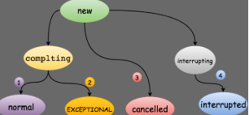

## FutureTask

runnable

```java
public interface Runnable {
    public abstract void run();
}
```

callabe，比runnable：可以返回结果，可以抛出异常

```java
public interface Callable<V> {
    //Computes a result, or throws an exception if unable to do so.
    V call() throws Exception;
}
```

future：控制生命周期，获取返回结果

```java
public interface Future<V> {
    //失败：已经完成了、已经取消了、不能取消
    //成功：如果还没开始，则不会再继续执行了。之后调用isCancelled()返回true
    //如果正在执行，则通过参数指定是否中断
    //调用该方法之后，调用isDone()会返回true，
    boolean cancel(boolean mayInterruptIfRunning);
    boolean isCancelled();//在完成之前取消，返回true
    boolean isDone();//中断、异常、取消，都会返回true
    //取消异常、中断异常、执行异常
    V get() throws InterruptedException, ExecutionException;//阻塞，返回结果
    V get(long timeout, TimeUnit unit)
        throws InterruptedException, ExecutionException, TimeoutException;
}
```

RunnbaleFutrue

```java
public interface RunnableFuture<V> extends Runnable, Future<V> {
    void run();
}
```

FutureTask 实现了RunnableFuture接口，及包括Runnabe和Future（控制生命周期，获取返回结果）

基本属性：

```java
public class FutureTask<V> implements RunnableFuture<V> {
    /* NEW -> COMPLETING -> NORMAL
     * NEW -> COMPLETING -> EXCEPTIONAL
     * NEW -> CANCELLED
     * NEW -> INTERRUPTING -> INTERRUPTED */
    //任务的运行状态
    private volatile int state;
    private static final int NEW          = 0;//初始状态，新任务还没有开始执行
    //正常执行完/发生异常，未将结果/异常写入outcome字段。中间状态，时间短。new->COMPLETING(1)
    private static final int COMPLETING   = 1;
    private static final int NORMAL       = 2;//任务已经执行完并保存到outcome字段中，1->2
    private static final int EXCEPTIONAL  = 3;//任务发生异常，异常保存到outcome字段中，1->3
    private static final int CANCELLED    = 4;//调用cancel(false),不中断取消任务。new->4
    private static final int INTERRUPTING = 5;//调用cancel(true),new->INTERRUPTING
    private static final int INTERRUPTED  = 6;//中断任务线程执行之后 INTERRUPTING->INTERRUPTED
    private Callable<V> callable;
    private Object outcome; //get()的结果/异常字段，由state的读写来保护并发
    private volatile Thread runner;//运行callabel的线程，CASed during run()
    private volatile WaitNode waiters;//等待线程的栈？？
```



#### 构造函数

```java
//1.传入callabel
public FutureTask(Callable<V> callable) {
    if (callable == null)
        throw new NullPointerException();
    this.callable = callable;
    this.state = NEW;       // ensure visibility of callable
}
//2.传入runnable，如果有返回结果，则传入，没有，则为null。
//内部将runnable转为callabel
public FutureTask(Runnable runnable, V result) {
    this.callable = Executors.callable(runnable, result);
    this.state = NEW;       // ensure visibility of callable
}
```

如何将runnable转为callabel？**适配器设计模式**：这个适配器很简单，就是简单的实现了Callable接口，在call()实现中调用Runnable.run()方法，然后把传入的result作为任务的结果返回。 

```java
public static <T> Callable<T> callable(Runnable task, T result) {
    if (task == null)
        throw new NullPointerException();
    return new RunnableAdapter<T>(task, result);
}
//适配类
static final class RunnableAdapter<T> implements Callable<T> {
    final Runnable task;
    final T result;
    RunnableAdapter(Runnable task, T result) {
        this.task = task;
        this.result = result;
    }
    public T call() {
        task.run();
        return result;
    }
}
```

#### run方法运行

```java
public void run() {
    // 1. 状态如果不是NEW，说明任务或者已经执行过，或者已经被取消，直接返回
    // 2. 状态如果是NEW，则CAS尝试把任务执行线程引用保存在runner字段中,如果赋值失败则直接返回
    if (state != NEW ||
        !UNSAFE.compareAndSwapObject(this, runnerOffset,
                                     null, Thread.currentThread()))
        return;
    try {
        Callable<V> c = callable;
        if (c != null && state == NEW) {
            V result;
            boolean ran;//通过该变量来判断任务是否正常执行
            try {
                result = c.call();//3.执行任务
                ran = true;
            } catch (Throwable ex) {
                result = null;
                ran = false;
                setException(ex);//4.如果抛出异常，则设置异常
            }
            if (ran)//5.如果正常执行，则设置结果
                set(result);
        }
    } finally {
        // runner must be non-null until state is settled to
        // prevent concurrent calls to run()
        runner = null;
        // state must be re-read after nulling runner to prevent
        // leaked interrupts
        int s = state;
        // 6. 如果任务被中断，执行中断处理
        if (s >= INTERRUPTING)
            handlePossibleCancellationInterrupt(s);
    }
}
```

```java
//1.首先会CAS的把当前的状态从NEW变更为COMPLETING状态。
//2.
protected void set(V v) {
    if (UNSAFE.compareAndSwapInt(this, stateOffset, NEW, COMPLETING)) {
        outcome = v;
        UNSAFE.putOrderedInt(this, stateOffset, NORMAL); // final state
        finishCompletion();
    }
}
//1.首先会CAS的把当前的状态从NEW变更为COMPLETING状态。
//2.把异常原因保存在outcome字段中，outcome字段用来保存任务执行结果或者异常原因。
//3.CAS的把当前任务状态从COMPLETING变更为EXCEPTIONAL。这个状态转换对应着上图中的二。
//4.调用finishCompletion()。关于这个方法后面在分析。
protected void setException(Throwable t) {
    if (UNSAFE.compareAndSwapInt(this, stateOffset, NEW, COMPLETING)) {
        outcome = t;
        UNSAFE.putOrderedInt(this, stateOffset, EXCEPTIONAL); // final state
        finishCompletion();
    }
}
```

```java
/**
 * Removes and signals all waiting threads, invokes done(), and nulls out callable.
 */
private void finishCompletion() {
    // assert state > COMPLETING;
    for (WaitNode q; (q = waiters) != null;) {
        if (UNSAFE.compareAndSwapObject(this, waitersOffset, q, null)) {
            for (;;) {
                Thread t = q.thread;
                if (t != null) {
                    q.thread = null;
                    LockSupport.unpark(t);
                }
                WaitNode next = q.next;
                if (next == null)
                    break;
                q.next = null; // unlink to help gc
                q = next;
            }
            break;
        }
    }

    done();

    callable = null;        // to reduce footprint
}
```


```java
public class FutureTask<V> implements RunnableFuture<V> {
    /*
     * Revision notes: This differs from previous versions of this
     * class that relied on AbstractQueuedSynchronizer, mainly to
     * avoid surprising users about retaining interrupt status during
     * cancellation races. Sync control in the current design relies
     * on a "state" field updated via CAS to track completion, along
     * with a simple Treiber stack to hold waiting threads.
     *
     * Style note: As usual, we bypass overhead of using
     * AtomicXFieldUpdaters and instead directly use Unsafe intrinsics.
     */

    /**
     * The run state of this task, initially NEW.  The run state
     * transitions to a terminal state only in methods set,
     * setException, and cancel.  During completion, state may take on
     * transient values of COMPLETING (while outcome is being set) or
     * INTERRUPTING (only while interrupting the runner to satisfy a
     * cancel(true)). Transitions from these intermediate to final
     * states use cheaper ordered/lazy writes because values are unique
     * and cannot be further modified.
     *
     * Possible state transitions:
     * NEW -> COMPLETING -> NORMAL
     * NEW -> COMPLETING -> EXCEPTIONAL
     * NEW -> CANCELLED
     * NEW -> INTERRUPTING -> INTERRUPTED
     */
    private volatile int state;
    private static final int NEW          = 0;
    private static final int COMPLETING   = 1;
    private static final int NORMAL       = 2;
    private static final int EXCEPTIONAL  = 3;
    private static final int CANCELLED    = 4;
    private static final int INTERRUPTING = 5;
    private static final int INTERRUPTED  = 6;

    /** The underlying callable; nulled out after running */
    private Callable<V> callable;
    /** The result to return or exception to throw from get() */
    private Object outcome; // non-volatile, protected by state reads/writes
    /** The thread running the callable; CASed during run() */
    private volatile Thread runner;
    /** Treiber stack of waiting threads */
    private volatile WaitNode waiters;

    /**
     * Returns result or throws exception for completed task.
     *
     * @param s completed state value
     */
    @SuppressWarnings("unchecked")
    private V report(int s) throws ExecutionException {
        Object x = outcome;
        if (s == NORMAL)
            return (V)x;
        if (s >= CANCELLED)
            throw new CancellationException();
        throw new ExecutionException((Throwable)x);
    }

    /**
     * Creates a {@code FutureTask} that will, upon running, execute the
     * given {@code Callable}.
     *
     * @param  callable the callable task
     * @throws NullPointerException if the callable is null
     */
    public FutureTask(Callable<V> callable) {
        if (callable == null)
            throw new NullPointerException();
        this.callable = callable;
        this.state = NEW;       // ensure visibility of callable
    }

    /**
     * Creates a {@code FutureTask} that will, upon running, execute the
     * given {@code Runnable}, and arrange that {@code get} will return the
     * given result on successful completion.
     *
     * @param runnable the runnable task
     * @param result the result to return on successful completion. If
     * you don't need a particular result, consider using
     * constructions of the form:
     * {@code Future<?> f = new FutureTask<Void>(runnable, null)}
     * @throws NullPointerException if the runnable is null
     */
    public FutureTask(Runnable runnable, V result) {
        this.callable = Executors.callable(runnable, result);
        this.state = NEW;       // ensure visibility of callable
    }

    public boolean isCancelled() {
        return state >= CANCELLED;
    }

    public boolean isDone() {
        return state != NEW;
    }

    public boolean cancel(boolean mayInterruptIfRunning) {
        if (!(state == NEW &&
              UNSAFE.compareAndSwapInt(this, stateOffset, NEW,
                  mayInterruptIfRunning ? INTERRUPTING : CANCELLED)))
            return false;
        try {    // in case call to interrupt throws exception
            if (mayInterruptIfRunning) {
                try {
                    Thread t = runner;
                    if (t != null)
                        t.interrupt();
                } finally { // final state
                    UNSAFE.putOrderedInt(this, stateOffset, INTERRUPTED);
                }
            }
        } finally {
            finishCompletion();
        }
        return true;
    }

    /**
     * @throws CancellationException {@inheritDoc}
     */
    public V get() throws InterruptedException, ExecutionException {
        int s = state;
        if (s <= COMPLETING)
            s = awaitDone(false, 0L);
        return report(s);
    }

    /**
     * @throws CancellationException {@inheritDoc}
     */
    public V get(long timeout, TimeUnit unit)
        throws InterruptedException, ExecutionException, TimeoutException {
        if (unit == null)
            throw new NullPointerException();
        int s = state;
        if (s <= COMPLETING &&
            (s = awaitDone(true, unit.toNanos(timeout))) <= COMPLETING)
            throw new TimeoutException();
        return report(s);
    }

    /**
     * Protected method invoked when this task transitions to state
     * {@code isDone} (whether normally or via cancellation). The
     * default implementation does nothing.  Subclasses may override
     * this method to invoke completion callbacks or perform
     * bookkeeping. Note that you can query status inside the
     * implementation of this method to determine whether this task
     * has been cancelled.
     */
    protected void done() { }

    /**
     * Sets the result of this future to the given value unless
     * this future has already been set or has been cancelled.
     *
     * <p>This method is invoked internally by the {@link #run} method
     * upon successful completion of the computation.
     *
     * @param v the value
     */
    protected void set(V v) {
        if (UNSAFE.compareAndSwapInt(this, stateOffset, NEW, COMPLETING)) {
            outcome = v;
            UNSAFE.putOrderedInt(this, stateOffset, NORMAL); // final state
            finishCompletion();
        }
    }

    /**
     * Causes this future to report an {@link ExecutionException}
     * with the given throwable as its cause, unless this future has
     * already been set or has been cancelled.
     *
     * <p>This method is invoked internally by the {@link #run} method
     * upon failure of the computation.
     *
     * @param t the cause of failure
     */
    protected void setException(Throwable t) {
        if (UNSAFE.compareAndSwapInt(this, stateOffset, NEW, COMPLETING)) {
            outcome = t;
            UNSAFE.putOrderedInt(this, stateOffset, EXCEPTIONAL); // final state
            finishCompletion();
        }
    }

    public void run() {
        if (state != NEW ||
            !UNSAFE.compareAndSwapObject(this, runnerOffset,
                                         null, Thread.currentThread()))
            return;
        try {
            Callable<V> c = callable;
            if (c != null && state == NEW) {
                V result;
                boolean ran;
                try {
                    result = c.call();
                    ran = true;
                } catch (Throwable ex) {
                    result = null;
                    ran = false;
                    setException(ex);
                }
                if (ran)
                    set(result);
            }
        } finally {
            // runner must be non-null until state is settled to
            // prevent concurrent calls to run()
            runner = null;
            // state must be re-read after nulling runner to prevent
            // leaked interrupts
            int s = state;
            if (s >= INTERRUPTING)
                handlePossibleCancellationInterrupt(s);
        }
    }

    /**
     * Executes the computation without setting its result, and then
     * resets this future to initial state, failing to do so if the
     * computation encounters an exception or is cancelled.  This is
     * designed for use with tasks that intrinsically execute more
     * than once.
     *
     * @return {@code true} if successfully run and reset
     */
    protected boolean runAndReset() {
        if (state != NEW ||
            !UNSAFE.compareAndSwapObject(this, runnerOffset,
                                         null, Thread.currentThread()))
            return false;
        boolean ran = false;
        int s = state;
        try {
            Callable<V> c = callable;
            if (c != null && s == NEW) {
                try {
                    c.call(); // don't set result
                    ran = true;
                } catch (Throwable ex) {
                    setException(ex);
                }
            }
        } finally {
            // runner must be non-null until state is settled to
            // prevent concurrent calls to run()
            runner = null;
            // state must be re-read after nulling runner to prevent
            // leaked interrupts
            s = state;
            if (s >= INTERRUPTING)
                handlePossibleCancellationInterrupt(s);
        }
        return ran && s == NEW;
    }

    /**
     * Ensures that any interrupt from a possible cancel(true) is only
     * delivered to a task while in run or runAndReset.
     */
    private void handlePossibleCancellationInterrupt(int s) {
        // It is possible for our interrupter to stall before getting a
        // chance to interrupt us.  Let's spin-wait patiently.
        if (s == INTERRUPTING)
            while (state == INTERRUPTING)
                Thread.yield(); // wait out pending interrupt

        // assert state == INTERRUPTED;

        // We want to clear any interrupt we may have received from
        // cancel(true).  However, it is permissible to use interrupts
        // as an independent mechanism for a task to communicate with
        // its caller, and there is no way to clear only the
        // cancellation interrupt.
        //
        // Thread.interrupted();
    }

    /**
     * Simple linked list nodes to record waiting threads in a Treiber
     * stack.  See other classes such as Phaser and SynchronousQueue
     * for more detailed explanation.
     */
    static final class WaitNode {
        volatile Thread thread;
        volatile WaitNode next;
        WaitNode() { thread = Thread.currentThread(); }
    }

    /**
     * Removes and signals all waiting threads, invokes done(), and
     * nulls out callable.
     */
    private void finishCompletion() {
        // assert state > COMPLETING;
        for (WaitNode q; (q = waiters) != null;) {
            if (UNSAFE.compareAndSwapObject(this, waitersOffset, q, null)) {
                for (;;) {
                    Thread t = q.thread;
                    if (t != null) {
                        q.thread = null;
                        LockSupport.unpark(t);
                    }
                    WaitNode next = q.next;
                    if (next == null)
                        break;
                    q.next = null; // unlink to help gc
                    q = next;
                }
                break;
            }
        }

        done();

        callable = null;        // to reduce footprint
    }

    /**
     * Awaits completion or aborts on interrupt or timeout.
     *
     * @param timed true if use timed waits
     * @param nanos time to wait, if timed
     * @return state upon completion
     */
    private int awaitDone(boolean timed, long nanos)
        throws InterruptedException {
        final long deadline = timed ? System.nanoTime() + nanos : 0L;
        WaitNode q = null;
        boolean queued = false;
        for (;;) {
            if (Thread.interrupted()) {
                removeWaiter(q);
                throw new InterruptedException();
            }

            int s = state;
            if (s > COMPLETING) {
                if (q != null)
                    q.thread = null;
                return s;
            }
            else if (s == COMPLETING) // cannot time out yet
                Thread.yield();
            else if (q == null)
                q = new WaitNode();
            else if (!queued)
                queued = UNSAFE.compareAndSwapObject(this, waitersOffset,
                                                     q.next = waiters, q);
            else if (timed) {
                nanos = deadline - System.nanoTime();
                if (nanos <= 0L) {
                    removeWaiter(q);
                    return state;
                }
                LockSupport.parkNanos(this, nanos);
            }
            else
                LockSupport.park(this);
        }
    }

    /**
     * Tries to unlink a timed-out or interrupted wait node to avoid
     * accumulating garbage.  Internal nodes are simply unspliced
     * without CAS since it is harmless if they are traversed anyway
     * by releasers.  To avoid effects of unsplicing from already
     * removed nodes, the list is retraversed in case of an apparent
     * race.  This is slow when there are a lot of nodes, but we don't
     * expect lists to be long enough to outweigh higher-overhead
     * schemes.
     */
    private void removeWaiter(WaitNode node) {
        if (node != null) {
            node.thread = null;
            retry:
            for (;;) {          // restart on removeWaiter race
                for (WaitNode pred = null, q = waiters, s; q != null; q = s) {
                    s = q.next;
                    if (q.thread != null)
                        pred = q;
                    else if (pred != null) {
                        pred.next = s;
                        if (pred.thread == null) // check for race
                            continue retry;
                    }
                    else if (!UNSAFE.compareAndSwapObject(this, waitersOffset,
                                                          q, s))
                        continue retry;
                }
                break;
            }
        }
    }

    // Unsafe mechanics
    private static final sun.misc.Unsafe UNSAFE;
    private static final long stateOffset;
    private static final long runnerOffset;
    private static final long waitersOffset;
    static {
        try {
            UNSAFE = sun.misc.Unsafe.getUnsafe();
            Class<?> k = FutureTask.class;
            stateOffset = UNSAFE.objectFieldOffset
                (k.getDeclaredField("state"));
            runnerOffset = UNSAFE.objectFieldOffset
                (k.getDeclaredField("runner"));
            waitersOffset = UNSAFE.objectFieldOffset
                (k.getDeclaredField("waiters"));
        } catch (Exception e) {
            throw new Error(e);
        }
    }

}
```

