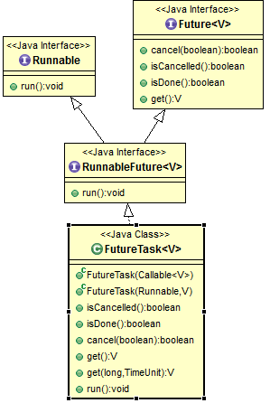

## FutureTask

参考：http://brokendreams.iteye.com/blog/2256494

runnable

```java
public interface Runnable {
    public abstract void run();
}
```

callabe，比runnable：可以返回结果，可以抛出异常

```java
public interface Callable<V> {
    //Computes a result, or throws an exception if unable to do so.
    V call() throws Exception;
}
```

future：控制生命周期，获取返回结果

```java
public interface Future<V> {
    //失败：已经完成了、已经取消了、不能取消
    //成功：如果还没开始，则不会再继续执行了。之后调用isCancelled()返回true
    //如果正在执行，则通过参数指定是否中断
    //调用该方法之后，调用isDone()会返回true，
    boolean cancel(boolean mayInterruptIfRunning);
    boolean isCancelled();//在完成之前取消，返回true
    boolean isDone();//中断、异常、取消，都会返回true
    //取消异常、中断异常、执行异常
    V get() throws InterruptedException, ExecutionException;//阻塞，返回结果
    V get(long timeout, TimeUnit unit)
        throws InterruptedException, ExecutionException, TimeoutException;
}
```

RunnbaleFutrue

```java
public interface RunnableFuture<V> extends Runnable, Future<V> {
    void run();
}
```

FutureTask 实现了RunnableFuture接口，及包括Runnabe和Future（控制生命周期，获取返回结果）

FutureTask是一个可取消的异步计算，FutureTask 实现了Future的基本方法，提供start cancel 操作，可以查询计算是否已经完成，并且可以获取计算的结果。 

基本属性：

```java
public class FutureTask<V> implements RunnableFuture<V> {
    /* NEW -> COMPLETING -> NORMAL
     * NEW -> COMPLETING -> EXCEPTIONAL
     * NEW -> CANCELLED
     * NEW -> INTERRUPTING -> INTERRUPTED */
    //任务的运行状态
    private volatile int state;
    private static final int NEW          = 0;//初始状态，新任务还没有开始执行
    //正常执行完/发生异常，未将结果/异常写入outcome字段。中间状态，时间短。new->COMPLETING(1)
    private static final int COMPLETING   = 1;
    private static final int NORMAL       = 2;//任务已经执行完并保存到outcome字段中，1->2
    private static final int EXCEPTIONAL  = 3;//任务发生异常，异常保存到outcome字段中，1->3
    private static final int CANCELLED    = 4;//调用cancel(false),不中断取消任务。new->4
    private static final int INTERRUPTING = 5;//调用cancel(true),new->INTERRUPTING
    private static final int INTERRUPTED  = 6;//中断任务线程执行之后 INTERRUPTING->INTERRUPTED
    private Callable<V> callable;
    private Object outcome; //get()的结果/异常字段，由state的读写来保护并发
    private volatile Thread runner;//运行callabel的线程，CASed during run()
    private volatile WaitNode waiters;//Treiber stack 并发stack数据结构，用于存放阻塞在该futuretask#get方法的线程。
```


#### 构造函数

```java
//1.传入callabel
public FutureTask(Callable<V> callable) {
    if (callable == null)
        throw new NullPointerException();
    this.callable = callable;
    this.state = NEW;       // ensure visibility of callable
}
//2.传入runnable，如果有返回结果，则传入，没有，则为null。
//内部将runnable转为callabel
public FutureTask(Runnable runnable, V result) {
    this.callable = Executors.callable(runnable, result);
    this.state = NEW;       // ensure visibility of callable
}
```

如何将runnable转为callabel？**适配器设计模式**：这个适配器很简单，就是简单的实现了Callable接口，在call()实现中调用Runnable.run()方法，然后把传入的result作为任务的结果返回。 

```java
public static <T> Callable<T> callable(Runnable task, T result) {
    if (task == null)
        throw new NullPointerException();
    return new RunnableAdapter<T>(task, result);
}
//适配类
static final class RunnableAdapter<T> implements Callable<T> {
    final Runnable task;
    final T result;
    RunnableAdapter(Runnable task, T result) {
        this.task = task;
        this.result = result;
    }
    public T call() {
        task.run();
        return result;
    }
}
```

#### run方法运行

当创建完一个Task通常会提交给Executors来执行，当然也可以使用Thread来执行，Thread的start()方法会调用Task的run()方法，Task的run()方法再调用call()方法。

​    如果状态是new, 判断runner是否为null, 如果为null, 则把当前执行任务的线程赋值给runner，如果runner不为null, 说明已经有线程在执行，返回。此处使用cas来赋值worker thread是保证多个线程同时提交同一个FutureTask时，确保该FutureTask的run只被调用一次， 如果想运行多次，使用runAndReset()方法，该方法不返回结果，执行完之后将返回future的初始状态。 

```java
public void run() {
    // 1. 状态如果不是NEW，说明任务或者已经执行过，或者已经被取消，直接返回
    // 2. 状态如果是NEW，则CAS尝试把任务执行线程引用保存在runner字段中,如果赋值失败则直接返回，说明已经有线程在执行任务了。
    if (state != NEW ||
        !UNSAFE.compareAndSwapObject(this, runnerOffset,
                                     null, Thread.currentThread()))
        return;
    try {
        Callable<V> c = callable;
        if (c != null && state == NEW) {
            V result;
            boolean ran;//通过该变量来判断任务是否正常执行
            try {
                result = c.call();//3.执行任务
                ran = true;
            } catch (Throwable ex) {
                result = null;
                ran = false;
                setException(ex);//4.如果抛出异常，则设置异常
            }
            if (ran)//5.如果正常执行，则设置结果
                set(result);
        }
    } finally {
        // runner must be non-null until state is settled to
        // prevent concurrent calls to run()
        runner = null;
        // state must be re-read after nulling runner to prevent
        // leaked interrupts
        int s = state;
        // 6. 处理可能发生的取消中断(cancel(true))。
        if (s >= INTERRUPTING)
            handlePossibleCancellationInterrupt(s);
    }
}
```
小总结一下执run方法：

 1.只有state为NEW的时候才执行任务(调用内部callable的run方法)。执行前会原子的设置执行线程(runner)，防止竞争。

 2.如果任务执行成功，任务状态从NEW迁转为COMPLETING(原子)，设置执行结果，任务状态从COMPLETING迁转为NORMAL(LazySet)；如果任务执行过程中发生异常，任务状态从NEW迁转为COMPLETING(原子)，设置异常结果，任务状态从COMPLETING迁转为EXCEPTIONAL(LazySet)。

 3.将Treiber Stack中等待当前任务执行结果的等待节点中的线程全部唤醒，同时删除这些等待节点，将整个Treiber Stack置空。

 4.最后别忘了等一下可能发生的cancel(true)中引起的中断，让这些中断发生在执行任务过程中(别泄露出去)。

注意：runAndReset与run方法的区别只是执行完毕后不设置结果、而且有返回值表示是否执行成功。 

```java
//1.首先会CAS的把当前的状态从NEW变更为COMPLETING状态。
//2.设置outcome字段
//3.CAS设置状态从COMPLETING变为NORMAL
//4.调用finishCompletion()方法
protected void set(V v) {
    if (UNSAFE.compareAndSwapInt(this, stateOffset, NEW, COMPLETING)) {
        outcome = v;
        UNSAFE.putOrderedInt(this, stateOffset, NORMAL); // final state
        finishCompletion();
    }
}
//1.首先会CAS的把当前的状态从NEW变更为COMPLETING状态。
//2.把异常原因保存在outcome字段中，outcome字段用来保存任务执行结果或者异常原因。
//3.CAS的把当前任务状态从COMPLETING变更为EXCEPTIONAL。这个状态转换对应着上图中的二。
//4.调用finishCompletion()。关于这个方法后面在分析。
protected void setException(Throwable t) {
    if (UNSAFE.compareAndSwapInt(this, stateOffset, NEW, COMPLETING)) {
        outcome = t;
        UNSAFE.putOrderedInt(this, stateOffset, EXCEPTIONAL); // final state
        finishCompletion();
    }
}
```

#### get方法

```java
//1.判断任务当前的state <= COMPLETING是否成立。COMPLETING状态是任务是否执行完成的临界状态。
//2.如果成立，表明任务还没有结束(这里的结束包括任务正常执行完毕，任务执行异常，任务被取消)，则会调用awaitDone()进行阻塞等待。
//3.如果不成立表明任务已经结束，调用report()返回结果。
public V get() throws InterruptedException, ExecutionException {
    int s = state;
    if (s <= COMPLETING)
        s = awaitDone(false, 0L);
    return report(s);
}
public V get(long timeout, TimeUnit unit)
    throws InterruptedException, ExecutionException, TimeoutException {
    if (unit == null)
        throw new NullPointerException();
    int s = state;
    if (s <= COMPLETING &&
        (s = awaitDone(true, unit.toNanos(timeout))) <= COMPLETING)
        throw new TimeoutException();
    return report(s);
}
```

report()方法用在get()方法中，作用是把不同的任务状态映射成任务执行结果 

```java
private V report(int s) throws ExecutionException {
        Object x = outcome;
        if (s == NORMAL)//正常
            return (V)x;
        if (s >= CANCELLED)//取消
            throw new CancellationException();
        throw new ExecutionException((Throwable)x);//异常
    }
```

#### awaitDone()方法

```java
/* Awaits completion or aborts on interrupt or timeout.
 * @param timed true if use timed waits
 * @param nanos time to wait, if timed
 * @return state upon completion */
private int awaitDone(boolean timed, long nanos) throws InterruptedException {
    //计算截止等待时间
    final long deadline = timed ? System.nanoTime() + nanos : 0L;
    WaitNode q = null;
    boolean queued = false;
    for (;;) {
        //1.判断是否被中断，并清除中断标志
        if (Thread.interrupted()) {
            removeWaiter(q); //2.1 如果中断，则在等待队列中移除该节点，并抛出中断异常
            throw new InterruptedException();
        }
        int s = state;
        // 2. 获取当前状态，如果状态大于COMPLETING
        // 说明任务已经结束(要么正常结束，要么异常结束，要么被取消)
        // 则把thread显示置空，并返回结果
        if (s > COMPLETING) {
            if (q != null)
                q.thread = null;
            return s;
        }
        // 3. 如果状态处于中间状态COMPLETING
        // 表示任务已经结束但是任务执行线程还没来得及给outcome赋值
        // 这个时候让出执行权让其他线程优先执行
        else if (s == COMPLETING) // cannot time out yet
            Thread.yield();
        // 4. 如果等待节点为空，则构造一个等待节点
        else if (q == null)
            q = new WaitNode();
        // 5. 如果还没有入队列，则把当前节点加入waiters首节点并替换原来waiters
        else if (!queued)
            queued = UNSAFE.compareAndSwapObject(this, waitersOffset,
                                                 q.next = waiters, q);
        else if (timed) {
            // 如果需要等待特定时间，则先计算要等待的时间
            // 如果已经超时，则删除对应节点并返回对应的状态
            nanos = deadline - System.nanoTime();
            if (nanos <= 0L) {
                removeWaiter(q);
                return state;
            }
            // 6.1 阻塞等待特定时间
            LockSupport.parkNanos(this, nanos);
        }
        else
            // 6.2 阻塞等待直到被其他线程唤醒，如果没有timeout的话
            LockSupport.park(this);
    }
}
```

假设当前state=NEW且waiters为NULL,也就是说还没有任何一个线程调用get()获取执行结果，这个时候有两个线程threadA和threadB先后调用get()来获取执行结果。再假设这两个线程在加入阻塞队列进行阻塞等待之前任务都没有执行完成且threadA和threadB都没有被中断的情况下(因为如果threadA和threadB在进行阻塞等待结果之前任务就执行完成或线程本身被中断的话，awaitDone()就执行结束返回了)，执行过程是这样的，以threadA为例:

1. 第一轮for循环，执行的逻辑是q == null,所以这时候会新建一个节点q。第一轮循环结束。
2. 第二轮for循环，执行的逻辑是!queue，这个时候会把第一轮循环中生成的节点的netx指针指向waiters，然后CAS的把节点q替换waiters。也就是把新生成的节点添加到waiters链表的首节点。如果替换成功，queued=true。第二轮循环结束。
3. 第三轮for循环，进行阻塞等待。要么阻塞特定时间，要么一直阻塞知道被其他线程唤醒。

在threadA和threadB都阻塞等待之后的waiters结果如图：

[](http://www.importnew.com/?attachment_id=25289)

#### cancel取消任务

```java
public boolean cancel(boolean mayInterruptIfRunning) {
    //1.如果任务不为new，则返回false
    //2.如果任务为new，CAS设置NEW->CANCELLED，如果要中断，则设置为INTERRUPTING
    if (!(state == NEW &&
          UNSAFE.compareAndSwapInt(this, stateOffset, NEW,
              mayInterruptIfRunning ? INTERRUPTING : CANCELLED)))
        return false;
    try {    //如果需要执行中断，则中断，并设置状态为INTERRUPTED
        if (mayInterruptIfRunning) {
            try {
                Thread t = runner;
                if (t != null)
                    t.interrupt();
            } finally { // final state
                UNSAFE.putOrderedInt(this, stateOffset, INTERRUPTED);
            }
        }
    } finally {
        finishCompletion();
    }
    return true;
}
```

1 .判断任务当前执行状态，如果任务状态不为NEW，则说明任务或者已经执行完成，或者执行异常，不能被取消，直接返回false表示执行失败。

2. 判断需要中断任务执行线程，则

- 把任务状态从NEW转化到INTERRUPTING。这是个中间状态。
- 中断任务执行线程。
- 修改任务状态为INTERRUPTED。这个转换过程对应上图中的四。

3. 如果不需要中断任务执行线程，直接把任务状态从NEW转化为CANCELLED。如果转化失败则返回false表示取消失败。这个转换过程对应上图中的四。
4. 调用finishCompletion()。

 **取消方法中要重点注意一点**：

​    在设置mayInterruptIfRunning为true的情况下，内部首先通过一个原子操作将state从NEW转变为INTERRUPTING，然后中断执行任务的线程，然后在通过一个LazySet的操作将state从INTERRUPTING转变为INTERRUPTED，由于后面这个操作对其他线程并不会立即可见，所以handlePossibleCancellationInterrupt才会有一个自旋等待state从INTERRUPTING变为INTERRUPTED的过程。


​    根据前面的分析，不管是任务执行异常还是任务正常执行完毕，或者取消任务，最后都会调用finishCompletion()方法，**解除所有阻塞的worker thread**， 调用done()方法，将成员变量callable设为null。 该方法实现如下: 

​    依次遍历waiters链表，唤醒节点中的线程，然后把callable置空。 被唤醒的线程会各自从awaitDone()方法中的LockSupport.park()阻塞中返回，然后会进行新一轮的循环。在新一轮的循环中会返回执行结果(或者更确切的说是返回任务的状态)。 

```java
 /**
 * Removes and signals all waiting threads, invokes done(), and
 * nulls out callable.
 */
private void finishCompletion() {
    // assert state > COMPLETING;
    for (WaitNode q; (q = waiters) != null;) {
        if (UNSAFE.compareAndSwapObject(this, waitersOffset, q, null)) {
            for (;;) {
                Thread t = q.thread;
                if (t != null) {
                    q.thread = null;
                    LockSupport.unpark(t);
                }
                WaitNode next = q.next;
                if (next == null)
                    break;
                q.next = null; // unlink to help gc
                q = next;
            }
            break;
        }
    }
    done();//回调下钩子方法。  
    callable = null;        // to reduce footprint
}
```

#### 如何实现等待：

```java
//单链表、等待节点
static final class WaitNode {
    volatile Thread thread;
    volatile WaitNode next;
    WaitNode() { thread = Thread.currentThread(); }
}
```

总结：



总体流程：

1. 通过传入Callabel对象，或者将Runnable对象转为Callabel对象。（适配器模式）。返回一个TaskFuture对象。
2. 将TaskFuture对象交给Thread或者线程池进行执行。线程池的AbstractExecutorService类中的submit方法中，将参数runnable/callabel方法包装为futureTask，并调用execute(futureTask)。execute(runnable)方法由ThreadPoolExecutor类实现。


   JDK1.6使用AQS的方式，可能会在取消发生竞争过程中诡异的保留了中断状态。这里之所以没有采用这种方式，是为了避免这种情况的发生。