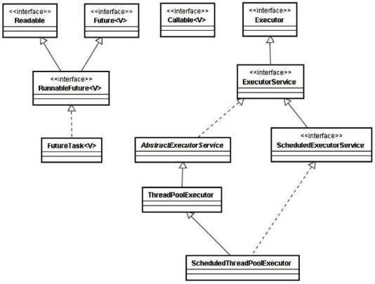
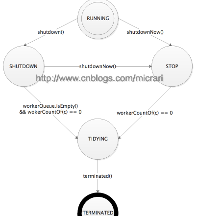
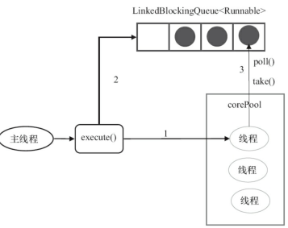
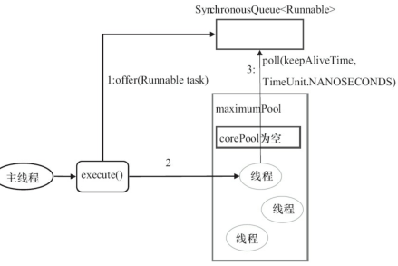
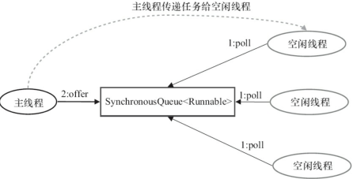
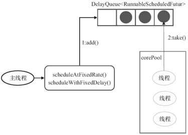
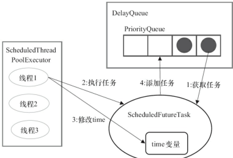
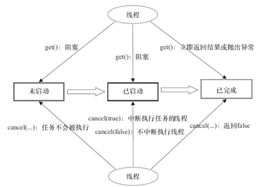
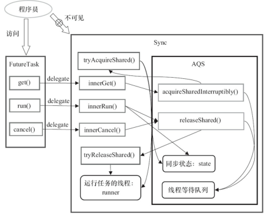
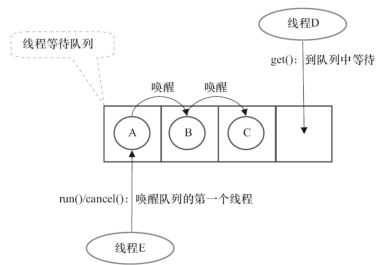

## 线程池Executor调度框架

[TOC]

### 一、简介

线程池优点：

1. 降低资源消耗。通过重复利用已创建的线程降低线程创建和销毁造成的消耗。
2. 提高响应速度。当任务到达时,任务可以不需要等到线程创建就能立即执行。
3. 提高线程的可管理性。线程是稀缺资源,如果无限制地创建,不仅会消耗系统资源,还会降低系统的稳定性,使用线程池可以进行统一分配、调优和监控。但是,要做到合理利用线程池,必须对其实现原理了如指掌。


基本概念：

- int corePoolSize：该线程池中核心线程数最大值。默认情况下，核心线程会一直存活在线程中，即使线程没有任务。如果指定ThreadPoolExecutor的 allowCoreThreadTimeOut 这个属性为true，那么核心线程如果不干活(闲置状态)的话，超过一定时间( keepAliveTime)，就会被销毁掉。
- int maximumPoolSize：该线程池中线程总数的最大值。线程总数计算公式 = 核心线程数 + 非核心线程数。
- long keepAliveTime：该线程池中非核心线程闲置超时时长。注意：一个非核心线程，如果不干活(闲置状态)的时长，超过这个参数所设定的时长，就会被销毁掉。但是，如果设置了 allowCoreThreadTimeOut = true，则会作用于核心线程。
- TimeUnit unit：时间单位，枚举类型
- BlockingQueue<Runnable> workQueue： 阻塞队列，该线程池中的任务队列：维护着等待执行的Runnable对象。当所有的核心线程都在干活时，新添加的任务会被添加到这个队列中等待处理，如果队列满了，则新建非核心线程执行任务。队列主要分为一下四种：
  - SynchronousQueue：（同步队列）这个队列接收到任务的时候，会直接提交给线程处理，而不保留它。若所有线程都在工作，SynchronousQueue就会新建一个线程来处理这个任务。所以为了保证不出现（线程数达到了maximumPoolSize而不能新建线程）的错误，使用这个类型队列的时候maximumPoolSize一般指定成Integer.MAX_VALUE，即无限大，去规避这个使用风险。
  - LinkedBlockingQueue（链表阻塞队列）：这个队列接收到任务的时候，如果当前线程数小于核心线程数，则新建线程(核心线程)处理任务；如果当前线程数等于核心线程数，则进入队列等待。由于这个队列没有最大值限制，即所有超过核心线程数的任务都将被添加到队列中，这也就导致了maximumPoolSize的设定失效，因为总线程数永远不会超过corePoolSize。
  - ArrayBlockingQueue（数组阻塞队列）：可以限定队列的长度（既然是数组，那么就限定了大小），接收到任务的时候，如果没有达到corePoolSize的值，则新建线程(核心线程)执行任务，如果达到了，则入队等候，如果队列已满，则新建线程(非核心线程)执行任务，又如果总线程数到了maximumPoolSize，并且队列也满了，则发生错误。
  - DelayQueue（延迟队列）：队列内元素必须实现Delayed接口，这就意味着你传进去的任务必须先实现Delayed接口。这个队列接收到任务时，首先先入队，只有达到了指定的延时时间，才会执行任务。


线程池的实现原理：

当提交一个新的任务时，线程池的处理流程如下：

1. 如果线程数量未达到corePoolSize，则新建一个线程(核心线程)执行任务（需要获取**全局锁**）。
2. 如果线程数量达到了corePools，则将任务移入队列等待BlockingQueue。
3. 如果队列已满，新建线程(非核心线程)执行任务(需要获取**全局锁**)
4. 如果队列已满，总线程数又达到了maximumPoolSize，任务被拒绝，就会调用RejectedExecutionHandler.rejectedExecution()方法。

注意：获取全局锁有性能代价，在正常运行后，几乎所有的execute()方法调用都是执行步骤2，加入队列，无需获取全局锁。

ThreadPoolExecutor执行execute()方法的示意图：


Executors提供了常用的四种线程池：

1. newFixedThreadPool 创建一个定长线程池，可控制线程最大并发数，超出的线程会在队列中等待。

```java
public interface Executor {
    /**Executes the given command at some time in the future.  The command
     * may execute in a new thread, in a pooled thread, or in the calling
     * thread, at the discretion of the {@code Executor} implementation.
     * @param command the runnable task
     * @throws RejectedExecutionException if this task cannot be accepted for execution
     * @throws NullPointerException if command is null*/
    void execute(Runnable command);
}
```

```java
public interface ExecutorService extends Executor {
  void shutdown();
  List<Runnable> shutdownNow();
  boolean isShutdown();
  boolean isTerminated();
  boolean awaitTermination(long timeout, TimeUnit unit)
        throws InterruptedException;
  <T> Future<T> submit(Callable<T> task);
  <T> Future<T> submit(Runnable task, T result);
  Future<?> submit(Runnable task);
  <T> List<Future<T>> invokeAll(Collection<? extends Callable<T>> tasks)
        throws InterruptedException;
  <T> List<Future<T>> invokeAll(Collection<? extends Callable<T>> tasks,
                                  long timeout, TimeUnit unit)
        throws InterruptedException;
  <T> T invokeAny(Collection<? extends Callable<T>> tasks)
        throws InterruptedException, ExecutionException;
  <T> T invokeAny(Collection<? extends Callable<T>> tasks,
                    long timeout, TimeUnit unit)
        throws InterruptedException, ExecutionException, TimeoutException;
}
```

```java
public abstract class AbstractExecutorService implements ExecutorService {
  
```


### 二、Executor框架


框架主要包括：

- 任务target。包括被执行任务需要实现的接口：Runnable接口或Callabel接口。
- 任务的执行。任务执行的核心接口Executor，以及子接口ExecutorService接口。该框架有连个关键类实现了该接口：ThreadPoolExecutor和ScheduledPoolExecutor。
- 异步计算的结果。包括接口Future和实现Future接口的FutureTask类。

接口和类简介：

- Executor接口：框架的基础，将任务的提交与执行分离开。
- ThreadPoolExecutor实现类：核心实现类，用来执行被提交的任务。
- ScheduledThreadPoolExecutor实现类，可以在给定的延迟后运行命令，或者定期执行命令。比Timer更灵活，更强大。
- Future接口和实现该接口的FutureTask类，代表异步计算结果。
- Runnable接口和Callable接口的实现类，都可以被ThreadPoolExecutor或者ScheduledThreadPoolExecutor执行。




Callable与Runnable相似，但是Runnable不能**返回结果**，不能**throw a checked exception**，但Callable可以。

源码：

```java
public interface Callable<V> {
    /**Computes a result, or throws an exception if unable to do so.
     * @return computed result
     * @throws Exception if unable to compute a result*/
    V call() throws Exception;
}
```

上层接口：

```java
public interface Future<V> {
  boolean cancel(boolean mayInterruptIfRunning);//取消任务，如果已经执行玩，则失败
  boolean isCancelled();
  boolean isDone();
  V get() throws InterruptedException, ExecutionException;//返回结果，若中断、取消，则异常
  V get(long timeout, TimeUnit unit)//在指定时间内返回结果
        throws InterruptedException, ExecutionException, TimeoutException;
}
```

```java
public interface RunnableFuture<V> extends Runnable, Future<V> {
    /* Sets this Future to the result of its computation
     * unless it has been cancelled. */
    void run();
}
```

FutureTask 实现了Runnable和Future组合的接口RunnableFuture。FutureTask可以交给Executor执行,也可以由调用线程直接执行(FutureTask.run())。根据FutureTask.run()方法被执行的时机,FutureTask可以处于下面3种状态。

```java
public class FutureTask<V> implements RunnableFuture<V> {
    //1.构造函数，传入Callabel对象
    public FutureTask(Callable<V> callable) {
        if (callable == null)
            throw new NullPointerException();
        this.callable = callable;
        this.state = NEW;       // ensure visibility of callable
    }//2.构造函数，传入Runnable对象，通过Executors工具类转为Callable对象
    public FutureTask(Runnable runnable, V result) {
        this.callable = Executors.callable(runnable, result);
        this.state = NEW;       // ensure visibility of callable
    }
    
    
```

创建ThreadPoolExecutor的工厂类Executors源码：

```java
//工具类
public class Executors {
    // 以下是获取ThreadPoolExecutor
    //1.创建使用固定线程数的FixedThreadPool
    //应用场景：需要满足资源管理，限制当前线程数，适用于负载比较重的服务器。
    public static ExecutorService newFixedThreadPool(int nThreads) {
        return new ThreadPoolExecutor(nThreads, nThreads,
                                      0L, TimeUnit.MILLISECONDS,
                                      new LinkedBlockingQueue<Runnable>());
    }
    public static ExecutorService newFixedThreadPool(int nThreads, ThreadFactory threadFactory) {
        return new ThreadPoolExecutor(nThreads, nThreads,
                                      0L, TimeUnit.MILLISECONDS,
                                      new LinkedBlockingQueue<Runnable>(),
                                      threadFactory);
    }
    //2.创建单个线程
    //应用场景：需要保证顺序地执行各个任务，并不会有多个线程活动的场景
    public static ExecutorService newSingleThreadExecutor() {
        return new FinalizableDelegatedExecutorService
            (new ThreadPoolExecutor(1, 1,
                                    0L, TimeUnit.MILLISECONDS,
                                    new LinkedBlockingQueue<Runnable>()));
    }
    public static ExecutorService newSingleThreadExecutor(ThreadFactory threadFactory) {
        return new FinalizableDelegatedExecutorService
            (new ThreadPoolExecutor(1, 1,
                                    0L, TimeUnit.MILLISECONDS,
                                    new LinkedBlockingQueue<Runnable>(),
                                    threadFactory));
    }
    //3.根据需要创建新线程的CacaedThreadPool，是大小无界的线程池
    //应用场景：适用很多短期执行的小任务，或者负载较轻的服务器
    public static ExecutorService newCachedThreadPool() {
        return new ThreadPoolExecutor(0, Integer.MAX_VALUE,
                                      60L, TimeUnit.SECONDS,
                                      new SynchronousQueue<Runnable>());
    }
    public static ExecutorService newCachedThreadPool(ThreadFactory threadFactory) {
        return new ThreadPoolExecutor(0, Integer.MAX_VALUE,
                                      60L, TimeUnit.SECONDS,
                                      new SynchronousQueue<Runnable>(),
                                      threadFactory);
    }
    ...
    // 以下是获取 SheduledThreadPoolExecutor
    //(1) 创建一个线程的ScheduledExecutorService
    //应用场景：单个后台线程执行周期任务，并保证顺序
    public static ScheduledExecutorService newSingleThreadScheduledExecutor() {
        return new DelegatedScheduledExecutorService
            (new ScheduledThreadPoolExecutor(1));
    }
    public static ScheduledExecutorService newSingleThreadScheduledExecutor(ThreadFactory threadFactory) {
        return new DelegatedScheduledExecutorService
            (new ScheduledThreadPoolExecutor(1, threadFactory));
    }
    //(2) 创建多个线程的ScheduledExecutorService
    //应用场景：需要多个后台执行周期任务，并根据资源管理来限制后台线程数量
    public static ScheduledExecutorService newScheduledThreadPool(int corePoolSize) {
        return new ScheduledThreadPoolExecutor(corePoolSize);
    }
    public static ScheduledExecutorService newScheduledThreadPool(
            int corePoolSize, ThreadFactory threadFactory) {
        return new ScheduledThreadPoolExecutor(corePoolSize, threadFactory);
    }
    ...
    //将Runnable包装为一个Callable
    public static Callable<Object> callable(Runnable task) {
        if (task == null)
            throw new NullPointerException();
        return new RunnableAdapter<Object>(task, null);
    }
    //将Runnable保证为一个带返回值的Callable
    public static <T> Callable<T> callable(Runnable task, T result) {
        if (task == null)
            throw new NullPointerException();
        return new RunnableAdapter<T>(task, result);
    }
```

以下详细介绍上面工具类的实现：

线程池的核心实现类：

```java
//线程池的核心实现类，由工具类Executors来创建
public class ThreadPoolExecutor extends AbstractExecutorService {
    /** Tracks largest attained pool size. Accessed only under mainLock.*/
    private int largestPoolSize;
    //接口ThreadFactory只有一个方法Thread newThread(Runnable r);
    private volatile ThreadFactory threadFactory;//创建线程的工厂类
    
    private volatile RejectedExecutionHandler handler;//线程饱和或关闭时调用
    private volatile long keepAliveTime;//非核心线程空闲时间，超过则销毁
    private volatile boolean allowCoreThreadTimeOut;//true，核心线程使用keepAliveTime
    private volatile int corePoolSize;//核心线程
    private volatile int maximumPoolSize;//最大
    private final BlockingQueue<Runnable> workQueue;//保存任务的工作队列
    private static final RejectedExecutionHandler defaultHandler =
        new AbortPolicy();//default rejected execution handler
    ...
    private final class Worker
        extends AbstractQueuedSynchronizer //继承同步器
        implements Runnable
    {
        //实现了lock相关方法
    }
    ...
    //构造器(主要的构造器)，设置必要的参数，如果没有，则用默认的
    public ThreadPoolExecutor(int corePoolSize,
                              int maximumPoolSize,
                              long keepAliveTime,
                              TimeUnit unit,
                              BlockingQueue<Runnable> workQueue,
                              ThreadFactory threadFactory,
                              RejectedExecutionHandler handler) {
        if (corePoolSize < 0 || maximumPoolSize <= 0 ||
            maximumPoolSize < corePoolSize || keepAliveTime < 0)
            throw new IllegalArgumentException();
        if (workQueue == null || threadFactory == null || handler == null)
            throw new NullPointerException();
        this.acc = System.getSecurityManager() == null?null : AccessController.getContext();
        this.corePoolSize = corePoolSize;
        this.maximumPoolSize = maximumPoolSize;
        this.workQueue = workQueue;
        this.keepAliveTime = unit.toNanos(keepAliveTime);
        this.threadFactory = threadFactory;
        this.handler = handler;
    }
    
    
    
    
    
    
```


线程池中生命周期的表示：

ctl是线程池中一个核心状态控制变量，类型为AtomicInteger，该变量存储里两个信息：

- 线程数：ctl的低29位表示线程数，上届约为5亿。ctl & ((1<<29)-1)
- 线程池状态：ctl的高3位标示5中生命周期状态。ctl & ~((1<<29)-1)

线程池状态：

- -1：RUNNING：初始状态，接受新任务，并处理队列中的等待的任务

- 0 ：SHUTDOWN：RUNNING状态下调用shutdown方法后进入此状态。此状态下线程池不接受新任务，但会处理队列中等待的任务。 
- 1 STOP：RUNNING/SHUTDOWN状态下调用shutdownNow方法后进入此状态。此状态下线程池不接受新任务，也不处理既有等待任务，并且会中断既有运行中的线程。 
- 2 TIDYING：SHUTDOWN/STOP状态会流转到此状态。此时所有任务都已终止，工作线程数workerCount为0，任务队列都为空。从字面角度理解，此时线程池已经清干净了。将要运行terminated()钩子方法。
- 3 TERMINATED: TIDYING状态下，线程池执行完terminated钩子方法后进入此状态，此时线程池已完全终止。 



```java
private static int runStateOf(int c)     { return c & ~CAPACITY; }//获取线程状态
private static int workerCountOf(int c)  { return c & CAPACITY; }//获取workerCount
private static int ctlOf(int rs, int wc) { return rs | wc; }//获取ctl变量
//判断线程状态不需要位运算，可直接在ctl上进行。因为workerCount不是负的。
private static boolean runStateLessThan(int c, int s) {
        return c < s;
    }
private static boolean runStateAtLeast(int c, int s) {
    return c >= s;
}
private static boolean isRunning(int c) {
    return c < SHUTDOWN;
}
```

在ThreadPoolExecutor类中，将线程和初始task包装为worker，worker为实现AQS的不可重入的互斥锁。

```java
private final class Worker extends AbstractQueuedSynchronizer implements Runnable
    {
        final Thread thread;// 该worker工作的线程
        Runnable firstTask; // 线程的初始任务
        volatile long completedTasks;//统计完成的任务
        Worker(Runnable firstTask) {
            setState(-1); //不可中断，直到运行runWorker（也就是加锁）
            this.firstTask = firstTask;//初始任务
            this.thread = getThreadFactory().newThread(this);//需要运行初始任务的线程
        }

        /** Delegates main run loop to outer runWorker  */
        public void run() { //任务的真正执行，则交给runWorker
            runWorker(this);
        }

        // Lock methods
        //
        // The value 0 represents the unlocked state.
        // The value 1 represents the locked state.

        protected boolean isHeldExclusively() {
            return getState() != 0;
        }

        protected boolean tryAcquire(int unused) {
            if (compareAndSetState(0, 1)) {
                setExclusiveOwnerThread(Thread.currentThread());
                return true;
            }
            return false;
        }

        protected boolean tryRelease(int unused) {
            setExclusiveOwnerThread(null);
            setState(0);
            return true;
        }

        public void lock()        { acquire(1); }
        public boolean tryLock()  { return tryAcquire(1); }
        public void unlock()      { release(1); }
        public boolean isLocked() { return isHeldExclusively(); }

        void interruptIfStarted() {
            Thread t;
            if (getState() >= 0 && (t = thread) != null && !t.isInterrupted()) {
                try {
                    t.interrupt();
                } catch (SecurityException ignore) {
                }
            }
        }
    }
```

Worker类实现了Runnable接口，并将run方法的实现委托给了外部类ThreadPoolExecutor的runWorker方法。 

```java
final void runWorker(Worker w) {
        Thread wt = Thread.currentThread();
        Runnable task = w.firstTask;
        w.firstTask = null;
        w.unlock(); // 在初始化加锁后，解锁，表示后面可中断
        boolean completedAbruptly = true; //用于标记完成任务时是否有异常。
        try {
            // 循环:初始任务（首次）或者从阻塞阻塞队列里拿一个（后续）
            while (task != null || (task = getTask()) != null) {
            	//获取互斥锁。
            	//在持有互斥锁时，调用线程池shutdown方法不会中断该线程。
            	//但是shutdownNow方法无视互斥锁，会中断所有线程。
                w.lock();
                /*
                 * 这里if做的事情就是判断是否需要中断当前线程。
                 * 如果线程池至少处于STOP阶段，当前线程未中断，则中断当前线程；
                 * 否则清除线程中断位。
                 *
                 * if条件中的Thread.interrupted() &&runStateAtLeast(ctl.get(), STOP)
                 * 做的事情说穿了就是清除中断位并确认目前线程池状态没有达到STOP阶段。
                 */  
                // If pool is stopping, ensure thread is interrupted;
                // if not, ensure thread is not interrupted.  This
                // requires a recheck in second case to deal with
                // shutdownNow race while clearing interrupt
                if ( (runStateAtLeast(ctl.get(), STOP) ||
                     	(Thread.interrupted() && runStateAtLeast(ctl.get(), STOP) ) ) 
                     && 
                     !wt.isInterrupted() 
                   )
                    wt.interrupt();
                try {
                    beforeExecute(wt, task);//调用由子类实现的前置处理钩子。
                    Throwable thrown = null;
                    try {
                        task.run();//真正的执行任务
                    } catch (RuntimeException x) {
                        thrown = x; throw x;
                    } catch (Error x) {
                        thrown = x; throw x;
                    } catch (Throwable x) {
                        thrown = x; throw new Error(x);
                    } finally {
                        afterExecute(task, thrown);//调用由子类实现的后置处理钩子。
                    }
                } finally {// 清空task, 计数器+1, 释放互斥锁。
                    task = null;
                    w.completedTasks++;
                    w.unlock();
                }
            }
            completedAbruptly = false;
        } finally {
            processWorkerExit(w, completedAbruptly);
        }
    }
```

接下来是从队列中取任务：

```java
/**
 * 工作线程从任务队列中拿取任务的核心方法。
 * 根据配置决定采用阻塞或是时限获取。
 * 在以下几种情况会返回null从而接下来线程会退出(runWorker方法循环结束):
 * 1. 当前工作线程数超过了maximumPoolSize(由于maximumPoolSize可以动态调整，这是可能的)。
 * 2. 线程池状态为STOP (因为STOP状态不处理任务队列中的任务了)。
 * 3. 线程池状态为SHUTDOWN,并且任务队列为空 (因为SHUTDOWN状态仍然需要处理等待中任务)。
 * 4. 根据线程池参数状态以及线程是否空闲超过keepAliveTime决定是否退出当前工作线程。
 */
private Runnable getTask() {
    boolean timedOut = false; // 上次从任务队列poll任务是否超时
    for (;;) {
        int c = ctl.get();
        int rs = runStateOf(c);//得到线程的运行状态
        //如果线程池状态已经不是RUNNING状态了，则设置ctl的工作线程数-1
        //if条件等价于 rs >= STOP || (rs == SHUTDOWN && workQueue.isEmpty())
        // Check if queue empty only if necessary.
        if (rs >= SHUTDOWN && (rs >= STOP || workQueue.isEmpty())) {
            decrementWorkerCount();
            return null;
        }
        int wc = workerCountOf(c);//获取工作线程数
        // allowCoreThreadTimeOut是用于设置核心线程是否受keepAliveTime影响。
        // 在allowCoreThreadTimeOut为true或者工作线程数>corePoolSize情况下，
        // 当前工作线程受keepAliveTime影响。
        // Are workers subject to culling?
        boolean timed = allowCoreThreadTimeOut || wc > corePoolSize;
	    /* 1. 工作线程数>maximumPoolSize,当前工作线程需要退出。
         * 2. timed && timedOut == true说明当前线程受keepAliveTime影响且上次获取任务超时。
         *    这种情况下只要当前线程不是最后一个工作线程或者任务队列为空，则可以退出。
         *
         *    换句话说就是，如果队列不为空，则当前线程不能是最后一个工作线程，
         *    否则退出了就没线程处理任务了。*/	
        if ((wc > maximumPoolSize || (timed && timedOut))
            && (wc > 1 || workQueue.isEmpty())) {
            // 设置ctl的workCount减1, CAS失败则需要重试(因为上面if中的条件可能不满足了)。
            if (compareAndDecrementWorkerCount(c))
                return null;
            continue;
        }
        try {
            // 根据timed变量的值决定是时限获取或是阻塞获取任务队列中的任务。
            Runnable r = timed ?
                workQueue.poll(keepAliveTime, TimeUnit.NANOSECONDS) :
                workQueue.take();
            if (r != null)
                return r;
            // workQueue.take是不会返回null的，因此说明poll超时了。
            timedOut = true;
        } catch (InterruptedException retry) {
            // 在阻塞队列上等待时如果被中断，则清除超时标识重试一次循环。
            timedOut = false;
        }
    }
}

```

runWorker方法中，如果getTask没有拿到任务或超时等，在工作线程退出的时候，processWorkerExit方法会被调用。 

```java
/**
 * Performs cleanup and bookkeeping for a dying worker. Called
 * only from worker threads. Unless completedAbruptly is set,
 * assumes that workerCount has already been adjusted to account
 * for exit.  This method removes thread from worker set, and
 * possibly terminates the pool or replaces the worker if either
 * it exited due to user task exception or if fewer than
 * corePoolSize workers are running or queue is non-empty but
 * there are no workers.
 *
 * @param w the worker
 * @param completedAbruptly if the worker died due to user exception
 */
private void processWorkerExit(Worker w, boolean completedAbruptly) {
    //因为正常退出，workerCount减1这件事情是在getTask拿不到任务的情况下做掉的。
    //所以在有异常的情况下，需要在本方法里给workCount减1。
    if (completedAbruptly)
        decrementWorkerCount();

    final ReentrantLock mainLock = this.mainLock;
    mainLock.lock();//获取锁
    try {
        completedTaskCount += w.completedTasks;// 累加completedTaskCount
        workers.remove(w);//从工作线程集合移除自己。
    } finally {
        mainLock.unlock();//释放锁
    }

    tryTerminate();// 由于workCount减1，需要调用tryTerminate方法。

    int c = ctl.get();
    // 只要线程池还没达到STOP状态，任务队列中的任务仍然是需要处理的
    if (runStateLessThan(c, STOP)) {
        if (!completedAbruptly) {//如果正常退出
            /* 
             * 确定在RUNNING或SHUTDOWN状态下最少需要的工作线程数。
             *
             * 默认情况下(无超时设置)，核心线程不受限制时影响，
             * 在这种情况下核心线程数量应当是稳定的。
             * 否则允许线程池中无线程。
             */
            int min = allowCoreThreadTimeOut ? 0 : corePoolSize;
            if (min == 0 && ! workQueue.isEmpty())//如果队列有任务，但没有线程，则至少需要一个线程
                min = 1;
            if (workerCountOf(c) >= min)//如果线程池线程满足要求，则直接返回；否则后面将添加一个线程
                return; // replacement not needed
        }
        //异常退出或者需要补偿一个线程的情况下，加一个空任务工作线程。
        addWorker(null, false);
    }
}
```


提交任务的处理：

```java
/**
 * execute方法可以说是线程池中最核心的方法，
 * 在继承链上层的AbstractExecutorService中将各种接受新任务的方法最终转发给了此方法进行任务处理。
 * Executes the given task sometime in the future.  The task
 * may execute in a new thread or in an existing pooled thread.
 *
 * If the task cannot be submitted for execution, either because this
 * executor has been shutdown or because its capacity has been reached,
 * the task is handled by the current {@code RejectedExecutionHandler}.
 *
 * @throws RejectedExecutionException at discretion of
 *         {@code RejectedExecutionHandler}, if the task
 *         cannot be accepted for execution
 */
public void execute(Runnable command) {
    if (command == null)
        throw new NullPointerException();
    /*
     * 2. If a task can be successfully queued, then we still need
     * to double-check whether we should have added a thread
     * (because existing ones died since last checking) or that
     * the pool shut down since entry into this method. So we
     * recheck state and if necessary roll back the enqueuing if
     * stopped, or start a new thread if there are none.
    /*
     * 分类讨论:
     * 1. 如果当前线程数<核心线程数，则会开启一个新线程来执行提交的任务。
     *
     * 2. 尝试向任务队列中添加任务。如果成功，这时需要再次检查方法开始到当前时刻这段间隙,
     *    线程池是否已经关闭了/线程池中没有工作线程了。
     *    如果线程池已经关闭了，需要在任务队列中移除先前提交的任务。
     *    如果没有工作线程了，则需要添加一个空任务工作线程用于执行提交的任务。
     *
     * 3. 如果无法向阻塞队列中添加任务，则尝试创建一个新的线程执行任务。
     *    如果失败，回调饱和策略处理任务。
     */
    int c = ctl.get();
    // 线程数 < corePoolSize
    if (workerCountOf(c) < corePoolSize) {
        if (addWorker(command, true))
            return;
        c = ctl.get();
    }
    // 检查线程池是否处于运行状态，并向任务队列中添加任务
    if (isRunning(c) && workQueue.offer(command)) {
        int recheck = ctl.get();
        /*
         * 再次检查是否线程池处于运行状态，如果不是则移除任务并回调饱和策略拒绝任务。
         * 因为有可能上面if条件读到线程池处于运行状态，而后shutdown/shutdownNow方法被调用，
         * 这时候需要把尝试刚才加入任务队列中的任务移除。
         */
        if (! isRunning(recheck) && remove(command))
            reject(command);
        // 如果workerCount为0，需要添加一个工作线程用于执行提交的任务
        else if (workerCountOf(recheck) == 0)
            addWorker(null, false);
    }
    //添加一个新的工作线程处理任务。
    //如果失败,则说明线程池已经关闭或者已经饱和了，此时回调饱和策略来拒绝任务。
    else if (!addWorker(command, false))
        reject(command);
}
```

addWorker

```java
/**
 * This method returns false if the pool is stopped or
 * eligible to shut down. It also returns false if the thread
 * factory fails to create a thread when asked.  If the thread
 * creation fails, either due to the thread factory returning
 * null, or due to an exception (typically OutOfMemoryError in
 * Thread.start()), we roll back cleanly.
 *
 * @param firstTask the task the new thread should run first (or
 * null if none). Workers are created with an initial first task
 * (in method execute()) to bypass queuing when there are fewer
 * than corePoolSize threads (in which case we always start one),
 * or when the queue is full (in which case we must bypass queue).
 * Initially idle threads are usually created via
 * prestartCoreThread or to replace other dying workers.
 *
 * @param core if true use corePoolSize as bound, else
 * maximumPoolSize. (A boolean indicator is used here rather than a
 * value to ensure reads of fresh values after checking other pool
 * state).
 * @return true if successful
 */
private boolean addWorker(Runnable firstTask, boolean core) {
    retry:
    for (;;) {
        int c = ctl.get();
        int rs = runStateOf(c);
        // Check if queue empty only if necessary.
        //如果线程池状态至少为STOP,返回false，不接受任务。
        //如果线程池状态为SHUTDOWN，并且firstTask不为null或者任务队列为空，同样不接受任务。
        //因为线程首先执行的是fisrtTask,之后从任务队列中接收任务
        if (rs >= SHUTDOWN &&
            ! (rs == SHUTDOWN && firstTask == null && ! workQueue.isEmpty()))
            return false;

        for (;;) {
            int wc = workerCountOf(c);//线程数量
            if (wc >= CAPACITY || //线程数量不能超
                wc >= (core ? corePoolSize : maximumPoolSize))
                return false;
            // 成功新增workCount,跳出整个循环往下走。
            if (compareAndIncrementWorkerCount(c))
                break retry;
            c = ctl.get();  // Re-read ctl
            /* 
             * 重读总控状态,如果运行状态变了，重试整个大循环。
             * 否则说明是workCount发生了变化，重试内层循环。
             */
            if (runStateOf(c) != rs)
                continue retry;
            // else CAS failed due to workerCount change; retry inner loop
        }
    }
	// 运行到此处时，线程池线程数已经成功+1,下面进行实质操作。
    boolean workerStarted = false;
    boolean workerAdded = false;
    Worker w = null;
    try {
        w = new Worker(firstTask);
        final Thread t = w.thread;
        if (t != null) {
            final ReentrantLock mainLock = this.mainLock;
            mainLock.lock();
            try {
                // Recheck while holding lock.
                // Back out on ThreadFactory failure or if
                // shut down before lock acquired.
                // 由于获取锁之前线程池状态可能发生了变化，这里需要重新读一次状态。
                int rs = runStateOf(ctl.get());

                if (rs < SHUTDOWN ||
                    (rs == SHUTDOWN && firstTask == null)) {
                    if (t.isAlive()) // precheck that t is startable 还没开始
                        throw new IllegalThreadStateException();
                    // 向工作线程集合添加新worker,更新largestPoolSize。
                    workers.add(w);
                    int s = workers.size();
                    if (s > largestPoolSize)
                        largestPoolSize = s;
                    workerAdded = true;
                }
            } finally {
                mainLock.unlock();
            }
            // 成功增加worker后，启动该worker线程。
            if (workerAdded) {
                t.start();
                workerStarted = true;
            }
        }
    } finally {
        // worker线程如果没有成功启动，回滚worker集合和worker计数器的变化。
        if (! workerStarted)
            addWorkerFailed(w);
    }
    return workerStarted;
}
```

#### addWorkerFailed

在新增工作线程失败的情况下，调用addWorkerFailed：

1. 从worker集合删除失败的worker。
2. workCount减1。
3. 调用tryTerminate尝试终止线程池。

```java
/**
 * Rolls back the worker thread creation.
 * - removes worker from workers, if present
 * - decrements worker count
 * - rechecks for termination, in case the existence of this
 *   worker was holding up termination
 */
private void addWorkerFailed(Worker w) {
    final ReentrantLock mainLock = this.mainLock;
    mainLock.lock();
    try {
        if (w != null)
            workers.remove(w);
        decrementWorkerCount();
        tryTerminate();
    } finally {
        mainLock.unlock();
    }
}
```

### 线程池的关闭(shutdown与shutdownNow)

在介绍线程池关闭shutdown与shutdownNow相关源码实现时，需要先分析两个很重要的方法

- tryTerminate
  线程池的生命周期最终态为TERMINATED，然而TERMINATED状态的演进未必是调用shutdown/shutdownNow能做到，因为TERMINATED状态下，线程池中已经没有工作线程，也没有任务队列。tryTerminate方法里面包含了一个逻辑上的责任链，将线程池状态的演进动作在线程中传播下去。
- interruptIdleWorkers
  Worker类是线程池对工作线程的封装抽象。它主要做的事情就是不断从任务队列中取任务执行，遇到异常退出。如果在工作线程等待任务(阻塞在阻塞队列)时中断该工作线程，则工作线程会重试一次getTask的循环来获取任务，获取不到就会退出runWorker方法的大循环，从而进入processWorkerExit方法收尾。ThreadPoolExecutor中线程中断的主要方法便是interruptIdleWorkers。可以通过参数控制是否最多中断1个线程。

####  tryTerminate

这是线程池中一个很重要的方法。它是实现线程池状态从SHUTDOWN或者STOP流转到TIDYING->TERMINATED的桥梁方法。

```java
/**
 * Transitions to TERMINATED state if either (SHUTDOWN and pool
 * and queue empty) or (STOP and pool empty).  If otherwise
 * eligible to terminate but workerCount is nonzero, interrupts an
 * idle worker to ensure that shutdown signals propagate. This
 * method must be called following any action that might make
 * termination possible -- reducing worker count or removing tasks
 * from the queue during shutdown. The method is non-private to
 * allow access from ScheduledThreadPoolExecutor.
 */
final void tryTerminate() {
    for (;;) {
        int c = ctl.get();
        /*能够进行状态流转的情况是:
         * 1. STOP状态
         * 2. SHUTDOWN并且任务队列已空。*/
        if (isRunning(c) ||
            runStateAtLeast(c, TIDYING) ||
            (runStateOf(c) == SHUTDOWN && ! workQueue.isEmpty()))
            return;
        /*
         * 这时只需要所有工作线程退出即可终止线程池。
         * 如果仍然有工作线程，则中断一个空闲的线程。
         *
         * 一旦空闲线程被终止，则会进入processWorkerExit方法，
         * 在processWorkerExit方法中即将退出的工作线程会调用tryTerminate，
         * 从而将终止线程池的动作通过这样的机制在线程间传播下去。
         */
        if (workerCountOf(c) != 0) { // Eligible to terminate
            interruptIdleWorkers(ONLY_ONE);
            return;
        }

        final ReentrantLock mainLock = this.mainLock;
        mainLock.lock();
        try {
            // 这时workerCount已经为0，任务队列也已为空,状态流转到TIDYING。
            if (ctl.compareAndSet(c, ctlOf(TIDYING, 0))) {
                try {
                    // 调用terminated()钩子方法。
                    terminated();
                } finally {
                    
                    ctl.set(ctlOf(TERMINATED, 0));
                    termination.signalAll();// 唤醒所有在线程池终止条件上等待的线程。
                }
                return;
            }
        } finally {
            mainLock.unlock();
        }
        // 线程池状态流转CAS失败的话重试循环。
        // else retry on failed CAS
    }
}
```

#### interruptIdleWorkers

```java
/**
 * Interrupts threads that might be waiting for tasks (as
 * indicated by not being locked) so they can check for
 * termination or configuration changes. Ignores
 * SecurityExceptions (in which case some threads may remain
 * uninterrupted).
 *
 * @param onlyOne If true, interrupt at most one worker. This is
 * called only from tryTerminate when termination is otherwise
 * enabled but there are still other workers.  In this case, at
 * most one waiting worker is interrupted to propagate shutdown
 * signals in case all threads are currently waiting.
 * Interrupting any arbitrary thread ensures that newly arriving
 * workers since shutdown began will also eventually exit.
 * To guarantee eventual termination, it suffices to always
 * interrupt only one idle worker, but shutdown() interrupts all
 * idle workers so that redundant workers exit promptly, not
 * waiting for a straggler task to finish.
 */
/**
 * 参数中的onlyOne表示至多只中断一个工作线程。
 * 在tryTerminate方法读取到目前线程池离可以进入终止状态只剩下workCount降为0时，
 * 会调用interruptIdeleWorkers(true)。因为有可能此时其他所有线程都阻塞在任务队列上，
 * 只要中断任意一个线程，通过processWorkerExit->tryTerminate->interruptIdleWorkers，
 * 可以使线程中断+退出传播下去。
 */
private void interruptIdleWorkers(boolean onlyOne) {
    final ReentrantLock mainLock = this.mainLock;
    /* 
     * 这里加全局锁的一个很重要的目的是使这个方法串行化执行。
     * 否则在线程池关闭阶段,退出的线程会通过tryTerminate调用到此方法,
     * 并发尝试中断还未中断的线程，引发一场中断风暴。
     */
    mainLock.lock();
    try {
        for (Worker w : workers) {
            Thread t = w.thread;
            // 工作线程在处理任务阶段是被互斥锁保护的，从而这里不会中断到。
            if (!t.isInterrupted() && w.tryLock()) {
                try {
                    t.interrupt();
                } catch (SecurityException ignore) {
                } finally {
                    w.unlock();
                }
            }
            if (onlyOne)// 最多中断一个。
                break;
        }
    } finally {
        mainLock.unlock();
    }
}
```

shutdown方法关闭线程池是有序优雅的，线程池进入SHUTDOWN状态后不会接受新任务，但是任务队列中已有的任务会继续处理。 shutdown方法会中断所有未处理任务的空闲线程。 

```java
/**
 * Initiates an orderly shutdown in which previously submitted
 * tasks are executed, but no new tasks will be accepted.
 * Invocation has no additional effect if already shut down.
 *
 * <p>This method does not wait for previously submitted tasks to
 * complete execution.  Use {@link #awaitTermination awaitTermination}
 * to do that.
 *
 * @throws SecurityException {@inheritDoc}
 */
public void shutdown() {
    final ReentrantLock mainLock = this.mainLock;
    mainLock.lock();
    try {
        checkShutdownAccess();
        // 状态切换到SHUTDOWN
        advanceRunState(SHUTDOWN);
        // 中断所有空闲线程，或者说在任务队列上阻塞的线程。
        interruptIdleWorkers();
        onShutdown(); // hook for ScheduledThreadPoolExecutor
    } finally {
        mainLock.unlock();
    }
    // 尝试终止线程池(状态流转至TERMINATED)。
    tryTerminate();
}
private void interruptIdleWorkers() {//关闭所有空闲线程
    interruptIdleWorkers(false);
}
```

#### 3.3.4 shutdownNow

shutdownNow方法关闭线程池相比shutdown就暴力了一点，会中断所有线程，哪怕线程正在执行任务。
线程池进入STOP状态后，不接受新的任务，也不会处理任务队列中已有的任务。
但需要注意的是，即便shutdownNow即便会中断正在执行任务的线程，不代表你的任务一定会挂：如果提交的任务里面的代码没有对线程中断敏感的逻辑的话，线程中断也不会发生什么。

```java
/**
 * Attempts to stop all actively executing tasks, halts the
 * processing of waiting tasks, and returns a list of the tasks
 * that were awaiting execution. These tasks are drained (removed)
 * from the task queue upon return from this method.
 *
 * <p>This method does not wait for actively executing tasks to
 * terminate.  Use {@link #awaitTermination awaitTermination} to
 * do that.
 *
 * <p>There are no guarantees beyond best-effort attempts to stop
 * processing actively executing tasks.  This implementation
 * cancels tasks via {@link Thread#interrupt}, so any task that
 * fails to respond to interrupts may never terminate.
 *
 * @throws SecurityException {@inheritDoc}
 */
public List<Runnable> shutdownNow() {
    List<Runnable> tasks;
    final ReentrantLock mainLock = this.mainLock;
    mainLock.lock();
    try {
        checkShutdownAccess();
        advanceRunState(STOP);// 状态切换到STOP
        interruptWorkers();//与SHUTDOWN不同的是，直接中断所有线程。
        tasks = drainQueue();// 将任务队列中的任务收集到tasks。
    } finally {
        mainLock.unlock();
    }
    tryTerminate();// 尝试终止线程池(状态流转至TERMINATED)。
    return tasks;
}

public boolean isShutdown() {
    return ! isRunning(ctl.get());
}
//此方法中断所有线程，只会被shutdown调用。
private void interruptWorkers() {
    final ReentrantLock mainLock = this.mainLock;
    mainLock.lock();
    try {
        for (Worker w : workers)
            w.interruptIfStarted();
    } finally {
        mainLock.unlock();
    }
}
/**
 * 将任务队列中的任务dump出来。
 * 这个方法执行完以后，任务队列其实可能还会有残留的任务。
 * 比方说：我们的任务队列用LinkedBlockingQueue，事件顺序如下：
 * 时刻1:    线程池状态为RUNNGING,线程A执行ThreadPoolExecutor#execute方法的
 *             if (isRunning(c) && workQueue.offer(command)) 
 *             isRunning(c)返回true，此时还未执行offer操作。
 * 时刻2： 线程B执行shutdownNow，切换线程池状态到STOP，接下来执行完drainQueue方法。
 * 时刻3： 线程A开始执行offer操作，往任务队列中添加了任务。  
 *
 * 对于这种情况，确实drainQueue没有按照doc描述返回所有未执行的任务，
 * 但实际上在ThreadPoolExecutor#execute方法中，向任务队列中添加完任务后有个再次检查线程池状态的步骤。
 * 此时线程A一定能够读取到线程池状态已经不是RUNNING了，在将任务从队列中移除后会使用饱和策略处理任务。
 */
/**
 * Drains the task queue into a new list, normally using
 * drainTo. But if the queue is a DelayQueue or any other kind of
 * queue for which poll or drainTo may fail to remove some
 * elements, it deletes them one by one.
 */
private List<Runnable> drainQueue() {
    BlockingQueue<Runnable> q = workQueue;
    ArrayList<Runnable> taskList = new ArrayList<Runnable>();
    q.drainTo(taskList);
    if (!q.isEmpty()) {
        for (Runnable r : q.toArray(new Runnable[0])) {
            if (q.remove(r))
                taskList.add(r);
        }
    }
    return taskList;
}
```


##### 1. ThreadPoolExecutor

###### 1.1 FixedThreadPool

- corePoolSize == maximumPoolSize。
- keepAliveTime==0L，表示非核心完成任务立即销毁。
- LinkedBlockingQueue使用无界队列，队列的容量为Integer.MAX_VALUE，使用无界队列的影响：
  - 线程数达到corePoolSize后，新任务将在无界队列中等待，因此线程数不会超过corePoolSize。
  - 使用无界队列时maximumPoolSize将是一个无效参数。
  - 使用无界队列时keepAliveTime将是一个无效参数。
  - 由于使用无界队列，运行中的FixedThreadPool（未执行方法shutdown()或shutdownNow()）不会拒绝任务（不会调用RejectedExecutionHandler.rejectedExecution方法）。

```java
ThreadPoolExecutor(int corePoolSize,int maximumPoolSize,
                              long keepAliveTime,
                              TimeUnit unit,
                              BlockingQueue<Runnable> workQueue,
                              ThreadFactory threadFactory,
                              RejectedExecutionHandler handler)
ThreadPoolExecutor(nThreads, nThreads,0L, TimeUnit.MILLISECONDS,
                                      new LinkedBlockingQueue<Runnable>());
```

流程如下：

1. 线程数少于corePoolSize，则创建新线程来执行任务
2. 在线程池完成预热之后（当前运行的线程数等于corePoolSize），将任务加入LinkedBlockingQueue。
3. 线程执行完1中的任务后，会在循环中反复从LinkedBlockingQueue获取任务来执行。




###### 1.2 SingleThreadExecutor

- corePoolSize == maximumPoolSize==1
- LinkedBlockingQueue使用无界队列，只有一个线程反复地从该队列中取工作任务

```java
public static ExecutorService newSingleThreadExecutor() {
        return new FinalizableDelegatedExecutorService
            (new ThreadPoolExecutor(1, 1,
                                    0L, TimeUnit.MILLISECONDS,
                                    new LinkedBlockingQueue<Runnable>()));
    }
```

###### 1.3 CachedThreadPool

- corePoolSize==0
- MaximumPoolSize==Integer.MAX_VALUE
- keepAliveTime==60L,即空闲线程等待新任务的最长时间为60秒，超过60秒会被终止
- ​

```java
public static ExecutorService newCachedThreadPool() {
        return new ThreadPoolExecutor(0, Integer.MAX_VALUE,
                                      60L, TimeUnit.SECONDS,
                                      new SynchronousQueue<Runnable>());
    }
```

流程图如下：



- 首先执行SynchronousQueue.offer（Runnable task），此时分两种情况：
  - 1. 如果当前maximumPool中有空闲线程正在执行SynchronousQueue.poll（keepAliveTime，TimeUnit.NANOSECONDS），那么主线程执行offer操作与空闲线程执行的poll操作配对成功，主线程把任务交给空闲线程执行，execute()方法执行完成；否则执行下面的步骤2）。
    2. 如果当初始maximumPool为空，或者maximumPool中当前没有空闲线程时，将没有线程执行SynchronousQueue.poll（keepAliveTime，TimeUnit.NANOSECONDS）。这种情况下，offer操作将失败。此时CachedThreadPool会创建一个新线程执行任务，execute()方法执行完成。
- 线程将任务执行完后：
  - 3. 线程将任务执行完后，会执行SynchronousQueue.poll（keepAliveTime，TimeUnit.NANOSECONDS）。这个poll操作会让空闲线程最多在SynchronousQueue中等待60秒钟。如果60秒钟内主线程提交了一个新任务（主线程执行步骤1）），那么这个空闲线程将执行主线程提交的新任务；否则，这个空闲线程将终止。由于空闲60秒的空闲线程会被终止，因此长时间保持空闲的CachedThreadPool不会使用任何资源。

    SynchronousQueue是一个没有容量的阻塞队列。每个插入操作必须等待另一个线程的对应移除操作，反之亦然。CachedThreadPool使用SynchronousQueue，把主线程提交的任务传递给空闲线程执行。CachedThreadPool中任务传递的示意图如图：



**注意**：如果主线程提交任务的速度高于maximumPool中线程处理任务的速度时，CachedThreadPool会不断创建新线程。极端情况下，CachedThreadPool会因为创建过多线程而耗尽CPU和内存资源。

### 三、ScheduledThreadPoolExecutor

    ScheduledThreadPoolExecutor继承ThreadPoolExecutor，并实现ScheduledExecutorService。它主要用来在给定的延迟之后运行任务，或者定期执行任务。ScheduledThreadPoolExecutor的功能与Timer类似，但ScheduledThreadPoolExecutor功能更强大、更灵活。Timer对应的是单个后台线程，而ScheduledThreadPoolExecutor可以在构造函数中指定多个对应的后台线程数。

ScheduledThreadPoolExecutor为了实现周期性的执行任务，对ThreadPoolExecutor做了如下的修改：

- 使用DelayQueue作为任务队列
- 获取任务的方式不同（后文会说明）
- 执行周期任务后，增加了额外的处理（后文会说明）

其执行机制主要分为两大部分：

1. 当调用ScheduledThreadPoolExecutor的scheduleAtFixedRate()方法或者scheduleWith-
   FixedDelay()方法时，会向ScheduledThreadPoolExecutor的DelayQueue添加一个实现了
   RunnableScheduledFutur接口的ScheduledFutureTask。
2. 线程池中的线程从DelayQueue中获取ScheduledFutureTask，然后执行任务。



源码：

```java
public interface Comparable<T> {
    public int compareTo(T o);//负数：小于o;0等于；正数：大于o
}
public interface Delayed extends Comparable<Delayed> {
    long getDelay(TimeUnit unit);//返货还需要延迟的时间
}
public interface ScheduledFuture<V> extends Delayed, Future<V> {}//空接口
```


```java
public interface ScheduledExecutorService extends ExecutorService {
    /* Creates and executes a one-shot action that becomes enabled after the given delay.
     * @return a ScheduledFuture representing pending completion of the task and whose {@code get()} method will return {@code null} upon completion  */
    public ScheduledFuture<?> schedule(Runnable command,long delay, TimeUnit unit);
    public <V> ScheduledFuture<V> schedule(Callable<V> callable,long delay, TimeUnit unit);
    public ScheduledFuture<?> scheduleAtFixedRate(Runnable command, long initialDelay,
                                                  long period, TimeUnit unit);
    //创建周期性任务，参数包括:初始延迟，周期延迟
    public ScheduledFuture<?> scheduleWithFixedDelay(Runnable command, long initialDelay,
                                                     long delay, TimeUnit unit);

}
```

    DelayQueue封装了一个PriorityQueue，这个PriorityQueue会对队列中的Scheduled-FutureTask进行排序。排序时，time小的排在前面（时间早的任务将被先执行）。如果两个ScheduledFutureTask的time相同，就比较sequenceNumber，sequenceNumber小的排在前面（也就是说，如果两个任务的执行时间相同，那么先提交的任务将被先执行）。流程如下：

1. 线程1从DelayQueue中获取已到期的ScheduledFutureTask（DelayQueue.take()）。到期任务是指ScheduledFutureTask的time大于等于当前时间。
2. 线程1执行这个ScheduledFutureTask。
3. 线程1修改ScheduledFutureTask的time变量为下次将要被执行的时间。
4. 线程1把这个修改time之后的ScheduledFutureTask放回DelayQueue中（Delay-Queue.add()）。




```java
public class ScheduledThreadPoolExecutor extends ThreadPoolExecutor
implements ScheduledExecutorService {
  ...
  private class ScheduledFutureTask<V> extends FutureTask<V> 
  		implements RunnableScheduledFuture<V> {
        private final long sequenceNumber;//添加到ScheduledThreadPoolExecutor的序列号
        private long time;//任务要被执行的具体时间

        /** Period in nanoseconds for repeating tasks.  A positive
         * value indicates fixed-rate execution.  A negative value
         * indicates fixed-delay execution.  A value of 0 indicates a
         * non-repeating task.*/
        private final long period;//任务执行的间隔周期

        /** The actual task to be re-enqueued by reExecutePeriodic */
        RunnableScheduledFuture<V> outerTask = this;

        /**
         * Index into delay queue, to support faster cancellation.
         */
        int heapIndex;

        /**
         * Creates a one-shot action with given nanoTime-based trigger time.
         */
        ScheduledFutureTask(Runnable r, V result, long ns) {
            super(r, result);
            this.time = ns;
            this.period = 0;
            this.sequenceNumber = sequencer.getAndIncrement();
        }

        /**
         * Creates a periodic action with given nano time and period.
         */
        ScheduledFutureTask(Runnable r, V result, long ns, long period) {
            super(r, result);
            this.time = ns;
            this.period = period;
            this.sequenceNumber = sequencer.getAndIncrement();
        }

        /**
         * Creates a one-shot action with given nanoTime-based trigger time.
         */
        ScheduledFutureTask(Callable<V> callable, long ns) {
            super(callable);
            this.time = ns;
            this.period = 0;
            this.sequenceNumber = sequencer.getAndIncrement();
        }

        public long getDelay(TimeUnit unit) {
            return unit.convert(time - now(), NANOSECONDS);
        }

        public int compareTo(Delayed other) {
            if (other == this) // compare zero if same object
                return 0;
            if (other instanceof ScheduledFutureTask) {
                ScheduledFutureTask<?> x = (ScheduledFutureTask<?>)other;
                long diff = time - x.time;
                if (diff < 0)
                    return -1;
                else if (diff > 0)
                    return 1;
                else if (sequenceNumber < x.sequenceNumber)
                    return -1;
                else
                    return 1;
            }
            long diff = getDelay(NANOSECONDS) - other.getDelay(NANOSECONDS);
            return (diff < 0) ? -1 : (diff > 0) ? 1 : 0;
        }

        /**
         * Returns {@code true} if this is a periodic (not a one-shot) action.
         *
         * @return {@code true} if periodic
         */
        public boolean isPeriodic() {
            return period != 0;
        }

        /**
         * Sets the next time to run for a periodic task.
         */
        private void setNextRunTime() {
            long p = period;
            if (p > 0)
                time += p;
            else
                time = triggerTime(-p);
        }

        public boolean cancel(boolean mayInterruptIfRunning) {
            boolean cancelled = super.cancel(mayInterruptIfRunning);
            if (cancelled && removeOnCancel && heapIndex >= 0)
                remove(this);
            return cancelled;
        }

        /**
         * Overrides FutureTask version so as to reset/requeue if periodic.
         */
        public void run() {
            boolean periodic = isPeriodic();
            if (!canRunInCurrentRunState(periodic))
                cancel(false);
            else if (!periodic)
                ScheduledFutureTask.super.run();
            else if (ScheduledFutureTask.super.runAndReset()) {
                setNextRunTime();
                reExecutePeriodic(outerTask);
            }
        }
    }

        
        
```


```java
public interface Queue<E> extends Collection<E> {
    boolean add(E e);
    boolean offer(E e);
    E remove();
    E poll();
    E element();
    E peek();
}
```

```java
public interface BlockingQueue<E> extends Queue<E> {
    boolean add(E e);
    boolean offer(E e);
    void put(E e) throws InterruptedException;
    boolean offer(E e, long timeout, TimeUnit unit) throws InterruptedException;
    E take() throws InterruptedException;
    boolean remove(Object o);
}
```


### 四、FutureTask

    Future接口和实现Future接口的FutureTask类，代表异步计算的结果。
    
    FutureTask除了实现Future接口外，还实现了Runnable接口。因此，FutureTask可以交给Executor执行，也可以由调用线程直接执行（FutureTask.run()）。根据FutureTask.run()方法被执行的时机，FutureTask可以处于下面3种状态。

1. 未启动。FutureTask.run()方法还没有被执行之前，FutureTask处于未启动状态。
2. 已启动。FutureTask.run()方法被执行的过程中，FutureTask处于已启动状态。
3. 已完成。FutureTask.run()方法执行完后正常结束，或被取消（FutureTask.cancel（…）），或执行FutureTask.run()方法时抛出异常而异常结束，FutureTask处于已完成状态。


    当FutureTask处于已完成状态时，执行FutureTask.get()方法将导致调用线程立即返回结果或抛出异常。当FutureTask处于未启动状态时，执行FutureTask.cancel()方法将导致此任务永远不会被执行；当FutureTask处于已启动状态时，执行FutureTask.cancel（true）方法将以中断执行此任务线程的方式来试图停止任务；当FutureTask处于已启动状态时，执行FutureTask.cancel（false）方法将不会对正在执行此任务的线程产生影响（让正在执行的任务运行完成）；当FutureTask处于已完成状态时，执行FutureTask.cancel（…）方法将返回false。



    可以把FutureTask交给Executor执行；也可以通过ExecutorService.submit（…）方法返回一个
FutureTask，然后执行FutureTask.get()方法或FutureTask.cancel（…）方法。除此以外，还可以单独
使用FutureTask。


    FutureTask的实现：基于AbstractQueuedSynchronizer。
    
    每一个基于AQS实现的同步器都会包含两种类型的操作，如下。

- 至少一个acquire操作。这个操作阻塞调用线程，除非/直到AQS的状态允许这个线程继续执行。FutureTask的acquire操作为get()/get（long timeout，TimeUnit unit）方法调用。

- 至少一个release操作。这个操作改变AQS的状态，改变后的状态可允许一个或多个阻塞线程被解除阻塞。FutureTask的release操作包括run()方法和cancel（…）方法。

    基于“复合优先于继承”的原则，FutureTask声明了一个内部私有的继承于AQS的子类Sync，对FutureTask所有公有方法的调用都会委托给这个内部子类。

    AQS被作为“模板方法模式”的基础类提供给FutureTask的内部子类Sync，这个内部子类只需要实现状态检查和状态更新的方法即可，这些方法将控制FutureTask的获取和释放操作。具体来说，Sync实现了AQS的tryAcquireShared（int）方法和tryReleaseShared（int）方法，Sync通过这两个方法来检查和更新同步状态。



    如图所示，Sync是FutureTask的内部私有类，它继承自AQS。创建FutureTask时会创建内部私有的成员对象Sync，FutureTask所有的的公有方法都直接委托给了内部私有的Sync。
    
    FutureTask.get()方法会调用AQS.acquireSharedInterruptibly（int arg）方法，这个方法的执行
过程如下：

1. 调用AQS.acquireSharedInterruptibly（int arg）方法，这个方法首先会回调在子类Sync中实
   现的tryAcquireShared()方法来判断acquire操作是否可以成功。acquire操作可以成功的条件为：
   state为执行完成状态RAN或已取消状态CANCELLED，且runner不为null。
2. 如果成功则get()方法立即返回。如果失败则到线程等待队列中去等待其他线程执行
   release操作。
3. 当其他线程执行release操作（比如FutureTask.run()或FutureTask.cancel（…））唤醒当前线
   程后，当前线程再次执行tryAcquireShared()将返回正值1，当前线程将离开线程等待队列并唤
   醒它的后继线程（这里会产生级联唤醒的效果，后面会介绍）。
4. 最后返回计算的结果或抛出异常。

FutureTask.run()的执行过程如下：

1. 执行在构造函数中指定的任务（Callable.call()）
2. 以原子方式来更新同步状态（调用AQS.compareAndSetState（int expect，int update），设置
   state为执行完成状态RAN）。如果这个原子操作成功，就设置代表计算结果的变量result的值为
   Callable.call()的返回值，然后调用AQS.releaseShared（int arg）。
3. AQS.releaseShared（int arg）首先会回调在子类Sync中实现的tryReleaseShared（arg）来执
   行release操作（设置运行任务的线程runner为null，然会返回true）；AQS.releaseShared（int arg），然后唤醒线程等待队列中的第一个线程。
4. 调用FutureTask.done()

    当执行FutureTask.get()方法时，如果FutureTask不是处于执行完成状态RAN或已取消状态
CANCELLED，当前执行线程将到AQS的线程等待队列中等待（见下图的线程A、B、C和D）。当
某个线程执行FutureTask.run()方法或FutureTask.cancel（...）方法时，会唤醒线程等待队列的第一
个线程（见图10-16所示的线程E唤醒线程A）。



    假设开始时FutureTask处于未启动状态或已启动状态，等待队列中已经有3个线程（A、B和C）在等待。此时，线程D执行get()方法将导致线程D也到等待队列中去等待。
     当线程E执行run()方法时，会唤醒队列中的第一个线程A。线程A被唤醒后，首先把自己从队列中删除，然后唤醒它的后继线程B，最后线程A从get()方法返回。线程B、C和D重复A线程的处理流程。最终，在队列中等待的所有线程都被级联唤醒并从get()方法返回。


### 4.1 mainLock的作用

线程池中用于保存工作线程的是一个HashSet,还有一些统计的字段比如largestPoolSize用于统计线程池中出现过的最大线程数，completedTaskCount用于统计完成的任务数。
这些东西的更新与读取都会被mainLock保护。这里很容易有个问题，为什么不用并发容器来保存工作线程？Doug Lea在源码的doc里的描述大意是：用锁可以串行化interruptIdleWorkers方法，避免关闭线程池时大量线程并发中断其他线程。另外在shutdown/shutdownNow时由于需要遍历工作线程集合来检查权限，在检查完权限后会中断工作线程。加上锁也可以保证在检查权限与中断线程过程中，工作线程集合元素不变。

### 4.2 Worker为什么要实现Mutex锁

Worker类继承AQS实现了一个简单**不可重入**的互斥锁，在执行用户提交任务的开始时需要获取锁，任务结束时需要释放锁。锁在这里最主要的目的是为了保证被别的线程中断时处于空闲状态，即没有在执行任务。当然如果shutdownNow方法被调用时，所有的线程都会被中断不管是否处于空闲状态。
很自然会想到为什么不能复用ReentrantLock组合在里面呢？实际上这里不能用ReentrantLock，因为不能允许工作线程能够多次获取锁。
我通过翻阅Doug Lea的代码库历史，发现当时有个[ThreadPoolExecutor的bug](http://bugs.java.com/view_bug.do?bug_id=6576792)，主要的问题就在于用户提交的任务通过调用ThreadPoolExecutor#setCorePoolSize -> interruptIdleWorkers 会把任务本身对应的工作线程给中断掉，因为工作线程可以通过tryLock方法重入了锁，这是不应该出现的预期外的结果。

### 4.3 TIDYING状态的意义

ThreadPoolExecutor很早以前是只有四种状态而没有TIDYING的。我个人对此状态存在意义的思考是，TIDYING的加入使得ThreadPoolExecutor的状态跃迁逻辑更为平滑。
Doug Lea在[某次提交](http://gee.cs.oswego.edu/cgi-bin/viewcvs.cgi/jsr166/src/main/java/util/concurrent/ThreadPoolExecutor.java?r1=1.116&r2=1.117)中加入了这个状态。
TIDYING相当于很早以前的TERMINATED，目前ThreadPoolExecutor中TIDYING和TERMINATED之间的流转在于是否完成了terminated钩子方法的调用。


