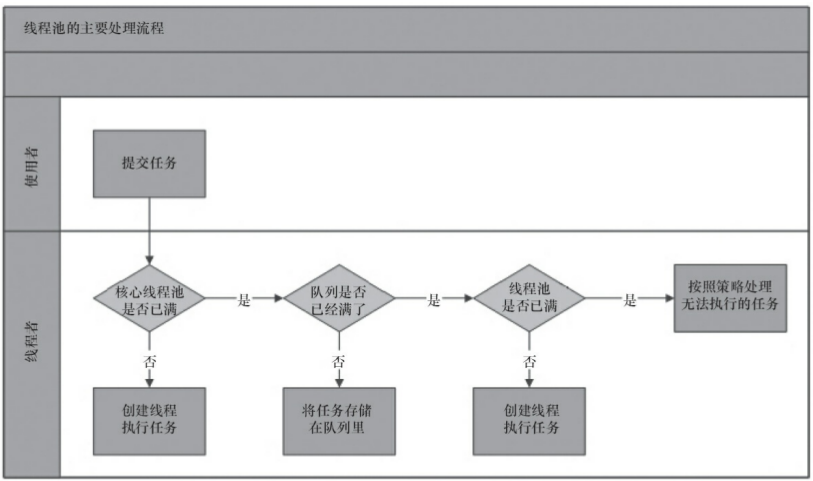
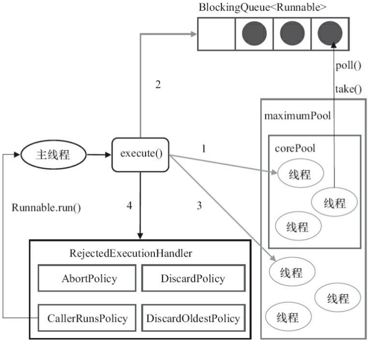
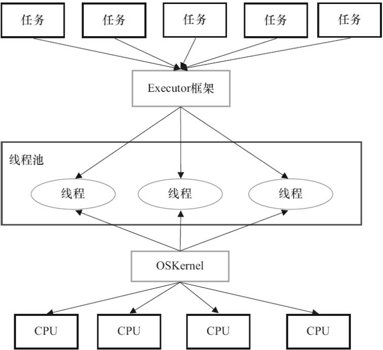

## 线程池

[TOC]

### 一、简介

线程池优点：

1. 降低资源消耗。通过重复利用已创建的线程降低线程创建和销毁造成的消耗。
2. 提高响应速度。当任务到达时,任务可以不需要等到线程创建就能立即执行。
3. 提高线程的可管理性。线程是稀缺资源,如果无限制地创建,不仅会消耗系统资源,还会降低系统的稳定性,使用线程池可以进行统一分配、调优和监控。但是,要做到合理利用线程池,必须对其实现原理了如指掌。


基本概念：

- int corePoolSize：该线程池中核心线程数最大值。默认情况下，核心线程会一直存活在线程中，即使线程没有任务。如果指定ThreadPoolExecutor的 allowCoreThreadTimeOut 这个属性为true，那么核心线程如果不干活(闲置状态)的话，超过一定时间( keepAliveTime)，就会被销毁掉。
- int maximumPoolSize：该线程池中线程总数的最大值。线程总数计算公式 = 核心线程数 + 非核心线程数。
- long keepAliveTime：该线程池中非核心线程闲置超时时长。注意：一个非核心线程，如果不干活(闲置状态)的时长，超过这个参数所设定的时长，就会被销毁掉。但是，如果设置了 allowCoreThreadTimeOut = true，则会作用于核心线程。
- TimeUnit unit：时间单位，枚举类型
- BlockingQueue<Runnable> workQueue： 阻塞队列，该线程池中的任务队列：维护着等待执行的Runnable对象。当所有的核心线程都在干活时，新添加的任务会被添加到这个队列中等待处理，如果队列满了，则新建非核心线程执行任务。队列主要分为一下四种：
  - SynchronousQueue：（同步队列）这个队列接收到任务的时候，会直接提交给线程处理，而不保留它。若所有线程都在工作，SynchronousQueue就会新建一个线程来处理这个任务。所以为了保证不出现（线程数达到了maximumPoolSize而不能新建线程）的错误，使用这个类型队列的时候maximumPoolSize一般指定成Integer.MAX_VALUE，即无限大，去规避这个使用风险。
  - LinkedBlockingQueue（链表阻塞队列）：这个队列接收到任务的时候，如果当前线程数小于核心线程数，则新建线程(核心线程)处理任务；如果当前线程数等于核心线程数，则进入队列等待。由于这个队列没有最大值限制，即所有超过核心线程数的任务都将被添加到队列中，这也就导致了maximumPoolSize的设定失效，因为总线程数永远不会超过corePoolSize。
  - ArrayBlockingQueue（数组阻塞队列）：可以限定队列的长度（既然是数组，那么就限定了大小），接收到任务的时候，如果没有达到corePoolSize的值，则新建线程(核心线程)执行任务，如果达到了，则入队等候，如果队列已满，则新建线程(非核心线程)执行任务，又如果总线程数到了maximumPoolSize，并且队列也满了，则发生错误。
  - DelayQueue（延迟队列）：队列内元素必须实现Delayed接口，这就意味着你传进去的任务必须先实现Delayed接口。这个队列接收到任务时，首先先入队，只有达到了指定的延时时间，才会执行任务。


线程池的实现原理：

当提交一个新的任务时，线程池的处理流程如下：

1. 如果线程数量未达到corePoolSize，则新建一个线程(核心线程)执行任务（需要获取**全局锁**）。
2. 如果线程数量达到了corePools，则将任务移入队列等待BlockingQueue。
3. 如果队列已满，新建线程(非核心线程)执行任务(需要获取**全局锁**)
4. 如果队列已满，总线程数又达到了maximumPoolSize，任务被拒绝，就会调用RejectedExecutionHandler.rejectedExecution()方法。

注意：获取全局锁有性能代价，在正常运行后，几乎所有的execute()方法调用都是执行步骤2，加入队列，无需获取全局锁。

ThreadPoolExecutor执行execute()方法的示意图：





Executors提供了常用的四种线程池：

1. newFixedThreadPool 创建一个定长线程池，可控制线程最大并发数，超出的线程会在队列中等待。


```java
public interface Executor {
    /**Executes the given command at some time in the future.  The command
     * may execute in a new thread, in a pooled thread, or in the calling
     * thread, at the discretion of the {@code Executor} implementation.
     * @param command the runnable task
     * @throws RejectedExecutionException if this task cannot be accepted for execution
     * @throws NullPointerException if command is null*/
    void execute(Runnable command);
}
```

```java
public interface ExecutorService extends Executor {
  void shutdown();
  List<Runnable> shutdownNow();
  boolean isShutdown();
  boolean isTerminated();
  boolean awaitTermination(long timeout, TimeUnit unit)
        throws InterruptedException;
  <T> Future<T> submit(Callable<T> task);
  <T> Future<T> submit(Runnable task, T result);
  Future<?> submit(Runnable task);
  <T> List<Future<T>> invokeAll(Collection<? extends Callable<T>> tasks)
        throws InterruptedException;
  <T> List<Future<T>> invokeAll(Collection<? extends Callable<T>> tasks,
                                  long timeout, TimeUnit unit)
        throws InterruptedException;
  <T> T invokeAny(Collection<? extends Callable<T>> tasks)
        throws InterruptedException, ExecutionException;
  <T> T invokeAny(Collection<? extends Callable<T>> tasks,
                    long timeout, TimeUnit unit)
        throws InterruptedException, ExecutionException, TimeoutException;
}
```

```java
public abstract class AbstractExecutorService implements ExecutorService {
  
```


### 一、Executor框架



框架主要包括：

- 任务target。包括被执行任务需要实现的接口：Runnable接口或Callabel接口。
- 任务的执行。任务执行的核心接口Executor，以及子接口ExecutorService接口。该框架有连个关键类实现了该接口：ThreadPoolExecutor和ScheduledPoolExecutor。
- 异步计算的结果。包括接口Future和实现Future接口的FutureTask类。


