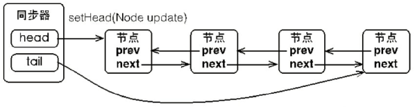
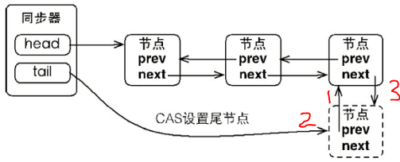
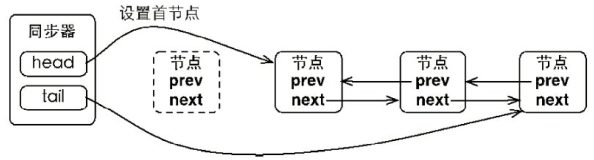
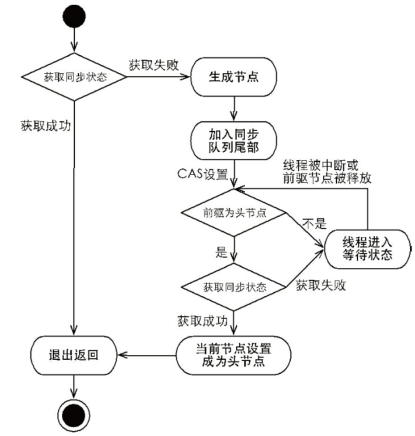
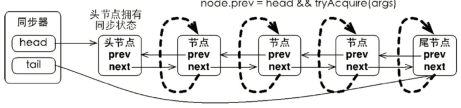

## 队列同步器

[TOC]

队列同步器**\*AbstractQueuedSynchronizer***（以下简称**\*同步器***），是用来构建锁或者其他同步组件的基础框架，它使用了一个**\*int成员变量***表示**同步状态**，通过内置的**FIFO队列**来完成资源获取线程的**排队工作**，并发包的作者（Doug Lea）期望它能够成为实现大部分同步需求的基础。 

### 一、队列同步器的基本结构

同步器的设计思路：节点是构成同步队列（等待队列，在5.6节中将会介绍）的基础，同步器拥有首节点（head）
和尾节点（tail），没有成功获取同步状态的线程将会成为节点加入该队列的尾部，同步队列的基本结构如图所示。



```java
public abstract class AbstractQueuedSynchronizer extends AbstractOwnableSynchronizer
    implements java.io.Serializable {
    protected AbstractQueuedSynchronizer() { }
    static final class Node {
        static final Node SHARED = new Node(); //共享模式标志
        static final Node EXCLUSIVE = null;//独占模式标志
        volatile int waitStatus;
        volatile Node prev; //前驱节点，当节点
        volatile Node next; //后继
        volatile Thread thread;
        ...
    }
    private transient volatile Node head;//同步器的节点
    private transient volatile Node tail;//同步器的尾节点
    private volatile int state;//同步状态
    protected final int getState() {
        return state;
    }
    protected final void setState(int newState) {
        state = newState;
    }
    protected final boolean compareAndSetState(int expect, int update) {
        return unsafe.compareAndSwapInt(this, stateOffset, expect, update);
    }
    static void selfInterrupt() {//中断当前线程
        Thread.currentThread().interrupt();
    }
    ...
}
```

同步队列中的节点Node，用来保存获取同步状态失败的线程引用，等待状态，前驱和后继节点。描述如下：

```java
static final class Node {
    static final Node SHARED = new Node(); //共享模式标志
    static final Node EXCLUSIVE = null;    //独占模式标志
    static final int CANCELLED =  1;
    static final int SIGNAL    = -1;
    static final int CONDITION = -2;
    static final int PROPAGATE = -3;
    volatile int waitStatus;
    //waitStatus等待状态包含如下状态：
    //1. CANCELLLED 在同步队列中等待的线程等待超时或被中断，需要从同步队列中取消等待，节点进入该状态将不会变化
    //2. SIGNAL 后继节点的线程处于等待状态，而当前节点的线程如果释放了同步状态或者被取消，将会通知后继节点，使得后继节点的线程运行
    //3. CONDITION 节点在等待队列，节点线程等待在Condition上，当其它线程对Condition调用了signal()方法后，该节点将会从等待队列中转移到同步队列中，加入到对同步状态的获取中
    //4. PROPAGATE 表示下一次共享式同步状态获取将会无条件地被传播下去
    volatile Node prev; //前驱节点，当节点
    volatile Node next; //后继
    volatile Thread thread;
    Node nextWaiter;
    final boolean isShared() {
        return nextWaiter == SHARED;
    }
    //获得前驱节点
    final Node predecessor() throws NullPointerException {
        Node p = prev;
        if (p == null)
            throw new NullPointerException();
        else
            return p;
    }
    Node() {}    // Used to establish initial head or SHARED marker
    Node(Thread thread, Node mode) {     // Used by addWaiter
        this.nextWaiter = mode;
        this.thread = thread;
    }
    Node(Thread thread, int waitStatus) { // Used by Condition
        this.waitStatus = waitStatus;
        this.thread = thread;
    }
}
```

​    同步器的**主要使用方式**是继承，子类通过**\*继承***同步器并**实现它的抽象方法**来管理同步状态，在抽象方法的实现过程中免不了要对同步状态进行更改，这时就需要使用同步器提供的3个方法（**getState**()、**setState**(int newState)和**compareAndSetState**(int expect,int update)）来进行操作，因为它们能够保证状态的改变是安全的。

子类推荐被定义为自定义同步组件的**\*静态内部类***，同步器自身没有实现任何同步接口，它仅仅是定义了若干同步状态获取和释放的方法来供自定义同步组件使用，同步器既可以支持独占式地获取同步状态，也可以支持共享式地获取同步状态，这样就可以方便实现不同类型的同步组件（ReentrantLock、ReentrantReadWriteLock和CountDownLatch等）。

同步器是实现**\*锁***（也可以是任意**\*同步组件***）的关键，在锁的实现中聚合（**\*组合***）同步器，利用同步器实现锁的语义。可以这样理解二者之间的关系：锁是面向使用者的，它定义了使用者与锁交互的接口（比如可以允许两个线程并行访问），隐藏了实现细节；同步器面向的是锁的实现者，它简化了锁的实现方式，屏蔽了同步状态管理、线程的排队、等待与唤醒等底层操作。锁和同步器很好地隔离了使用者和实现者所需关注的领域。

同步器的设计是基于**\*模板方法模式***的，也就是说，使用者需要继承同步器并重写指定的方法，随后将同步器**\*组合***在自定义同步组件的实现中，并调用同步器提供的模板方法，而这些**\*模板方法***将会调用使用者**重写的方法**。
重写同步器指定的方法时，需要使用同步器提供的如下3个方法来访问或修改同步状态。
**getState**()：获取当前同步状态。
**setState**(int newState)：设置当前同步状态。
**compareAndSetState**(int expect,int update)：使用CAS设置当前状态，该方法能够保证状态设置的原子性。


同步器将节点加入到同步队列：

1. 如果tail为null，则需要先进行初始化。先将node.pre = 原来的尾节点t
2. cas设置tail为新的节点node。CAS机制保障线程安全。
3. 原来尾节点t.next = node



同步队列设置首节点：

​    同步队列遵循FIFO，首节点是获取同步状态成功的节点，首节点的线程在释放同步状态时，将会唤醒后继节点，而后继节点将会在获取同步状态成功时将自己设置为首节点。设置首节点是通过获取到同步状态成功的线程来完成，只有一个线程能获取成功，因此是线程安全的，不需要CAS来保证。只需要将head设置为原首节点的next，并断开原首节点的next引用即可。



### 二、独占式同步状态的获取与释放

需要重写的方法（即未实现）：

```java
//独占式获取同步状态，实现该方法需要查询当前状态并判断同步状态是否符合预期，然后再进行CAS设置同步状态
protected boolean tryAcquire(int arg)
//独占式释放同步状态，等待获取同步状态的线程将有机会获取同步状态
protected boolean tryRelease(int arg)
//当前同步器是否在独占模式下被线程占用，一般该方法表示是否被当前线程所独占
protected boolean isHeldExclusively()
```

同步器提供的模板方法：

```java
//独占式获取同步状态，如果当前线程获取同步状态成功，立即返回。否则，将会进入同步队列等待，且不响应中断
//该方法将会重复调用重写的tryAcquire(int arg)方法
public final void acquire(int arg)
//与acquire(int arg)基本相同，但是该方法响应中断。
public final void acquireInterruptibly(int arg)
//独占式释放同步状态，该方法会在释放同步状态后，将同步队列中第一个节点包含的线程唤醒
public final boolean release(int arg)
```

模板方法的实现：

主要逻辑：首先调用**\*自定义同步器实现***的**\*tryAcquire***(int arg)方法，该方法保证线程安全的获取同步状态，如果同步状态获取失败，则构造同步节点（独占式Node.EXCLUSIVE，同一时刻只能有一个线程成功获取同步状态）并通过**\*addWaiter***(Node node)方法将该节点加入到同步队列的尾部，最后调用**\*acquireQueued***(Node node,int arg)方法，使得该节点以“死循环”的方式获取同步状态。 



```java
public final void acquire(int arg) {
    if (!tryAcquire(arg) &&  //先通过tryAcquire获取同步状态
        acquireQueued(addWaiter(Node.EXCLUSIVE), arg))//获取同步状态失败则生成节点并加入同步队列
        selfInterrupt();
}
```

生成节点并加入同步队列：

```java
private Node addWaiter(Node mode) {
    Node node = new Node(Thread.currentThread(), mode);//将当前线程以独占模式生成节点
    //快速尝试在尾部添加
    Node pred = tail;
    if (pred != null) {
        node.prev = pred; //1.先将当前节点node的前驱指向当前tail
        if (compareAndSetTail(pred, node)) { //2.CAS尝试将tail设置为node
            //如果CAS成功，说明"设置当前节点node的前驱"与"CAS设置tail"之间没有别的线程设置tail成功
            pred.next = node;  //3.将"之前的tail"的后继节点指向node即可
            return node;
        }
    }
    enq(node);//如果失败，同步器则进行初始化，或者通过死循环的方式来保证正确添加尾部节点。
    return node;
}
```


```java
//通过死循环来保证节点的正确添加，将并发添加节点变为串行话
private Node enq(final Node node) {
    for (;;) {//通过死循环来保证节点的正确添加
        Node t = tail;
        if (t == null) { //如果没有初始化，则进行初始化
            if (compareAndSetHead(new Node()))
                tail = head;
        } else {  
            node.prev = t;
            if (compareAndSetTail(t, node)) {//直到CAS成功为止
                t.next = node;
                return t; //结束死循环
            }
        }
    }
}
```

CAS串行化的优点：

如果通过加锁同步的方式添加节点，线程必须获取锁后才能添加尾节点，那么必然会导致其他线程等待加锁而阻塞，获取锁的线程释放锁后阻塞的线程又会被唤醒，而线程的阻塞和唤醒需要依赖于系统内核完成，因此程序的执行需要从用户态切换到核心态，而这样的切换是非常耗时的操作。如果我们通过”循环CAS“来添加节点的话，所有线程都不会被阻塞，而是不断失败重试，线程不需要进行锁同步，不仅消除了线程阻塞唤醒的开销而且消除了加锁解锁的时间开销。但是循环CAS也有其缺点，循环CAS通过不断尝试来添加节点，如果说CAS操作失败那么将会占用处理器资源。

节点在同步队列中自旋：

节点进入同步队列之后，就进入了一个**\*自旋***的过程，每个节点（或者说是线程）都在自省地观察，当条件满足，获取到了同步状态，就可以从这个自旋过程中退出，否则依旧留在这个自旋过程中。 



```java
//不可中断地自旋
final boolean acquireQueued(final Node node, int arg) {
    boolean failed = true;
    try {
        boolean interrupted = false;
        for (;;) {
            final Node p = node.predecessor();//获取前驱姐节点
            //如果前驱节点是首节点 head -> first   node.pre -> first
            //则尝试获取同步状态，如果成功，则代表当前线程获取了同步状态
            if (p == head && tryAcquire(arg)) {
                //当前线程获取同步状态成功
                setHead(node); //将自己设置为首节点 head -> node
                p.next = null; // help GC
                failed = false; 
                return interrupted;//从自旋中退出
            }
            //如果前驱不是首节点 或者 获取同步状态失败后判断是否需要阻塞或中断
            if (shouldParkAfterFailedAcquire(p, node) && //判断是否需要阻塞或中断
                parkAndCheckInterrupt())//阻塞当前线程
                interrupted = true;
        }
    } finally {
        if (failed)
            cancelAcquire(node);
    }
}
```

```java
//判断是否需要阻塞或中断
private static boolean shouldParkAfterFailedAcquire(Node pred, Node node) {
    int ws = pred.waitStatus;//获取前驱节点的等待状态
    if (ws == Node.SIGNAL)
        //SIGNAL状态：前驱节点释放同步状态或者被取消，将会通知后继节点。因此，可以放心的阻塞当前线程，返回true。
         /* This node has already set status asking a release
         * to signal it, so it can safely park.
         */
        return true;
    if (ws > 0) {
        //前驱节点被取消了，跳过前驱节点并重试
        do {
            node.prev = pred = pred.prev;
        } while (pred.waitStatus > 0);
        pred.next = node;
    } else {//独占模式下，一般情况下这里指前驱节点等待状态为SIGNAL
        /*
         * waitStatus must be 0 or PROPAGATE.  Indicate that we
         * need a signal, but don't park yet.  Caller will need to
         * retry to make sure it cannot acquire before parking.
         */
        compareAndSetWaitStatus(pred, ws, Node.SIGNAL);//设置当前节点等待状态为SIGNAL
    }
    return false;
}
```

```java
/**
     * Convenience method to park and then check if interrupted
     *
     * @return {@code true} if interrupted
     */
    private final boolean parkAndCheckInterrupt() {
        LockSupport.park(this);
        return Thread.interrupted();
    }
```

