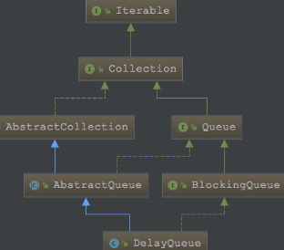
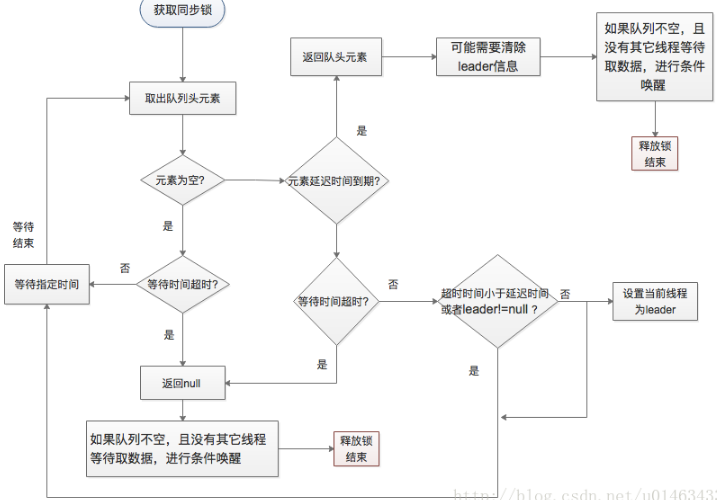

## 阻塞队列-DelayQueue

[TOC]

  DelayQueue是一个支持延时获取元素的无界阻塞队列。**队列使用PriorityQueue来实现**。**队列中的元素必须实现Delayed接口**，在创建元素时可以指定多久才能从队列中获取当前元素。只有在**延迟期满**时才能从队列中提取元素。

### Delayed 接口分析

```java
public interface Delayed extends Comparable<Delayed> {
    /* Returns the remaining delay associated with this object, in the
     * given time unit.
     * @param unit the time unit
     * @return the remaining delay; zero or negative values indicate
     * that the delay has already elapsed */
    long getDelay(TimeUnit unit);
}
```

  Delayed 接口有一个getDelay 方法接口，该方法用来告知延迟到期有多长的时间，或者延迟在多长时间之前已经到期。
  为了排序Delayed 接口还继承了Comparable 接口，因此必须实现compareTo()，使其可以进行元素的比较。

继承体系：

和阻塞队列ArrayBlockingQueue，LinkedBlockingQueue，PriorityBlockingQueue基本是一样的，唯独**没有实现序列化接口**。  

DelayQueue 实现了BlockingQueue接口，该接口中定义了阻塞的方法接口。

DelayQueue 继承了AbstractQueue，具有了队列的行为。 



DelayQueue非常有用，可以将DelayQueue运用在以下应用场景。

- 缓存系统的设计：可以用DelayQueue保存缓存元素的有效期，使用一个线程循环查询DelayQueue，一旦能从DelayQueue中获取元素时，表示缓存有效期到了。
- 定时任务调度：使用DelayQueue保存当天将会执行的任务和执行时间，一旦从DelayQueue中获取到任务就开始执行，比如TimerQueue就是使用DelayQueue实现的。

DelayQueue的主要结构：

```java
public class DelayQueue<E extends Delayed> extends AbstractQueue<E>
    implements BlockingQueue<E> {
    private final transient ReentrantLock lock = new ReentrantLock();//可重入锁
    private final PriorityQueue<E> q = new PriorityQueue<E>();//存储元素的优先级队列
    /**
     * Thread designated to wait for the element at the head of
     * the queue.  This variant of the Leader-Follower pattern
     * (http://www.cs.wustl.edu/~schmidt/POSA/POSA2/) serves to
     * minimize unnecessary timed waiting.  When a thread becomes
     * the leader, it waits only for the next delay to elapse, but
     * other threads await indefinitely.  The leader thread must
     * signal some other thread before returning from take() or
     * poll(...), unless some other thread becomes leader in the
     * interim.  Whenever the head of the queue is replaced with
     * an element with an earlier expiration time, the leader
     * field is invalidated by being reset to null, and some
     * waiting thread, but not necessarily the current leader, is
     * signalled.  So waiting threads must be prepared to acquire
     * and lose leadership while waiting.
     */
     //为了缩短最小等待时间，当一个线程成为leader后，它只需要等待下一个delay即可，而其余线程则不确定。
    private Thread leader = null;
    /**
     * Condition signalled when a newer element becomes available at the head of the queue or a new thread may need to become leader.
     */
     //队列首部是否可以取数据，新线程是否需要变成leader
    private final Condition available = lock.newCondition();
```

DelayQueue 通过组合一个PriorityQueue 来实现元素的存储以及优先级维护，通过ReentrantLock 来保证线程安全，通过Condition 来判断是否可以取数据，对于leader我们后面再来分析它的作用。

### 构造方法

1、默认构造方法，这个简单，什么都没有

```java
    public DelayQueue() {}//空
```

2、通过集合初始化

```java
    public DelayQueue(Collection<? extends E> c) {
        this.addAll(c);
    }
```

DelayQueue 内部组合PriorityQueue，对元素的操作都是通过PriorityQueue 来实现的，DelayQueue 的构造方法很简单，对于PriorityQueue 都是使用的默认参数，不能通过DelayQueue 来指定PriorityQueue的初始大小，也不能使用指定的Comparator，元素本身就需要实现Comparable ，因此不需要指定的Comparator。

### 入队

#### 1、add(E e)

将指定的元素插入到此队列中，在成功时返回 true

```java
    public boolean add(E e) {
        return offer(e);
    }
```

#### 2、offer(E e)

将指定的元素插入到此队列中，在成功时返回 true，在前面的add 中，内部调用了offer 方法，我们也可以直接调用offer 方法来完成入队操作。

```java
    public boolean offer(E e) {
        final ReentrantLock lock = this.lock;
        lock.lock();//获取锁
        try {
            q.offer(e);//通过PriorityQueue 来将元素入队
            //peek 是获取的队头元素，唤醒阻塞在available 条件上的一个线程，表示可以从队列中取数据了
            if (q.peek() == e) {//如果添加的元素在队头，则说明即将过期，avaliable通知已经有元素了
                leader = null;
                available.signal();
            }
            return true;
        } finally {
            lock.unlock();
        }
    }
```

peek并不一定是当前添加的元素，队头是当前添加元素，说明当前元素e的优先级最小也就即将过期的，这时候激活avaliable变量条件队列里面的一个线程，通知他们队列里面有元素了。

### 3、offer(E e, long timeout, TimeUnit unit)

```java
    public boolean offer(E e, long timeout, TimeUnit unit) {
        return offer(e);//调用offer 方法
    }
```

因为是无界队列，因此不会出现”队满”(超出最大值会抛异常)，指定一个等待时间将元素放入队列中并没有意义，队列没有达到最大值那么会入队成功，达到最大值，则失败，不会进行等待。

#### 4、put(E e)

将指定的元素插入此队列中,队列达到最大值，则抛oom异常

```java
    public void put(E e) {
        offer(e);
    }
```

虽然提供入队的接口方式很多，实际都是调用的offer 方法，通过PriorityQueue 来进行入队操作，入队超时方法并没有其超时功能，也不会阻塞。

### 出队

#### 1、poll()

获取并移除此队列的头，如果此队列为空，或者队列首部元素延时还没到，则返回 null

```java
    /**
     * Retrieves and removes the head of this queue, or returns {@code null}
     * if this queue has no elements with an expired delay.
     *
     * @return the head of this queue, or {@code null} if this
     *         queue has no elements with an expired delay
     */
    public E poll() {
        final ReentrantLock lock = this.lock;
        lock.lock();//获取同步锁
        try {
            E first = q.peek();//获取队头
            //如果队头为null 或者 延时还没有到，则返回null
            if (first == null || first.getDelay(NANOSECONDS) > 0)
                return null;
            else
                return q.poll(); //元素出队
        } finally {
            lock.unlock();
        }
    }
```

#### 2、poll(long timeout, TimeUnit unit)

获取并移除此队列的头部，在指定的等待时间前等待。

```java
    /* Retrieves and removes the head of this queue, waiting if necessary
     * until an element with an expired delay is available on this queue,
     * or the specified wait time expires.
     * @return the head of this queue, or {@code null} if the
     *         specified waiting time elapses before an element with
     *         an expired delay becomes available
     * @throws InterruptedException {@inheritDoc}
     */
	public E poll(long timeout, TimeUnit unit) throws InterruptedException {
        long nanos = unit.toNanos(timeout);//超时等待时间
        final ReentrantLock lock = this.lock;
        lock.lockInterruptibly();//可中断的获取锁
        try {
            //无限循环，即阻塞，直到返回。
            for (;;) {
                E first = q.peek();//获取队头元素
                //1.队头为空，也就是队列为空
                if (first == null) {
                    //1.1达到超时指定时间，返回null 
                    if (nanos <= 0)
                        return null;
                    else
                    //1.2如果还没有超时，那么再available条件上进行等待nanos时间
                        nanos = available.awaitNanos(nanos);
                //2.对头有元素first
                } else {
                    //获取元素first延迟时间
                    long delay = first.getDelay(NANOSECONDS);
                    //2.1延时到期，返回first元素
                    if (delay <= 0)
                        return q.poll(); //返回出队元素
                    //延时未到期，超时到期，返回null
                    if (nanos <= 0)
                        return null;
                    first = null; // don't retain ref while waiting
                    // 超时等待时间 < 延迟时间 或者有其它线程再取数据
                    if (nanos < delay || leader != null)
                        //在available 条件上进行等待nanos 时间
                        nanos = available.awaitNanos(nanos);
                    else {
                        //超时等待时间 > 延迟时间 并且没有其它线程在等待，那么当前元素成为leader，表示leader 线程最早 正在等待获取元素
                        Thread thisThread = Thread.currentThread();
                        leader = thisThread;
                        try {
                        //等待  延迟时间 超时
                            long timeLeft = available.awaitNanos(delay);
                            //还需要继续等待 nanos
                            nanos -= delay - timeLeft;
                        } finally {
                            //清除 leader
                            if (leader == thisThread)
                                leader = null;
                        }
                    }
                }
            }
        } finally {
            //唤醒阻塞在available 的一个线程，表示可以取数据了
            if (leader == null && q.peek() != null)
                available.signal();
            //释放锁
            lock.unlock();
        }
    }
```

来梳理梳理这里的逻辑： 
1、如果队列为空，如果超时时间未到，则进行等待，否则返回null 
2、队列不空，取出队头元素，如果延迟时间到，则返回元素，否则 如果超时 时间到 返回null 
3、超时时间未到，并且超时时间< 延迟时间或者有线程正在获取元素，那么进行等待 
4、超时时间> 延迟时间，那么肯定可以取到元素，设置leader为当前线程，等待延迟时间到期。

这里需要注意的时Condition 条件在阻塞时会释放锁，在被唤醒时会再次获取锁，获取成功才会返回。 
当进行超时等待时，阻塞在Condition 上后会释放锁,一旦释放了锁，那么其它线程就有可能参与竞争，某一个线程就可能会成为leader(参与竞争的时间早，并且能在等待时间内能获取到队头元素那么就可能成为leader) 
leader是用来减少不必要的竞争,如果leader不为空说明已经有线程在取了,设置当前线程等待即可。（leader 就是一个信号，告诉其它线程：你们不要再去获取元素了，它们延迟时间还没到期，我都还没有取到数据呢，你们要取数据，等我取了再说） 
下面用流程图来展示这一过程： 


#### 3、take() :

获取并移除此队列的头部，在元素变得可用(时间到的元素)之前一直等待

```java
    public E take() throws InterruptedException {
        final ReentrantLock lock = this.lock;
        lock.lockInterruptibly();
        try {
            //加锁后死循环 
            for (;;) {
                E first = q.peek();//取出队头元素
                //1.没有元素，则available.await等带
                if (first == null)
                    available.await();//没有元素，则等待
                //2.有元素first
                else {
                    long delay = first.getDelay(NANOSECONDS);//得到firt的元素延期时间
                    //2.1 first时间到，则返回
                    if (delay <= 0)//延迟到期
                        return q.poll();
                    first = null; // don't retain ref while waiting
                    //2.2 如果有其它线程在等待获取元素，则当前线程不用去竞争，直接等待
                    if (leader != null)
                        available.await();
                    //2.3 如果没有别的线程等待，则将自己的线程设为leader
                    else {
                        Thread thisThread = Thread.currentThread();
                        leader = thisThread;
                        try {
                            //等待延迟时间到期
                            available.awaitNanos(delay);
                        } finally {
                            if (leader == thisThread)
                                leader = null;
                        }
                    }
                }
            }
        } finally {
            if (leader == null && q.peek() != null)
                available.signal();
            lock.unlock();
        }
    }
```

该方法就是相当于在前面的超时等待中，把超时时间设置为无限大，那么这样只要队列中有元素，要是元素延迟时间要求，那么就可以取出元素，否则就直接等待元素延迟时间到期，再取出元素，最先参与等待的线程会成为leader。

思路：

- 加锁

- 无限循环
  - 获取第一个元素first，没有则等待
  - leader不为null，说明有别的线程之前就等待获取元素，我就不去竞争了，直接等available.await()
  - 否则，没有线程等待，我将自己设置为leader，并等待first元素的延迟时间delay，调用available.awaitNanos(delay);放弃锁
    - 获取锁后，如果在等待delay期间，leader没有变，还是自己，则将对头元素返回，leader设置为null。
    - 返回之前，如果leader为null，并且队列中有元素，则调用available.signal();唤醒等待在avaliable上的线程去设置leader。最后解锁，真正返回。

回顾插入的思路：

- 加锁，插入元素，如果插入的元素在队列头部，说明新插入的元素是第一个超时返回的。
- 要将leader置为null，并调用available.signal()来通知等待线程获取，并重新设置leader。因为之前的leader线程在等待插入之前的第一个元素的delay，而现在队头的元素delay更少，所以要重新设置。

#### 4、peek()

调用此方法，可以返回队头元素，但是元素并不出队。

```
    public E peek() {
        final ReentrantLock lock = this.lock;
        lock.lock();
        try {
            //返回队列头部元素，元素不出队
            return q.peek();
        } finally {
            lock.unlock();
        }
    }12345678910
```

### 总结

1. DelayQueue 内部通过组合PriorityQueue 来实现存储和维护元素顺序的。
2. DelayQueue 存储元素必须实现Delayed 接口，通过实现Delayed 接口，可以获取到元素延迟时间，以及可以比较元素大小（Delayed 继承Comparable）
3. DelayQueue 通过一个可重入锁来控制元素的入队出队行为
4. DelayQueue 中leader 标识 用于减少线程的竞争，表示当前有其它线程正在获取队头元素。
5. PriorityQueue 只是负责存储数据以及维护元素的顺序，对于延迟时间取数据则是在DelayQueue 中进行判断控制的。
6. DelayQueue 没有实现序列化接口