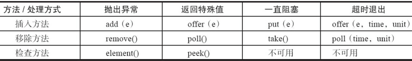
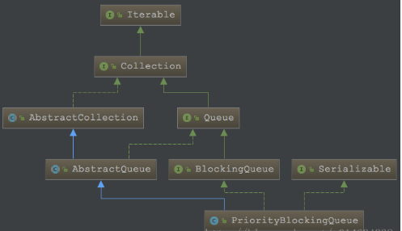

## 阻塞队列

[TOC]

阻塞队列：

- 支持阻塞的插入方法：意思是当队列满时，队列会阻塞插入元素的线程，直到队列不满。
- 支持阻塞的插入方法：意思是当队列满时，队列会阻塞插入元素的线程，直到队列不满。

在阻塞队列不可用时，这两个附加操作提供了4种处理方式：



- 抛出异常：当队列满时，如果再往队列里插入元素，会抛出IllegalStateException（"Queue full"）异常。当队列空时，从队列里获取元素会抛出NoSuchElementException异常。
- 返回特殊值：当往队列插入元素时，会返回元素是否插入成功，成功返回true。如果是移除方法，则是从队列里取出一个元素，如果没有则返回null。offer和poll都有字母o.
- 一直阻塞：当阻塞队列满时，如果生产者线程往队列里put元素，队列会一直阻塞生产者线程，直到队列可用或者响应中断退出。当队列空时，如果消费者线程从队列里take元素，队列会阻塞住消费者线程，直到队列不为空。put和take都有字母t。
- 超时退出：当阻塞队列满时，如果生产者线程往队列里插入元素，队列会阻塞生产者线程一段时间，如果超过了指定的时间，生产者线程就会退出。

JDK提供的阻塞队列：

1. ArrayBlockingQueue:一个由数组结构组成的有界阻塞队列
2. LinkedBlockingQueue：一个由链表结构组成的有界阻塞队列。
3. PriorityBlockingQueue：一个支持优先级排序的无界阻塞队列。
4. PriorityBlockingQueue：一个支持优先级排序的无界阻塞队列。
5. SynchronousQueue：一个不存储元素的阻塞队列。
6. LinkedTransferQueue：一个由链表结构组成的无界阻塞队列。
7. LinkedBlockingDeque：一个由链表结构组成的双向阻塞队列。


### 1. ArrayBlockingQueue

  ArrayBlockingQueue是一个用数组实现的有界阻塞队列.

  默认情况下不保证线程公平的访问队列，所谓公平访问队列是指阻塞的线程，可以按照阻塞的先后顺序访问队列，即先阻塞线程先访问队列。

  一个ReentrantLock控制所有的访问。

```java
public class ArrayBlockingQueue<E> extends AbstractQueue<E>
        implements BlockingQueue<E>, java.io.Serializable {
	final Object[] items;//The queued items
	int takeIndex;//items index for next take, poll, peek or remove
	int putIndex;//items index for next put, offer, or add
	int count;//Number of elements in the queue
	final ReentrantLock lock;// Main lock guarding all access
	private final Condition notEmpty;//Condition for waiting takes
	private final Condition notFull; //Condition for waiting puts
	...
	/**
     * Creates an {@code ArrayBlockingQueue} with the given (fixed)
     * capacity and the specified access policy.
     * @param capacity the capacity of this queue
     * @param fair if {@code true} then queue accesses for threads blocked
     *        on insertion or removal, are processed in FIFO order;
     *        if {@code false} the access order is unspecified.
     * @throws IllegalArgumentException if {@code capacity < 1}
     */
    public ArrayBlockingQueue(int capacity, boolean fair) {
        if (capacity <= 0)
            throw new IllegalArgumentException();
        this.items = new Object[capacity];//数组实现
        //通过重入锁来实现公平或者非公平。公平：由同步队列FIFO；非公平:CAS设置成功即可
        lock = new ReentrantLock(fair);
        notEmpty = lock.newCondition();//
        notFull =  lock.newCondition();
    }
    /**
     * Inserts element at current put position, advances, and signals.
     * Call only when holding lock.
     */
    private void enqueue(E x) {
        // assert lock.getHoldCount() == 1;
        // assert items[putIndex] == null;
        final Object[] items = this.items;
        items[putIndex] = x;
        if (++putIndex == items.length)
            putIndex = 0;
        count++;
        notEmpty.signal();
    }
    
    
    
    
    /**
     * Extracts element at current take position, advances, and signals.
     * Call only when holding lock.
     */
    private E dequeue() {
        // assert lock.getHoldCount() == 1;
        // assert items[takeIndex] != null;
        final Object[] items = this.items;
        @SuppressWarnings("unchecked")
        E x = (E) items[takeIndex];
        items[takeIndex] = null;
        if (++takeIndex == items.length)
            takeIndex = 0;
        count--;
        if (itrs != null)
            itrs.elementDequeued();
        notFull.signal();//通知等待在notFull对象上的线程非空。
        return x;
    }
    //添加元素，
    public boolean add(E e) {
        return super.add(e);//父类add调用的是offer方法，失败抛出异常
    }
    //offer添加元素，需要获取锁，然后调用enqueue(e),并出发notFull.signal
    public boolean offer(E e) {
        checkNotNull(e);
        final ReentrantLock lock = this.lock;
        lock.lock();
        try {
            if (count == items.length)
                return false;
            else {
                enqueue(e);
                return true;
            }
        } finally {
            lock.unlock();
        }
    }
    /**
     * Inserts the specified element at the tail of this queue, waiting
     * for space to become available if the queue is full.
     * @throws InterruptedException {@inheritDoc}
     */
    //添加元素，获取锁，可中断，如果元素满，则需要等待notFull.await()
    public void put(E e) throws InterruptedException {
        checkNotNull(e);
        final ReentrantLock lock = this.lock;
        lock.lockInterruptibly();//在等待过程中要检查中断状态
        try {
            while (count == items.length)
                notFull.await();
            enqueue(e);
        } finally {
            lock.unlock();
        }
    }
    
    //接下来是移除元素
    private E dequeue() {
        // assert lock.getHoldCount() == 1;
        // assert items[takeIndex] != null;
        final Object[] items = this.items;
        @SuppressWarnings("unchecked")
        E x = (E) items[takeIndex];
        items[takeIndex] = null;
        if (++takeIndex == items.length)
            takeIndex = 0;
        count--;
        if (itrs != null)
            itrs.elementDequeued();
        notFull.signal();//移除一个之后，通知等待的线程有空位置了
        return x;
    }
    public E poll() {
        final ReentrantLock lock = this.lock;
        lock.lock();
        try {
            return (count == 0) ? null : dequeue();
        } finally {
            lock.unlock();
        }
    }
    public E take() throws InterruptedException {
        final ReentrantLock lock = this.lock;
        lock.lockInterruptibly();
        try {
            while (count == 0)
                notEmpty.await();//如果空，则等待非空条件
            return dequeue();
        } finally {
            lock.unlock();
        }
    }
    //限时移除
    public E poll(long timeout, TimeUnit unit) throws InterruptedException {
        long nanos = unit.toNanos(timeout);
        final ReentrantLock lock = this.lock;
        lock.lockInterruptibly();//可中断
        try {
            while (count == 0) {//while，需要重新判断。
            //因为线程1添加之后，释放锁，如果线程2再取空，此时轮到该线程，则还是空？？？
                if (nanos <= 0)
                    return null;
                nanos = notEmpty.awaitNanos(nanos);
            }
            return dequeue();
        } finally {
            lock.unlock();
        }
    }
    public E peek() {
        final ReentrantLock lock = this.lock;
        lock.lock();
        try {
            return itemAt(takeIndex); // null when queue is empty
        } finally {
            lock.unlock();
        }
    }
    //移除一个，根据equals来判断
    public boolean remove(Object o) {
        if (o == null) return false;
        final Object[] items = this.items;
        final ReentrantLock lock = this.lock;
        lock.lock();
        try {
            if (count > 0) {
                final int putIndex = this.putIndex;
                int i = takeIndex;
                do {
                    if (o.equals(items[i])) {
                        removeAt(i);
                        return true;
                    }
                    if (++i == items.length)
                        i = 0;
                } while (i != putIndex);
            }
            return false;
        } finally {
            lock.unlock();
        }
    }
    /**
     * Deletes item at array index removeIndex.
     * Utility for remove(Object) and iterator.remove.
     * Call only when holding lock.
     */
    //移除特定index的对象，后面的对象要往前移动
    void removeAt(final int removeIndex) {
        // assert lock.getHoldCount() == 1;
        // assert items[removeIndex] != null;
        // assert removeIndex >= 0 && removeIndex < items.length;
        final Object[] items = this.items;
        if (removeIndex == takeIndex) {
            // removing front item; just advance
            items[takeIndex] = null;
            if (++takeIndex == items.length)
                takeIndex = 0;
            count--;
            if (itrs != null)
                itrs.elementDequeued();
        } else {
            // an "interior" remove
            // slide over all others up through putIndex.
            final int putIndex = this.putIndex;
            for (int i = removeIndex;;) {
                int next = i + 1;
                if (next == items.length)
                    next = 0;
                if (next != putIndex) {
                    items[i] = items[next];
                    i = next;
                } else {
                    items[i] = null;
                    this.putIndex = i;
                    break;
                }
            }
            count--;
            if (itrs != null)
                itrs.removedAt(removeIndex);
        }
        notFull.signal();
    }
```

### 2. LinkedBlockingQueue

  LinkedBlockingQueue是一个用链表实现的有界阻塞队列。此队列的默认和最大长度为Integer.MAX_V ALUE。此队列按照先进先出的原则对元素进行排序。

```java
public class LinkedBlockingQueue<E> extends AbstractQueue<E>
        implements BlockingQueue<E>, java.io.Serializable {
	private final int capacity;//The capacity bound, or Integer.MAX_VALUE if none
	private final AtomicInteger count = new AtomicInteger();//Current number of elements
	transient Node<E> head;// head.item==null 
	private transient Node<E> last// last.next==null
	private final ReentrantLock takeLock = new ReentrantLock();//Lock held by take, poll, etc
	private final Condition notEmpty = takeLock.newCondition();//Wait queue for waiting takes
	private final ReentrantLock putLock = new ReentrantLock();//Lock held by put, offer, etc
	private final Condition notFull = putLock.newCondition(); //Wait queue for waiting puts
	...
```

put阻塞插入方法：

```java
/**
 * Inserts the specified element at the tail of this queue, waiting if
 * necessary for space to become available.
 *
 * @throws InterruptedException {@inheritDoc}
 * @throws NullPointerException {@inheritDoc}
 */
//将元素添加到队列的尾部，如果队列满，则等待
public void put(E e) throws InterruptedException {
    if (e == null) throw new NullPointerException();
    // Note: convention in all put/take/etc is to preset local var
    // holding count negative to indicate failure unless set.
    int c = -1;
    Node<E> node = new Node<E>(e);
    final ReentrantLock putLock = this.putLock;
    final AtomicInteger count = this.count;
    putLock.lockInterruptibly();
    try {
        /*
         * Note that count is used in wait guard even though it is
         * not protected by lock. This works because count can
         * only decrease at this point (all other puts are shut
         * out by lock), and we (or some other waiting put) are
         * signalled if it ever changes from capacity. Similarly
         * for all other uses of count in other wait guards.
         */
        //如果满，则等待在notFull的Condition对象上
        while (count.get() == capacity) {
            notFull.await();
        }
        enqueue(node);//返回，则说明不满
        c = count.getAndIncrement();//计数加1
        if (c + 1 < capacity)//如果还不满，则唤醒一个其余等待插入的线程
            notFull.signal();//插入线程一旦开始，则会依次唤醒并插入
    } finally {
        putLock.unlock();
    }
    // c如果不为-1，则代表队列原来的个数
    // 如果插入元素之前，队列是空的，那么有可能有等待取的线程
    // 现在插入了一条数据，队列不空，就唤醒等待取得线程
    if (c == 0)
        signalNotEmpty();
}

```

offer方法：

```java
//将元素插入尾部
public boolean offer(E e) {
    if (e == null) throw new NullPointerException();
    final AtomicInteger count = this.count;
    if (count.get() == capacity)//判断容量满，则失败。提前判断
        return false;
    int c = -1;
    Node<E> node = new Node<E>(e);
    final ReentrantLock putLock = this.putLock;//获取插入锁putLock
    putLock.lock();
    try {
        //再次判断，考虑并发情况
        if (count.get() < capacity) {//在锁中判断容量，如果可以插入，则插入
            enqueue(node);//插入元素
            c = count.getAndIncrement();//更新c，c为之前的个数，然后count++
            if (c + 1 < capacity) //如果现在的个数还没满，则通知后面等待插入的线程(notFull)。
                notFull.signal(); //唤醒下一个线程，执行添加操作。
        }
    } finally {
        putLock.unlock();
    }
    // c如果不为-1，则代表队列原来的个数
    // 如果插入元素之前，队列是空的，那么有可能有等待取的线程
    // 现在插入了一条数据，队列不空，就唤醒等待取得线程
    if (c == 0)
        signalNotEmpty();
    return c >= 0;
}
。。。
/**
 * Signals a waiting take. Called only from put/offer (which do not
 * otherwise ordinarily lock takeLock.)
 */
private void signalNotEmpty() {
    final ReentrantLock takeLock = this.takeLock;
    takeLock.lock();
    try {
        notEmpty.signal();
    } finally {
        takeLock.unlock();
    }
}
```

take()方法:

```java
public E take() throws InterruptedException {
    E x;
    int c = -1;
    final AtomicInteger count = this.count;
    final ReentrantLock takeLock = this.takeLock;
    takeLock.lockInterruptibly();
    try {
        while (count.get() == 0) {//如果为空，则等待
            notEmpty.await();
        }
        x = dequeue();//取出元素
        c = count.getAndDecrement();//计数减1
        if (c > 1) //如果还有元素，则唤醒等待take()的线程。即，一旦开始取，则会依次往后唤醒
            notEmpty.signal();
    } finally {
        takeLock.unlock();
    }
    //c如果不为-1，则代表队列原来的个数
    //如果取之前队列是满的，那么可能有等待插入的线程。
    //而现在已经取了一个，队列不满，则可以通知等待插入的线程。
    if (c == capacity)
        signalNotFull();
    return x;
}
/**
 * Signals a waiting put. Called only from take/poll.
 */
private void signalNotFull() {
    final ReentrantLock putLock = this.putLock;
    putLock.lock();
    try {
        notFull.signal();
    } finally {
        putLock.unlock();
    }
}
```

remove方法

```java
//因为移除的对象位置不确定，所以要获取两个锁。
public boolean remove(Object o) {
    if (o == null) return false;
    fullyLock();
    try {
        for (Node<E> trail = head, p = trail.next; p != null; trail = p, p = p.next) {
            if (o.equals(p.item)) {
                unlink(p, trail);
                return true;
            }
        }
        return false;
    } finally {
        fullyUnlock();
    }
}
```

#### LinkedBlockingQueue和ArrayBlockingQueue迥异

通过上述的分析，对于LinkedBlockingQueue和ArrayBlockingQueue的基本使用以及内部实现原理我们已较为熟悉了，这里我们就对它们两间的区别来个小结

1.队列大小有所不同，ArrayBlockingQueue是有界的初始化必须指定大小，而LinkedBlockingQueue可以是有界的也可以是无界的(Integer.MAX_VALUE)，对于后者而言，当添加速度大于移除速度时，在无界的情况下，可能会造成内存溢出等问题。

2.数据存储容器不同，ArrayBlockingQueue采用的是数组作为数据存储容器，而LinkedBlockingQueue采用的则是以Node节点作为连接对象的链表。

3.由于ArrayBlockingQueue采用的是数组的存储容器，因此在插入或删除元素时不会产生或销毁任何额外的对象实例，而LinkedBlockingQueue则会生成一个额外的Node对象。这可能在长时间内需要高效并发地处理大批量数据的时，对于GC可能存在较大影响。

4.两者的实现队列添加或移除的锁不一样，ArrayBlockingQueue实现的队列中的锁是没有分离的，即添加操作和移除操作采用的同一个ReenterLock锁，而LinkedBlockingQueue实现的队列中的锁是分离的，其添加采用的是putLock，移除采用的则是takeLock，这样能大大提高队列的吞吐量，也意味着在高并发的情况下生产者和消费者可以并行地操作队列中的数据，以此来提高整个队列的并发性能。

#### 问：为什么ArrayBlockingQueue不像LinkedBlockingQueue那样用两个锁实现？

1. 因为数组的入队和出队时间复杂度低，不像列表需要额外维护节点对象。所以当入队和出队并发执行时，阻塞时间很短。如果使用双锁的话，会带来额外的设计复杂性，如count应被volatile修饰，并且赋值需要CAS操作等。
2. 前者在插入或删除元素时不会产生或销毁任何额外的对象实例，而后者则会生成一个额外的Node对象。这在长时间内需要高效并发地处理大批量数据的系统中，其对于GC的影响还是存在一定的区别。
3. 创建ArrayBlockingQueue时，我们还可以控制对象的内部锁是否采用公平锁，默认采用非公平锁
4. ArrayBlockingQueue是定长的，当putIndex==length时，putIndex会重置为0，这样入队和出队的index可能是同一个，在这种情况下还需要考虑锁之间的通讯，参考读写锁。


### 3. PriorityBlockingQueue



  PriorityBlockingQueue是一个支持优先级的无界阻塞队列。默认情况下元素采取自然顺序升序排列。也可以自定义类实现compareTo()方法来指定元素排序规则，或者初始化PriorityBlockingQueue时，指定构造参数Comparator来对元素进行排序。需要注意的是不能保证同优先级元素的顺序。

  ArrayBlockingQueue，LinkedBlockingQueue 中通过指定大小来确定队列的大小，队列大小一旦确定后就不会改变，同时队列是否入队或者出队由两个条件来控制（notEmpty 和notFull ）,因此它们都是有界的阻塞队列  。

  在PriorityBlockingQueue 我们看到只有notEmpty 条件，没有notFull 条件，同时也有默认的队列大小，也就是说PriorityBlockingQueue 没有队满的概念，当队列满了以后，那么就进行扩容，当达到最大的容量后就不能继续入队了，否则就会抛异常。

  PriorityBlockingQueue 中通过一个可重入锁来控制入队和出队行为，这个和ArrayBlockingQueue 中是一致的 

  使用二叉堆实现，最小堆。默认容量为11.<64,2倍+2；否则长50%。

PriorityBlockingQueue 实现了BlockingQueue接口，该接口中定义了阻塞的方法接口， 

PriorityBlockingQueue 继承了AbstractQueue，具有了队列的行为.

PriorityBlockingQueue 实现了Serializable接口,可以序列化。 

```java
public class PriorityBlockingQueue<E> extends AbstractQueue<E>
    implements BlockingQueue<E>, java.io.Serializable {
    private static final int DEFAULT_INITIAL_CAPACITY = 11;//默认数组容量
    private transient Object[] queue;//数组实现，不序列化
    private transient int size;//元素个数
    private transient Comparator<? super E> comparator;//比较方法，null则用自然顺序
    private final ReentrantLock lock;//Lock used for all public operations
    private final Condition notEmpty;
    //队列扩容的 "锁" 
    private transient volatile int allocationSpinLock;//Spinlock for allocation, acquired via CAS.
    ...
    public boolean add(E e) {
        return offer(e);
    }
    public void put(E e) {//因为无界，所以不会阻塞
        offer(e); // never need to block
    }
    /**
     * As the queue is unbounded, this method will never return {@code false}.
     * @throws ClassCastException if the specified element cannot be compared
     *         with elements currently in the priority queue according to the
     *         priority queue's ordering
     * @throws NullPointerException if the specified element is null
     */
     //因为无界，所以永远不会返回false
    public boolean offer(E e) {
        if (e == null)
            throw new NullPointerException();
        final ReentrantLock lock = this.lock;
        lock.lock();
        int n, cap;
        Object[] array;
        //如果队列满了，则进行扩容
        while ((n = size) >= (cap = (array = queue).length))
            tryGrow(array, cap);
        try {
            Comparator<? super E> cmp = comparator;
            if (cmp == null)
                siftUpComparable(n, e, array);//在n的位置(最后)插入，并上浮
            else
                siftUpUsingComparator(n, e, array, cmp);
            size = n + 1;
            ////入队后  notEmpty 条件满足，唤醒阻塞在notEmpty 条件上的一个线程
            notEmpty.signal();
        } finally {
            lock.unlock();
        }
        return true;
    }
    private static <T> void siftUpComparable(int k, T x, Object[] array) {
        Comparable<? super T> key = (Comparable<? super T>) x;
        while (k > 0) {
            int parent = (k - 1) >>> 1;//x元素的父节点位置
            Object e = array[parent];
            if (key.compareTo((T) e) >= 0)
                break;
            array[k] = e;//将节点的值下移
            k = parent;
        }
        array[k] = key;//在最终k的位置插入x元素(及key)
    }
    ...
    /**
     * Tries to grow array to accommodate at least one more element
     * (but normally expand by about 50%), giving up (allowing retry)
     * on contention (which we expect to be rare). Call only while
     * holding lock.
     *
     * @param array the heap array
     * @param oldCap the length of the array
     */
     //扩容
    private void tryGrow(Object[] array, int oldCap) {
    	//在offer中获取了锁，此时释放锁，其它线程也可以操作队列
        lock.unlock(); // must release and then re-acquire main lock
        Object[] newArray = null;
        //防止其它线程也对队列进行扩容，采用该变量来当成扩容加锁机制。
        //用cas 将allocationSpinLock 设置为1
        if (allocationSpinLock == 0 &&
            UNSAFE.compareAndSwapInt(this, allocationSpinLockOffset, 0, 1)) {
            try {
                int newCap = oldCap + ((oldCap < 64) ?
                                       (oldCap + 2) : // grow faster if small
                                       (oldCap >> 1));
                if (newCap - MAX_ARRAY_SIZE > 0) {    // possible overflow
                    int minCap = oldCap + 1;//超过最大容量，扩容增加1
                    if (minCap < 0 || minCap > MAX_ARRAY_SIZE)//还是超过了，则oom
                        throw new OutOfMemoryError();
                    newCap = MAX_ARRAY_SIZE;
                }
                //queue == array 这里保证 queue引用还未被修改
                if (newCap > oldCap && queue == array)
                    newArray = new Object[newCap];
            } finally {
                allocationSpinLock = 0;//还原
            }
        }
        //CAS失败，代表其它线程对队列进行了改动，放弃扩容
        if (newArray == null) // back off if another thread is allocating
            Thread.yield();
        lock.lock();//重新加锁，准备回到offer 中 
        if (newArray != null && queue == array) {//扩容成功，复制内容到新数组
            queue = newArray;
            System.arraycopy(array, 0, newArray, 0, oldCap);
        }
    }
```

这个扩容方法还是很有意思 
1、释放了可重入锁，此时其它线程可以操控队列 
2、如果allocationSpinLock=0 ，则cas 设置成为1 
3、如果超出最大容量，则抛oom 
4、如果队列没有被修改，则扩容 
5、准备回到offer 方法中，重新加锁，如果获取到锁，其它线程无法修改队列 
6、如果期间队列没有被修改，那么扩容，复制队列元素到新队列 
7、还原allocationSpinLock

这里的allocationSpinLock 其实相当于锁的功能，因为在该方法中，释放掉了锁，那么其它线程可能就会操作队列，那么也可能进行扩容操作，为了保证扩容的线程安全，那么就用allocationSpinLock 来进行记录，来保证只有一个线程能执行扩容代码。 
通过判断 queue == array 是否相等（引用是否被改变），来判断是否其它线程对队列元素进行了修改，如果其它元素对队列进行了修改，那么就会放弃扩容，因此才会看到在 offer 中通过while 循环来判断是否真正需要扩容

```
while ((n = size) >= (cap = (array = queue).length))
            tryGrow(array, cap);12
```

应该从offer 中进入到tryGrow 中释放了锁，因此最后需要重新获取锁，获取锁后，其它线程将不能操作队列，此时再次判断是否能扩容，如果是则进行扩容，复制队列元素到新队列中，完毕。

  接下来是出队：

```java
public E poll() {
    final ReentrantLock lock = this.lock;
    lock.lock();
    try {
        return dequeue();
    } finally {
        lock.unlock();
    }
}
//Mechanics for poll().  Call only while holding lock.
private E dequeue() {
    int n = size - 1;
    if (n < 0)
        return null;
    else {
        Object[] array = queue;
        E result = (E) array[0];//堆顶就是我们需要的元素
        E x = (E) array[n];//获取最后一个元素
        array[n] = null;//gc
        //shiftDown
        Comparator<? super E> cmp = comparator;
        if (cmp == null)
            siftDownComparable(0, x, array, n);
        else
            siftDownUsingComparator(0, x, array, n, cmp);
        size = n;
        return result;
    }
}
//k节点索引，x为元素，n为长度
private static <T> void siftDownComparable(int k, T x, Object[] array, int n) {
    if (n > 0) {
        Comparable<? super T> key = (Comparable<? super T>)x;
        /*n是我们的队列中元素个数-1,因为数组是总下标0开始存的，因此n-1 就是最后一个元素的下标。对于任何一个角标i来说，2*i+1 就是左孩子的下标，因为二叉树是完全二叉树结构，因此有右孩子就必定有左孩子，有左孩子不一定有右孩子，没左孩子必定没右孩子，因此2*i+1 <=n,及 i<=(n-1)/2,当然 i<=n/2,因为叶子节点没有孩子，不需要再下沉了，进行i*/
        int half = n >>> 1;           // loop while a non-leaf
        while (k < half) {
            int child = (k << 1) + 1; // 2*k+1 表示的k的左孩子的位置
            Object c = array[child];
            int right = child + 1;   // 2*k+2 右孩子位置
            //取左右孩子中元素值较小的值（这里的较小，是通过比较器来定义的较小）
            if (right < n &&
                ((Comparable<? super T>) c).compareTo((T) array[right]) > 0)
                c = array[child = right];
            if (key.compareTo((T) c) <= 0)//x 比左右孩子都小，那么不用继续下沉了  
                break;
            //下沉    
            array[k] = c;
            k = child;
        }
        array[k] = key;
    }
}
...
public E take() throws InterruptedException {
final ReentrantLock lock = this.lock;
lock.lockInterruptibly();
E result;
try {
    //如果队列为空，则阻塞在notEmpty条件上
    while ( (result = dequeue()) == null)
        notEmpty.await();
} finally {
    lock.unlock();
}
return result;
}
```

集合初始化PriorityBlockingQueue 

```java
public PriorityBlockingQueue(Collection<? extends E> c) {
        this.lock = new ReentrantLock();
        this.notEmpty = lock.newCondition();
        //是否需要将堆进行有序化
        boolean heapify = true; // true if not known to be in heap order
        //扫描null 值，保证队列中不会有null 元素
        boolean screen = true;  // true if must screen for nulls
        if (c instanceof SortedSet<?>) {

            SortedSet<? extends E> ss = (SortedSet<? extends E>) c;
            this.comparator = (Comparator<? super E>) ss.comparator();
            //SortedSet 本身是有序的，因此不用进行堆有序化
            heapify = false;
        }
        else if (c instanceof PriorityBlockingQueue<?>) {
            PriorityBlockingQueue<? extends E> pq =
                (PriorityBlockingQueue<? extends E>) c;
            this.comparator = (Comparator<? super E>) pq.comparator();
            //PriorityBlockingQueue 本身就不会存null 值，因此不用再次扫描
            screen = false;
            //如果已经是本身类结构，那么也无需再次堆有序化
            if (pq.getClass() == PriorityBlockingQueue.class) // exact match
                heapify = false;
        }
        Object[] a = c.toArray();
        int n = a.length;
        // If c.toArray incorrectly doesn't return Object[], copy it.
        //拷贝元素
        if (a.getClass() != Object[].class)
            a = Arrays.copyOf(a, n, Object[].class);
        //扫描集合，不允许出现null 
        if (screen && (n == 1 || this.comparator != null)) {
            for (int i = 0; i < n; ++i)
                if (a[i] == null)
                    throw new NullPointerException();
        }
        this.queue = a;
        this.size = n;
        if (heapify)
            heapify(); //堆有序化
    }
```

从集合中初始化PriorityBlockingQueue，需要进行判断  1、是否需要进行有序化，PriorityBlockingQueue，SortedSet 本身有序，无需再进行有序化  2、是否进行集合扫描，保证队列中不存储null 值元素  下面来看看有序化方法heapify 

```java
private void heapify() {
    Object[] array = queue;
    int n = size;
    //非叶子节点并且编号最大的节点
    int half = (n >>> 1) - 1;
    Comparator<? super E> cmp = comparator;
    if (cmp == null) {
        //对每个元素进行下沉操作
        for (int i = half; i >= 0; i--)
            siftDownComparable(i, (E) array[i], array, n);
    }
    else {
        for (int i = half; i >= 0; i--)
            siftDownUsingComparator(i, (E) array[i], array, n, cmp);
    }
}
```

有序化，就是不断的进行上浮操作，而上浮从非叶子节点并且编号最大的节点开始调整，而这个编号怎么求呢，就是：n/2-1. 

序列化

```java
/* Saves this queue to a stream (that is, serializes it).
 * For compatibility with previous version of this class, elements
 * are first copied to a java.util.PriorityQueue, which is then
 * serialized.
 *
 * @param s the stream
 * @throws java.io.IOException if an I/O error occurs
 */
private void writeObject(java.io.ObjectOutputStream s)
    throws java.io.IOException {
    lock.lock();
    try {
        // avoid zero capacity argument
        q = new PriorityQueue<E>(Math.max(size, 1), comparator);//生成一个新的队列
        q.addAll(this); //将队列中的元素添加到新的队列中
        s.defaultWriteObject(); //序列化新的队列
    } finally {
        q = null;
        lock.unlock();
    }
}
```

队列的容量 >= 队列中元素的个数，为了必要把没必要的null 值序列化，因此就重新生成一个队列，避免过多的null 值被序列化 

总结：

1. PriorityBlockingQueue 是基于二叉堆来实现的，二叉堆底层用的是数组来进行存储
2. PriorityBlockingQueue 不能存储null 值（队列里面的元素一般具有意义）
3. PriorityBlockingQueue 通过一个重入锁来控制入队和出队操作，线程安全
4. PriorityBlockingQueue 是FIFO队列，但是该FIFO是基于优先级的，通过默认比较器 比较结果中 较小的元素靠近队头（优先级高），当然我们可以通过自定义比较器来实现排队规则。
5. PriorityBlockingQueue 中没有队满的概念，当队列满后，会进行扩容，当操作队列最大值后（Integer.MAX_VALUE - 8），将抛出oom异常，同时入队没有队满操时等待和队满阻塞操作，当队列达到最大值，如果继续入队，则会抛oom异常，这一点需要注意，在使用中，避免大量的元素不断入队，入队速度快，而出队速度又很慢。

### 4. DelayQueue

  DelayQueue是一个支持延时获取元素的无界阻塞队列。队列使用PriorityQueue来实现。队列中的元素必须实现Delayed接口，在创建元素时可以指定多久才能从队列中获取当前元素。只有在延迟期满时才能从队列中提取元素。

DelayQueue非常有用，可以将DelayQueue运用在以下应用场景。

- 缓存系统的设计：可以用DelayQueue保存缓存元素的有效期，使用一个线程循环查询DelayQueue，一旦能从DelayQueue中获取元素时，表示缓存有效期到了。
- 定时任务调度：使用DelayQueue保存当天将会执行的任务和执行时间，一旦从DelayQueue中获取到任务就开始执行，比如TimerQueue就是使用DelayQueue实现的。

```java
public class DelayQueue<E extends Delayed> extends AbstractQueue<E>
    implements BlockingQueue<E> {
    private final transient ReentrantLock lock = new ReentrantLock();
    private final PriorityQueue<E> q = new PriorityQueue<E>();
```


