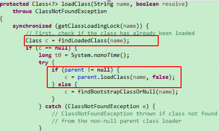

类装载器：ClassLoader

1. 加载
   1. 取得类的二进制流
   2. 转为方法区数据结构
   3. 在Java堆中生成对应的java.lang.Class对象
2. 链接
   1. 验证：保证Class流的格式是正确的。
      1. 文件格式的验证：
         1. 是否以0xCAFEBABE开头
         2. 版本号是否合理
      2. 元数据验证（基本语法和语意）
         1. 是否有父类
         2. 继承了final类？
         3. 非抽象类是否实现了所有的抽象方法
      3. 字节码验证 (很复杂)
         1. 运行检查
         2. 栈数据类型和操作码数据参数吻合
         3. 跳转指令指定到合理的位置
      4. 符号引用验证
         1. 常量池中描述类是否存在
         2. 访问的方法或字段是否存在且有足够的权限
   2. 准备：分配内存，并为类设置初始值 （方法区中）
      1. public static int v=1;
      2. 在准备阶段中，v会被设置为0
      3. 在初始化的<clinit/>中才会被设置为1
      4. 对于static final类型，在准备阶段就会被赋上正确的值
      5. public static final  int v=1;
   3. 解析：将符号引用替换为直接引用(指针，定位到内存地址)
3. 初始化
   1. 执行类构造器<clinit>
      1. static变量 赋值语句
      2. static{}语句
   2. 子类的<clinit>调用前保证父类的<clinit>被调用
   3. <clinit>是线程安全的

什么是类加载器ClassLoader？

- ClassLoader是一个抽象类 
- ClassLoader的实例将读入Java字节码将类装载到JVM中
- ClassLoader可以定制，满足不同的字节码流获取方式
- ClassLoader负责类装载过程中的**加载阶段**

ClassLoader的重要方法：

- public Class<?> loadClass(String name) throws ClassNotFoundException
  - 载入并返回一个Class
- protected final Class<?> defineClass(byte[] b, int off, int len)
  - 定义一个类，不公开调用
- protected Class<?> findClass(String name) throws ClassNotFoundException
  - loadClass回调该方法，自定义ClassLoader的推荐做法
- protected final Class<?> findLoadedClass(String name) 
  - 寻找已经加载的类

JVM中的ClassLoader：

- BootStrap ClassLoader （启动ClassLoader）
- Extension ClassLoader （扩展ClassLoader）
- App ClassLoader （应用ClassLoader/系统ClassLoader）（自己写的类）
- Custom ClassLoader(自定义ClassLoader)
- 每个ClassLoader都有一个Parent作为父亲(处理启动ClassLoader)

1.自低向上：查找类的时候，一般从自己当前的classLoader开始查找，自己写的类在app classloader下，即Classpath下。如果每找到，就向上找（Extension -> Bootstrap）。

2.自顶向下加载：如果在1中没有找到，则Bootstrap去加载，如果没有加载成功，则由下面的classloader去加载。

如上代码：加载类首先在已加载中的类去找，如果没有找到，则让其parent去加载。