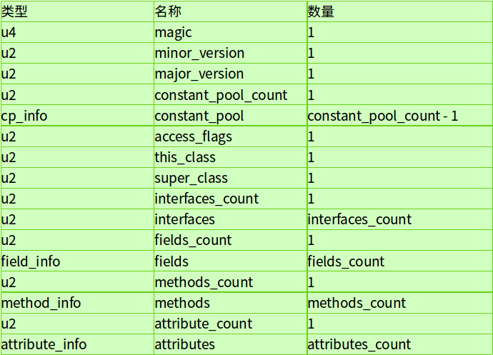

## Class文件结构

语言无关性
文件结构

- 魔数
- 版本
- 常量池
- 访问符
- 类、超类、接口
- 字段
- 方法
- 属性

ASM

- Java字节码操作框架
- 可以用于修改现有类或者动态产生新类
- 用户
  - AspectJ
  - Clojure
  - Ecplise
  - spring
  - cglib
    - hibernate

- 字节码执行性能较差，所以可以对于热点代码编译成机器码再执行，在运行时的编译，叫做JIT Just-In-Time

- JIT的基本思路是，将热点代码，就是执行比较频繁的代码，编译成机器码。
- 参数：
  - -Xint：解释执行
  - -Xcomp：全部编译执行
  - -Xmixed：默认，混合