## GC

[TOC]

gc对象：堆空间和永久区

堆空间：

- 新生代 Young Gen:包括Eden和Survivor区(from,to)
- 老年代 Old Gen
- 非堆：包含永久代，Hotspot在永久代中实现方法区。

线程私有：

- 一个字长的PC寄存器：保存字节码指令地址，如果是本地方法，则未定义。
- JVM栈：与线程同时创建，用于存储栈帧(局部变量表、操作数栈、返回地址)。因为栈只需要出栈和入栈，所以允许在堆中分配。

方法区：共享。存储每个类的元数据信息。虚拟机启动时创建。Hotspot在堆中的永久代实现，逻辑上独立。JVM没有规范GC在这里的作用。Hotspot则会收集此区域，主要关注对常量池的收集和对类的卸载。

- 常量池
- 域
- 方法数据
- 方法和构造函数的字节码
- 类、实例、接口初始化时用到的特殊方法

整体运行：方法区有类的字段和字节码，引用堆中的对象，围绕栈操作JVM指令。

## 一、理论算法

### 1.引用计数

  对象的引用计数器为0时，就不再被使用，可以gc.

**缺点**：

1. 引用和去引用伴随这加法和减法，影响性能
2. 很难处理循环引用

### 2.标记-清楚法

分为两个阶段：

1. 标记阶段：通过根节点，标记所有从根节点的可达对象
2. 清除阶段：清除所有未被标记的对象。

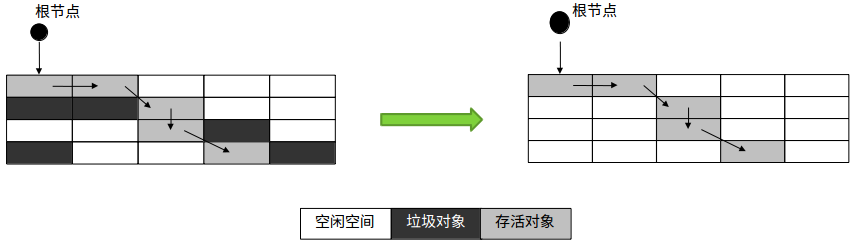

缺点：产出大量内存碎片。

### 3.标记-压缩

适用场景：适合用于存活对象较多的场合，如老年代。

分为两个阶段：

1. 标记阶段：通过根节点，标记所有可达对象
2. 清楚阶段：将所有存活对象压缩到内存的一端，之后，清理边界外的所有空间

优点：产生大量标记清楚。

### 4.复制算法

使用场景：不适用于存活对象比较多的场合，如老年代

与标记-清除相比，相对高效。

思路：将原有的内存空间分为两块，每次只使用其中一块，在垃圾回收时，将正在使用的内存中的存活对象复制到未使用的内存块中，之后，清除正在使用的内存块中的所有对象，交换两个内存的角色，完成垃圾回收

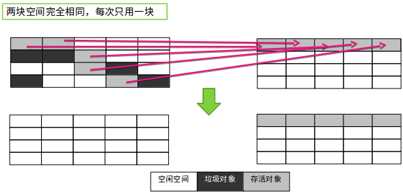

**缺点**：空间浪费。

整合标记-清理思想：

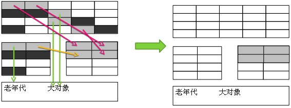

最上面的空间：eden space,用于产生新的对象

复制算法空间：from to,用于复制算法进行gc(from == to)

最下面的空间：存放老年代和大对象。

新生代的总可用空间：eden + from

### 分代思想

依据对象的存活周期进行分类，短命对象归为新生代，长命对象归为老年代。

- 少量对象存活(新生代)：复制算法
- 大量对象存活(老年代)：标记-清除/压缩

### 对象的可触及性

- 可触及的：从根界定啊可以触及到这个对象

- 可复活的：一旦所有引用被释放，就是可复活对象。可在finalize()中可能复活。

- 不可触及的：在finalize()后，可能会进入不可触及状态(不可复活)，可以进行gc

  复活例子：

  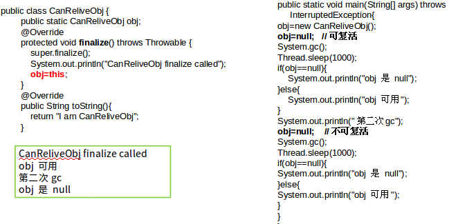

注意：finalize()方法中复活了obj,但该方法只会被调用一次。故第一次gc的时候，obj复活，第二次gc的时候，obj为null。

避免使用finalize()方法，该方法优先级低，只有在gc的时候被调用，但何时gc不确定，所有调用该方法页不确定，操作不慎可导致错误。可以使用try-catch-finally来释放资源。

- 根：
  - 栈中引用的对象，局部变量
  - 方法区中静态或者常量引用的对象（全局对象）
  - JNI方法栈中的引用对象

### stop-the-world

- 该现象是java中一种全局暂停的现象。
- 全局停顿，所有java代码停止，native代码可以执行，但不能和JVM交互
- 多半由GC引起。其它原因：Dump线程、死锁检查，堆dump.
- GC导致全局停顿的原因：只有全局停顿，才能将垃圾对象回收干净。(新生代gc时间比较短)
- 危害：长时间服务停止，没有响应。遇到HA系统，可能引起主备切换，严重危害生产环境(主备机同时启用，导致数据不一致等)。

## 二、GC参数

新生代：eden s0 s1(处理栈上分配，大对象可能分配到tenured之外，新对象一般在eden)

老年代：tenured

在eden分配新对象， 对象在gc之后能后幸存，则放如幸存区域(s0,s1)，在多次gc之后，对象到了一定年龄，则放入老年代tenured。

### 1.串行回收器

- 优点：最古老，最稳定，效率高
- 缺点：可能会产生较长时间的停顿，只使用一个线程去回收。
- -XX:+UseSerialGC：新生代、老年代使用串行回收
  - 新生代：复制算法
  - 老年代：标记-压缩

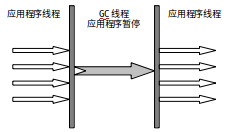

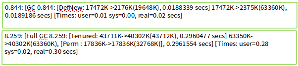

### 2.并行收集器-Par

- -XX:+UseParNewGC
  - 新生代并行（复制算法）
  - 老年代串行
- serial收集器新生代的并行版本
- 多线程，需要多核支持
- -XX:ParallelGCThreads:限制线程数量。

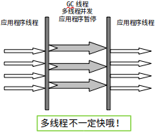

### 3.并行收集器-Parallel

- 类似ParNew,但更加关注吞吐量

- 新生代：复制算法；老年代：标记-压缩

- -XX:+UseParallelGC

  - 使用Parallel收集器+老年代串行

- -XX:+UseParallelOldGC

  - 使用Parallel收集器+老年代并行

    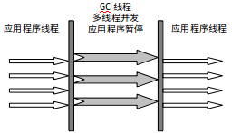

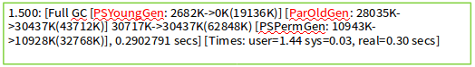

其余参数：

- -XX:MaxGCPauseMills
  - 最大停顿时间，单位毫秒
  - GC尽力保证回收时间不超过设定值
- -XX:GCTimeRatio
  - 0-100的取值范围
  - 垃圾收集时间占总时间的比
  - 默认99，即最大允许1%时间做GC
- 这两个参数是矛盾的。因为停顿时间和吞吐量不可能同时调优

### 4.并发标记清除-CMS (concurrent mark sweep)

- 并发：gc与应用程序线程一起执行。（停顿减少，导致吞吐量降低(cpu资源)）
- 老年代收集器（新生代使用ParNew）
- -XX:+UseConcMarkSweepGC ：作用于老年代
- 过程：（主要的标记过程与应用程序一起）
  - 初始标记（独占cpu，STW）
    - 根可以直接关联到的对象
    - 速度快（因为根对象数量有限）
  - **并发标记**（和用户线程一起）
    - 主要标记过程，在初始标记的基础上继续向下追溯标记。标记全部对象。
  - 并发预清理
    - 由于在上一个阶段，可能会出现晋升到老年代的对象。所以需要重新扫描。
  - 重新标记（独占cpu，STW）
    - 由于并发标记时，用户线程依然运行，因此在正式清理前，再做修正
  - 并发清除（和用户线程一起）
    - 基于标记结果，直接清理对象
    - **因为要与应用程序一起执行，所以不使用压缩，而直接使用清楚。**

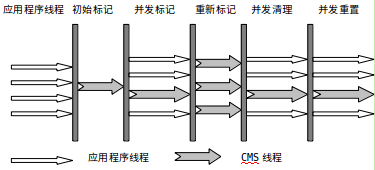 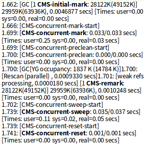

- 特点：
  - 尽可能降低停顿
  - 会影响系统整体吞吐量和性能
    - 比如，在用户线程运行过程中，分一半CPU去做GC，系统性能在GC阶段，反应速度就下降一半
  - 清理不彻底
    - 因为在清理阶段，用户线程还在运行，会产生新的垃圾，无法清理
  - 因为和用户线程一起运行，不能在空间快满时再清理（因为应用程序可能申请空间，但空间又不够）
    - -XX:CMSInitiatingOccupancyFraction设置触发GC的阈值
    - 如果不幸内存预留空间不够，就会引起concurrent mode failure
    - 失败时，使用串行收集器作为后备。
  - -XX:+ UseCMSCompactAtFullCollection Full GC后，进行一次整理
    - 整理过程是独占的，会引起停顿时间变长
  - -XX:+CMSFullGCsBeforeCompaction 
    - 设置进行几次Full GC后，进行一次碎片整理
  - -XX:ParallelCMSThreads：设定CMS的线程数量。（建议为CPU数量）

CMS适用场景：

- 老年代对象多
- CPU核心数大于等于2

GC参数整理：

-XX:+UseSerialGC：在新生代和老年代使用串行收集器
-XX:SurvivorRatio：设置eden区大小和survivior区大小的比例
-XX:NewRatio:新生代和老年代的比
-XX:+UseParNewGC：在新生代使用并行收集器
-XX:+UseParallelGC ：新生代使用并行回收收集器
-XX:+UseParallelOldGC：老年代使用并行回收收集器
-XX:ParallelGCThreads：设置用于垃圾回收的线程数
-XX:+UseConcMarkSweepGC：新生代使用并行收集器，老年代使用CMS+串行收集器
-XX:ParallelCMSThreads：设定CMS的线程数量
-XX:CMSInitiatingOccupancyFraction：设置CMS收集器在老年代空间被使用多少后触发

-XX:+UseCMSCompactAtFullCollection：设置CMS收集器在完成垃圾收集后是否要进行一次内存碎片的整理
-XX:CMSFullGCsBeforeCompaction：设定进行多少次CMS垃圾回收后，进行一次内存压缩
-XX:+CMSClassUnloadingEnabled：允许对类元数据进行回收
-XX:CMSInitiatingPermOccupancyFraction：当永久区占用率达到这一百分比时，启动CMS回收
-XX:UseCMSInitiatingOccupancyOnly：表示只在到达阀值的时候，才进行CMS回收

使用Jmeter工具测试Tomcat服务器的性能/吞吐量。（与JDK版本、GC算法相关）。

CMS在一定程度上可以提高系统吞吐量？

GC参数属于微调。