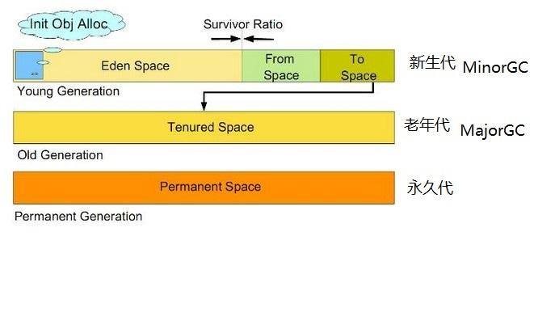
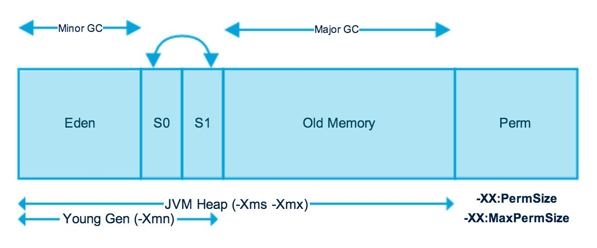
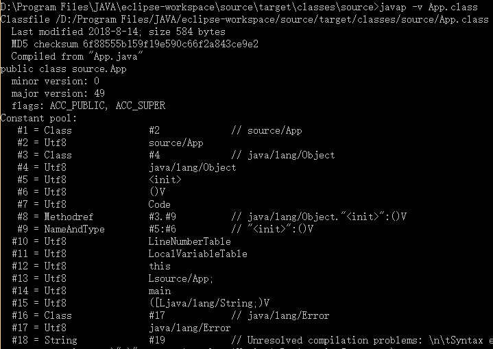
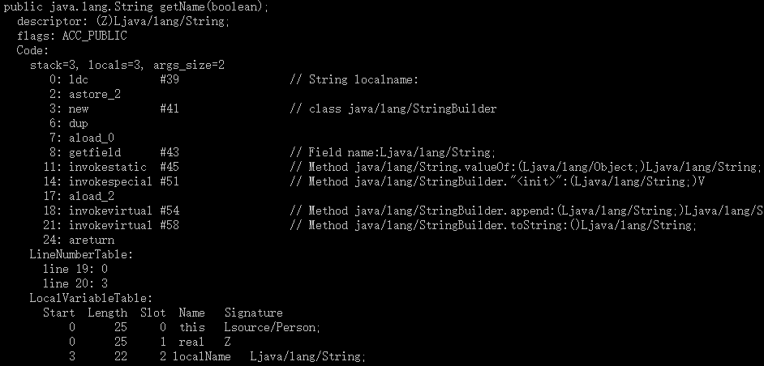

## JVM内存结构

[TOC]

gc对象：堆空间和永久区

堆空间：

- 新生代 Young Gen:包括Eden和Survivor区(from,to)
- 老年代 Old Gen
- 非堆：包含永久代，Hotspot在永久代中实现方法区。





线程私有：

- 一个字长的PC寄存器：保存字节码指令地址，如果是本地方法，则未定义。
- JVM栈：与线程同时创建，用于存储栈帧(局部变量表、操作数栈、返回地址)。因为栈只需要出栈和入栈，所以允许在堆中分配。

方法区：共享。存储每个类的元数据信息。虚拟机启动时创建。Hotspot在堆中的永久代实现，逻辑上独立。JVM没有规范GC在这里的作用。Hotspot则会收集此区域，主要关注对常量池的收集和对类的卸载。

- 常量池
- 域
- 方法数据
- 方法和构造函数的字节码
- 类、实例、接口初始化时用到的特殊方法

整体运行：方法区有类的字段和字节码，引用堆中的对象，围绕栈操作JVM指令。

方法区对类/接口的描述：

1. 类型描述：
   1. 【3类型的全限定名
   2. 类型的直接超类的全限定名。接口或java.lang.Object类除外，因为它们没有超类
   3. 是一个类类型还是接口类型
   4. 类型修饰：public、abstract、final等
   5. 一个已排序的接口列表。
2. 类型的主题信息 ：
   1. **常量池**
   2. **字段信息**：字段名称、字段类型、字段描述：public、static、final、transient、volatile等
   3. **方法信息**：方法名、返回类型、参数个数和类型、方法描述：public、synchronized、native、abstract、final、static等。
      1. 除了抽象方法和本地方法之外的方法，还包括：**方法的字节码**、**操作数栈大小和本地变量**、**异常表**。
   4. **类变量**：除常量外的所有static类型变量
   5. **指向该类的类加载器的引用**
   6. **指向该类的引用**

 2.1 常量池

  虚拟机在创建一个类或者接口时，将按照类或者接口在class文件中的定义创建相应的常量池。class文件中的constant_pool表是常量池的静态描述。在解析和链接后，将在内存为该类生成一套运行时常量，即constant_poo的动态描述，在方法区中分配。

  作用：在类加载和链接阶段，利用常量池实现对符号引用的定位。解决了JVM定位字段和方法的问题，仅通过少量字节就能够定位到目标。通过javap -v 查看class文件中的常量池。如下图所示：



\#2(索引) = 类型  值

例如：\#8 = Methodref \#3.\#9 表示\#代表的是一个Methodref类型(java方法的符号引用),，值为 \#3.\#9，而\#3是一个值为\#4的类，\#4为Utf8编码的字符串，值为java/lang/Object。\#9代表的是\<init\>:()V。合在一起，为：java/lang/Object.\<init\>:()V

  常量池在HotSpot内部由constantPoolOopDesc类型来表示。其数据结构包括:

1. 常量池高速缓存 constantPoolCacheOop
2. 该常量池所在的类 klassOop
3. 常量池项的长度 int
4. 描述所有常量池项类型的数组，即上图的Utf8、Methodred等
5. 描述所有常量池项的数组

  常量池Cacae:为类和接口的字段与方法提供快速访问。每个缓存项表示类中引用的一个字段或方法。

```java
public class Person {
	private int privateAge;
	public int publicAge;
	public static int staticAge;
	private String name;
	private final String finalName = "finalname";
	public static String staticName;
	public static final String staticFinalName = "staticfinalname";
	public void Person() {}
	public void setAge(int age) {
		this.privateAge = age;
	}
	public String getName(boolean real) {
		return this.name;
	}
}
```

方法的表示：methodOop

java方法在hotspot中由一个内部对象表示，类型为methodOop。

上述代码生成的class文件中的方法：



链接解析器将对方法进行解析和查找，以解析引用符号。

