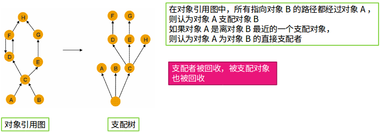
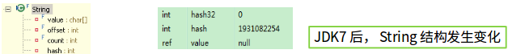

## 堆分析

堆溢出代码：

```java
public static void main(String args[]){
    ArrayList<byte[]> list=new ArrayList<byte[]>();
    for(int i=0;i<1024;i++){
        list.add(new byte[1024*1024]);
    }
}
```

永久区溢出代码：(生成大量的类)

```java
public static void main(String[] args) {
    for(int i=0;i<100000;i++){
        CglibBean bean = new CglibBean("geym.jvm.ch3.perm.bean"+i,new HashMap());
    }
}
```

栈溢出代码：

- 大量的线程
- 大量的递归调用

物理内存 = 堆内存 +　线程栈

直接内存溢出：无法从操作系统获得足够的空间。

操作系统可分配 = 堆　＋ 线程栈 + 直接内存

减少堆，有意触发GC可适当解决。


内存分析：MAT



即如果C回收了，则DEHFG都会被回收。


浅堆：一个对象结构所占用的内存大小

- 3个int类型以及一个引用类型合计占用内存3*4+4=16个字节。再加上对象头的8个字节，因此String对象占用的空间，即浅堆的大小是16+8=24字节
- 对象大小按照8字节对齐
- 浅堆大小和对象的内容无关，只和对象的结构有关

深堆：一个对象被GC回收后，可以真实释放的内存大小

- 只能通过对象访问到的（直接或者间接）所有对象的浅堆之和 （支配树）