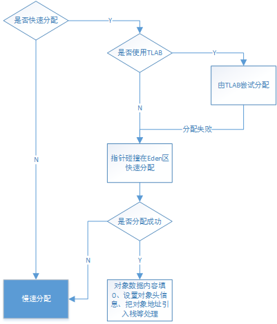
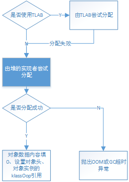
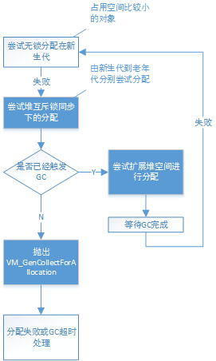

## 对象分配过程

[TOC]

参考：http://www.cnblogs.com/iceAeterNa/p/4877741.html

Java对象的分配，根据其过程，将其分为快速分配和慢速分配两种形式，其中快速分配使用无锁的指针碰撞技术在新生代的Eden区上进行分配，而慢速分配根据堆的实现方式、GC的实现方式、代的实现方式不同而具有不同的分配调用层次。 
下面就以bytecodeInterpreter解释器对于new指令的解释出发，分析实例对象的内存分配过程：

### 　一、快速分配

　 1.实例的创建首先需要知道该类型是否被加载和正确解析，根据字节码所指定的CONSTANT_Class_info常量池索引，获取对象的类型信息并调用is_unresovled_klass()验证该类是否被解析过，在创建类的实例之前，必须确保该类型已经被正确加载和解析。

```
 CASE(_new): {
        u2 index = Bytes::get_Java_u2(pc+1);
        constantPoolOop constants = istate->method()->constants();
        if (!constants->tag_at(index).is_unresolved_klass()) {
```

　　2.接下来获取该类型在虚拟机中的表示instanceKlass(具体可以参考前文[实例探索Java对象的组织结构](http://www.cnblogs.com/iceAeterNa/p/4877470.html))　

[](javascript:void(0);)

```
oop entry = constants->slot_at(index).get_oop();
          assert(entry->is_klass(), "Should be resolved klass");
          klassOop k_entry = (klassOop) entry;
          assert(k_entry->klass_part()->oop_is_instance(), "Should be instanceKlass");
          instanceKlass* ik = (instanceKlass*) k_entry->klass_part();
```

[](javascript:void(0);)

　　3.当类型已经被初始化并且可以被快速分配时，那么将根据UseTLAB来决定是否使用TLAB技术(Thread-Local Allocation Buffers，线程局部分配缓存技术)来将分配工作交由线程自行完成。TLAB是每个线程在Java堆中预先分配了一小块内存，当有对象创建请求内存分配时，就会在该块内存上进行分配，而不需要在Eden区通过同步控制进行内存分配。

[](javascript:void(0);)

```
if ( ik->is_initialized() && ik->can_be_fastpath_allocated() ) {
            size_t obj_size = ik->size_helper();
            oop result = NULL;
            // If the TLAB isn't pre-zeroed then we'll have to do it
            bool need_zero = !ZeroTLAB;
            if (UseTLAB) {
              result = (oop) THREAD->tlab().allocate(obj_size);
            }
            if (result == NULL) {
              need_zero = true;
```

[](javascript:void(0);)

　　4.如果不使用TLAB或在TLAB上分配失败，则会尝试在堆的Eden区上进行分配。Universe::heap()返回虚拟机内存体系所使用的CollectedHeap，其top_addr()返回的是Eden区空闲块的起始地址变量_top的地址，end_addr()是Eden区空闲块的结束地址变量_end的地址。故这里compare_to是Eden区空闲块的起始地址，new_top为使用该块空闲块进行分配后新的空闲块起始地址。这里使用CAS操作进行空闲块的同步操作，即观察_top的预期值，若与compare_to相同，即没有其他线程操作该变量，则将new_top赋给_top真正成为新的空闲块起始地址值，这种分配技术叫做bump-the-pointer(指针碰撞技术)。

　　

[](javascript:void(0);)

```
 retry:
              HeapWord* compare_to = *Universe::heap()->top_addr();
              HeapWord* new_top = compare_to + obj_size;
              if (new_top <= *Universe::heap()->end_addr()) {
                if (Atomic::cmpxchg_ptr(new_top, Universe::heap()->top_addr(), compare_to) != compare_to) {
                  goto retry;
                }
                result = (oop) compare_to;
              }
            }
```

[](javascript:void(0);)

 

　　5.根据是否需要填0选项，对分配空间的对象数据区进行填0

[](javascript:void(0);)

```
if (result != NULL) {
              // Initialize object (if nonzero size and need) and then the header
              if (need_zero ) {
                HeapWord* to_zero = (HeapWord*) result + sizeof(oopDesc) / oopSize;
                obj_size -= sizeof(oopDesc) / oopSize;
                if (obj_size > 0 ) {
                  memset(to_zero, 0, obj_size * HeapWordSize);
                }
              }
```

[](javascript:void(0);)

　　6.根据是否使用偏向锁，设置对象头信息，然后设置对象的klassOop引用(这样对象本身就获取了获取类型数据的途径)

[](javascript:void(0);)

```
if (UseBiasedLocking) {
                result->set_mark(ik->prototype_header());
              } else {
                result->set_mark(markOopDesc::prototype());
              }
              result->set_klass_gap(0);
              result->set_klass(k_entry);
```

[](javascript:void(0);)

　　7.把对象地址引入栈，并继续执行下一个字节码

```
SET_STACK_OBJECT(result, 0);
              UPDATE_PC_AND_TOS_AND_CONTINUE(3, 1);
```

　　8.若该类型没有被解析，就会调用InterpreterRuntime的_new函数完成慢速分配

[](javascript:void(0);)

```
// Slow case allocation
        CALL_VM(InterpreterRuntime::_new(THREAD, METHOD->constants(), index),
                handle_exception);
        SET_STACK_OBJECT(THREAD->vm_result(), 0);
        THREAD->set_vm_result(NULL);
        UPDATE_PC_AND_TOS_AND_CONTINUE(3, 1);
```

[](javascript:void(0);)

以上就是快速分配的过程，其流程图如下，关键在于快速分配在Eden区所使用的无锁指针碰撞技术 

　　　　

### 　二、慢速分配

　　接下来看看慢速分配是如何进行的： 
　　1.InterpreterRuntime的_new函数定义在/hotspot/src/share/vm/interpreter/interpreterRuntime.cpp中：

[](javascript:void(0);)

```
IRT_ENTRY(void, InterpreterRuntime::_new(JavaThread* thread, constantPoolOopDesc* pool, int index))
  klassOop k_oop = pool->klass_at(index, CHECK);
  instanceKlassHandle klass (THREAD, k_oop);

  // Make sure we are not instantiating an abstract klass
  klass->check_valid_for_instantiation(true, CHECK);

  // Make sure klass is initialized
  klass->initialize(CHECK);

  oop obj = klass->allocate_instance(CHECK);
  thread->set_vm_result(obj);
IRT_END
```

[](javascript:void(0);)

　　该函数在进行了对象类的检查(确保不是抽象类)和对该类型进行初始化后，调用instanceKlassHandle的allocate_instance进行内存分配。 
　　其中instanceKlassHandle类由DEF_KLASS_HANDLE宏进行声明，注意该类重载了成员访问运算符”->”，这里的一系列成员方法的访问实际上是instanceKlass对象的访问。

```
 type*    operator -> () const       { return (type*)obj()->klass_part(); }
```

　　2.所以实际上是调用了instanceKlass的allocate_instance()成员函数： 
　　allocate_instance()定义在/hotspot/src/share/vm/oops/instanceKlass.cpp 
　　(1).检查是否设置了Finalizer函数，获取对象所需空间的大小

```
instanceOop instanceKlass::allocate_instance(TRAPS) {
     bool has_finalizer_flag = has_finalizer(); // Query before possible GC
     int size = size_helper();  // Query before forming handle.
```

　　(2).调用CollectedHeap的obj_allocate()创建一个instanceOop(堆上的对象实例)，并根据情况注册Finalizer函数

[](javascript:void(0);)

```
　　　 KlassHandle h_k(THREAD, as_klassOop());

      instanceOop i;

      i = (instanceOop)CollectedHeap::obj_allocate(h_k, size, CHECK_NULL);
      if (has_finalizer_flag && !RegisterFinalizersAtInit) {
        i = register_finalizer(i, CHECK_NULL);
      }
      return i;
```

[](javascript:void(0);)

　　3.CollectedHeap::ojb_allocate()定义在/hotspot/src/share/vm/gc_interface/CollectedHeap.hpp中，它将转而调用内联函数obj_allocate()

　　4.obj_allocate()定义在/hotspot/src/share/vm/gc_interface/CollectedHeap.inline.h中，若当正处于gc状态时，不允许进行内存分配申请，否则将调用common_mem_allocate_init()进行内存分配并返回获得内存的起始地址，随后将调用post_allocation_setup_obj()进行一些初始化工作　

[](javascript:void(0);)

```
oop CollectedHeap::obj_allocate(KlassHandle klass, int size, TRAPS) {
 //...assert
  HeapWord* obj = common_mem_allocate_init(size, false, CHECK_NULL);
  post_allocation_setup_obj(klass, obj, size);
  NOT_PRODUCT(Universe::heap()->check_for_bad_heap_word_value(obj, size));
  return (oop)obj;
}
```

[](javascript:void(0);)

　　5.common_mem_allocate_init()分为两部分，将分别调用common_mem_allocate_noinit()进行内存空间的分配和调用init_obj()进行对象空间的初始化

[](javascript:void(0);)

```
HeapWord* CollectedHeap::common_mem_allocate_init(size_t size, bool is_noref, TRAPS) {
  HeapWord* obj = common_mem_allocate_noinit(size, is_noref, CHECK_NULL);
  init_obj(obj, size);
  return obj;
}
```

[](javascript:void(0);)

　　6.common_mem_allocate_noinit()如下： 
　　(1).若使用了本地线程分配缓冲TLAB，则会调用allocate_from_tlab()尝试从TLAB中分配内存

[](javascript:void(0);)

```
  HeapWord* result = NULL;
  if (UseTLAB) {
    result = CollectedHeap::allocate_from_tlab(THREAD, size);
    if (result != NULL) {
      assert(!HAS_PENDING_EXCEPTION,
             "Unexpected exception, will result in uninitialized storage");
      return result;
    }
  }
```

[](javascript:void(0);)

　　(2).否则会调用堆的mem_allocate()尝试分配

　

[](javascript:void(0);)

```
  bool gc_overhead_limit_was_exceeded = false;
  result = Universe::heap()->mem_allocate(size,
                                          is_noref,
                                          false,
                                          &gc_overhead_limit_was_exceeded);
```

[](javascript:void(0);)

　　(3).统计分配的字节数

[](javascript:void(0);)

```
 if (result != NULL) {
   //...
    THREAD->incr_allocated_bytes(size * HeapWordSize);
    return result;
  }
```

[](javascript:void(0);)

　　(4).否则说明申请失败，若在申请过程中gc没有超时，则抛出OOM异常

[](javascript:void(0);)

```
if (!gc_overhead_limit_was_exceeded) {
    // -XX:+HeapDumpOnOutOfMemoryError and -XX:OnOutOfMemoryError support
    report_java_out_of_memory("Java heap space");

    if (JvmtiExport::should_post_resource_exhausted()) {
      JvmtiExport::post_resource_exhausted(
        JVMTI_RESOURCE_EXHAUSTED_OOM_ERROR | JVMTI_RESOURCE_EXHAUSTED_JAVA_HEAP,
        "Java heap space");
    }

    THROW_OOP_0(Universe::out_of_memory_error_java_heap());
```

[](javascript:void(0);)

　　7.对象内存分配后的初始化过程包括两部分，一个是init_obj()完成对对象内存空间的对齐和填充，一个是post_allocation_setup_obj()对堆上的oop对象进行初始化。 

　　(1).init_obj()：

[](javascript:void(0);)

```
void CollectedHeap::init_obj(HeapWord* obj, size_t size) {
  assert(obj != NULL, "cannot initialize NULL object");
  const size_t hs = oopDesc::header_size();
  assert(size >= hs, "unexpected object size");
  ((oop)obj)->set_klass_gap(0);
  Copy::fill_to_aligned_words(obj + hs, size - hs);
}
```

[](javascript:void(0);)

　　hs就是对象头的大小，fill_to_aligned_words将对象空间除去对象头的部分做填0处理，该函数定义在/hotspot/src/share/vm/utilities/copy.h中，并转而调用pd_fill_to_aligned_words()。 
　　pd_fill_to_aligned_words根据不同平台实现，以x86平台为例，该函数定义在/hotspot/src/cpu/x86/vm/copy_x86.h中：

[](javascript:void(0);)

```
static void pd_fill_to_words(HeapWord* tohw, size_t count, juint value) {
#ifdef AMD64
  julong* to = (julong*) tohw;
  julong  v  = ((julong) value << 32) | value;
  while (count-- > 0) {
    *to++ = v;
  }
#else
  juint* to = (juint*)tohw;
  count *= HeapWordSize / BytesPerInt;
  while (count-- > 0) {
    *to++ = value;
  }
#endif // AMD64
}
```

[](javascript:void(0);)

　　该函数的作用就是先将地址类型转换，然后把堆的字数转化为字节数，再对该段内存进行填值(value = 0)处理

　　(2).post_allocation_setup_obj()调用了post_allocation_setup_common()进行初始化工作，然后调用post_allocation_notify()通知JVMTI和dtrace

[](javascript:void(0);)

```
void CollectedHeap::post_allocation_setup_obj(KlassHandle klass,
                                              HeapWord* obj,
                                              size_t size) {
  post_allocation_setup_common(klass, obj, size);
  assert(Universe::is_bootstrapping() ||
         !((oop)obj)->blueprint()->oop_is_array(), "must not be an array");
  // notify jvmti and dtrace
  post_allocation_notify(klass, (oop)obj);
}
```

[](javascript:void(0);)

　　post_allocation_setup_common()如下：

[](javascript:void(0);)

```
void CollectedHeap::post_allocation_setup_common(KlassHandle klass,
                                                 HeapWord* obj,
                                                 size_t size) {
  post_allocation_setup_no_klass_install(klass, obj, size);
  post_allocation_install_obj_klass(klass, oop(obj), (int) size);
}
```

[](javascript:void(0);)

　　post_allocation_setup_no_klass_install()根据是否使用偏向锁，设置对象头信息等，即初始化oop的_mark字段。post_allocation_install_obj_klass()设置对象实例的klassOop引用，即初始化oop的_metadata(_klass/_compressed_klass)字段 。

　　以上内容就是堆实现无关的慢速分配过程，其流程图如下： 

　　　　　　　　

### 　三、堆的分配实现

　　1.mem_allocate将由堆的实现类型定义，以GenCollectedHeap为例：

[](javascript:void(0);)

```
HeapWord* GenCollectedHeap::mem_allocate(size_t size,
                                         bool is_large_noref,
                                         bool is_tlab,
                                         bool* gc_overhead_limit_was_exceeded) {
  return collector_policy()->mem_allocate_work(size,
                                               is_tlab,
                                               gc_overhead_limit_was_exceeded);
}
```

[](javascript:void(0);)

　　2.由之前分析，GenCollectedHeap根据用户配置有着不同的GC策略(默认的和配置UseSerialGC的MarkSweepPolicy、配置UseComcMarkSweepGC和UseAdaptiveSizePolicy的ASConcurrentMarkSweepPolicy、只配置UseComcMarkSweepGC的ConcurrentMarkSweepPolicy)，但这里，对象内存空间的基本结构和分配的思想是一致的，所以统一由GenCollectorPolicy实现进行分代层级的对象分配操作，但具体的工作将交由各代的实现者来完成。

　　GenCollectedPolicy的mem_allocate_work()函数如下： 
　　(1).gch指向GenCollectedHeap堆，内存分配请求将循环不断地进行尝试，直到分配成功或GC后分配失败

[](javascript:void(0);)

```
HeapWord* GenCollectorPolicy::mem_allocate_work(size_t size,
                                        bool is_tlab,
                                        bool* gc_overhead_limit_was_exceeded) {
  GenCollectedHeap *gch = GenCollectedHeap::heap();
  //...
  // Loop until the allocation is satisified,
  // or unsatisfied after GC.
  for (int try_count = 1; /* return or throw */; try_count += 1) {  
```

[](javascript:void(0);)

　　对于占用空间比较大的对象，如果经常放在新生代，那么剩余的内存空间就会非常紧张，将可能会导致新生代内存垃圾回收的频繁触发。故若对象的大小超过一定值，那么就不应该分配在新生代。

[](javascript:void(0);)

```
　　 //...紧接上面部分
 　　HandleMark hm; // discard any handles allocated in each iteration

    // First allocation attempt is lock-free.
    Generation *gen0 = gch->get_gen(0);

    if (gen0->should_allocate(size, is_tlab)) {
      result = gen0->par_allocate(size, is_tlab);
      if (result != NULL) {
        assert(gch->is_in_reserved(result), "result not in heap");
        return result;
      }
    }
```

[](javascript:void(0);)

　　若对象应该在新生代上分配，就会调用新生代的par_allocate()进行分配，注意在新生代普遍是采用复制收集器的，而内存的分配对应采用了无锁式的指针碰撞技术。

　　(2).在新生代上尝试无锁式的分配失败，那么就获取堆的互斥锁，并尝试在各代空间内进行内存分配

[](javascript:void(0);)

```
unsigned int gc_count_before;  // read inside the Heap_lock locked region
    {
      MutexLocker ml(Heap_lock);
     //...
      bool first_only = ! should_try_older_generation_allocation(size);

      result = gch->attempt_allocation(size, is_tlab, first_only);
      if (result != NULL) {
        assert(gch->is_in_reserved(result), "result not in heap");
        return result;
      }
```

[](javascript:void(0);)

　　其中should_try_older_generation_allocation()如下：

[](javascript:void(0);)

```
bool GenCollectorPolicy::should_try_older_generation_allocation(
        size_t word_size) const {
  GenCollectedHeap* gch = GenCollectedHeap::heap();
  size_t gen0_capacity = gch->get_gen(0)->capacity_before_gc();
  return    (word_size > heap_word_size(gen0_capacity))
         || GC_locker::is_active_and_needs_gc()
         || gch->incremental_collection_failed();
}
```

[](javascript:void(0);)

　　当进行gc前，新生代的空闲空间大小不足以分配对象，或者有线程触发了gc，或前一次的FullGC是由MinorGC触发的情况，都应该不再尝试再更高的内存代上进行分配，以保证新分配的对象尽可能在新生代空间上。 

　　attempt_allocation()实现如下：

[](javascript:void(0);)

```
HeapWord* GenCollectedHeap::attempt_allocation(size_t size,
                                               bool is_tlab,
                                               bool first_only) {
  HeapWord* res;
  for (int i = 0; i < _n_gens; i++) {
    if (_gens[i]->should_allocate(size, is_tlab)) {
      res = _gens[i]->allocate(size, is_tlab);
      if (res != NULL) return res;
      else if (first_only) break;
    }
  }
  // Otherwise...
  return NULL;
}
```

[](javascript:void(0);)

　　即由低内存代向高内存代尝试分配内存 

　　(3).从各个代空间都找不到可用的空闲内存(或不应该在更高的内存代上分配时)，如果已经有线程触发了gc，那么当各代空间还有virtual space可扩展空间可用时，将会尝试扩展代空间并再次尝试进行内存分配，有点在gc前想尽一切办法获得内存的意思。

[](javascript:void(0);)

```
if (GC_locker::is_active_and_needs_gc()) {
        if (is_tlab) {
          return NULL;  // Caller will retry allocating individual object
        }
        if (!gch->is_maximal_no_gc()) {
          // Try and expand heap to satisfy request
          result = expand_heap_and_allocate(size, is_tlab);
          // result could be null if we are out of space
          if (result != NULL) {
            return result;
          }
        }
```

[](javascript:void(0);)

　　(4).否则各代已经没有可用的可扩展空间时，当当前线程没有位于jni的临界区时，将释放堆的互斥锁，以使得请求gc的线程可以进行gc操作，等待所有本地线程退出临界区和gc完成后，将继续循环尝试进行对象的内存分配

[](javascript:void(0);)

```
JavaThread* jthr = JavaThread::current();
        if (!jthr->in_critical()) {
          MutexUnlocker mul(Heap_lock);
          // Wait for JNI critical section to be exited
          GC_locker::stall_until_clear();
          continue;
        }
```

[](javascript:void(0);)

　　(5).若各代无法分配对象的内存，并且没有gc被触发，那么当前请求内存分配的线程将发起一次gc，这里将提交给VM一个GenCollectForAllocation操作以触发gc，当操作执行成功并返回时，若gc锁已被获得，那么说明已经由其他线程触发了gc，将继续循环以等待gc完成

[](javascript:void(0);)

```
VM_GenCollectForAllocation op(size,
                                  is_tlab,
                                  gc_count_before);
    VMThread::execute(&op);
    if (op.prologue_succeeded()) {
      result = op.result();
      if (op.gc_locked()) {
         assert(result == NULL, "must be NULL if gc_locked() is true");
         continue;  // retry and/or stall as necessary
      }
```

[](javascript:void(0);)

　　否则将等待gc完成，若gc超时则会将gc_overhead_limit_was_exceeded设置为true返回给调用者，并重置超时状态，并对分配的对象进行填充处理

[](javascript:void(0);)

```
　　　 const bool limit_exceeded = size_policy()->gc_overhead_limit_exceeded();
      const bool softrefs_clear = all_soft_refs_clear();
      assert(!limit_exceeded || softrefs_clear, "Should have been cleared");
      if (limit_exceeded && softrefs_clear) {
        *gc_overhead_limit_was_exceeded = true;
        size_policy()->set_gc_overhead_limit_exceeded(false);
        if (op.result() != NULL) {
          CollectedHeap::fill_with_object(op.result(), size);
        }
        return NULL;
      }
```

[](javascript:void(0);)

　　以上内容就是堆的实现相关、但代/GC实现无关的分配过程，其流程图归纳如下： 

　　　　　　　　