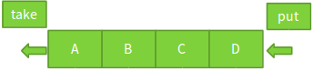
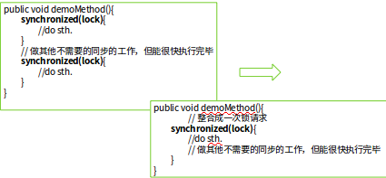
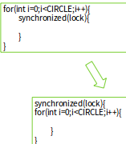
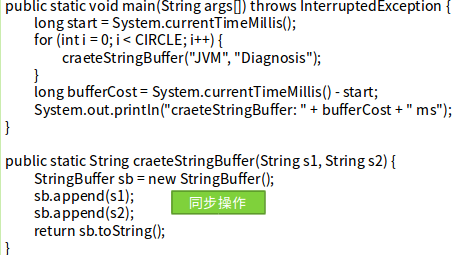
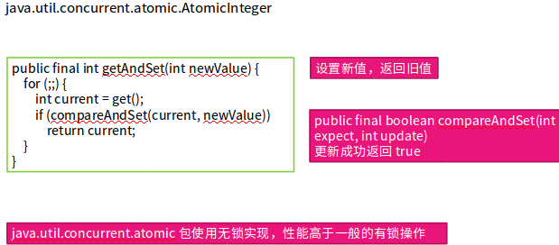
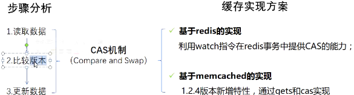
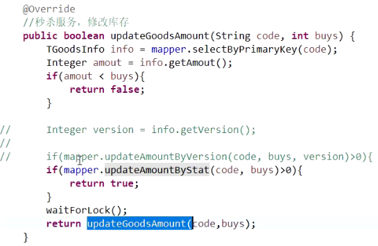
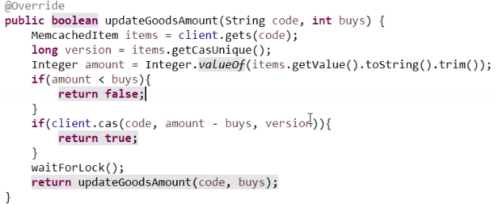

## 锁

目的：多个线程访问统一资源的串行化。


对象头 Mark

Mark Word，对象头的标记，32位
描述对象的hash、锁信息，垃圾回收标记，年龄

- 指向锁记录的指针
- 指向monitor的指针
- GC标记
- 偏向锁线程ID

**偏向锁**：

- 大部分情况是没有竞争的，所以可以通过偏向来提高性能
- 所谓的偏向，就是偏心，即锁会偏向于当前已经占有锁的线程
- 将对象头Mark的标记设置为偏向，并将线程ID写入对象头Mark
- 只要没有竞争，获得偏向锁的线程，在将来进入同步块，不需要做同步
- 当其他线程请求相同的锁时，偏向模式结束
- -XX:+UseBiasedLocking
- 默认启用
- 在竞争激烈的场合，偏向锁会增加系统负担

例子：

```java
public static List<Integer> numberList =new Vector<Integer>();
public static void main(String[] args) throws InterruptedException {
	long begin=System.currentTimeMillis();
	int count=0;
	int startnum=0;
	while(count<10000000){
		numberList.add(startnum);
		startnum+=2;
		count++;
	}
	long end=System.currentTimeMillis();
	System.out.println(end-begin);
}
```

```
-XX:+UseBiasedLocking -XX:BiasedLockingStartupDelay=0
-XX:-UseBiasedLocking
```

使用偏向锁能提高5%的性能。


**轻量级锁**：嵌入在线程栈中的对象。


- 普通的锁处理性能不够理想，轻量级锁是一种快速的锁定方法。
- 如果对象没有被锁定
  - 将对象头的Mark指针保存到锁对象中
  - 将对象头设置为指向锁的指针（在线程栈空间中）
- 如果轻量级锁失败，表示存在竞争，升级为重量级锁（常规锁）
- 在没有锁竞争的前提下，减少传统锁使用OS互斥量产生的性能损耗
- 在竞争激烈时，轻量级锁会多做很多额外操作(竞争失败)，导致性能下降


**自旋锁**：

- 当竞争存在时，如果线程可以很快获得锁，那么可以不在OS层挂起线程，让线程做几个空操作（自旋）
- JDK1.6中-XX:+UseSpinning开启
- JDK1.7中，去掉此参数，改为内置实现
- 如果同步块很长，自旋失败，会降低系统性能（即，占CPU资源，但没做任何操作）
- 如果同步块很短，自旋成功，节省线程挂起切换时间，提升系统性能


小结：

- 不是Java语言层面的锁优化方法
- 内置于JVM中的获取锁的优化方法和获取锁的步骤
  - 偏向锁可用会先尝试偏向锁
  - 轻量级锁可用会先尝试轻量级锁
  - 以上都失败，尝试自旋锁
  - 再失败，尝试普通锁，使用OS互斥量在操作系统层挂起


优化：

1. 减小锁持有时间，只对需要同步的代码进行同步。
2. 减小锁粒度：将大对象，拆成小对象，大大增加并行度，降低锁竞争
   - 偏向锁，轻量级锁成功率提高
   	 ConcurrentHashMap	
     - 若干个Segment ：Segment<K,V>[] segments
     - Segment中维护HashEntry<K,V>
     - put操作时，先定位到Segment，锁定一个Segment，执行put
     - 在减小锁粒度后， ConcurrentHashMap允许若干个线程同时进入
3. 锁分离：
   - 根据功能进行锁分离，ReadWriteLock。只有读锁是并发的。读锁(共享锁)，写锁(排它锁)。
   - 读写分离思想可以延伸，只要操作互不影响，锁就可以分离
     - LinkedBlockingQueue
     - 队列
     - 链表
     - 
4. 锁粗化：通常情况下，为了保证多线程间的有效并发，会要求每个线程持有锁的时间尽量短，即在使用完公共资源后，应该立即释放锁。只有这样，等待在这个锁上的其他线程才能尽早的获得资源执行任务。但是，凡事都有一个度，如果对同一个锁不停的进行请求、同步和释放，其本身也会消耗系统宝贵的资源，反而不利于性能的优化

 

5. 锁消除：在即时编译器时，如果发现不可能被共享的对象，则可以消除这些对象的锁操作。




6. 无锁：

   - 锁是悲观的操作
   - 无锁是乐观的操作
   - 无锁的一种实现方式：（如果结果是期望的结果，则正确操作，否则有竞争关系）
     - CAS(Compare And Swap)
     - 非阻塞的同步
     - CAS(V,E,N)
   - 在应用层面判断多线程的干扰，如果有干扰，则通知线程重试

   


- **悲观锁**：提前加锁，对数据库的操作必须靠数据库来实现。行锁、页锁、表锁、共享锁（读锁）、排它锁(写锁)。适用：写多读少，保证数据安全。
- **乐观锁**：假设数据一般不会冲突，只有提交的时候才检查。数据库乐观锁、缓存乐观锁。适用：读多写少，提高系统吞吐量。


数据库

```sq
-- 行锁
select name from t_goods_info where code 'xiaomi6' for update
--行
```


客观锁的实现：

只在更新数据的那一刻锁表。

1. 数据库的乐观锁：优点：简单搞笑、稳定可靠。缺点：并发能力低。
   1. 通过版本号实现
      1. 每次对数据进行修改的时候，版本号加１．
      2. ​

   ```sql
   update info
   set amount = amout - #{buys}, version = version + 1
   where code = #{code} and version = #{version}
   ```

   1. 通过状态控制

      1.

   ```sql
   update info set 
   amount = amount - #{buys}
   where code = #{code} and amount - #{buys} >= 0
   ```

mysql并发量：300（机械硬盘）、700(固态硬盘)

2. 缓存




秒杀业务：商铺请购，群红包，优惠券，抢火车票，在线预约。

秒杀特点：读多写少，高并发、负载压力大，竞争资源有限。







如果用redis还解决不了，则使用MQ异步队列来对请求进行排队，将统一时间的请求分发到不同时间进行处理。

CountDownLatch:协调不同的线程，


jdk中atomic就是CAS机制

CPU的缓存：CAS

#### CAS

compare and swap 比较并交换

cas操作包含三个值：内存位置V,预期原值A，新值B.

思想：从地址V读取值A,执行多步计算获得新值B,最后在写新值B的时候，会比较地址V此时的值是否为A,如果为A,则代表在此期间，并没有其它线程来改变，故直接将新值B写入，成功返回；否则，在此其期间有别的线程修改了值，更新失败，同时，可以重复以上步骤直到更新成功。

**CAS缺点**：

1. **ABA问题**：因为CAS需要在操作值的时候检查下值有没有发生变化，如果没有发生变化则更新，但是如果一个值原来是A，变成了B，又变成了A，那么使用CAS进行检查时会发现它的值没有发生变化，但是实际上却变化了。ABA问题的解决思路就是使用版本号。在变量前面追加上版本号，每次变量更新的时候把版本号加一，那么A－B－A 就会变成1A-2B－3A。（**从Java1**.5开始JDK的atomic包里提供了一个类AtomicStampedReference来解决ABA问题。这个类的compareAndSet方法作用是首先检查当前引用是否等于预期引用，并且当前标志是否等于预期标志，如果全部相等，则以原子方式将该引用和该标志的值设置为给定的更新值。）
2. **循环时间长开销大**：自旋CAS如果长时间不成功，会给CPU带来非常大的执行开销。如果JVM能支持处理器提供的pause指令那么效率会有一定的提升，pause指令有两个作用，第一它可以延迟流水线执行指令（de-pipeline）,使CPU不会消耗过多的执行资源，延迟的时间取决于具体实现的版本，在一些处理器上延迟时间是零。第二它可以避免在退出循环的时候因内存顺序冲突（memory order violation）而引起CPU流水线被清空（CPU pipeline flush），从而提高CPU的执行效率。
3. **只能保证一个共享变量的原子操作**。当对一个共享变量执行操作时，我们可以使用循环CAS的方式来保证原子操作，但是对多个共享变量操作时，循环CAS就无法保证操作的原子性，这个时候就可以用锁，或者有一个取巧的办法，就是把多个共享变量合并成一个共享变量来操作。比如有两个共享变量i＝2,j=a，合并一下ij=2a，然后用CAS来操作ij。从Java1.5开始JDK提供了**AtomicReference类来保证引用对象之间的原子性，你可以把多个变量放在一个对象里来进行CAS操作。**

xmind8??

