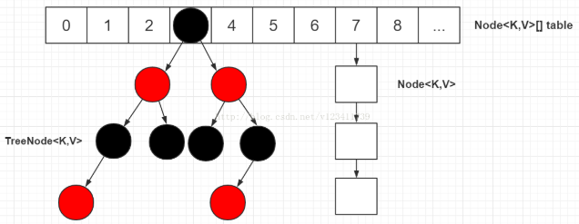
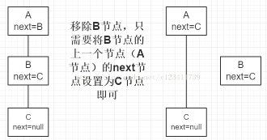
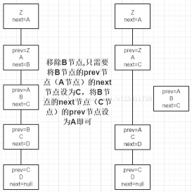

HashMap源码解读

[TOC]

参考：https://blog.csdn.net/v123411739/article/details/78996181

    基于哈希表的Map接口的实现。key和value都允许为null值。**key为null的话，其hash为0**.接近Hashtable（除了不是同步的，允许null值外）。不保证顺序。

　　Map m = Collections.synchronizedMap(new HashMap(...));

　　get和put都有常数时间复杂度。

　　初始容量，加载因子。这两个参数是影响HashMap性能的重要参数，其中容量表示哈希表中桶的数量，初始容量是创建哈希表时的容量，加载因子是哈希表在其容量自动增加之前可以达到多满的一种尺度，它衡量的是一个散列表的空间的使用程度，负载因子越大表示散列表的装填程度越高，反之愈小。对于使用链表法的散列表来说，查找一个元素的平均时间是O(1+a)，因此如果负载因子越大，对空间的利用更充分，然而后果是查找效率的降低；如果负载因子太小，那么散列表的数据将过于稀疏，对空间造成严重浪费。系统默认负载因子为0.75，一般情况下我们是无需修改的。



# **几个点：**

先了解以下几个点，有利于更好的理解HashMap的源码和阅读本文。

1. 头节点指的是table表上索引位置的节点，也就是链表的头节点。

2. 根结点（root节点）指的是红黑树最上面的那个节点，也就是没有父节点的节点。

3. 红黑树的根结点不一定是索引位置的头结点。

4. 转为红黑树节点后，链表的结构还存在，通过next属性维持，红黑树节点在进行操作时都会维护链表的结构，并不是转为红黑树节点，链表结构就不存在了。

5. 在红黑树上，叶子节点也可能有next节点，因为红黑树的结构跟链表的结构是互不影响的，不会因为是叶子节点就说该节点已经没有next节点。

6. 源码中一些变量定义：如果定义了一个节点p，则pl为p的左节点，pr为p的右节点，pp为p的父节点，ph为p的hash值，pk为p的key值，kc为key的类等等。源码中很喜欢在if/for等语句中进行赋值并判断，请注意。

7. 链表中移除一个节点只需如下图操作，其他操作同理。

   

8. 红黑树在维护链表结构时，移除一个节点只需如下图操作（红黑树中增加了一个prev属性），其他操作同理。注：此处只是红黑树维护链表结构的操作，红黑树还需要单独进行红黑树的移除或者其他操作。

   

9. 源码中进行红黑树的查找时，会反复用到以下两条规则：1）如果目标节点的hash值小于p节点的hash值，则向p节点的左边遍历；否则向p节点的右边遍历。2）如果目标节点的key值小于p节点的key值，则向p节点的左边遍历；否则向p节点的右边遍历。这两条规则是利用了红黑树的特性（左节点<根结点<右节点）。

10. 源码中进行红黑树的查找时，会用dir（direction）来表示向左还是向右查找，dir存储的值是目标节点的hash/key与p节点的hash/key的比较结果。

 

主要属性：

```java
public class HashMap<K,V> extends AbstractMap<K,V>
    implements Map<K,V>, Cloneable, Serializable {

    private static final long serialVersionUID = 362498820763181265L;
    static final int DEFAULT_INITIAL_CAPACITY = 1 << 4; //默认初始容量16，2的幂
    static final int MAXIMUM_CAPACITY = 1 << 30;   //最大容量
    static final float DEFAULT_LOAD_FACTOR = 0.75f;//默认加载因子0.75
    static final int TREEIFY_THRESHOLD = 8;//链表转红黑书的节点阈值,>8,则转为红黑树
    static final int UNTREEIFY_THRESHOLD = 6;//红黑书转链表的阈值
    static final int MIN_TREEIFY_CAPACITY = 64;// 决定是否转换成tree的最小容量 
   
    transient Node<K,V>[] table; //表大小，2的幂
    /**Holds cached entrySet(). Note that AbstractMap fields are used
     * for keySet() and values(). */
    transient Set<Map.Entry<K,V>> entrySet;
    transient int size; //key-value对的数量
    /* This field is used to make iterators on Collection-views of
     * the HashMap fail-fast.  (See ConcurrentModificationException). */
    transient int modCount; //结构被修改的次数
    //hashmap所能容纳的最大数据量的Node个数　threshold = length * Load factor
    int threshold;   // (capacity * load factor) to resize  
    final float loadFactor;
```

链表节点：

```JAVA
static class Node<K,V> implements Map.Entry<K,V> {
    final int hash;
    final K key;
    V value;
    Node<K,V> next;
    Node(int hash, K key, V value, Node<K,V> next) {
        this.hash = hash;
        this.key = key;
        this.value = value;
        this.next = next;
    }
    public final K getKey()        { return key; }
    public final V getValue()      { return value; }
    public final String toString() { return key + "=" + value; }
    public final int hashCode() { //节点的hashcode由key，value共同组成.要保证一致性
        return Objects.hashCode(key) ^ Objects.hashCode(value);
    }
    public final V setValue(V newValue) {
        V oldValue = value;
        value = newValue;
        return oldValue;
    }
    public final boolean equals(Object o) {//自己写equals方法　key value都要相同
        if (o == this)
            return true;
        if (o instanceof Map.Entry) {
            Map.Entry<?,?> e = (Map.Entry<?,?>)o;
            if (Objects.equals(key, e.getKey()) &&
                Objects.equals(value, e.getValue()))
                return true;
        }
        return false;
    }
}
```

红黑树节点：保留了链表的结构，可以正常使用next

```java
static final class TreeNode<K,V> extends LinkedHashMap.Entry<K,V> {
    TreeNode<K,V> parent;  // red-black tree links
    TreeNode<K,V> left;
    TreeNode<K,V> right;
    TreeNode<K,V> prev;    // needed to unlink next upon deletion
    boolean red;
    TreeNode(int hash, K key, V val, Node<K,V> next) {
        super(hash, key, val, next);
    }
    ...
}
```


如何定位哈希桶的下标，步骤如下：

1. 将hash值 与 无符号右移16的哈希值 进行 异或运算，**使得新的哈希值尽量分散**。
2. 索引为将(tab.length - 1) 与 hash值进行&运算（所以**要求表容量为2的幂**）

```java
static final int hash(Object key) {
    int h;
    return (key == null) ? 0 : (h = key.hashCode()) ^ (h >>> 16);//
}
int n = tab.length;// 代码2
int index = (n - 1) & hash// 将(tab.length - 1) 与 hash值进行&运算
```

### 构造函数：

```java
// 1
public HashMap(int initialCapacity, float loadFactor) {
    if (initialCapacity < 0)
        throw new IllegalArgumentException("Illegal initial capacity: " +
                                           initialCapacity);
    if (initialCapacity > MAXIMUM_CAPACITY)
        initialCapacity = MAXIMUM_CAPACITY;
    if (loadFactor <= 0 || Float.isNaN(loadFactor))
        throw new IllegalArgumentException("Illegal load factor: " +
                                           loadFactor);
    this.loadFactor = loadFactor;
    this.threshold = tableSizeFor(initialCapacity);
}
//2
public HashMap(int initialCapacity) {
    this(initialCapacity, DEFAULT_LOAD_FACTOR);
}
//3
public HashMap() {
    this.loadFactor = DEFAULT_LOAD_FACTOR; // all other fields defaulted
}
```

```java
//对于给定的容量cap，找到一个大于等于cap的最小的２的幂。 
static final int tableSizeFor(int cap) {
    int n = cap - 1;// 防止已经是2的幂了 假设为：0000 1010 1000 1011
    n |= n >>> 1;　// 0000 1110 1000 1011 将最高位为１的右边一位置为１，变为　11*******
    n |= n >>> 2;  // 0000 1111 1000 1011 将接着的右边两位置１，变为　1111******
    n |= n >>> 4;  // 0000 1111 1111 1011 将接着的右边四位置１，变为　1111 1111 *****
    n |= n >>> 8;  // 0000 1111 1111 1111 ...
    n |= n >>> 16;
    // 三元运算法，右结合。即　右边当做一个整体
    // 当n<0时，为１．否则执行后面
    return (n < 0) ? 1 : (n >= MAXIMUM_CAPACITY) ? MAXIMUM_CAPACITY : n + 1;
}
```

### put方法

```java
public V put(K key, V value) {
    return putVal(hash(key), key, value, false, true);
}
```

```java
/**Implements Map.put and related methods
 * @param hash hash for key
 * @param key the key
 * @param value the value to put
 * @param onlyIfAbsent if true, don't change existing value
 * @param evict if false, the table is in creation mode.
 * @return previous value, or null if none
 */
final V putVal(int hash, K key, V value, boolean onlyIfAbsent, boolean evict) {
    Node<K,V>[] tab; Node<K,V> p; int n, i;
    //1.如果表为null，或者长度为0，则resize方法进行初始化
    if ((tab = table) == null || (n = tab.length) == 0)
        n = (tab = resize()).length;
    //2.计算索引值，如果该位置为空，则直接加入即可。
    if ((p = tab[i = (n - 1) & hash]) == null)
        tab[i] = newNode(hash, key, value, null);
    //3.说明索引值i处已经有值p了，则需要插入到链表或者红黑书后面
    else {
        Node<K,V> e; K k;
        //3.1 如果第一个值p就是要找的目标，则赋值给e
        if (p.hash == hash &&
            ((k = p.key) == key || (key != null && key.equals(k))))
            e = p;
        //3.2 如果第一个节点p是红黑树，则通过红黑树插入
        else if (p instanceof TreeNode)
            e = ((TreeNode<K,V>)p).putTreeVal(this, tab, hash, key, value);
        //3.3 第一个节点是链表，则在链表中插入(可能需要转为红黑树)
        else {
            for (int binCount = 0; ; ++binCount) { 
                //将next赋值给e,如果下一个节点为null，则在链表末尾插入即可。
                if ((e = p.next) == null) {
                    p.next = newNode(hash, key, value, null);//在链表末尾插入
                    //如果节点个数超过8，则转为红黑树
                    if (binCount >= TREEIFY_THRESHOLD - 1) // -1 for 1st   >
                        treeifyBin(tab, hash);
                    break;
                }
                //如果找到了，则break跳出循环
                if (e.hash == hash &&
                    ((k = e.key) == key || (key != null && key.equals(k))))
                    break;
                p = e;//p指向p.next
            }
        }
        if (e != null) { //说明存在有相同的key，返回oldValue
            V oldValue = e.value;
            if (!onlyIfAbsent || oldValue == null) //是否替换，默认替换
                e.value = value;
            afterNodeAccess(e); //用于LinkedHashMap
            return oldValue;
        }
    }
    //说明没有冲突，添加成功
    ++modCount;
    if (++size > threshold)//插入节点后，如果实际节点个数 > (tab.length * factor)
        resize();
    afterNodeInsertion(evict);//用于LinkedHashMap
    return null;//插入成功，返回null
}
```

红黑树的插入putTreeVal

```java
// 红黑树插入会同时维护原来的链表属性, 即原来的next属性
final TreeNode<K,V> putTreeVal(HashMap<K,V> map, Node<K,V>[] tab,
                               int h, K k, V v) {
    Class<?> kc = null;
    boolean searched = false;
    // 查找根节点, 索引位置的头节点并不一定为红黑树的根结点
    TreeNode<K,V> root = (parent != null) ? root() : this;
    for (TreeNode<K,V> p = root;;) { // 将根节点赋值给p, 开始遍历
        int dir, ph; K pk;
        if ((ph = p.hash) > h) // 如果传入的hash值h小于p节点的hash值
            dir = -1;          // 则将dir赋值为-1, 代表向p的左边查找树
        else if (ph < h)       // 如果传入的hash值h大于p节点的hash值
            dir = 1;           // 则将dir赋值为1, 代表向p的右边查找树
        // 如果传入的hash值和key值等于p节点的hash值和key值, 则p节点即为目标节点, 返回p节点
        else if ((pk = p.key) == k || (k != null && k.equals(pk)))
            return p;	
        //如果k所属的类没有实现Comparable接口，或者k和p节点的key使用compareTo方法比较相等：第一次会从p节点的左节点和右节点分别调用find方法（见上文代码块2）进行查找，如果查找到目标节点则返回；如果不是第一次或者调用find方法没有找到目标节点，则调用tieBreakOrder方法（见下文代码块5）比较k和p节点的key值的大小，以决定向树的左节点还是右节点查找。
        else if ((kc == null &&
                  (kc = comparableClassFor(k)) == null) ||
                 (dir = compareComparables(kc, k, pk)) == 0) {
            if (!searched) {
                TreeNode<K,V> q, ch;
                searched = true;
                if (((ch = p.left) != null &&
                     (q = ch.find(h, k, kc)) != null) ||
                    ((ch = p.right) != null &&
                     (q = ch.find(h, k, kc)) != null))
                    return q;
            }
            //否则使用自定义的一套规则来比较k和p.key的大小，用来决定向左还是向右查找
            dir = tieBreakOrder(k, pk);
        }
        TreeNode<K,V> xp = p;// xp为x的父亲节点，中间变量，用于下面给x的父亲节点赋值
        //如果找到了树中节点的孩子为null，则进行插入
        if ((p = (dir <= 0) ? p.left : p.right) == null) {
            //找到了放x的节点
            Node<K,V> xpn = xp.next;  //xp的next节点
            TreeNode<K,V> x = map.newTreeNode(h, k, v, xpn);
            if (dir <= 0) //插入到xp的左边
                xp.left = x;
            else          //插入到xp的右孩子
                xp.right = x;
            xp.next = x;  //将xp的next节点设置为x，链表？
            x.parent = x.prev = xp;//将x.parent(红黑树)，x.prev(链表)指向xp
            if (xpn != null)  //如果xpn(原来xp.next)不为null，则设置xpn.prev指向x（链表）
                ((TreeNode<K,V>)xpn).prev = x; 
            moveRootToFront(tab, balanceInsertion(root, x));//从根节点开始调整x，红黑书平衡调整
            return null;
        }
    }
}
```

tieBreakOrder 该函数用于hashcode相同时，或者key不可比较时比较的一种方法：

```java
//此方法定义一套规则用于极端情况下比较两个参数的大小。
static int tieBreakOrder(Object a, Object b) {
    int d;
    if (a == null || b == null ||
        (d = a.getClass().getName().
         compareTo(b.getClass().getName())) == 0)
        d = (System.identityHashCode(a) <= System.identityHashCode(b) ?
             -1 : 1);
    return d;
}
```

treeifyBin 链表转为红黑树：

```java
/*Replaces all linked nodes in bin at index for given hash unless
 * table is too small, in which case resizes instead. */
final void treeifyBin(Node<K,V>[] tab, int hash) {
    int n, index; Node<K,V> e;
    //1.表为空，或者表的长度<64，则进行扩容
    if (tab == null || (n = tab.length) < MIN_TREEIFY_CAPACITY)
        resize();
    //2.高
    else if ((e = tab[index = (n - 1) & hash]) != null) {
        TreeNode<K,V> hd = null, tl = null;
        do {
            TreeNode<K,V> p = replacementTreeNode(e, null);
            if (tl == null)
                hd = p;
            else {
                p.prev = tl;
                tl.next = p;
            }
            tl = p;
        } while ((e = e.next) != null);
        if ((tab[index] = hd) != null)
            hd.treeify(tab);
    }
}
```

链表节点转红黑树节点：

```java
TreeNode<K,V> replacementTreeNode(Node<K,V> p, Node<K,V> next) {
    return new TreeNode<>(p.hash, p.key, p.value, next);
}
```

节点构建红黑树：

```java
/**Forms tree of the nodes linked from this node.
 * @return root of tree  */
final void treeify(Node<K,V>[] tab) {
    TreeNode<K,V> root = null;
    //根据next值进行遍历
    for (TreeNode<K,V> x = this, next; x != null; x = next) {//this即为调用此方法的treeNode
        next = (TreeNode<K,V>)x.next; //next为x的下一个节点，保留，以方便上面循环。
        //开始插入x节点
        x.left = x.right = null;
        //如果还没有根节点，则设置x为根节点
        if (root == null) {
            x.parent = null;
            x.red = false;
            root = x;
        }
        //否则，已有根节点
        else {
            K k = x.key;
            int h = x.hash;
            Class<?> kc = null;
            //从根节点开始查找x插入的位置
            for (TreeNode<K,V> p = root;;) {
                int dir, ph;
                K pk = p.key;
                if ((ph = p.hash) > h)
                    dir = -1;
                else if (ph < h)
                    dir = 1;
                //此时，hash值相等，需要继续比较key。
                //如果key没有实现compareable方法，或者key相等，则使用自定义的比较方法。
                else if ((kc == null &&
                          (kc = comparableClassFor(k)) == null) || 
                         (dir = compareComparables(kc, k, pk)) == 0)
                    dir = tieBreakOrder(k, pk);//使用自定义的比较方法

                TreeNode<K,V> xp = p;//记录x的可能的父亲节点xp，后面用
                //如果找到了，则插入；否则继续上面的循环
                if ((p = (dir <= 0) ? p.left : p.right) == null) {
                    x.parent = xp;    //给x.parent赋值
                    if (dir <= 0)
                        xp.left = x;  //左孩子
                    else
                        xp.right = x; //右孩子
                    root = balanceInsertion(root, x); //插入平衡调整
                    break;   //跳出循环
                }
            }
        }
    }
    //如果索引位置的节点经过调整后，不再是root节点，则将新的root调整为索引处的节点
    moveRootToFront(tab, root);
}
```

在tab表中调整root节点：

```java
static <K,V> void moveRootToFront(Node<K,V>[] tab, TreeNode<K,V> root) {
    int n;
    //如果root不为null，表不为null，表长度不为0
    if (root != null && tab != null && (n = tab.length) > 0) {
        int index = (n - 1) & root.hash; //计算root节点索引
        TreeNode<K,V> first = (TreeNode<K,V>)tab[index]; 
        //如果root节点不是索引位置的节点first，则进行调整
        if (root != first) { 
            Node<K,V> rn;
            tab[index] = root; //将root设置为索引位置处的节点
            //1.将root节点从原来的pre节点和next节点中删掉
            TreeNode<K,V> rp = root.prev; //得到root的上一个节点rp
            //1.1如果root的下一个节点不为null，则将下一个节点的prev指向root的上一个节点rp
            if ((rn = root.next) != null)
                ((TreeNode<K,V>)rn).prev = rp;
            //1.2如果上一个节点不为null，则将root上一个节点的next指向root的下一个节点rn
            if (rp != null)
                rp.next = rn;
            //2.将root节点设置为原来头节点first的前驱，及变为新的头节点
            if (first != null)
                first.prev = root;
            root.next = first;
            root.prev = null;
        }
        assert checkInvariants(root);//检查树是否正常
    }
}
```


### 扩容机制

resize()方法：

- 初始化，表的容量翻倍

```java
/**
 * Initializes or doubles table size.  If null, allocates in
 * accord with initial capacity target held in field threshold.
 * Otherwise, because we are using power-of-two expansion, the
 * elements from each bin must either stay at same index, or move
 * with a power of two offset in the new table.
 *
 * @return the table
 */
final Node<K,V>[] resize() {
    Node<K,V>[] oldTab = table;  //获取原来的表
    int oldCap = (oldTab == null) ? 0 : oldTab.length;  //获取原来表的长度
    int oldThr = threshold;  //获取原来的阈值
    int newCap, newThr = 0;
    //1如果原来的表长度>0
    if (oldCap > 0) { 
        //1.1 如果长度超过最大值，则threshold赋值为Integer.MAX_VALUE，并返回原来的table
        if (oldCap >= MAXIMUM_CAPACITY) {
            threshold = Integer.MAX_VALUE;
            return oldTab;
        }
        //1.2 新翻倍的容量小于最大值，原来的容量大于等于初始默认值，则翻倍。阈值threshold也翻倍
        else if ((newCap = oldCap << 1) < MAXIMUM_CAPACITY &&
                 oldCap >= DEFAULT_INITIAL_CAPACITY)
            newThr = oldThr << 1; // double threshold
    }
    //2.如果原来的表长度为0
    //2.1 老表的容量为0, 老表的阈值大于0, 是因为初始容量被放入阈值.则将新表的容量设置为老表的阈值
    else if (oldThr > 0) 
        newCap = oldThr;
    //2.2 老表的容量为0, 老表的阈值为0, 则为空表，设置默认容量和阈值
    else {               // zero initial threshold signifies using defaults
        newCap = DEFAULT_INITIAL_CAPACITY;
        newThr = (int)(DEFAULT_LOAD_FACTOR * DEFAULT_INITIAL_CAPACITY);
    }
    // 如果新表的阈值为空, 则通过新的容量*负载因子获得阈值
    if (newThr == 0) {
        float ft = (float)newCap * loadFactor;
        newThr = (newCap < MAXIMUM_CAPACITY && ft < (float)MAXIMUM_CAPACITY ?
                  (int)ft : Integer.MAX_VALUE);
    }
    // 将当前阈值赋值为刚计算出来的新的阈值
    threshold = newThr;
    // 定义新表,容量为刚计算出来的新容量
    @SuppressWarnings({"rawtypes","unchecked"})
        Node<K,V>[] newTab = (Node<K,V>[])new Node[newCap];
    table = newTab; // 将当前的表赋值为新定义的表
    if (oldTab != null) { // 如果老表不为空, 则需遍历将节点赋值给新表
        for (int j = 0; j < oldCap; ++j) {
            Node<K,V> e;
            if ((e = oldTab[j]) != null) { // 将索引值为j的老表头节点赋值给e
                oldTab[j] = null;          // help gc
                //1.如果只有一个节点，则直接赋值到新表
                if (e.next == null) 
                    newTab[e.hash & (newCap - 1)] = e; 
                //2.如果e节点是红黑树
                else if (e instanceof TreeNode)//调treeNode的hash分布(跟下面最后一个else几乎相同)
                    ((TreeNode<K,V>)e).split(this, newTab, j, oldCap);
                //3.如果节点e是链表节点，则进行普通的hash分布。
                else { // preserve order
                    //扩容后，因为哈希值不变，但扩容后，参与计算的高位多了一个1.
                    //   hash: 0011 1010            0011 1010
                    //   n-1 :      1111    扩容后：    1 1111 
                    //   索引：      1010               1 1010
                    //将链表分为 原来位置索引的链表 和 新位置索引的链表(原索引+oldCap)
                    Node<K,V> loHead = null, loTail = null;// 存储跟原索引位置相同的节点
                    Node<K,V> hiHead = null, hiTail = null;// 存储索引位置为:原索引+oldCap的节点
                    Node<K,V> next;
                    do {
                        next = e.next;
                        //如果e的hash值与老表的容量进行与运算为0,则扩容后的索引跟老表的索引位置一样
                        if ((e.hash & oldCap) == 0) {
                            if (loTail == null) // 如果loTail为空, 代表该节点为第一个节点
                                loHead = e;     // 则将loHead赋值为第一个节点
                            else
                                loTail.next = e;// 否则将节点添加在loTail后面
                            loTail = e;         // 并将loTail赋值为新增的节点
                        }
                        //如果e的hash值与老表的容量进行与运算为1,则扩容后的索引为:老表的索引＋oldCap
                        else {
                            if (hiTail == null) // 如果hiTail为空, 代表该节点为第一个节点
                                hiHead = e;     // 则将hiHead赋值为第一个节点
                            else
                                hiTail.next = e;// 否则将节点添加在hiTail后面
                            hiTail = e;         // 并将hiTail赋值为新增的节点
                        }
                    } while ((e = next) != null);
                    if (loTail != null) {
                        loTail.next = null; // 最后一个节点的next设为空 
                        newTab[j] = loHead; // 将原索引位置的节点设置为对应的头结点
                    }
                    if (hiTail != null) {
                        hiTail.next = null;         // 最后一个节点的next设为空
                        newTab[j + oldCap] = hiHead;//将索引为原索引+oldCap的节点设置为对应的头结点
                    }
                }
            }
        }
    }
    return newTab;
}
```

红黑树分裂为低位置和高位置：

```java
/**
 * @param index the index of the table being split
 * @param bit the bit of hash to split on
 */
final void split(HashMap<K,V> map, Node<K,V>[] tab, int index, int bit) {
    TreeNode<K,V> b = this; // 拿到调用此方法的节点
    // Relink into lo and hi lists, preserving order
    TreeNode<K,V> loHead = null, loTail = null; // 存储跟原索引位置相同的节点
    TreeNode<K,V> hiHead = null, hiTail = null; // 存储索引位置为:原索引+oldCap的节点
    int lc = 0, hc = 0;
    for (TreeNode<K,V> e = b, next; e != null; e = next) {
        next = (TreeNode<K,V>)e.next;
        e.next = null;      // help gc
        //扩容后，与原索引位置一样
        if ((e.hash & bit) == 0) {
            if ((e.prev = loTail) == null) // 如果loTail为空, 代表该节点为第一个节点
                loHead = e;                // 则将loHead赋值为第一个节点
            else
                loTail.next = e;           // 否则将节点添加在loTail后面
            loTail = e;                    // 并将loTail赋值为新增的节点
            ++lc;                          // 统计原索引位置的节点个数
        }
        //扩容后，变为：老表的索引位置＋oldCap
        else {
            if ((e.prev = hiTail) == null) // 如果hiHead为空, 代表该节点为第一个节点
                hiHead = e;                // 则将hiHead赋值为第一个节点
            else
                hiTail.next = e;           // 否则将节点添加在hiTail后面
            hiTail = e;                    // 并将hiTail赋值为新增的节点
            ++hc;                          // 统计索引位置为原索引+oldCap的节点个数
        }
    }

    if (loHead != null) {              // 原索引位置的节点不为空
        if (lc <= UNTREEIFY_THRESHOLD) // 节点个数<=6个则将红黑树转为链表结构
            tab[index] = loHead.untreeify(map); //将原索引位置的节点设置为转为链表结构的尾部
        else {
            tab[index] = loHead;       // 将原索引位置的节点设置为对应的头结点
            // hiHead不为空则代表原来的红黑树(老表的红黑树由于节点被分到两个位置)
            // 已经被改变, 需要重新构建新的红黑树
            if (hiHead != null) // (else is already treeified)
                loHead.treeify(tab);  // 以loHead为根结点, 构建新的红黑树
        }
    }
    if (hiHead != null) {               // 索引位置为原索引+oldCap的节点不为空
        if (hc <= UNTREEIFY_THRESHOLD)  // 节点个数<=6个则将红黑树转为链表结构
            tab[index + bit] = hiHead.untreeify(map);
        else {
            tab[index + bit] = hiHead;  // 将索引位置为原索引+oldCap的节点设置为对应的头结点
            // loHead不为空则代表原来的红黑树(老表的红黑树由于节点被分到两个位置)
            // 已经被改变, 需要重新构建新的红黑树
            if (loHead != null)
                hiHead.treeify(tab);// 以hiHead为根结点, 构建新的红黑树
        }
    }
}
```

红黑树退化为链表：

```java
// 将红黑树节点转为链表节点, 当节点<=6个时会被触发
final Node<K,V> untreeify(HashMap<K,V> map) {
    Node<K,V> hd = null, tl = null; // hd指向头结点, tl指向尾节点
    // 从调用该方法的节点, 即链表的头结点开始遍历, 将所有节点全转为链表节点
    for (Node<K,V> q = this; q != null; q = q.next) {
        Node<K,V> p = map.replacementNode(q, null);// 调用replacementNode方法构建链表节点
        if (tl == null)// 如果tl为null, 则代表当前节点为第一个节点, 将hd赋值为该节点
            hd = p;
        else  
            tl.next = p; // 否则, 将尾节点的next属性设置为当前节点p
        tl = p;  // 每次都将tl节点指向当前节点, 即尾节点
    }
    return hd;  // 返回转换后的链表的头结点
}
```

节点转化：

```java
Node<K,V> replacementNode(Node<K,V> p, Node<K,V> next) {
    return new Node<>(p.hash, p.key, p.value, next);
}
```


### get获取node

```java
public V get(Object key) {
    Node<K,V> e;
    return (e = getNode(hash(key), key)) == null ? null : e.value;
}
```
判断节点是否相等：**先判断key的hash值**，如果相等，再通过== || equals方法判断key。相等则相等。

大多数是不相等的，所以首先通过hash值来判断，能够加快速度。

```java
/* @param hash hash for key
 * @param key the key
 * @return the node, or null if none */
final Node<K,V> getNode(int hash, Object key) {
    Node<K,V>[] tab; Node<K,V> first, e; int n; K k;
    //table不为null，长度>0，并且表的hash索引不为null
    if ((tab = table) != null && (n = tab.length) > 0 &&
        (first = tab[(n - 1) & hash]) != null) {
        if (first.hash == hash && // always check first node
            ((k = first.key) == key || (key != null && key.equals(k))))
            return first;// hash值相等，并且k==key || key.equals(k)，则返回first节点
        if ((e = first.next) != null) {//不是first，则向下遍历
            if (first instanceof TreeNode)//如果是红黑树，则通过红黑书遍历
                return ((TreeNode<K,V>)first).getTreeNode(hash, key);
            do { //如果不是红黑书，则通过链表遍历
                if (e.hash == hash &&
                    ((k = e.key) == key || (key != null && key.equals(k))))
                    return e;
            } while ((e = e.next) != null);
        }
    }
    return null;  // 找不到符合的返回空
}
```

红黑树的TreeNode.getTreeNode(hash, key)查找节点：

```java
//通过红黑树的根节点调用find方法
final TreeNode<K,V> getTreeNode(int h, Object k) {
    return ((parent != null) ? root() : this).find(h, k, null);
}
```

```java
// 从调用此方法的结点开始查找, 通过hash值和key找到对应的节点
// 此处是红黑树的遍历, 红黑树是特殊的自平衡二叉查找树
// 平衡二叉查找树的特点：左节点<根节点<右节点
final TreeNode<K,V> find(int h, Object k, Class<?> kc) {
    TreeNode<K,V> p = this; // this为调用此方法的节点
    do {
        int ph, dir; K pk;
        TreeNode<K,V> pl = p.left, pr = p.right, q;
        if ((ph = p.hash) > h)//在左孩子处找
            p = pl;
        else if (ph < h) //在右孩子处找
            p = pr;
        else if ((pk = p.key) == k || (k != null && k.equals(pk)))//找到就返回
            return p;
        else if (pl == null) // p节点的左节点为空则将向右遍历
            p = pr;
        else if (pr == null) // p节点的右节点为空则向左遍历
            p = pl;
        else if ((kc != null || //比较大小
                  (kc = comparableClassFor(k)) != null) && //此行不为空代表k实现了Comparable
                 (dir = compareComparables(kc, k, pk)) != 0) //k<pk则dir<0, k>pk则dir>0
            p = (dir < 0) ? pl : pr; // k < pk则向左遍历(p赋值为p的左节点), 否则向右遍历
        // 代码走到此处, 代表key所属类没有实现Comparable, 直接指定向p的右边遍历
        else if ((q = pr.find(h, k, kc)) != null)
            return q;
        // 代码走到此处代表上一个向右遍历（pr.find(h, k, kc)）为空, 因此直接向左遍历
        else 
            p = pl;
    } while (p != null);
    return null;
}
```

### remove方法

```java
public V remove(Object key) {
    Node<K,V> e;
    return (e = removeNode(hash(key), key, null, false, true)) == null ?
        null : e.value;
}
```

```java
/**@param hash hash for key
 * @param key the key
 * @param value the value to match if matchValue, else ignored
 * @param matchValue if true only remove if value is equal
 * @param movable if false do not move other nodes while removing
 * @return the node, or null if none
 */
final Node<K,V> removeNode(int hash, Object key, Object value,
                           boolean matchValue, boolean movable) {
    Node<K,V>[] tab; Node<K,V> p; int n, index;
    // 如果table不为空并且根据hash值计算出来的索引位置不为空, 将该位置的节点赋值给p
    if ((tab = table) != null && (n = tab.length) > 0 &&
        (p = tab[index = (n - 1) & hash]) != null) {
        Node<K,V> node = null, e; K k; V v;
        // 如果p的hash值和key都与入参的相同, 则p即为目标节点, 赋值给node
        if (p.hash == hash &&
            ((k = p.key) == key || (key != null && key.equals(k))))
            node = p;
        // 否则向下遍历节点
        else if ((e = p.next) != null) {
            // 如果p是TreeNode则调用红黑树的方法查找节点
            if (p instanceof TreeNode) 
                node = ((TreeNode<K,V>)p).getTreeNode(hash, key);
            // 遍历链表查找符合条件的节点
            else {
                do {
                    // 当节点的hash值和key与传入的相同,则该节点即为目标节点
                    if (e.hash == hash &&
                        ((k = e.key) == key ||
                         (key != null && key.equals(k)))) {
                        node = e;  // 赋值给node, 并跳出循环
                        break;
                    }
                    p = e; // p节点赋值为本次结束的e
                } while ((e = e.next) != null); // 指向像一个节点
            }
        }
        // 如果node不为空(即根据传入key和hash值查找到目标节点)，则进行移除操作
        if (node != null && (!matchValue || (v = node.value) == value ||
                             (value != null && value.equals(v)))) {
            // 如果是TreeNode则调用红黑树的移除方法
            if (node instanceof TreeNode)
                ((TreeNode<K,V>)node).removeTreeNode(this, tab, movable);
            // 走到这代表节点是普通链表节点
            // 如果node是该索引位置的头结点则直接将该索引位置的值赋值为node的next节点
            else if (node == p)
                tab[index] = node.next;
            // 否则将node的上一个节点的next属性设置为node的next节点, 
            // 即将node节点移除, 将node的上下节点进行关联(链表的移除) 
            else
                p.next = node.next;
            ++modCount;  // 修改次数+1
            --size;      // table的总节点数-1
            afterNodeRemoval(node); // 供LinkedHashMap使用
            return node;  // 返回被移除的节点
        }
    }
    return null;
}
```

removeTreeNode()方法：先处理链表，然后处理红黑树

```java
final void removeTreeNode(HashMap<K,V> map, Node<K,V>[] tab, boolean movable) {
    //开始处理链表
    int n;
    if (tab == null || (n = tab.length) == 0) // table为空或者length为0直接返回
        return;
    int index = (n - 1) & hash; // 根据hash计算出索引的位置
    //// 索引位置的头结点赋值给first和root
    TreeNode<K,V> first = (TreeNode<K,V>)tab[index], root = first, rl;
    // 该方法被将要被移除的node(TreeNode)调用, 因此此方法的this为要被移除node节点, 
    // 则此处next即为node的next节点, prev即为node的prev节点
    TreeNode<K,V> succ = (TreeNode<K,V>)next, pred = prev;
    // 如果node节点的prev节点为空，说明node为第一个
    if (pred == null)
        tab[index] = first = succ;// 将table索引的值和first节点的值赋值为succ(node的next节点)即可
    else
        pred.next = succ;//否则移除链表
    if (succ != null)//设置后继的pred
        succ.prev = pred;
    if (first == null)//为null，直接返回
        return;
    // 如果root的父节点不为空, 则将root赋值为根结点
    // (root在上面被赋值为索引位置的头结点, 索引位置的头节点并不一定为红黑树的根结点)
    if (root.parent != null)
        root = root.root();
    // 通过root节点来判断此红黑树是否太小, 如果是则调用untreeify方法转为链表节点并返回
    // (转链表后就无需再进行下面的红黑树处理)
    if (root == null || root.right == null ||
        (rl = root.left) == null || rl.left == null) {
        tab[index] = first.untreeify(map);  // too small
        return;
    }
    //链表处理结束
    
    //开始处理红黑树
    TreeNode<K,V> p = this, pl = left, pr = right, replacement;
    // node的左节点和右节点都不为空时
    if (pl != null && pr != null) {
        TreeNode<K,V> s = pr, sl;// s节点赋值为node的右节点
        while ((sl = s.left) != null) // find successor
            s = sl;     //向左一直查找,直到叶子节点,跳出循环时,s为叶子节点
        boolean c = s.red; s.red = p.red; p.red = c;//交换p节点和s节点(叶子节点)的颜色
        TreeNode<K,V> sr = s.right;   // s的右节点
        TreeNode<K,V> pp = p.parent;  // p的父节点
        if (s == pr) { // p was s's direct parent
            p.parent = s;
            s.right = p;
        }
        else {
            TreeNode<K,V> sp = s.parent;
            if ((p.parent = sp) != null) {
                if (s == sp.left)
                    sp.left = p;
                else
                    sp.right = p;
            }
            if ((s.right = pr) != null)
                pr.parent = s;
        }
        p.left = null;
        if ((p.right = sr) != null)
            sr.parent = p;
        if ((s.left = pl) != null)
            pl.parent = s;
        if ((s.parent = pp) == null)
            root = s;
        else if (p == pp.left)
            pp.left = s;
        else
            pp.right = s;
        if (sr != null)
            replacement = sr;
        else
            replacement = p;
    }
    else if (pl != null)
        replacement = pl;
    else if (pr != null)
        replacement = pr;
    else
        replacement = p;
    if (replacement != p) {
        TreeNode<K,V> pp = replacement.parent = p.parent;
        if (pp == null)
            root = replacement;
        else if (p == pp.left)
            pp.left = replacement;
        else
            pp.right = replacement;
        p.left = p.right = p.parent = null;
    }

    TreeNode<K,V> r = p.red ? root : balanceDeletion(root, replacement);

    if (replacement == p) {  // detach
        TreeNode<K,V> pp = p.parent;
        p.parent = null;
        if (pp != null) {
            if (p == pp.left)
                pp.left = null;
            else if (p == pp.right)
                pp.right = null;
        }
    }
    if (movable)
        moveRootToFront(tab, r);
}
```

 

# **HashMap和Hashtable的区别：**

1. HashMap允许key和value为null，Hashtable不允许。
2. HashMap的默认初始容量为16，Hashtable为11。
3. HashMap的扩容为原来的2倍，Hashtable的扩容为原来的2倍加1。
4. HashMap是非线程安全的，Hashtable是线程安全的。
5. HashMap的hash值重新计算过，Hashtable直接使用hashCode。
6. HashMap去掉了Hashtable中的contains方法。
7. HashMap继承自AbstractMap类，Hashtable继承自Dictionary类。

# 总结：

1. HashMap的底层是个Node数组（Node<K,V>[] table），在数组的具体索引位置，如果存在多个节点，则可能是以链表或红黑树的形式存在。
2. 增加、删除、查找键值对时，定位到哈希桶数组的位置是很关键的一步，源码中是通过下面3个操作来完成这一步：1）拿到key的hashCode值；2）将hashCode的高位参与运算，重新计算hash值；3）将计算出来的hash值与(table.length - 1)进行&运算。
3. HashMap的默认初始容量（capacity）是16，capacity必须为2的幂次方；默认负载因子（load factor）是0.75；实际能存放的节点个数（threshold，即触发扩容的阈值）= capacity * load factor。
4. HashMap在触发扩容后，阈值会变为原来的2倍，并且会进行重hash，重hash后索引位置index的节点的新分布位置最多只有两个：原索引位置或原索引+oldCap位置。例如capacity为16，索引位置5的节点扩容后，只可能分布在新报索引位置5和索引位置21（5+16）。
5. 导致HashMap扩容后，同一个索引位置的节点重hash最多分布在两个位置的根本原因是：1）table的长度始终为2的n次方；2）索引位置的计算方法为“(table.length - 1) & hash”。HashMap扩容是一个比较耗时的操作，定义HashMap时尽量给个接近的初始容量值。
6. HashMap有threshold属性和loadFactor属性，但是没有capacity属性。初始化时，如果传了初始化容量值，该值是存在threshold变量，并且Node数组是在第一次put时才会进行初始化，初始化时会将此时的threshold值作为新表的capacity值，然后用capacity和loadFactor计算新表的真正threshold值。
7. 当同一个索引位置的节点在增加后达到9个时，会触发链表节点（Node）转红黑树节点（TreeNode，间接继承Node），转成红黑树节点后，其实链表的结构还存在，通过next属性维持。链表节点转红黑树节点的具体方法为源码中的treeifyBin(Node<K,V>[] tab, int hash)方法。
8. 当同一个索引位置的节点在移除后达到6个时，并且该索引位置的节点为红黑树节点，会触发红黑树节点转链表节点。红黑树节点转链表节点的具体方法为源码中的untreeify(HashMap<K,V> map)方法。
9. HashMap在JDK1.8之后不再有死循环的问题，JDK1.8之前存在死循环的根本原因是在扩容后同一索引位置的节点顺序会反掉。
10. HashMap是非线程安全的，在并发场景下使用ConcurrentHashMap来代替。**如果两个线程同时put，则可能造成数据丢失的问题。（size等变量都不是volitle的）**