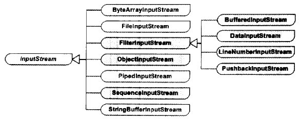

## 一般IO

[TOC]

对于文本来说，优先考虑字符流，因为可以一次性读取多个字节。而字节流一次只能读写一个字节。



inputStream是个抽象类(read,close,skip等方法)是所有输入字节流的父类。有7个直接的子类：

1. 原始流处理器：数组、String、File等
   1. ByteArrayInputStream：接受一个Byte数组作为流的源
   2. FileInputStream：接受一个File对象作为流的源
   3. PipedInputStream：可以和PipedOutputStream配合使用，用于读入一个数据管道的数据。接受一个PipedOutputStream作为源。
   4. StringBufferInputStream：将一个字符串缓冲区转换为一个输入流。接受一个String对象作为流的源。
2. 链接流处理器：同样类型的流用做链接流类的流源
   1. ObjectInputStream 可以将使用ObjectInputStream串行化的原始数据类型和对象重新并行化
   2. SequenceInputStream可以将两个已有的输入流连接起来，形成一个输入流，从而将多个输入流排列构成一个输入流序列。
   3. FilterInputStream称为过滤输入流，它将另一个输入流作为流源。这个类的子类包括以下几种：
      1. BufferedInputStream：用来从硬盘将数据读入到一个内存缓冲区中，并从此缓冲区提供数据。
      2. DateInputStream**：**提供基于多字节的读取方法，可以读取原始数据类型的数据。
      3. LineNumberInputStream**：**提供带有行计算功能的过滤输入流。
      4. PushbackInputStream： 提供特殊的功能，可以将已读取的直接“推回”输入流中。

inputStream中的装饰模式：以FilterInputStream该类为抽象的装饰器角色。


各个角色：

1. **抽象构件（Component）角色：**由InputStream扮演。这是一个抽象类，为各种子类型处理器提供统一的接口。
2. **具体构建（Concrete Component）角色：**由ByteArrayInputStream、FileInputStream、PipedInputStream以及StringBufferInputStream等原始流处理器扮演。它们实现了抽象构建角色所规定的接口，可以被链接流处理器所装饰。
3. **抽象装饰（Decorator）角色：**由FilterInputStream扮演。它实现了InputStream所规定的接口。
4. **具体装饰（Concrete Decorator**）角色：由几个类扮演，分别是DateInputStream、BufferedInputStream 以及两个不常用到的类LineNumberInputStream和PushbackInputStream。

链接流其实就是装饰角色，原始流就是具体构建角色.

1. BufferedInputStream“装饰” 了InputStream的内部工作方式，使得流的读入操作使用缓冲机制，**通过预先读入数组实现**。在使用了缓冲机制后，不会对每一次的流读入操作都产生一个物理的读盘动作，从而提高了程序的效率。在涉及到物理流的读入时，都应当使用这个装饰流类。
2. DataInputStream子类读入各种不同的原始数据类型以及String类型的数据，这一点可以从它提供的各种read()方法看出来：readByte()、readUnsignedByte()、readShort()、readUnsignedShort()、readChar()、readInt()、readLong()、readFloat()、readDouble()、readUTF()。使用这个流处理器以及它的搭档DateOutputStream，可以将原始数据通过流从一个地方移到另一个地
3. LineNumberInputStream和PushbackInputStream也同样“装饰”了InputStream的内部工作方式， 前者使得程序能够按照行号读入数据；后者能使程序在读入的过程中退后一个字符。后两个装饰类可能在实际的编程工作中很少用到，因为它们是为了支持用 java语言做编译器而准备的。

来看看装饰类：

```java
public class FilterInputStream extends InputStream {
    protected volatile InputStream in;
    protected FilterInputStream(InputStream in) {
        this.in = in;
    }
    public int read() throws IOException {
        return in.read();
    }
    public long skip(long n) throws IOException {
        return in.skip(n);
    }
    public int available() throws IOException {
        return in.available();
    }
    public void close() throws IOException {
        in.close();
    }
    public synchronized void mark(int readlimit) {
        in.mark(readlimit);
    }
}
```

来看看BuffferedInputStream类：

```java
public class BufferedInputStream extends FilterInputStream {
    private static int DEFAULT_BUFFER_SIZE = 8192;
    private static int MAX_BUFFER_SIZE = Integer.MAX_VALUE - 8;
    protected volatile byte buf[];//缓冲数组，通过case更新，当数组长度改变时
    protected int count;
    protected int pos;
    private InputStream getInIfOpen() throws IOException {
        InputStream input = in; //获取父类的in
        if (input == null)
            throw new IOException("Stream closed");
        return input;
    }
    public BufferedInputStream(InputStream in) {
        this(in, DEFAULT_BUFFER_SIZE);
    }
    public BufferedInputStream(InputStream in, int size) {
        super(in);//调用父类的方法
        if (size <= 0) {
            throw new IllegalArgumentException("Buffer size <= 0");
        }
        buf = new byte[size];
    }
    ...
```

再来看看DataInputStream:

```java
public class DataInputStream extends FilterInputStream implements DataInput {
    public DataInputStream(InputStream in) {
        super(in);
    }
    public final byte readByte() throws IOException {
        int ch = in.read();
        if (ch < 0)
            throw new EOFException();
        return (byte)(ch);
    }
    public final short readShort() throws IOException {
        int ch1 = in.read();
        int ch2 = in.read();
        if ((ch1 | ch2) < 0)
            throw new EOFException();
        return (short)((ch1 << 8) + (ch2 << 0));
    }
    public final char readChar() throws IOException {
        int ch1 = in.read();
        int ch2 = in.read();
        if ((ch1 | ch2) < 0)
            throw new EOFException();
        return (char)((ch1 << 8) + (ch2 << 0));
    }
```


参考：http://www.cnblogs.com/wxgblogs/p/5649933.html