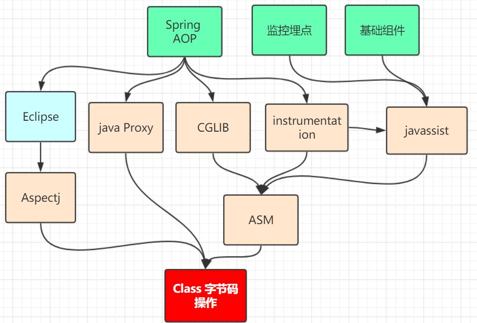

## 动态代理

### 1.动态代理作用：

1. 日志集中打印
2. 事务
3. 权限管理
4. AOP

### 2.在Spring Aop中的实现方式及区别

1. java Proxy(动态构建字节码)（生成一个全新的proxy Class）
2. cglib (动态构建字节码)（生成一个全新的proxy Class）
3. Aspectj（修改目标类的字节，织入代理的字节，在程序编译）(直接修改目标Class)
4. instrumentation（修改目标类的字节码、类装载的时候动态拦截去修改，基于javaagent） -javaagent:spring-instrument-4.3.8.RELEASE.jar (直接修改目标Class)

### 3.动态代理本质

　　无论哪种方式实现动态代理，其本质实现都是对字节码的修改。其区别是从哪里进行切入修改字节码。

动态代理技术栈图：(如果对性能要求很高的化，用后面的方式实现)

Aspectj是一个协议，静态代理

小总结：

1. 动态代理可以由 java proxy、cglib、instrumentation(javaagent)、Aspectj、等多种方式实现

2. 动态代理本质是对class 字节码进行动态构建或修改。

   修改的工具有 ASM 、javavssist 

3. 多种实现方式的区别在于 对字节码切入方式不一样。可选方式的有：
   1. java proxy 、Cglib 是基于动态构建 接口实现类字节
   2. AspectJ 是借助 Eclipse工具 在编译时织入代理字节
   3. instrumentation 是基于 javaagent 在类装载时修改Class 织入代理字节
   4. 使用字定义ClassLoader 在装载时织入代理字节

参考：

[1].https://www.bilibili.com/video/av20514857?from=search&seid=15215464352879577920

[2].https://shimo.im/doc/ONEwKqaiY6cxz1f4