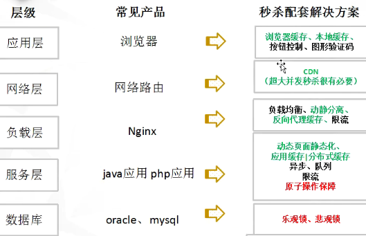
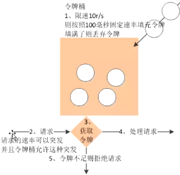
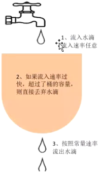

## 秒杀系统

秒杀特点：

- 读多写少：缓存（减少数据库的开销）
- 高并发：
  - 大部分是无用并发，只让少部分可用的连接通过，所以可以限流。
  - 负载均衡：单个tomcat只能承受五六百的并发。
  - 缓存
  - 同步并发转为异步并发（消息队列：削峰利器）
  - 队列，先进先出队列，可以设置跟商品数相同的队列，只是队列中的请求去得到商品
- 资源冲突：
  - 原子操作
    - 数据库锁：乐观锁、悲观锁。在大高并发体系下，乐观锁效率低于悲观锁；因为乐观锁需要不断重试，所以效率低。
      - 悲观锁：响应速度快，适合冲突频率大的场景
    - 分布式锁：redis,zk
    - 其它原子操作：redis, decr
  - 异步

秒杀的第一重要任务：

- 限流
- 高可用，独立出去

网络层：CDN， 超大并发秒杀很有必要。解决带宽问题。

负载层：Nginx 负载均衡、动静分离、反向代理缓存、限流

服务层：动态页面静态化、应用缓存|分布式缓存、异步、队列、限流、原子操作

数据库：乐观锁、悲观锁

预估并发峰值，如果超过太多，就可以使用docker进行快速扩容。

评价并发用户数：c = 400用户 * 每个用户每天评价使用小时 / 每天工作小时(8)

峰值：c + 3*根号c

nginx限流算法：

1. 令牌桶：允许出现突然大的并发

 

2. 漏桶算法：请求速率固定。

